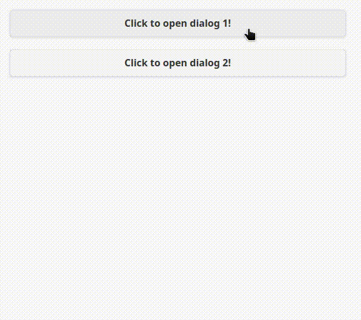
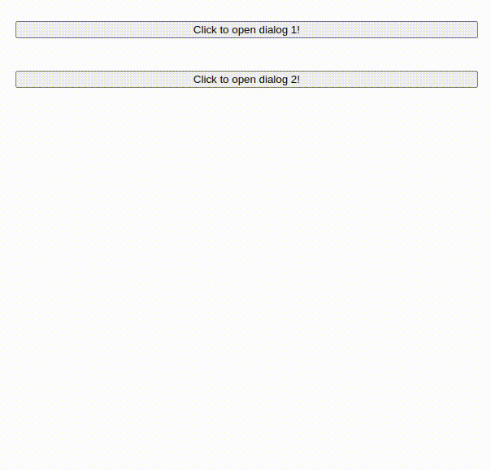

<style>
    table {
        width: 100%;
    }
</style>

# Javascript vs jQuery (疊加對話框範例)

## jQuery 前端元件輸出結果



## jQuery 疊加對話框

```js
(function ($) {
  $.fn.overlay = function () {
    overlay = $(".overlay");

    overlay.ready(function () {
      overlay.on(
        "transitionend webkitTransitionEnd oTransitionEnd MSTransitionEnd",
        function (e) {
          if (!$(this).hasClass("shown"))
            return $(this).css("visibility", "hidden");
        }
      );

      overlay.on("show", function () {
        $(this).css("visibility", "visible");
        $(this).addClass("shown");
        return true;
      });

      overlay.on("hide", function () {
        $(this).removeClass("shown");
        $(this).css("visibility", "hidden");
        return true;
      });

      overlay.on("click", function (e) {
        if (e.target.className === $(this).attr("class"))
          return $(this).trigger("hide");
      });

      $('a[data-overlay-trigger=""]').on("click", function () {
        overlay.trigger("show");
      });

      $('a[data-overlay-trigger]:not([data-overlay-trigger=""])').on(
        "click",
        function () {
          console.log($(".overlay#" + $(this).attr("data-overlay-trigger")));
          $(".overlay#" + $(this).attr("data-overlay-trigger")).trigger("show");
        }
      );
    });
  };
})(jQuery);
```

## CSS 疊加對話框

```css
button.pick {
  margin: 20px;
  width: 90%;
}

.overlay {
  visibility: hidden;
  opacity: 50;
  position: fixed;
  top: 0;
  bottom: 0;
  right: 0;
  left: 0;
  z-index: 10;
  width: 100%;
  height: 100%;
  background-color: rgba(100, 100, 100, 0.5);
  cursor: pointer;
  transition: opacity 0.3s ease-in-out;
}

.overlay .modal {
  cursor: auto;
  position: absolute;
  top: 0;
  bottom: 0;
  right: 0;
  left: 0;
  z-index: 11;
  margin: auto;
  max-width: 380px;
  max-height: 360px;
  padding: 0px 10px 0 10px;
  background-color: rgb(255, 255, 255);
  border-radius: 5px;
  filter: drop-shadow(6px 6px 3px rgba(0, 0, 0, 0.7));
}

.overlay.shown {
  opacity: 1;
}
```

## 疊加對話框的網頁示例

```html
<html>
  <head>
    <link rel="stylesheet" href="https://code.jquery.com/mobile/1.4.5/jquery.mobile-1.4.5.min.css" />
    <script src="https://code.jquery.com/jquery-1.11.1.min.js"></script>
    <script src="https://code.jquery.com/mobile/1.4.5/jquery.mobile-1.4.5.min.js"></script>
    <script type="text/javascript" src="./mOverlay.js"></script>
    <link rel="stylesheet" type="text/css" href="./overlay.css" />
  </head>
<body>
  <button class="pick" type="button" id="click1">Click to open dialog 1!</button>
  <button class="pick" type="button" id="click2">Click to open dialog 2!</button>
    <div class="overlay" id="Page1">
      <div class="modal" style="height:300px;">
        <p>Page 1</p>
        <button type="button" id="close1">Click to close dialog 1!</button>
      </div>
    </div>
    <div class="overlay" id="Page2">
      <div class="modal" style="height:300px;">
        <p>Page 2</p>
        <button type="button" id="close2">Click to close dialog 2!</button>
      </div>
    </div>
    <script>
      $('.overlay').overlay();
      $("#click1").click(function(){
        $(".overlay#Page1").trigger('show');
      });
      $("#click2").click(function(){
        $(".overlay#Page2").trigger('show');
      });
      $("#close1").click(function(){
        $(".overlay#Page1").trigger('hide');
      });
      $("#close2").click(function(){
        $(".overlay#Page2").trigger('hide');
      });
    </script>
</body>
</html>
```

## Javascript ES6 前端元件輸出結果

 - CSS 基本不變
 - 原來的按鈕樣式是由 jQuery Mobile 控制的，因它被移除了，所以將按鈕更改為默認網頁樣式。



## Javascript 疊加對話框

```js
class overlay {
  constructor(id) {
    let elems = document.getElementsByClassName(id);
    for (let i = 0; i < elems.length; ++i) {
      let item = elems[i];
      let content = item.innerHTML;
      item.innerHTML = "";
      let model = document.createElement("div");
      let modelWidth = item.getAttribute("model-style") || "height: 300px";
      model.setAttribute("class", "modal");
      model.setAttribute("style", modelWidth);
      model.innerHTML = content;
      item.appendChild(model);
    }
  }

  show(id) {
    let elem = document.getElementById(id);
    elem.setAttribute("style", "visibility:visible;");
    elem.classList.add("shown");
  }

  hide(id) {
    let elem = document.getElementById(id);
    elem.setAttribute("style", "visibility:hidden;");
    elem.classList.remove("shown");
  }

  addClick(items) {
    Object.entries(items).forEach(([key, value]) => {
      document.getElementById(key).addEventListener("click", value);
    });
  }
}
```

## 疊加對話框的網頁示例

```html
<html>
  <head>
    <script type="text/javascript" src="./overlay.js"></script>
    <link rel="stylesheet" type="text/css" href="./overlay.css" />
    <script>
      document.addEventListener("DOMContentLoaded", function () {
          let obj = new overlay("overlay");
          obj.addClick({ click1: fn1, Page1: fn3 });
          obj.addClick({ click2: fn2, Page2: fn4 });
          function fn1() {
            obj.show("Page1");
          }
          function fn2() {
            obj.show("Page2");
          }
          function fn3() {
            obj.hide("Page1");
          }
          function fn4() {
            obj.hide("Page2");
          }
        },false);
    </script>
  </head>
  <body>
    <button class="pick" type="button" id="click1">
      Click to open dialog 1!
    </button>
    <button class="pick" type="button" id="click2">
      Click to open dialog 2!
    </button>
    <div class="overlay" id="Page1" model-style="height: 300px">
      <p>Page 1</p>
      <button type="button" id="close1">Click to close dialog 1!</button>
    </div>
    <div class="overlay" id="Page2">
      <p>Page 2</p>
      <button type="button" id="close2">Click to close dialog 2!</button>
    </div>
  </body>
</html>
```
