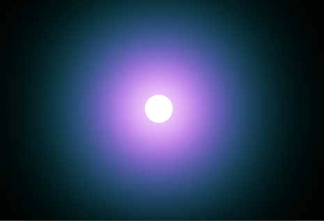
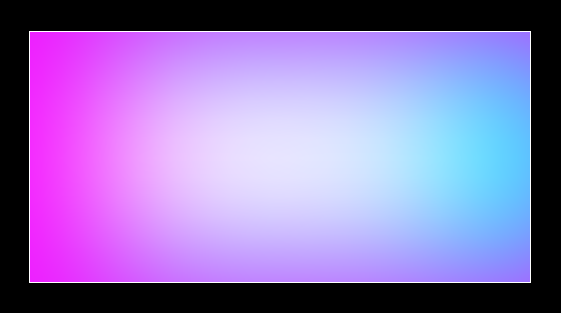
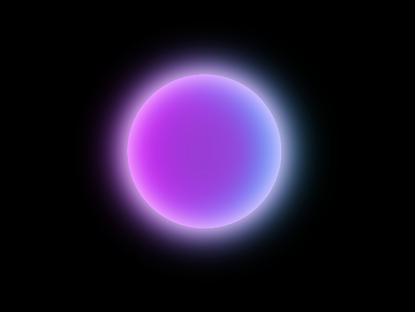

<style>
    table {
        width: 100%;
    }
</style>

# CSS 有用技巧

## box-shadow

CSS box-shadow 屬性看起來很棒的一種元素添加陰影效果的簡單方法。將它用於圖像。可以完成一些非常特別的事情。如下將分享如何創建彩色發光效果。

下面是一個簡單的例子來說明 box-shadow 是如何工作的:

```css
div {
  width: 150px;
  height: 150px;
  background-color: #fff;
  box-shadow: 120px 80px 40px 20px #0ff;
  /* 依次為：x 偏移、y 偏移、模糊大小、展開大小、顏色 */
  /* 模糊大小和散佈大小是可選的（默認值為 0） */
}
```

這是結果圖：


很容易。這就是我們將要建立的基礎。

box-shadow 採用原來的元素形狀。如用 border-radius: 50% 來做一個圓形的元素，那麼 box-shadow 基於這個元素形狀創造陰影效果。

可以通過給 box-shadow 提供多組值（用逗號分隔）來在同一個元素上堆疊多個發光效果。發光效果將首先在頂部堆疊，最後在底部堆疊。順層序安排創建發光效果。

## 兩種技術組合

```css
div {
  width: 40px;
  height: 40px;
  border-radius: 50%;
  background-color: #fff;
  box-shadow:
    0 0 60px 30px #fff,  /* 白色 (核心) */
    0 0 100px 60px #f0f, /* 洋紅色 (中間) */
    0 0 140px 90px #0ff; /* 青色 (外面) */
}
```


以上代碼已經足以製作一些令人印象深刻的視覺效果。如可以通過在已經介紹的 box-shadow 技術中添加一點動畫來製作以下內容：


## 插圖和偏移 (Insets and Offsets)

現在創造嵌入發光效果。通過在 box-shadow 聲明中添加插圖，您可以將其從外發光更改為內發光。將此與 x / y 偏移值相結合，以創建顏色從一側向內發光的效果如下：



## 整合上述效果

現在讓我們結合提到的所有技術來創造一個發光效果的半透明大理石如下：

```css
div {
  width: 300px;
  height: 300px;
  border-radius: 50%;
  box-shadow:
    inset 0 0 50px #fff,      /* 白色核心 */
    0 0 50px #fff,            /* 白色外邊緣 (較窄)*/
    inset 20px 0 80px #f0f,   /* 左洋紅色內核 (較窄密) */
    inset 20px 0 300px #f0f,  /* 左洋紅色內核 (較寬模糊)*/
    -10px 0 80px #f0f,        /* 左洋紅色外邊 */
    inset -20px 0 80px #0ff,  /* 右青色內核 (較窄密) */
    inset -20px 0 300px #0ff, /* 右青色內核 (較寬模糊) */
    10px 0 80px #0ff;         /* 右青色外邊 (較窄) */
}
```

最終顯示結果如下：



幾行 CSS 就很不錯了，還有更多可以做的如創造閃亮、發光、多彩的效果等等。


