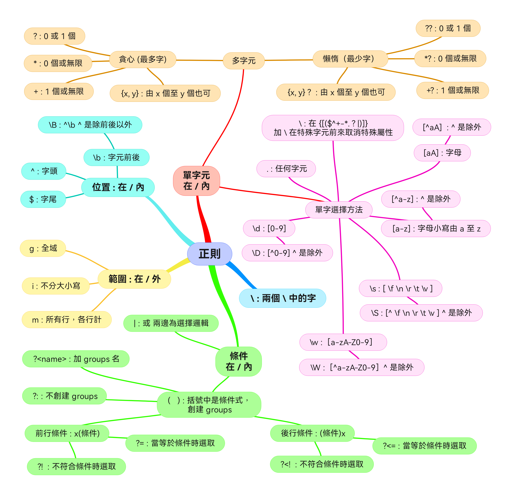

# 如何在 JavaScript 陣列遍歷方法 forEach, map 和 for

## forEach
 - forEach **不返回任何值**
 - forEach 如執行線性運算方法
 - forEach 不能與任何其他數組方法鏈接

## map
 - map 返回一個與原始列表相同大小的 **新數組**
 - map 可以很容易地與其他數組方法 some(), every(),filter() 等方法
 - map 如在數組內部使用回調，可以改變原始對象

## for
 - for 普通循環總是比任何數組方法都快


# JavaScript 陣列遍歷方法 map, filter, find 和 reduce 的不同


# 如何在 JavaScript 字典中訪問 鍵 (keys)、值 (values) 和 字典元素 (Entries)

 - Key : 鍵是列表屬性的名稱。
 - value : 值的是屬性列表的值。
 - Entries : 是字典名稱和相應值的元素。

# 字典和數組轉換

## 從字典到數組

```js
// ----- 從字典到數組 -----
const element = {
  name: 'dicky',
  city: 'Hong Kong'
};
Object.keys(element);
// 输出结果：['name', 'city']
Object.values(element);
// 输出结果：['dicky', 'Hong Kong']
Object.entries(element);
// 输出结果：[['name', 'dicky'], ['city', 'Hong Kong']]
```

## 從數組到字典

```js
// ----- 從數組到字典 -----
const data = [
  ['key1', 'value1'],
  ['key2', 3]
];
const result = Object.fromEntries(data)
// 输出结果：{'key1': 'value1', 'key2': 3 };
```

# 正則用法

通過特殊字符組合以提供統一選擇方法的含義



所有正則表達式都應 **包含在字符 / 的開頭和結尾** ，但范圍參數除外。

|句法|字元|<font color="#FF1000">可</font>選取結果|
|:---:|:---|:---|
|/a/|This is a apple|This is <font color="#FF1000">a</font> apple|
|/is/|This is a apple|Th<font color="#FF1000">is is</font> a apple|

## 單字元符號選取

- 單字元符號的基本選擇方法

### 普通字元選取

| 句法 | 解釋 |
|:---:|:---|
|  []  | 選取多個字元或範圍字元|
| [^]  | 過濾特定字元 |

範例

|句法|字元|<font color="#FF1000">可</font>選取結果|
|:---:|:---|:---|
|/[aA]/|A apple|<font color="#FF1000">A a</font>pple|
|/[aeiou]/|There is a apple|Th<font color="#FF1000">e</font>r<font color="#FF1000">e i</font>s <font color="#FF1000">a a</font>ppl<font color="#FF1000">e</font>|
|/[a-z]/|There is a apple|T<font color="#FF1000">here is a apple</font>|
|/[a-zA-Z]/|I'm 20 year old|<font color="#FF1000">I</font>'<font color="#FF1000">m</font> 20 <font color="#FF1000">year old</font>|
|/[5-8]/|1234567890|1234<font color="#FF1000">5678</font>90|
|/[^aA]/|A apple|A a<font color="#FF1000">pple</font>|
|/[^0-9]/|I'm 20 year old|<font color="#FF1000">I'm</font> 20 <font color="#FF1000">year old</font>|

### 特殊字元選取

 - 特殊符號有 \{ \[ \( $ ^ \+ \- \* \. ? \| \) \] \}

| 句法 | 解釋 |
|:---:|:---|
| \ | 將特殊字符轉換為原始字符 |

範例

|句法|字元|選取結果|
|:---:|:---|:---|
/if\\\(true\\\)/|if(true) {do someting｝|<font color="#FF1000">if(true)</font>｛do someting｝|
|/1\＋2\＝3/|1＋2＝3|<font color="#FF1000">1＋2＝3</font>|

### 任意字元選取

| 句法 | 解釋 |
|:---:|:---|
| . | 任意單字元 |

範例

|句法|字元|<font color="#FF1000">可</font>選取結果|
|:---:|:---|:---|
|/.a/|I'm a man|I'm <font color="#FF1000">a ma</font>n|
|/a./|I'm a man|I'm <font color="#FF1000">a</font> m<font color="#FF1000">an</font>|

### 多個字元縮寫 (細寫字母)

| 句法 | 解釋 |
|:---:|:---|
| \d |［0-9］|
| \w |［a-zA-Z0-9］|
| \s | 任何空白字元，包括空格、定位字元、換頁符 [ \f \n \r \t \v ］|

範例

|句法|字元|<font color="#FF1000">可</font>選取結果|
|:---:|:---|:---|
|/\we/|There is a apple|T<font color="#FF1000">here</font> is a app<font color="#FF1000">le</font>|
|/\d/|I'm 20 year old|I'm <font color="#FF1000">20</font> year old|

多個字元縮寫 (大寫字母) 相等知 ^

| 句法 | 解釋 |
|:---:|:---|
| \D |［^0-9］|
| \W |［^a-zA-Z0-9］|
| \S |［^\f \n \r \t \v］|

範例

|句法|字元|<font color="#FF1000">可</font>選取結果|
|:---:|:---|:---|
|/\D/|I'm 20 year old|<font color="#FF1000">I'm</font> 20 <font color="#FF1000">year old</font>|
|/\W/|1＋2＝3|1<font color="#FF1000">＋</font>2<font color="#FF1000">＝</font>3|

字元中的 **或**

| 句法 | 解釋 |
|:---:|:---|
| \| | A 或 B 符合條件即可|

範例

|句法|字元|<font color="#FF1000">可</font>選取結果|
|:---:|:---:|:---:|
|/grep\|gray/|I'm grep the gray color|I'm <font color="#FF1000">grep</font> the <font color="#FF1000">gray</font> color|

## 多字元符號選取

 - 多字元符號根據控制條件重複選擇字元。

### 貪婪的選擇

| 句法 | 解釋 |
|:---:|:---|
| ? | <font color="#FF1000">0</font> 次或 <font color="#FF1000">1</font> 次，選擇最多字符。 |
| * | <font color="#FF1000">0</font> 次或 <font color="#FF1000">多</font> 次，選擇最多字符。 |
| + | <font color="#FF1000">1</font> 次或 <font color="#FF1000">多</font> 次，選擇最多字符。 |

範例

|句法|字元|選取結果|
|:---:|:---:|:---:|
|/l*l/|Hello world|He<font color="#FF1000">llo worl</font>d|
|/l?l/|Hello world|He<font color="#FF1000">llo worl</font>d|
|/n?a/|Banana|Ba<font color="#FF1000">nana</font>|

### 懶惰的選擇

| 句法 | 解釋 |
|:---:|:---|
| ?<font color="#FF1000">?</font> | <font color="#FF1000">0</font> 次或 <font color="#FF1000">1</font> 次，加 <font color="#FF1000">?</font> 選擇最少字符。 |
| *<font color="#FF1000">?</font> | <font color="#FF1000">0</font> 次或 <font color="#FF1000">多</font> 次，加 <font color="#FF1000">?</font> 選擇最少字符。|
| +<font color="#FF1000">?</font> | <font color="#FF1000">1</font> 次或 <font color="#FF1000">多</font> 次，加 <font color="#FF1000">?</font> 選擇最少字符。|

範例

|句法|字元|選取結果|
|:---:|:---:|:---:|
|/l*?l/|Hello world|He<font color="#FF1000">ll</font>o world|
|/l+?l/|Hello world|He<font color="#FF1000">ll o worl</font>d|
|/n??a/|Banana|Ba<font color="#FF1000">na</font>na|

### 出現次數選擇

| 句法 | 解釋 |
|:---:|:---:|
| {} |｛出現次數｝|
| {x,y} |｛最小次數, 最大次數｝|
| {x,} |｛最小次數, ｝|
| {,y} |｛,最大次數｝|

範例

|句法|字元|選取結果|
|:---:|:---:|:---:|
|/l{2}/|Hello world|He<font color="#FF1000">ll</font>o world|
|/l{1,}/|Hello world|He<font color="#FF1000">ll</font>o wor<font color="#FF1000">l</font>d|

## 位置符號

 - 位置符號添加在參數前 ，用於控制參數的使用範圍。

| 句法 | 解釋 |
|:---:|:---|
| ^ | 字句的開頭 包含換行的開頭|
| $ | 字句的結尾 包含換行的結尾|
| \b | 字元的「前面」或「後面」除了空白字元,標點符號|
| \B | 字串開頭或結尾外有其它字元|

範例

|句法|字元|選取結果|
|:---:|:---|:---|
|/\He./|He's Joe|<font color="#FF1000">He'</font>s Joe|
|/$home/|This is Joe home|This is Joe <font color="#FF1000">home</font>|
|/\b[a]/g|This is a apple|This is <font color="#FF1000">a a</font>pple|
|/lo\b/|Hello,mike|Hel<font color="#FF1000">lo</font>,mike|
||Hello\nmike|Hel<font color="#FF1000">lo</font>\nmike|
||Hello mike|Hel<font color="#FF1000">lo</font> mike|
|/\Blo/|Hello,mike|Hel<font color="#FF1000">lo</font>,mike|
||Hello_mike|Hel<font color="#FF1000">lo</font>_mike|
|/^he.*me$/|He is a good for me|<font color="#FF1000">He is a good for me</font>|

## 範圍符號

- 範圍符號添加在 / 末，用於控制參數的使用範圍。

| 句法 | 解釋 |
|:---:|:---|
| g | 全域 |
| i |不分大小寫|
| m | 多行計數 |

範例

|句法|字元|選取結果|
|:---:|:---|:---|
| /\b[a]/|This is a apple|This is <font color="#FF1000">a</font> apple|
| /\b[a]/g|This is a apple|This is <font color="#FF1000">a a</font>pple|
| /\b[s]/ig|This is a Linux OS|This i<font color="#FF1000">s</font> a Linux O<font color="#FF1000">S</font>|

## 條件符號

- 條件符號包裹參數，用於控制參數的選擇目的。

所有的返回數組帶有 groups 元素除了 (?:)

| 句法 | 解釋 |
|:---:|:---|
|(?:x) | 返回數組未包含匹配值 |
|（x）| x 符合選取, 數組[0] 為 匹配值|
|(?<name>x) | 創建 groups 名稱為 name |

範例

|句法|字元|返回數組結果|
|:---:|:---|:---|
|/(?:Jack)/|JacSprat| null |
|/(?:Jack)/|JackSprat| ['Jack', index: 0, input: 'JackSprat', groups: undefined]|
|/(Jack)/|JackSprat| [<font color="#FF1000">'Jack'</font>, 'Jack', index: 0, input: 'JackSprat', groups: undefined]|
|/(?\<name\>Jack)/|JackSprat|  [<font color="#FF1000">'Jack'</font>, 'Jack', index: 0, input: 'JackSprat', groups: {<font color="#FF1000">name: "Jack"</font>}]|
|/(Jac)Spr(at)/|JacSprat Peter|[<font color="#FF1000">'JacSprat'</font>, 'Jac', 'at', index: 0, input: 'JacSprat Peter', groups: undefined]|
|/(\?\<name0\>Jac)Spr(\?\<name1\>at)/|JacSprat Peter|[<font color="#FF1000">'JacSprat'</font>, 'Jac', 'at', index: 0, input: 'JacSprat Peter', groups: {<font color="#FF1000">name0: 'Jac', name1: 'at'</font>}]|

### *前面* 或 *後面* 條件符號

| 句法 | 解釋 |
|:---:|:---|
|  x(?=y)   | x 後面<font color="#FF1000">有</font> y 時才符合選取  |
|  x(?!y)   | x 後面<font color="#FF1000">沒有</font> y 時才符合選取  |
|  (?<=y)x  | x 前面<font color="#FF1000">有</font> y 時才符合選取  |
|  (?<!y)x  | x 前面<font color="#FF1000">沒有</font> y 時才符合選取  |

範例

|句法|字元|選取結果|
|:---:|:---|:---|
| /Jack(?=Sprat)/ | JackSprat, JackPeter | <font color="#FF1000">JackSprat</font>, JackPeter |
|   /\d+(?!\.)/   | 141,3.141            | <font color="#FF1000">141</font>,3.141            |
| /(?<=Jack)Sprat/| JackSprat, JackPeter | <font color="#FF1000">JackSprat</font>, JackPeter |
|   /(?<!-)\d+/   | -3.5,3.5             | -3.5,<font color="#FF1000">3</font>.5             |


## 正則表達式的 5 個方法

 1. match() 與字符串一起使用以檢查字符串和正則表達式 regex 之間的匹配，以正則表達式為參數。如果正則表達式包含一個 **g** 標記，它是一個全局匹配，它將返回一個包含所有不帶捕獲組信息的匹配項的數組； 如果正則表達式未標記為 **g** ，它將返回一個包含第一個匹配項及其相關捕獲組的數組； 如果根本沒有匹配項，它將返回null。

```js
const strText = "Hello China";
const regex = /[A-Z]/g;
console.log(strText.match(regex));
// 输出结果：[ 'H', 'C' ]

const regex = /[A-Z]/;
console.log(text.match(regex))
// 输出结果：[ 'H', index: 0, input: 'Hello China', groups: undefined ]
// groups：一個對象的名稱，如果未定義則為 undefined

const strText = "hello china";
const regex = /[A-Z]/;
console.log(strText.match(regex));
// 输出结果：null
```

 2. test() 用于测试指定字符串和正则表达式之间是否匹配，接受一个字符串作为其参数，并根据是否匹配<font color="#FF1000">返回 true 或 false</font> 。


```js
const strText = "hello china";
const regex = /china/;
console.log(regex.test(strText));
// 输出结果：true

const strText = "hello China";
const regex = /china/;
console.log(regex.test(strText));
// 输出结果： false (大小寫問題)

const strText = "hello China";
const regex = /china/i;
console.log(regex.test(strText));
// 输出结果：true (用 i 忽略太小寫)
```

 3. search() 方法是一個字符串方法，可以將其與正則表達式一起使用。 可以將正則表達式作為參數傳遞給它，以在字符串中搜索匹配項。方法<font color="#FF1000">返回第一個位置</font>能匹配項整個字符串的值，如果沒有匹配項，則返回 -1。


```js
const strText = "hello china，i love china";
const regex = /china/;
console.log(strText.search(regex));
// 输出结果：6

const strText = "hello china，i love china";
const regex = /devpoint/;
console.log(strText.search(regex));
// 输出结果： -1
```

 4. replace() 是在字符串中搜索指定的值或正則表達式並將其替換為另一個值，方法接受兩個參數。 方法返回一個包含被替換後的新字符串，需要注意的是，它不會改變原始字符串，並且<font color="#FF1000">只替換搜索到的第一個值</font>。


```js
const strText = "hello world,i love world";
const regex = /world/;
console.log(strText.replace(regex, "china"));
// 输出结果： hello china,i love world
```

 5. replaceAll() 类似于方法 replace() ，但它允许替换字符串中所有匹配的值或正则表达式。如果是正则，则必须带上全局标记 **g** 要替换的新值。它返回一个包含所有新值的新字符串，同样也不会更改原始字符串。

```js
const strText = "hello world,i love world";
const regex = /world/g;
console.log(strText.replaceAll(regex, "china"));
// 输出结果：hello china,i love china

const strText = "hello world,i love world";
console.log(strText.replaceAll("world", "china"));
// 输出结果：hello china,i love china
```

# Javascript 事件註冊、觸發與傳遞

事件註冊，我們透過 **addEventListener** 這個方法把函數註冊上去。

所有 EventTarget 的實例都有這個方法，也就是說不只是 DOM 節點，window 也是，甚至你自己 new 一個 EventTarget 的實例，都擁有這樣的能力。

addEventListener 的語法格式如下:

```js
/*
事件目標.addEventListener('事件類型',回呼函數);
*/

document.addEventListener('load', main);

function main(){
 consolelog("Success!");
}
```

以上告訴系統，我們在等待些什麼。希望能在使用者做了一些操作後（比如點擊 *click* ），及做一些什麼事情 (函數 *callback* )

註：**removeListener** 可以移除掉這個事件。

## 捕獲 (capture) 與冒泡

DOM 事件發生時，事件會先由外到內 (capturing phase)、再由內到外 (bubbling phase) 的順序來傳播。其信息流的方向，解釋如下圖:


在開發環境中有 87% 是冒泡的操作。所以 *addEventListener* 預設為 **冒泡操作** ，只有當 *addEventListener* 的最後一個參數設為 true 的時候，事件才會用 **捕獲操作** 方式傳遞。

## 事件停止傳遞

**stopPropogation** 用來控制<font color="#FF1000">事件不再往前傳遞</font>，這意味著不管往下（捕獲時）或是往上（冒泡時），都能停止。

**preventDefault** 防止預設行為觸發，它指的是停止瀏覽器的預設行為，<font color="#FF1000">並非事件傳遞</font>。它常常 *stopPropogation*  混淆，如果傳遞是二維的線性，那麼 default 行為就是第三維的瀏覽器行為，停止預設行為與停止事件傳遞完全是不同的事。

## 事件目標 (EventTarget) 實體註冊 & 事件目標實體觸發事件實體 (Event)

DOM 節點有一些 click()、focus()，但若是有一些自定義的事件類型，需要能有個方法把事件塞進去。那個動作正是 EventTarget 上都有的dispatchEvent 方法，我們可以透過以下方式把事件實體給塞進去。

```js
/*
事件目標.addEventListener('事件類型',回呼函數);
事件目標.dispatchEvent(事件實體);
*/
// 例子如下
element.dispatchEvent(new CustomEvent('Hello'));
```

## DOM Event 定義事件型態

JavaScript 用來監聽 (listen) 和處理 (event handling) 事件如下表:

|事件名稱|	觸發條件|
|:---:|:---|
|blur	|物件失去焦點時|
|change|	物件內容改變時|
|click	|滑鼠點擊物件時|
|dblclick|	滑鼠連點二下物件時|
|error|	當圖片或文件下載產生錯誤時|
|focus	|當物件被點擊或取得焦點時|
|keydown|	按下鍵盤按鍵時|
|keypress|	按下並放開鍵盤按鍵後|
|keyup	|按下並放開鍵盤按鍵時|
|load|	網頁或圖片完成下載時|
|mousedown	|按下滑鼠按鍵時|
|mousemove	|介於over跟out間的滑鼠移動行為|
|mouseout|	滑鼠離開某物件四周時|
|mouseover	|滑鼠進入一個元素 (包含進入該元素中的子元素) 四周時|
|mouseup	|放開滑鼠按鍵時|
|resize	|當視窗或框架大小被改變時|
|scroll|當捲軸被拉動時|
|select	|當文字被選取時|
|submit	|當按下送出按紐時|
|beforeunload	|當使用者關閉 (或離開) 網頁之前|
|unload	|當使用者關閉 (或離開) 網頁之後|

# 自定義事件型態方法

瀏覽器中使用 dispatchEvent 派發自定義事件，用以在 DOM 組件下交換信息。

1. createEvent()方法返回新創建的Event對象，支持一個參數，表示事件類型。

|參數|事件接口|初始化方法|
|:---:|:---:|:---:|
|HTMLEvents|HTMLEvent|initEvent()|
|MouseEvents|MouseEvent|initMouseEvent()|
|UIEvents|UIEvent|initUIEvent()|
|MutationEvents|MutationEvent|initMutationEvent()|

2. initEvent()方法用於初始化通過DocumentEvent接口創建的Event的值。 支持三個參數：initEvent(eventName, canBubble, preventDefault). 分別表示： 事件名稱，是否可以冒泡，是否阻止事件的默認操作。

3. dispatchEvent()就是觸發執行了，element.dispatchEvent(eventObject), 參數eventObject表示事件對象，是createEvent()方法返回的創建的Event對象。

```js
var elem = document.querySelector('#div');
var event = document.createEvent('Event');
// 定义事件名称myEvent
  event.initEvent('myEvent', true, true);
// 监听myEvent
  elem.addEventListener('myEvent', function (e) {
    console.log(e);
  }, false);
// 使用目标对象去派发事件，可以是元素节点/事件对象
  elem.dispatchEvent(event);
```

CustomEvent 可以創建一個更具體的自定義事件，並且可以攜帶額外的參數：new CustomEvent(eventname, options)。

```js
var elem = document.querySelector('#div');
var event = document.createEvent('Event');
// 定义事件名称myEvent
  event.initEvent('myEvent', true, true);
// 监听myEvent
  elem.addEventListener('myEvent', function(e)
    {console.log(e.detail);}
  );
var event = new CustomEvent("myEvent", {"detail":{"username":123}});
// 使用目标对象去派发事件，可以是元素节点/事件对象
  elem.dispatchEvent(event);
// 输出结果：{username: 123}
```
# JavaScript 中調用、應用和綁定方法的快速指南

函數原型鏈的調用、應用和綁定方法是 JavaScript 中一些最重要和最常用的概念，並且與 this 關鍵字密切相關。


## **call** 調用方法

 - 可以進行函數/方法借用，可以從其他對像中借用函數並將其與其他對象的數據一起使用。
 - 使用 call()，可以編寫一次方法，然後在另一個對像中繼承它，而無需為新對象重寫方法。
 - 在 call 方法中，第一個參數將是引用或我們希望 *this* 指向的內容。
 - 後面的參數可以是該函數的參數。 可以傳遞任意數量的以逗號分隔的參數。

```js
func.call([thisArg[, arg1, arg2, ...argN]])
```

參數：
 - thisArg 是可選。 是調用 func 時用作 this 的值。
 - arg1, arg2, ...argN 函數的可選參數。

返回值：
  - 指定的 this 值和參數調用函數的結果。

## **apply** 應用方法

 - 可以編寫一次方法，然後在另一個對像中繼承它，而無需為新對象重寫方法。
 - apply 與 call() 非常相似，除了它支持的參數類型。通過 apply，還可以使用數組字面量。
 - argsArray 使用參數。 arguments 是函數的局部變量。 它可用於被調用對象的所有未指定參數。 因此，當您使用 apply 方法時，**不必知道被調用對象的參數**。
 - 給定的 this 值調用函數，並以**數組**（或類似數組的對象）的形式提供參數。

```js
func.apply(thisArg, [argsArray])
```

參數：
 - thisArg 為調用 func 提供的 this 值。
 - argsArray 是可選。 一個類似數組的對象，指定調用 func 時應使用的參數，如果不應向函數提供參數，則為 null 或 undefined。


請注意，這可能不是方法看到的實際值：如果方法是非嚴格模式代碼中的函數，null 和 undefined 將被替換為全局對象，原始值將被裝箱。 該參數是必需的。

返回值：
  - 指定的 this 值和參數調用函數的結果。

## **bind** 應用方法

 - 函數創建一個新的綁定函數，它是一個包裝原始函數對象的奇異函數對象。調用綁定函數通常會導致其包裝函數的執行。
 - bind 方法看起來和 call 方法完全一樣，但唯一的區別是這裡不是直接調用這個方法，而是 bind 方法將此方法與對象綁定並返回該方法的**副本**。
 - 裡有一個問題，它不會直接調用該方法，而是會返回一個可以稍後調用的方法。這基本上用於綁定並保留該方法的副本並稍後使用它。


綁定方法
bind() 方法返回一個新函數，當被調用時，它的 this 設置為一個特定的值。

```js
func.bind(thisArg[, arg1[, arg2[, ...]]])
```

參數：
 - thisArg 調用綁定函數時作為 this 參數傳遞給 func。如果沒有為 bind 提供參數 this，或為 null 或未定義，則執行範圍的 this 將被視為新函數。
 - arg1, arg2, ...argN 是可選。 調用 func 時提供給綁定函數的參數前面的參數。

返回值：
 - 指定 this 值和初始參數（如果提供）的給定函數的副本。

# class

JavaScript 開發者有多種多樣的代碼風格，有的是函數式、有的是面向對象式。 類或者類的構造器是面向對象編程的一部分。 類可以看成創建對象的模板，這個模板可以設置一些初始值和提供一些特定的方法。

 JavaScript 通過構造函數和 **new** 操作符完全可以提供這種模板。

**get** 及 **set** 是特別字用途是使函數能像參數一般可用 = 號作設定。請參考以下例子:

```js
class sample {

  constructor(name) {
    this.id = name;
  }

  get name(){
    return this.name;
  }

  set name(name){
     this.name = name;
  }

  log(){
    console.log(this.name);
  }
}

let obj = new sample("test");
obj.log();
// consolelog is test

obj.name = "dicky";
obj.log();
// consolelog is dicky

let nameStr = obj.name
// nameStr is dicky
```
