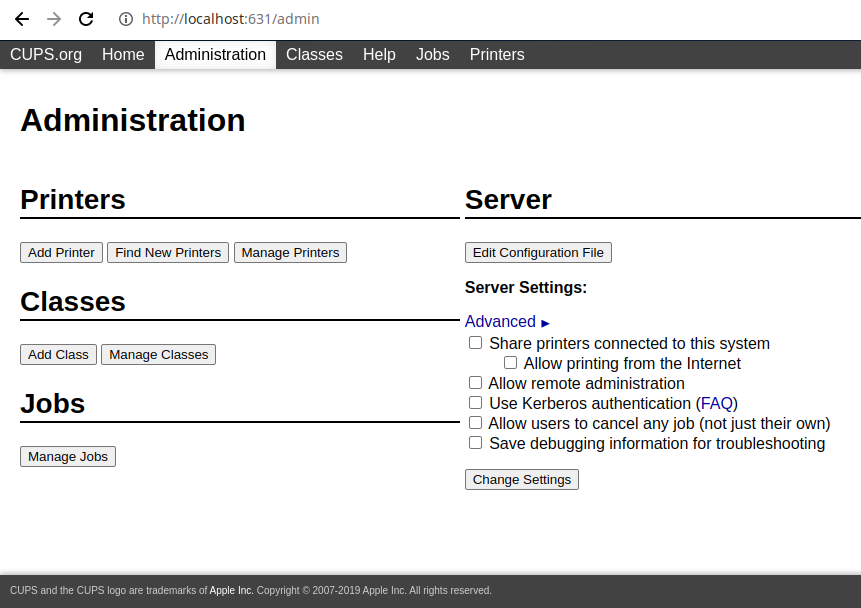
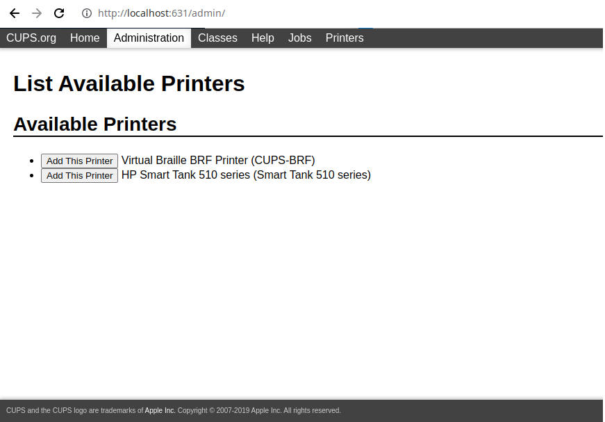
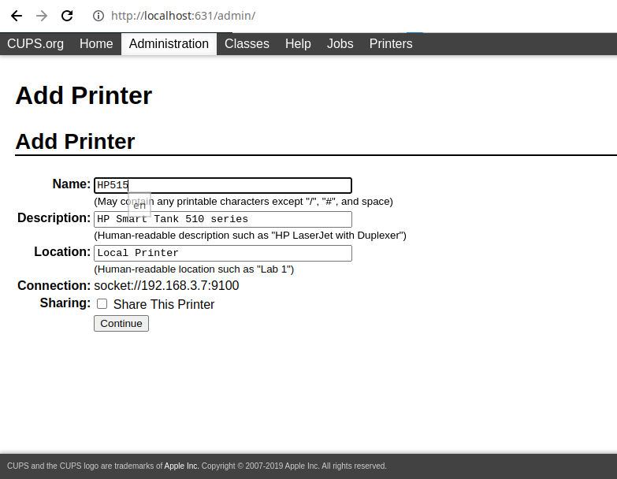
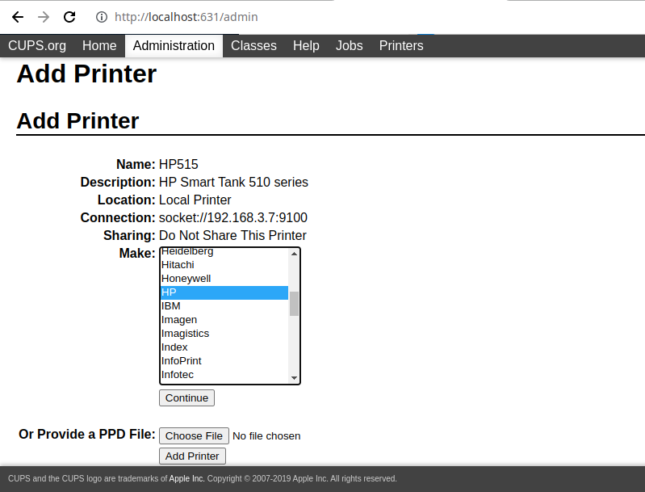
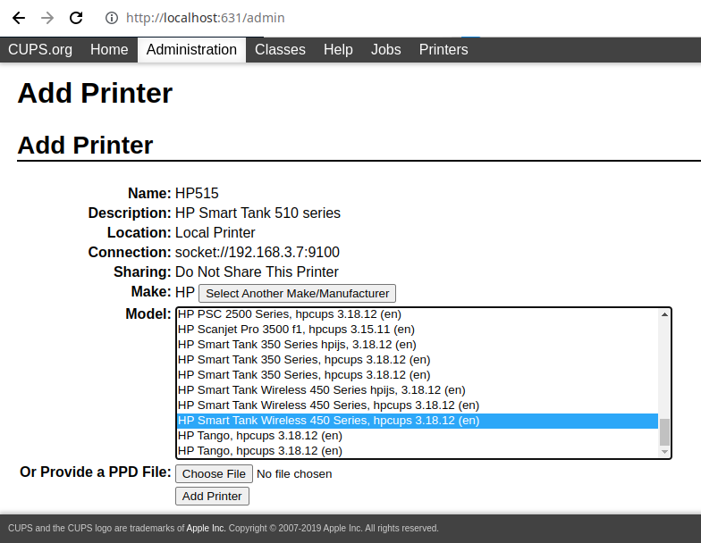
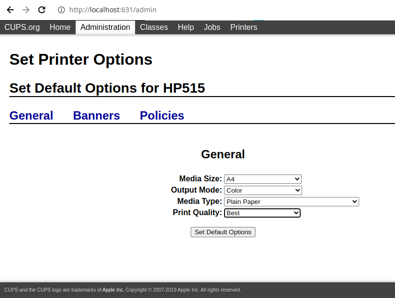
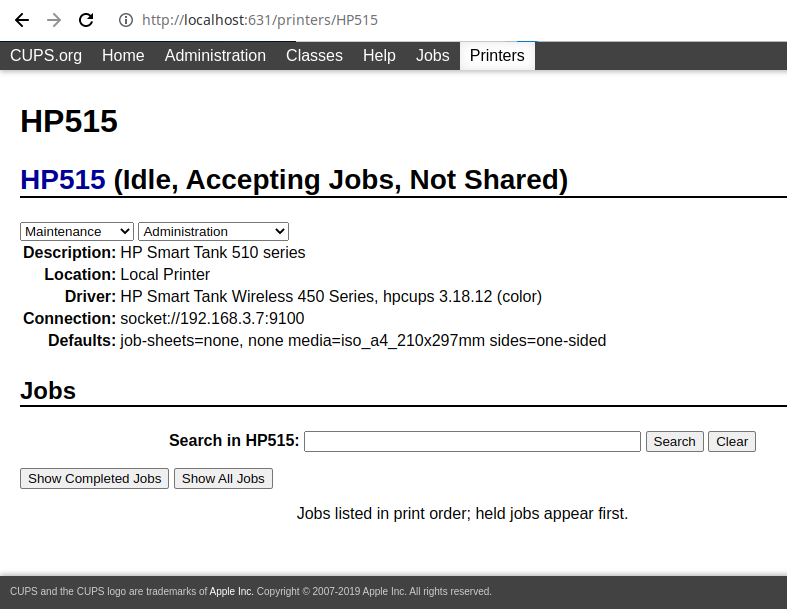

# 開放麒麟

下載並安裝至電腦如網站所述:

[開放麒麟下載](https://www.openkylin.top/downloads/)


## 安裝其它軟件的方法

在 Linux 下有幾種安裝軟件的方法，請參加 [軟件安裝方法 (Linux)](https://hkdickyko.github.io/%E7%B3%BB%E7%B5%B1/linux)

但在開放麒麟不能直接使用 <font color="#FF1000">apt-get</font> 。有如下錯誤:

```shell
sudo apt-get update

// sudo 取執行密碼
> [sudo] password for dickyko:
// 輸出結果如下
Get:1 file:/cdrom yangtze InRelease
Ign:1 file:/cdrom yangtze InRelease
Get:2 file:/cdrom yangtze Release
Err:2 file:/cdrom yangtze Release
  File not found - /cdrom/dists/yangtze/Release (2: No such file or directory)
Reading package lists... Done
E: The repository 'file:/cdrom yangtze Release' does not have a Release file.
N: Updating from such a repository can't be done securely, and is therefore disabled by default.
N: See apt-secure(8) manpage for repository creation and user configuration details.
```
注意: <font color="#FF1000">sudo</font> 是將指今改為 root 指令，使能安裝其它軟件及更新。以上問題是因為 /etc/apt/sources.list 這檔案係設定。

```shell
cd /etc/apt
// 保存原檔案
sudo cp sources.list sources.list.bak
// 列出原檔案內容
cat sources.list
// 原內容如下
deb http://ppa.build.openkylin.top/packaging/ppa2/openkylin yangtze main
#deb file:/cdrom yangtze main
```
更改 sources.list 內容 (第一行加上 <font color="#FF1000">#</font>)為以下內容，加入更多網上軟件倉庫

```shell
#deb http://ppa.build.openkylin.top/packaging/ppa2/openkylin yangtze main
#deb file:/cdrom yangtze main

deb http://archive.ubuntu.com/ubuntu/ focal main restricted universe multiverse

deb-src http://archive.ubuntu.com/ubuntu/ focal main restricted universe multiverse

deb http://archive.ubuntu.com/ubuntu/ focal-updates main restricted universe multiverse

deb-src http://archive.ubuntu.com/ubuntu/ focal-updates main restricted universe multiverse

deb http://archive.ubuntu.com/ubuntu/ focal-security main restricted universe multiverse

deb-src http://archive.ubuntu.com/ubuntu/ focal-security main restricted universe multiverse

deb http://archive.ubuntu.com/ubuntu/ focal-backports main restricted universe multiverse

deb-src http://archive.ubuntu.com/ubuntu/ focal-backports main restricted universe multiverse

deb http://archive.canonical.com/ubuntu focal partner

deb-src http://archive.canonical.com/ubuntu focal partner

deb https://mirrors.ustc.edu.cn/ubuntu/ jammy main restricted universe multiverse

deb-src https://mirrors.ustc.edu.cn/ubuntu/ jammy main restricted universe multiverse

deb https://mirrors.ustc.edu.cn/ubuntu/ jammy-updates main restricted universe multiverse

deb-src https://mirrors.ustc.edu.cn/ubuntu/ jammy-updates main restricted universe multiverse

deb https://mirrors.ustc.edu.cn/ubuntu/ jammy-backports main restricted universe multiverse

deb-src https://mirrors.ustc.edu.cn/ubuntu/ jammy-backports main restricted universe multiverse

deb https://mirrors.ustc.edu.cn/ubuntu/ jammy-security main restricted universe multiverse

deb-src https://mirrors.ustc.edu.cn/ubuntu/ jammy-security main restricted universe multiverse

deb https://mirrors.ustc.edu.cn/ubuntu/ jammy-proposed main restricted universe multiverse

deb-src https://mirrors.ustc.edu.cn/ubuntu/ jammy-proposed main restricted universe multiverse


```

軟件倉庫主要分四類型如下：

|名稱|解釋|
|:---:|:---|
|Main|Canonical 支持的免費和開源軟件|
|Universe|社區維護的免費和開源軟件|
|Restricted|設備的專有驅動程序|
|Multiverse|受版權或法律問題限制的軟件|

注: <font color="#FF1000">Canonical</font> 為 Ubuntu 的開發公司

加入後會發現仍然有錯誤。原因是<font color="#FF1000">沒有公共金匙</font>來下載倉庫軟件如下

```shell
sudo apt-get update

// 輸出結果如下
Get:1 http://archive.canonical.com/ubuntu focal InRelease [12.1 kB]
Err:1 http://archive.canonical.com/ubuntu focal InRelease
  The following signatures couldn't be verified because the public key is not available: NO_PUBKEY 3B4FE6ACC0B21F32 NO_PUBKEY 871920D1991BC93C
Get:2 http://archive.ubuntu.com/ubuntu focal InRelease [265 kB]
Err:2 http://archive.ubuntu.com/ubuntu focal InRelease
  The following signatures couldn't be verified because the public key is not available: NO_PUBKEY 3B4FE6ACC0B21F32 NO_PUBKEY 871920D1991BC93C
Get:3 http://archive.ubuntu.com/ubuntu focal-updates InRelease [114 kB]
Err:3 http://archive.ubuntu.com/ubuntu focal-updates InRelease
  The following signatures couldn't be verified because the public key is not available: NO_PUBKEY 3B4FE6ACC0B21F32 NO_PUBKEY 871920D1991BC93C
Get:4 http://archive.ubuntu.com/ubuntu focal-security InRelease [114 kB]
Err:4 http://archive.ubuntu.com/ubuntu focal-security InRelease
  The following signatures couldn't be verified because the public key is not available: NO_PUBKEY 3B4FE6ACC0B21F32 NO_PUBKEY 871920D1991BC93C
Get:5 http://archive.ubuntu.com/ubuntu focal-backports InRelease [108 kB]
Err:5 http://archive.ubuntu.com/ubuntu focal-backports InRelease
  The following signatures couldn't be verified because the public key is not available: NO_PUBKEY 3B4FE6ACC0B21F32 NO_PUBKEY 871920D1991BC93C
Reading package lists... Done
W: GPG error: http://archive.canonical.com/ubuntu focal InRelease: The following signatures couldn't be verified because the public key is not available: NO_PUBKEY 3B4FE6ACC0B21F32 NO_PUBKEY 871920D1991BC93C
E: The repository 'http://archive.canonical.com/ubuntu focal InRelease' is not signed.
N: Updating from such a repository can't be done securely, and is therefore disabled by default.
N: See apt-secure(8) manpage for repository creation and user configuration details.
W: GPG error: http://archive.ubuntu.com/ubuntu focal InRelease: The following signatures couldn't be verified because the public key is not available: NO_PUBKEY 3B4FE6ACC0B21F32 NO_PUBKEY 871920D1991BC93C
E: The repository 'http://archive.ubuntu.com/ubuntu focal InRelease' is not signed.
N: Updating from such a repository can't be done securely, and is therefore disabled by default.
N: See apt-secure(8) manpage for repository creation and user configuration details.
W: GPG error: http://archive.ubuntu.com/ubuntu focal-updates InRelease: The following signatures couldn't be verified because the public key is not available: NO_PUBKEY 3B4FE6ACC0B21F32 NO_PUBKEY 871920D1991BC93C
E: The repository 'http://archive.ubuntu.com/ubuntu focal-updates InRelease' is not signed.
N: Updating from such a repository can't be done securely, and is therefore disabled by default.
N: See apt-secure(8) manpage for repository creation and user configuration details.
W: GPG error: http://archive.ubuntu.com/ubuntu focal-security InRelease: The following signatures couldn't be verified because the public key is not available: NO_PUBKEY 3B4FE6ACC0B21F32 NO_PUBKEY 871920D1991BC93C
E: The repository 'http://archive.ubuntu.com/ubuntu focal-security InRelease' is not signed.
N: Updating from such a repository can't be done securely, and is therefore disabled by default.
N: See apt-secure(8) manpage for repository creation and user configuration details.
W: GPG error: http://archive.ubuntu.com/ubuntu focal-backports InRelease: The following signatures couldn't be verified because the public key is not available: NO_PUBKEY 3B4FE6ACC0B21F32 NO_PUBKEY 871920D1991BC93C
E: The repository 'http://archive.ubuntu.com/ubuntu focal-backports InRelease' is not signed.
N: Updating from such a repository can't be done securely, and is therefore disabled by default.
N: See apt-secure(8) manpage for repository creation and user configuration details.
```

在以上資訊中你會發覺 NO_PUBKEY <font color="#FF1000">3B4FE6ACC0B21F32</font> NO_PUBKEY <font color="#FF1000">871920D1991BC93C</font>

在以上出現的金匙可能會不同。請自尋找顯示的金匙。並用以下指令生成金匙。

 - sudo apt-key adv --keyserver keyserver.ubuntu.com --recv-keys <font color="#FF1000">金匙號碼</font>


```shell
sudo apt-key adv --keyserver keyserver.ubuntu.com --recv-keys 3B4FE6ACC0B21F32

// 輸出結果如下
Executing: /tmp/apt-key-gpghome.h4o7D1rBQf/gpg.1.sh --keyserver keyserver.ubuntu.com --recv-keys 3B4FE6ACC0B21F32
gpg: key 3B4FE6ACC0B21F32: public key "Ubuntu Archive Automatic Signing Key (2012) <ftpmaster@ubuntu.com>" imported
gpg: Total number processed: 1
gpg:               imported: 1

sudo apt-key adv --keyserver keyserver.ubuntu.com --recv-keys 871920D1991BC93C

// 輸出結果如下
Executing: /tmp/apt-key-gpghome.Fr7e23ni5Y/gpg.1.sh --keyserver keyserver.ubuntu.com --recv-keys 871920D1991BC93C
gpg: key 871920D1991BC93C: "Ubuntu Archive Automatic Signing Key (2018) <ftpmaster@ubuntu.com>" not changed
gpg: Total number processed: 1
gpg:              unchanged: 1
```

用以下指令測試是否設定未完成

```
sudo apt-get update

// 輸出如下
Hit:1 http://archive.canonical.com/ubuntu focal InRelease
Hit:2 http://archive.ubuntu.com/ubuntu focal InRelease
Hit:3 http://archive.ubuntu.com/ubuntu focal-updates InRelease
Hit:4 http://archive.ubuntu.com/ubuntu focal-security InRelease
Hit:5 http://archive.ubuntu.com/ubuntu focal-backports InRelease
Reading package lists... Done
Building dependency tree
Reading state information... Done
All packages are up to date.
```

根據以上。列出的資訊已能在網上尋找到適當的軟件倉庫。

## 更新軟件資料

```
sudo apt-get update
sudo apt-get --fix-broken install
sudo apt-get upgrade
```

## 安裝編譯軟件用以編譯源文件壓縮包

```
sudo apt-get install build-essential
sudo apt-get autoremove
sudo apt-get upgrade
```

## 實用軟件介紹

### CUPS 打印系統

CUPS（Common UNIX Printing System 的首字母縮寫詞）是用於類 Unix 計算機操作系統的模塊化打印系統，它允許計算機充當打印服務器。運行 CUPS 的計算機是可以接受來自客戶端計算機的打印作業、處理它們並將它們發送到適當的打印機的主機。

CUPS 由打印假脫機程序和調度程序、將打印數據轉換為打印機可以理解的格式的過濾系統以及將此數據發送到打印設備的後端系統組成。 CUPS 使用 Internet 打印協議 (IPP) 作為管理打印作業和隊列的基礎。系統管理員可以通過編輯 Adob​​e 的 PostScript 打印機描述 (PPD) 格式的文本文件來配置 CUPS 提供的設備驅動程序。它具有內置的基於 Web 的界面。


安裝方式：

```shell
sudo apt-get update
sudo apt-get install cups
sudo systemctl stop cups
sudo systemctl start cups
sudo systemctl enable cups
sudo systemctl status cups

// 輸出如下
cups.service - CUPS Scheduler
     Loaded: loaded (/lib/systemd/system/cups.service; enabled; vendor preset: enabled)
     Active: active (running) since Sun 2022-07-31 15:57:33 HKT; 8min ago
TriggeredBy: ● cups.path
             ● cups.socket
       Docs: man:cupsd(8)
   Main PID: 998 (cupsd)
      Tasks: 1 (limit: 4465)
     Memory: 6.6M
     CGroup: /system.slice/cups.service
             └─998 /usr/sbin/cupsd -l
```
在 Web 瀏覽器中打開 CUPS


但需要更改配置文件以適應安裝的環境

```shell
sudo cd /etc/cups
sudo cp /etc/cups/cupsd.conf /etc/cups/cupsd.conf.bak
```

編輯文件內容如下:

#Show shared printers on the local network.\
&nbsp;&nbsp;&nbsp;&nbsp;Browsing <font color="#FF1000">On</font>\
&nbsp;&nbsp;&nbsp;&nbsp;BrowseLocalProtocols dnssd\

#Restrict access to the server\
\<Location />\
&nbsp;&nbsp;&nbsp;&nbsp;Order allow,deny\
&nbsp;&nbsp;&nbsp;&nbsp;<font color="#FF1000">Allow @LOCAL</font>\
\<Location>\

#Restrict access to the admin pages.\
\<Location /admin>\
&nbsp;&nbsp;&nbsp;&nbsp;Order allow,deny\
&nbsp;&nbsp;&nbsp;&nbsp;<font color="#FF1000">Allow @LOCAL</font>\
\<Location>\

如果使用 CUPS 瀏覽器界面進行配置，建議使用 root 或在 lpadmin 組中經過身份驗證的用戶。要將用戶添加到 lpadmin 組，請鍵入：

 - sudo usermod -aG lpadmin 用戶名

```shell
sudo usermod -aG lpadmin root
sudo systemctl restart cups
```

 - lpadmin -p <font color="#FF1000">printer-name</font> -E -v device
    - p : 創建或修改的打印機
    - E : 啟用打印機並接受新的打印作業
    - v : 設置打印機的 URI
    - m : 型號名稱設置打印機驅動程序 (everywhere：驅動程序用於自 2009 年左右以來銷售的幾乎所有現代網絡打印機)
    - L : 設置打印機的位置，例如 會議室
    - D : 顯示的打印機描述，不是打印機名稱，例如 HP LaserJet
    - o : 選項值設置命名選項

```shell
lpadmin -p Smart-Tank-510-series -E -v socket://192.186.3.7 -m everywhere
```

### 網絡瀏覽器地址 : http://localhost:631/admin



### 選擇打印機



### 打印機說明



### 打印機類型



### 打印機驅動程序



### 打印機默認設置



### 打印機信息



## 共享打印機至網絡

要 CUPS 共享打印機至網絡，需要安裝 avahi-daemon 。 avahi-daemon 是一個 Bonjour 服務器將廣播打印機信息至網絡。

```shell
sudo apt-get install avahi-daemon
sudo systemctl start avahi-daemon
```

設置允許 CUPS 通過防火牆來共享打印機訪問權限

```shell
sudo ufw allow 631/tcp
sudo ufw allow 5353/udp
```


中州韻輸入法引擎 : RIME 中文輸入法

安裝 fcitx5 輸入法方式：

```shell
# --- 卸載過時相關軟件包並清理依賴包
sudo apt purge fcitx*
sudo apt autoremove
# --- 刪除配置文件目錄
rm -rf ~/.config/fcitx
# --- 安裝中州韻輸入法引擎 ---
sudo apt-get install fcitx-data
sudo apt-get install fcitx-rime
sudo apt-get install fcitx5 fcitx5-chinese-addons
sudo apt-get install fcitx5-config-qt
```

```shell
# --- 可以根據需要安裝以下項目 ---
# --- 朙月拼音（預裝）
sudo apt-get install librime-data-luna-pinyin
# --- 倉頡五代（預裝）
sudo apt-get install librime-data-cangjie5
# --- 雙拼
sudo apt-get install librime-data-double-pinyin
# --- 宮保拼音
sudo apt-get install librime-data-combo-pinyin
# --- 注音、地球拼音
sudo apt-get install librime-data-terra-pinyin librime-data-bopomofo
# --- 速成五代
sudo apt-get install librime-data-quick5
# --- 五筆86、袖珍簡化字拼音、五筆畫
sudo apt-get install librime-data-wubi librime-data-pinyin-simp librime-data-stroke-simp
# --- IPA (X-SAMPA)
sudo apt-get install librime-data-ipa-xsampa
# --- 上海吳語
sudo apt-get install librime-data-wugniu
# --- 粵拼
sudo apt-get install librime-data-jyutping
# --- 中古漢語拼音
sudo apt-get install librime-data-zyenpheng
```

### Krita : Krita 是一個專業的免費開源繪畫程序


