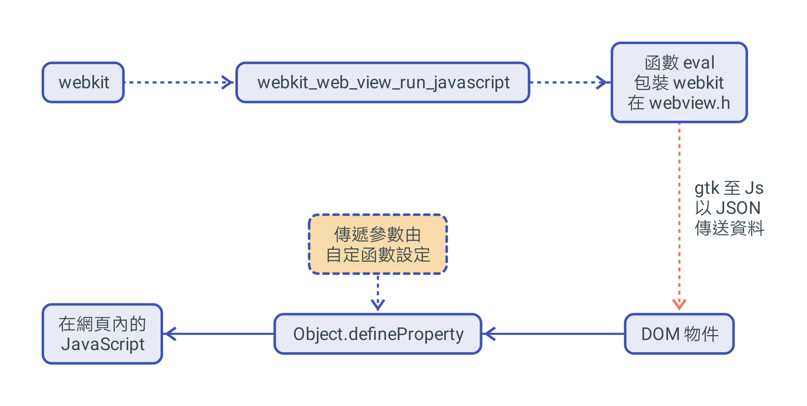
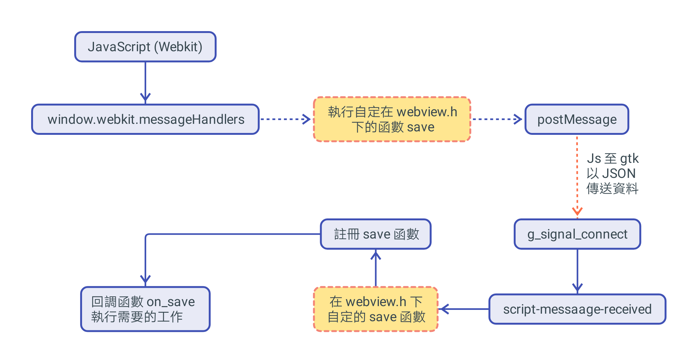
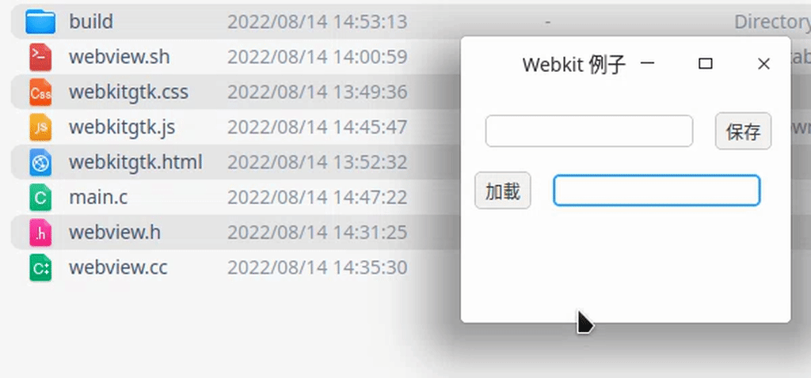

# 在 Deepin 下如何安裝並編譯存儲庫

開發需要 GTK 和 WebKit2GTK 庫。需要檢查您的軟件包存儲庫。

安裝相關的 webkit 軟件至 Deepin 電腦系統：

## 方法一: 用 apt-get 安裝

 - <font color="#FF1000">開發版</font>： sudo apt-get install libgtk-3-dev libwebkit2gtk-4.0-dev
 - <font color="#FF1000">發行版</font>： sudo apt-get install libgtk-3-0 libwebkit2gtk-4.0-37


## 方法二: 源代碼編繹並安裝

下載並解壓: [互聯網上的 Webview 源代碼](https://github.com/WebKit/WebKit)

## 編譯需求版本

### <font color="#FF1000">發行版</font>

```shell
git clone https://github.com/WebKit/WebKit.git WebKit
cmake -DPORT=GTK -DCMAKE_BUILD_TYPE=RelWithDebInfo -GNinja
ninja
sudo ninja install
```

### <font color="#FF1000">開發版</font>

```shell
git clone https://github.com/WebKit/WebKit.git WebKit
sudo apt-get install flatpak
Tools/gtk/install-dependencies
Tools/Scripts/update-webkitgtk-libs
Tools/Scripts/build-webkit --gtk --debug
// 發行版將 --debug 改為 --release
```

## 互聯網上的例子

下載並解壓: [互聯網上的 Webview 軟件包](https://github.com/webview/webview#linux-and-bsd)

一個用於 C/C++ 的 webview 庫，是為使用的平台創建一個通用的 HTML5 UI 抽象層。支持雙向 JavaScript 綁定（從 C/C++ 調用 JavaScript 和從 JavaScript 調用 C/C++）。


# 一般設計方法的簡要說明

## JavaScriptCore

JavaScriptCore 引擎是 WebKit 中默認的 JavaScript 引擎，內嵌緩存、基於正則表達式的 JIT 及字節碼解釋器技術。

JavaScript 引擎的主要功能是解析和執行 JavaScript 代碼，往往不能滿足使用者多樣化的需要，那麼就可以增加擴展以提升它的能力。

### 綁定機制

使用IDL文件或接口文件生成綁定文件，將這些文件同引擎一起編譯。  WebKit 中使用 IDL 來定義 JavaScript，但又與IDL 有所不同，有一些改變。 定義一個新的接口的步驟大致如下：

 1.定義新的接口文件，可以在JavaScript 代碼進行調用，如mymodule.MyObj.myAttr；

```c
module mymodule {
    interface [
            InterfaceName = MyObject
    ] MyObj {
        readonly attribute long myAttr;
        DOMString myMethod (DOMString myArg);
    };
}
```

按照引擎定義的標準接口為基礎實現接口類，生成 JavaScript 引擎所需的綁定文件。WebKit 提供了工具幫助生成所需的綁定類，根據引擎不同和引擎開發語言的不同而生成 C++ 類代碼及頭文件用作綁定。

JavaScript 引擎綁定機制需要擴展代碼和 JavaScript 引擎一塊編譯和打包，不能根據需要在引擎啟動後再動態注入。一般情況下應用中不可能介入到 JavaScript 引擎的編譯中，所以綁定機制有很大的局限性，但其非常高效，只適用於對性能要求較高的場景。

### Extension 機制

 通過基類 Extension 進行能力擴展，無需和引擎一起編譯，可以動態為引擎增加功能特性，具有很大的靈活性。

 Extension 機制的大致思路就是，提供一個基類 Extension 和一個全局註冊函數，要想擴展 JavaScript 能力，需要經過以下步驟：

```
class MYExtension : public v8::Extension {
    public:
        MYExtension() : v8::Extension("v8/My", "native function my();") {}
        virtual v8::Handle<v8::FunctionTemplate> GetNativeFunction (
        v8::Handle<v8::String> name) {
            // 可以根据 name 来返回不同的函数
            return v8::FunctionTemplate::New(MYExtention::MY);
        }
        static v8::Handle<v8::Value> MY(const v8::Arguments& args) {
            // Do sth here
            return v8::Undefined();
        }
};
MYExtension extension;
RegisterExtension(&extension);
```

 - 基於 Extension 基類構建一個它的子類，並實現它的虛函數 *GetNativeFunction*，根據參數 name 來決定返回實函數；

 - 創建一個該子類的對象，並通過註冊函數將該對象註冊到引擎，當 JavaScript 調用 ’my’ 函數時就可被調用到。

 Extension 機制是調用引擎的接口注入新函數，動態擴展非常方便，但沒有綁定機制高效，用於性能要求不高的場景。


### JavaScript 注意

 - 類型: 對於函數，JavaScript 是一種動態類型語言，JavaScriptCore 使用隱藏類和內嵌緩存來提高性能，為了保證緩存命中率，一個函數應該使用較少的數據類型；對於數組，應盡量存放相同類型的數據，這樣就可以通過偏移位置來訪問。

 - 數據表示: 簡單類型數據（如整型）直接保存在句柄中，可以減少尋址時間和內存佔用，如果可以使用整數表示的，盡量不要用浮點類型。

 - 內存: 雖然 JavaScript 語言會自己進行垃圾回收，但我們也應盡量做到及時回收不用的內存，對不再使用的對象設置為 null 或使用 delete 方法來刪除。

 - 優化回滾: 在執行多次之後，不要出現修改對像類型的語句，盡量不要觸發優化回滾，否則會大幅度降低代碼的性能。

 - 新機制: 使用 JavaScript 引擎或者渲染引擎提供的新機制和新接口提高性能。

## 最簡單的方法在 webkit (javascript) 和 gtk 之間提供最基本的通信渠道

根據上面的解釋在 javascript 和 gtk 之間提供通信渠道的方法比較複雜，如下提出了一個簡單的方法來提供它們之間的基本和統一的通信。

因程序跟網頁的交互，主要有兩個方面。

### 程序需要調用網頁 Javascript 代碼

webkit2gtk 的內置的 <font color="#FF1000">webkit_web_view_run_javascript</font> 函數即可解決, eval 已封裝這個函數詳細請看下面的例子。

#### 函數添加到 DOM 元素內

調用需要在 DOM 對像下創建一個函數，以便 webkit2gtk 通過該函數調用 javascript，下面的例子是在 DOM 元素下 ID 為 *info* 的物件創建一個 load 函數，該函數是在 value 的 { ... } 內

##### C 部分源代碼如下

```c
\\ --- javascript 下的程序調用，---
eval("info.load(\"Success!!!\");");
```



##### Javascript 部分源代碼如下

```js
var info = document.getElementById('info');
Object.defineProperty(info, 'load', {
  value: function(strValue){
    \\ --- 函數開始 ---
    document.getElementById("info").innerText = strValue;
    \\ --- 函數結束---
    },
  configurable: true
});
```

### Javascript 需要調用程序的功能代碼
 - webkit2gtk 的內置的 window.webkit.messageHandlers.<font color="#FF1000">save</font>.postMessage(...);函數即可解決。函數包裝創建有關 save 及 on_save 回調詳細請看下面的例子。

##### Javascript 部分源代碼如下

```js
function saveClick() {
  let content = document.getElementById("input").value;
  window.webkit.messageHandlers.save.postMessage(
    "{'filename':'save.txt', 'content':" + content + "}"
  );
}
```



##### C 部分源代碼如下

```c
g_signal_connect(manager, "script-message-received::save",
                  G_CALLBACK(+[](WebKitUserContentManager *, WebKitJavascriptResult *r, gpointer arg){
                  auto *w = static_cast<gtk_webkit_engine *>(arg);
                  char *s = get_string_from_js_result(r);
                  w->on_save(s);
                  g_free(s);
                }),this);
webkit_user_content_manager_register_script_message_handler(manager, "save");

private:
  virtual void on_save(const std::string &msg) = 0;

void on_save(const std::string &msg)
{
  char *jsonStr = const_cast<char *>(msg.c_str());
  char *fileName = getPair(jsonStr, "filename");
  char *content = getPair(jsonStr, "content");
  saveFile(fileName, content);
  free(fileName);
  free(content);
}
```

## 編譯 C 源文件的 shell 腳本 (webview.sh)

```shell
rm -rf ./build
mkdir build
g++ -c webview.cc -std=c++11 $(pkg-config --cflags gtk+-3.0 webkit2gtk-4.0) -o build/webview.o
gcc -c main.c -std=c99 -Iwebview -o build/main.o
g++ build/main.o build/webview.o $(pkg-config --libs gtk+-3.0 webkit2gtk-4.0) -o build/main
./build/main
```

## 文件的編譯示例程序


## 在終端使用腳本文件編譯程序

```shell
chmod 777 webview.sh
./webview.sh
```

## 輸出結果



# 所有源代碼如下供參考

## 網頁文件 (webkitgrk.html)

```html
<!DOCTYPE html>
<html>
  <header>
    <script src="https://code.jquery.com/jquery-1.11.1.min.js"></script>
  </header>
  <body>
    <input id="input" value="我的初始值" />
    <button id="save">保存</button>
    <br />
    <button id="load">加載</button>
    <input value="" id="info" />
  </body>
</html>
```

## CSS 文件 (webkitgrk.css)

```css
input {
  margin:10px;
}
```

## Javascript 文件 (webkitgrk.js)

```js
$(document).ready(function () {
  function saveClick() {
    let content = document.getElementById("input").value;
    window.webkit.messageHandlers.save.postMessage(
      "{'filename':'save.txt', 'content':" + content + "}"
    );
  }

  function loadClick() {
    window.webkit.messageHandlers.load.postMessage(
      "{'filename':'save.txt'}"
    );
  }

  var info = document.getElementById("info");
  Object.defineProperty(info, "load", {
    value: function (strValue) {
      document.getElementById("info").value = strValue;
    },
    configurable: true,
  });

  document.getElementById("load").addEventListener('click', loadClick);
  document.getElementById("save").addEventListener('click', saveClick);
});
```

## C 源文件 (main.c)

```cpp
#include <stdlib.h>
#include "webview.h"

static webview_t w;
char *cssContent = "";
char *jsContent = "";

void addCSS(char *filename) {
  char *result = readFileElem(filename, "style");
  cssContent = combineStrings(cssContent, result);
  free(result);
}

void addJS(char *filename) {
  char *result = readFileElem(filename, "script");
  jsContent = combineStrings(jsContent, result);
  free(result);
}

int main()
{
  w = webview_create(0, NULL);
  webview_set_title(w, "Webkit 例子");
  webview_set_size(w, 1080, 800, WEBVIEW_HINT_NONE);
  char *htmlContent = readFileElem("webkitgtk.html", NULL);
  addCSS("webkitgtk.css");
  addJS("webkitgtk.js");
  char *headerContent = combineStrings(cssContent, jsContent);
  char *html = combineHtml(htmlContent, headerContent);
  webview_set_html(w, html);
  webview_run(w);
  webview_destroy(w);
  return 0;
}
```

## C 頭文件 (webview.h)

```cpp
#ifdef __cplusplus
extern "C"
{
#endif

#define WEBVIEW_HINT_NONE 0  // Width and height are default size
#define WEBVIEW_HINT_MIN 1   // Width and height are minimum bounds
#define WEBVIEW_HINT_MAX 2   // Width and height are maximum bounds
#define WEBVIEW_HINT_FIXED 3 // Window size can not be changed by a user

  typedef void *webview_t;
  extern webview_t webview_create(int debug, void *window);
  extern void webview_destroy(webview_t w);
  extern void webview_run(webview_t w);
  extern void webview_terminate(webview_t w);
  extern void webview_dispatch(webview_t w, void (*fn)(webview_t w, void *arg),
                               void *arg);
  extern void *webview_get_window(webview_t w);
  extern void webview_set_title(webview_t w, const char *title);
  extern void webview_set_size(webview_t w, int width, int height, int hints);
  extern void webview_navigate(webview_t w, const char *url);
  extern void webview_set_html(webview_t w, const char *html);
  extern void webview_init(webview_t w, const char *js);
  extern void webview_eval(webview_t w, const char *js);

  extern char *readFileElem(char *filename, char *elem);
  extern char *combineStrings(char *inputA, char *inputB);
  extern int findStr(char *sourceStr, char *wordStr);
  extern char *combineHtml(char *htmlStr, char *headerStr);
  extern char **str_split(char *a_str, const char a_delim);
  extern void removechar(char str[], char t);
  extern char *ltrim(char *s);
  extern char *rtrim(char *s);
  extern char *trim(char *s);
  extern char *getPair(char *jsonStr, char *key);
  extern char *readFile(char *filename);
  extern void saveFile(char *fileName, char *content);

#ifdef __cplusplus
}
#endif

char *combineStrings(char *inputA, char *inputB);
int findStr(char *sourceStr, char *wordStr);
char *combineHtml(char *htmlStr, char *headerStr);
void addCSS(char *filename);
void addJS(char *filename);
```

## C 源文件 (webview.cc)

```c
#include "webview.h"
#include <JavaScriptCore/JavaScript.h>
#include <cstring>
#include <fstream>
#include <functional>
#include <future>
#include <gtk/gtk.h>
#include <iostream>
#include <map>
#include <regex>
#include <stdio.h>
#include <stdlib.h>
#include <string.h>
#include <utility>
#include <vector>
#include <webkit2/webkit2.h>
// ====================================================================
//   pkg-config --cflags --libs gtk+-3.0 webkit2gtk-4.0
// ====================================================================
namespace webview {
using dispatch_fn_t = std::function<void()>;
namespace detail {
class gtk_webkit_engine {
public:
  gtk_webkit_engine(bool debug, void *window)
      : m_window(static_cast<GtkWidget *>(window)) {
    if (gtk_init_check(0, NULL) == FALSE)
      return;
    m_window = static_cast<GtkWidget *>(window);
    if (m_window == nullptr)
      m_window = gtk_window_new(GTK_WINDOW_TOPLEVEL);
    g_signal_connect(G_OBJECT(m_window), "destroy",
                     G_CALLBACK(+[](GtkWidget *, gpointer arg) {
                       static_cast<gtk_webkit_engine *>(arg)->terminate();
                     }),
                     this);
    // Initialize webview widget
    m_webview = webkit_web_view_new();
    WebKitUserContentManager *manager =
        webkit_web_view_get_user_content_manager(WEBKIT_WEB_VIEW(m_webview));
    //---------- Save -------------
    g_signal_connect(manager, "script-message-received::save",
                     G_CALLBACK(+[](WebKitUserContentManager *,
                                    WebKitJavascriptResult *r, gpointer arg) {
                       auto *w = static_cast<gtk_webkit_engine *>(arg);
                       char *s = get_string_from_js_result(r);
                       w->on_save(s);
                       g_free(s);
                     }),
                     this);
    webkit_user_content_manager_register_script_message_handler(manager,
                                                                "save");
    //-----------------------------
    //---------- Load -------------
    g_signal_connect(manager, "script-message-received::load",
                     G_CALLBACK(+[](WebKitUserContentManager *,
                                    WebKitJavascriptResult *r, gpointer arg) {
                       auto *w = static_cast<gtk_webkit_engine *>(arg);
                       char *s = get_string_from_js_result(r);
                       w->on_load(s);
                       g_free(s);
                     }),
                     this);
    webkit_user_content_manager_register_script_message_handler(manager,
                                                                "load");
    //-----------------------------
    gtk_container_add(GTK_CONTAINER(m_window), GTK_WIDGET(m_webview));
    gtk_widget_grab_focus(GTK_WIDGET(m_webview));
    WebKitSettings *settings =
        webkit_web_view_get_settings(WEBKIT_WEB_VIEW(m_webview));
    webkit_settings_set_javascript_can_access_clipboard(settings, true);
    if (debug) {
      webkit_settings_set_enable_write_console_messages_to_stdout(settings,
                                                                  true);
      webkit_settings_set_enable_developer_extras(settings, true);
    }
    gtk_widget_show_all(m_window);
  }
  virtual ~gtk_webkit_engine() = default;
  void *window() { return (void *)m_window; }
  void run() { gtk_main(); }
  void terminate() { gtk_main_quit(); }
  void dispatch(std::function<void()> f) {
    g_idle_add_full(G_PRIORITY_HIGH_IDLE, (GSourceFunc)([](void *f) -> int {
                      (*static_cast<dispatch_fn_t *>(f))();
                      return G_SOURCE_REMOVE;
                    }),
                    new std::function<void()>(f),
                    [](void *f) { delete static_cast<dispatch_fn_t *>(f); });
  }

  void set_title(const std::string &title) {
    gtk_window_set_title(GTK_WINDOW(m_window), title.c_str());
  }

  void set_size(int width, int height, int hints) {
    gtk_window_set_resizable(GTK_WINDOW(m_window), hints != WEBVIEW_HINT_FIXED);
    if (hints == WEBVIEW_HINT_NONE)
      gtk_window_resize(GTK_WINDOW(m_window), width, height);
    else if (hints == WEBVIEW_HINT_FIXED)
      gtk_widget_set_size_request(m_window, width, height);
    else {
      GdkGeometry g;
      g.min_width = g.max_width = width;
      g.min_height = g.max_height = height;
      GdkWindowHints h =
          (hints == WEBVIEW_HINT_MIN ? GDK_HINT_MIN_SIZE : GDK_HINT_MAX_SIZE);
      gtk_window_set_geometry_hints(GTK_WINDOW(m_window), nullptr, &g, h);
    }
  }

  void navigate(const std::string &url) {
    webkit_web_view_load_uri(WEBKIT_WEB_VIEW(m_webview), url.c_str());
  }

  void set_html(const std::string &html) {
    webkit_web_view_load_html(WEBKIT_WEB_VIEW(m_webview), html.c_str(), NULL);
  }

  void init(const std::string &js) {
    WebKitUserContentManager *manager =
        webkit_web_view_get_user_content_manager(WEBKIT_WEB_VIEW(m_webview));
    webkit_user_content_manager_add_script(
        manager, webkit_user_script_new(
                     js.c_str(), WEBKIT_USER_CONTENT_INJECT_TOP_FRAME,
                     WEBKIT_USER_SCRIPT_INJECT_AT_DOCUMENT_START, NULL, NULL));
  }

  void eval(const std::string &js) {
    webkit_web_view_run_javascript(WEBKIT_WEB_VIEW(m_webview), js.c_str(), NULL,
                                   NULL, NULL);
  }

private:
  virtual void on_save(const std::string &msg) = 0;
  virtual void on_load(const std::string &msg) = 0;

  static char *get_string_from_js_result(WebKitJavascriptResult *r) {
    char *s;
#if WEBKIT_MAJOR_VERSION >= 2 && WEBKIT_MINOR_VERSION >= 22
    JSCValue *value = webkit_javascript_result_get_js_value(r);
    s = jsc_value_to_string(value);
#else
    JSGlobalContextRef ctx = webkit_javascript_result_get_global_context(r);
    JSValueRef value = webkit_javascript_result_get_value(r);
    JSStringRef js = JSValueToStringCopy(ctx, value, NULL);
    size_t n = JSStringGetMaximumUTF8CStringSize(js);
    s = g_new(char, n);
    JSStringGetUTF8CString(js, s, n);
    JSStringRelease(js);
#endif
    return s;
  }

  GtkWidget *m_window;
  GtkWidget *m_webview;
};

} // namespace detail

using browser_engine = detail::gtk_webkit_engine;

} // namespace webview

namespace webview {

class webview : public browser_engine {
public:
  webview(bool debug = false, void *wnd = nullptr)
      : browser_engine(debug, wnd) {}

  void navigate(const std::string &url) {
    if (url == "") {
      browser_engine::navigate("about:blank");
      return;
    }
    browser_engine::navigate(url);
  }

private:
  void on_save(const std::string &msg) {
    char *jsonStr = const_cast<char *>(msg.c_str());
    char *fileName = getPair(jsonStr, "filename");
    char *content = getPair(jsonStr, "content");
    saveFile(fileName, content);
    free(fileName);
    free(content);
  }

  void on_load(const std::string &msg) {
    char *jsonStr = const_cast<char *>(msg.c_str());
    char *fileName = getPair(jsonStr, "filename");
    char *content = readFile(fileName);
    char *rValue = (char *)malloc(sizeof(char) * (strlen(content) + 100));
    sprintf(rValue, "info.load(\"%s\");", content);
    eval(rValue);
    free(rValue);
    free(content);
    free(fileName);
  }
};
} // namespace webview

extern webview_t webview_create(int debug, void *wnd) {
  auto w = new webview::webview(debug, wnd);
  if (!w->window()) {
    delete w;
    return nullptr;
  }
  return w;
}

extern void webview_destroy(webview_t w) {
  delete static_cast<webview::webview *>(w);
}

extern void webview_run(webview_t w) {
  static_cast<webview::webview *>(w)->run();
}

extern void webview_terminate(webview_t w) {
  static_cast<webview::webview *>(w)->terminate();
}

extern void webview_dispatch(webview_t w, void (*fn)(webview_t, void *),
                             void *arg) {
  static_cast<webview::webview *>(w)->dispatch([=]() { fn(w, arg); });
}

extern void *webview_get_window(webview_t w) {
  return static_cast<webview::webview *>(w)->window();
}

extern void webview_set_title(webview_t w, const char *title) {
  static_cast<webview::webview *>(w)->set_title(title);
}

extern void webview_set_size(webview_t w, int width, int height, int hints) {
  static_cast<webview::webview *>(w)->set_size(width, height, hints);
}

extern void webview_navigate(webview_t w, const char *url) {
  static_cast<webview::webview *>(w)->navigate(url);
}

extern void webview_set_html(webview_t w, const char *html) {
  static_cast<webview::webview *>(w)->set_html(html);
}

extern void webview_init(webview_t w, const char *js) {
  static_cast<webview::webview *>(w)->init(js);
}

extern void webview_eval(webview_t w, const char *js) {
  static_cast<webview::webview *>(w)->eval(js);
}

extern char *readFileElem(char *filename, char *elem) {
  FILE *f = fopen(filename, "rt");
  fseek(f, 0, SEEK_END);
  long length = ftell(f);
  fseek(f, 0, SEEK_SET);
  char *buffer = (char *)malloc(sizeof(char) * (length + 1));
  buffer[length] = '\0';
  fread(buffer, 1, length, f);
  fclose(f);
  if (elem) {
    long elemLen = strlen(elem);
    length = length + elemLen * 2 + 4 + 1;
    char *output = (char *)malloc(sizeof(char) * (length));
    output[length] = '\0';
    sprintf((char *)output, "<%s>%s</%s>", elem, buffer, elem);
    free(buffer);
    return output;
  } else
    return buffer;
}

extern char *combineStrings(char *inputA, char *inputB) {
  size_t len = 0, lenB = 0;
  while (inputA[len] != '\0')
    len++;
  while (inputB[lenB] != '\0')
    lenB++;
  char *output = (char *)malloc(sizeof(char *) * (len + lenB));
  sprintf((char *)output, "%s%s", inputA, inputB);
  return output;
}

extern int findStr(char *sourceStr, char *wordStr) {
  char *result = strstr(sourceStr, wordStr);
  int position = strlen(sourceStr) - strlen(result);
  return position;
}

extern char *combineHtml(char *htmlStr, char *headerStr) {
  int index = findStr(htmlStr, "</header>");
  if (index > 0) {
    int len0 = strlen(htmlStr);
    int len1 = strlen(headerStr);
    int length = len0 + len1;
    char *output = (char *)malloc(sizeof(char *) * length);
    memcpy(output, htmlStr, index);
    memcpy(&(output[index]), headerStr, len1);
    memcpy(&(output[index + len1]), &(htmlStr[index]), len0 - index);
    memcpy(&(output[length]), "\0", length);
    free(htmlStr);
    free(headerStr);
    return output;
  }
  return NULL;
}

extern char **str_split(char *a_str, const char a_delim) {
  char **result = 0;
  size_t count = 0;
  char *tmp = a_str;
  char *last_comma = 0;
  char delim[2];
  delim[0] = a_delim;
  delim[1] = 0;
  while (*tmp) {
    if (a_delim == *tmp) {
      count++;
      last_comma = tmp;
    }
    tmp++;
  }
  count += last_comma < (a_str + strlen(a_str) - 1);
  count++;
  result = (char **)malloc(sizeof(char *) * count);
  if (result) {
    size_t idx = 0;
    char *token = strtok(a_str, delim);
    while (token) {
      *(result + idx++) = strdup(token);
      token = strtok(0, delim);
    }
    *(result + idx) = 0;
  }
  return result;
}

extern void removechar(char str[], char t) {
  int i, j;
  i = 0;
  while (i < strlen(str)) {
    if (str[i] == t)
      for (j = i; j < strlen(str); j++)
        str[j] = str[j + 1];
    else
      i++;
  }
}

extern char *ltrim(char *s) {
  while (isspace(*s))
    s++;
  return s;
}

extern char *rtrim(char *s) {
  char *back = s + strlen(s);
  while (isspace(*--back))
    ;
  *(back + 1) = '\0';
  return s;
}

extern char *trim(char *s) { return rtrim(ltrim(s)); }

extern void saveFile(char *fileName, char *content) {
  FILE *destFile;
  destFile = fopen(fileName, "wb");
  fwrite(content, 1, strlen(content), destFile);
  fclose(destFile);
}

extern char *getPair(char *jsonStr, char *key) {
  char *localStr = (char *)malloc(sizeof(char) * strlen(jsonStr) + 1);
  strcpy(localStr, jsonStr);
  removechar(localStr, '\"');
  removechar(localStr, '\'');
  removechar(localStr, '{');
  removechar(localStr, '}');
  char **tokens = str_split(localStr, ',');
  free(localStr);
  char **result;
  if (tokens) {
    for (int i = 0; *(tokens + i); i++) {
      result = str_split(trim(*(tokens + i)), ':');
      if (strcmp(result[0], key) == 0) {
        free(tokens);
        free(result[0]);
        return result[1];
      } else
        free(*(tokens + i));
    }
  }
  free(tokens);
  return NULL;
}

extern char *readFile(char *filename) {
  FILE *f = fopen(filename, "rt");
  fseek(f, 0, SEEK_END);
  long length = ftell(f);
  fseek(f, 0, SEEK_SET);
  char *buffer = (char *)malloc(length + 1);
  buffer[length] = '\0';
  fread(buffer, 1, length, f);
  fclose(f);
  return buffer;
}
```