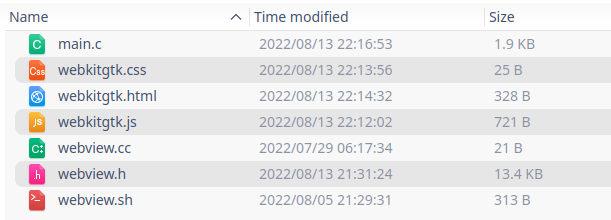
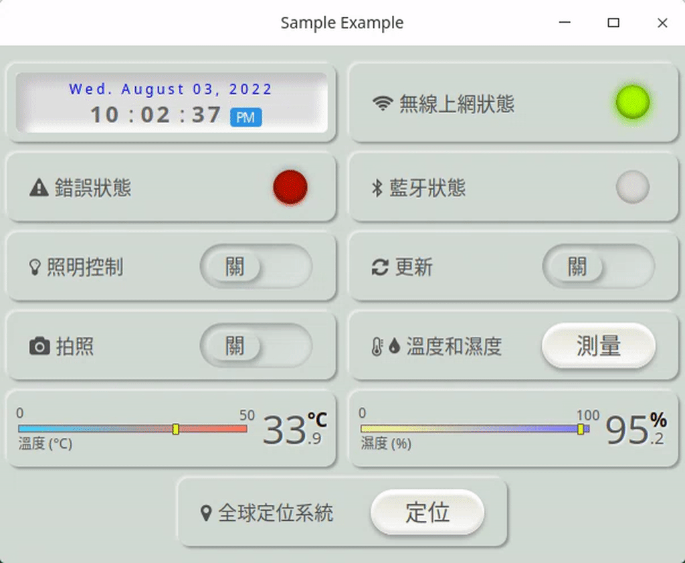

# 如何安裝存儲庫至 Deepin

下載並解壓: [互聯網上的 Webview 軟件包](https://github.com/webview/webview#linux-and-bsd)

一個用於 C/C++ 的 webview 庫，是為使用的平台創建一個通用的 HTML5 UI 抽象層。支持雙向 JavaScript 綁定（從 C/C++ 調用 JavaScript 和從 JavaScript 調用 C/C++）。

# 在 Deepin 下如何安裝並編譯存儲庫

開發需要 GTK 和 WebKit2GTK 庫。需要檢查您的軟件包存儲庫。

安裝相關的 webkit 軟件至 Deepin 電腦系統：

 - <font color="#FF1000">開發版</font>： sudo apt-get install libgtk-3-dev libwebkit2gtk-4.0-dev
 - <font color="#FF1000">發行版</font>： sudo apt-get install libgtk-3-0 libwebkit2gtk-4.0-37

## C 源文件創建 webview 程序 (main.c)

```c
#include "webview.h"
#include <stdio.h>
#include <stdlib.h>
#include <string.h>
#include <assert.h>

char *cssContent = "";
char *jsContent = "";

char *readFile(char *filename, char *elem)
{
  FILE *f = fopen(filename, "rt");
  assert(f);
  fseek(f, 0, SEEK_END);
  long length = ftell(f);
  fseek(f, 0, SEEK_SET);
  char *buffer = (char *)malloc(length + 1);
  buffer[length] = '\0';
  fread(buffer, 1, length, f);
  fclose(f);
  if (elem)
  {
    long elemLen = strlen(elem);
    length = length + elemLen * 2 + 5 + 1;
    char *output = (char *)malloc(length + 1);
    output[length] = '\0';
    sprintf((char *)output, "<%s>%s</%s>", elem, buffer, elem);
    free(buffer);
    return output;
  }
  else
    return buffer;
}

char *combineStrings(char *inputA, char *inputB)
{
  size_t len = 0, lenB = 0;
  while (inputA[len] != '\0')
    len++;
  while (inputB[lenB] != '\0')
    lenB++;
  char *output = malloc(len + lenB);
  sprintf((char *)output, "%s%s", inputA, inputB);
  return output;
}

void addCSS(char *filename)
{
  char *result = readFile(filename, "style");
  cssContent = combineStrings(cssContent, result);
  free(result);
}

void addJS(char *filename)
{
  char *result = readFile(filename, "script");
  jsContent = combineStrings(jsContent, result);
  free(result);
}

char *body(char *filename)
{
  return readFile(filename, NULL);
}

typedef struct
{
  webview_t w;
  unsigned int count;
} context_t;

// void increment(const char *seq, const char *req, void *arg)
// {
//   context_t *context = (context_t *)arg;
//   char count_string[10] = {0};
//   sprintf(count_string, "%u", ++context->count);
//   char result[21] = {0};
//   strcat(result, "{\"count\": ");
//   strcat(result, count_string);
//   strcat(result, "}");
//   webview_return(context->w, seq, 0, result);
// }

int main()
{
  webview_t w = webview_create(0, NULL);
  context_t context = {.w = w, .count = 0};
  webview_set_title(w, "Sample Example");
  webview_set_size(w, 1080, 800, WEBVIEW_HINT_NONE);
  //  webview_bind(w, "increment", increment, &context);
  char *bodyContent = readFile("switch.html", "html");
  addCSS("switch.css");
  addJS("components.js");
  char *headerContent = combineStrings(cssContent, jsContent);
  char *html = combineStrings(headerContent, bodyContent);
  webview_set_html(w, html);
  webview_run(w);
  webview_destroy(w);
  return 0;
}
```

## 編譯 C 源文件的 shell 腳本 (webview.sh)

```shell
rm -rf ./build
mkdir build
g++ -c webview.cc -std=c++11 $(pkg-config --cflags gtk+-3.0 webkit2gtk-4.0) -o build/webview.o
gcc -c main.c -std=c99 -Iwebview -o build/main.o
g++ build/main.o build/webview.o $(pkg-config --libs gtk+-3.0 webkit2gtk-4.0) -o build/main
./build/main
```

 ## 文件的編譯示例程序



## 輸出結果



## 在終端使用腳本文件編譯程序

```shell
chmod 777 webview.sh
./webview.sh
```

## C 源文件 webview

```c
#ifdef __cplusplus
extern "C" {
#endif

#define WEBVIEW_HINT_NONE 0  // Width and height are default size
#define WEBVIEW_HINT_MIN 1   // Width and height are minimum bounds
#define WEBVIEW_HINT_MAX 2   // Width and height are maximum bounds
#define WEBVIEW_HINT_FIXED 3 // Window size can not be changed by a user

typedef void *webview_t;
extern webview_t webview_create(int debug, void *window);
extern void webview_destroy(webview_t w);
extern void webview_run(webview_t w);
extern void webview_terminate(webview_t w);
extern void webview_dispatch(webview_t w, void (*fn)(webview_t w, void *arg), void *arg);
extern void *webview_get_window(webview_t w);
extern void webview_set_title(webview_t w, const char *title);
extern void webview_set_size(webview_t w, int width, int height, int hints);
extern void webview_navigate(webview_t w, const char *url);
extern void webview_set_html(webview_t w, const char *html);
extern void webview_init(webview_t w, const char *js);
extern void webview_eval(webview_t w, const char *js);
extern void webview_bind(webview_t w, const char *name, void (*fn)(const char *seq, const char *req, void *arg), void *arg);
extern void webview_unbind(webview_t w, const char *name);
extern void webview_return(webview_t w, const char *seq, int status, const char *result);

#ifdef __cplusplus
}

#include <array>
#include <atomic>
#include <cstring>
#include <functional>
#include <future>
#include <map>
#include <string>
#include <utility>
#include <vector>

namespace webview {

using dispatch_fn_t = std::function<void()>;

namespace detail {

inline int json_parse_c(const char *s, size_t sz, const char *key, size_t keysz,
                        const char **value, size_t *valuesz) {
  enum {
    JSON_STATE_VALUE,
    JSON_STATE_LITERAL,
    JSON_STATE_STRING,
    JSON_STATE_ESCAPE,
    JSON_STATE_UTF8
  } state = JSON_STATE_VALUE;
  const char *k = NULL;
  int index = 1;
  int depth = 0;
  int utf8_bytes = 0;

  if (key == NULL) {
    index = keysz;
    keysz = 0;
  }

  *value = NULL;
  *valuesz = 0;

  for (; sz > 0; s++, sz--) {
    enum {
      JSON_ACTION_NONE,
      JSON_ACTION_START,
      JSON_ACTION_END,
      JSON_ACTION_START_STRUCT,
      JSON_ACTION_END_STRUCT
    } action = JSON_ACTION_NONE;
    unsigned char c = *s;
    switch (state) {
    case JSON_STATE_VALUE:
      if (c == ' ' || c == '\t' || c == '\n' || c == '\r' || c == ',' ||
          c == ':') {
        continue;
      } else if (c == '"') {
        action = JSON_ACTION_START;
        state = JSON_STATE_STRING;
      } else if (c == '{' || c == '[') {
        action = JSON_ACTION_START_STRUCT;
      } else if (c == '}' || c == ']') {
        action = JSON_ACTION_END_STRUCT;
      } else if (c == 't' || c == 'f' || c == 'n' || c == '-' ||
                 (c >= '0' && c <= '9')) {
        action = JSON_ACTION_START;
        state = JSON_STATE_LITERAL;
      } else {
        return -1;
      }
      break;
    case JSON_STATE_LITERAL:
      if (c == ' ' || c == '\t' || c == '\n' || c == '\r' || c == ',' ||
          c == ']' || c == '}' || c == ':') {
        state = JSON_STATE_VALUE;
        s--;
        sz++;
        action = JSON_ACTION_END;
      } else if (c < 32 || c > 126) {
        return -1;
      } // fallthrough
    case JSON_STATE_STRING:
      if (c < 32 || (c > 126 && c < 192)) {
        return -1;
      } else if (c == '"') {
        action = JSON_ACTION_END;
        state = JSON_STATE_VALUE;
      } else if (c == '\\') {
        state = JSON_STATE_ESCAPE;
      } else if (c >= 192 && c < 224) {
        utf8_bytes = 1;
        state = JSON_STATE_UTF8;
      } else if (c >= 224 && c < 240) {
        utf8_bytes = 2;
        state = JSON_STATE_UTF8;
      } else if (c >= 240 && c < 247) {
        utf8_bytes = 3;
        state = JSON_STATE_UTF8;
      } else if (c >= 128 && c < 192) {
        return -1;
      }
      break;
    case JSON_STATE_ESCAPE:
      if (c == '"' || c == '\\' || c == '/' || c == 'b' || c == 'f' ||
          c == 'n' || c == 'r' || c == 't' || c == 'u') {
        state = JSON_STATE_STRING;
      } else {
        return -1;
      }
      break;
    case JSON_STATE_UTF8:
      if (c < 128 || c > 191) {
        return -1;
      }
      utf8_bytes--;
      if (utf8_bytes == 0) {
        state = JSON_STATE_STRING;
      }
      break;
    default:
      return -1;
    }

    if (action == JSON_ACTION_END_STRUCT) {
      depth--;
    }

    if (depth == 1) {
      if (action == JSON_ACTION_START || action == JSON_ACTION_START_STRUCT) {
        if (index == 0) {
          *value = s;
        } else if (keysz > 0 && index == 1) {
          k = s;
        } else {
          index--;
        }
      } else if (action == JSON_ACTION_END ||
                 action == JSON_ACTION_END_STRUCT) {
        if (*value != NULL && index == 0) {
          *valuesz = (size_t)(s + 1 - *value);
          return 0;
        } else if (keysz > 0 && k != NULL) {
          if (keysz == (size_t)(s - k - 1) && memcmp(key, k + 1, keysz) == 0) {
            index = 0;
          } else {
            index = 2;
          }
          k = NULL;
        }
      }
    }

    if (action == JSON_ACTION_START_STRUCT) {
      depth++;
    }
  }
  return -1;
}

inline std::string json_escape(const std::string &s) {
  // TODO: implement
  return '"' + s + '"';
}

inline int json_unescape(const char *s, size_t n, char *out) {
  int r = 0;
  if (*s++ != '"') {
    return -1;
  }
  while (n > 2) {
    char c = *s;
    if (c == '\\') {
      s++;
      n--;
      switch (*s) {
      case 'b':
        c = '\b';
        break;
      case 'f':
        c = '\f';
        break;
      case 'n':
        c = '\n';
        break;
      case 'r':
        c = '\r';
        break;
      case 't':
        c = '\t';
        break;
      case '\\':
        c = '\\';
        break;
      case '/':
        c = '/';
        break;
      case '\"':
        c = '\"';
        break;
      default: // TODO: support unicode decoding
        return -1;
      }
    }
    if (out != NULL) {
      *out++ = c;
    }
    s++;
    n--;
    r++;
  }
  if (*s != '"') {
    return -1;
  }
  if (out != NULL) {
    *out = '\0';
  }
  return r;
}

inline std::string json_parse(const std::string &s, const std::string &key,
                              const int index) {
  const char *value;
  size_t value_sz;
  if (key == "") {
    json_parse_c(s.c_str(), s.length(), nullptr, index, &value, &value_sz);
  } else {
    json_parse_c(s.c_str(), s.length(), key.c_str(), key.length(), &value,
                 &value_sz);
  }
  if (value != nullptr) {
    if (value[0] != '"') {
      return std::string(value, value_sz);
    }
    int n = json_unescape(value, value_sz, nullptr);
    if (n > 0) {
      char *decoded = new char[n + 1];
      json_unescape(value, value_sz, decoded);
      std::string result(decoded, n);
      delete[] decoded;
      return result;
    }
  }
  return "";
}

} // namespace detail

} // namespace webview

//
// ====================================================================
//
// This implementation uses webkit2gtk backend. It requires gtk+3.0 and
// webkit2gtk-4.0 libraries. Proper compiler flags can be retrieved via:
//
//   pkg-config --cflags --libs gtk+-3.0 webkit2gtk-4.0
//
// ====================================================================
//
#include <JavaScriptCore/JavaScript.h>
#include <gtk/gtk.h>
#include <webkit2/webkit2.h>

namespace webview {

namespace detail {

class gtk_webkit_engine {
public:
  gtk_webkit_engine(bool debug, void *window)
      : m_window(static_cast<GtkWidget *>(window)) {
    if (gtk_init_check(0, NULL) == FALSE) {
      return;
    }
    m_window = static_cast<GtkWidget *>(window);
    if (m_window == nullptr) {
      m_window = gtk_window_new(GTK_WINDOW_TOPLEVEL);
    }
    g_signal_connect(G_OBJECT(m_window), "destroy",
                     G_CALLBACK(+[](GtkWidget *, gpointer arg) {
                       static_cast<gtk_webkit_engine *>(arg)->terminate();
                     }),
                     this);
    // Initialize webview widget
    m_webview = webkit_web_view_new();
    WebKitUserContentManager *manager =
        webkit_web_view_get_user_content_manager(WEBKIT_WEB_VIEW(m_webview));
    g_signal_connect(manager, "script-message-received::external",
                     G_CALLBACK(+[](WebKitUserContentManager *,
                                    WebKitJavascriptResult *r, gpointer arg) {
                       auto *w = static_cast<gtk_webkit_engine *>(arg);
                       char *s = get_string_from_js_result(r);
                       w->on_message(s);
                       g_free(s);
                     }),
                     this);
    webkit_user_content_manager_register_script_message_handler(manager,
                                                                "external");
    init("window.external={invoke:function(s){window.webkit.messageHandlers."
         "external.postMessage(s);}}");

    gtk_container_add(GTK_CONTAINER(m_window), GTK_WIDGET(m_webview));
    gtk_widget_grab_focus(GTK_WIDGET(m_webview));

    WebKitSettings *settings =
        webkit_web_view_get_settings(WEBKIT_WEB_VIEW(m_webview));
    webkit_settings_set_javascript_can_access_clipboard(settings, true);
    if (debug) {
      webkit_settings_set_enable_write_console_messages_to_stdout(settings,
                                                                  true);
      webkit_settings_set_enable_developer_extras(settings, true);
    }

    gtk_widget_show_all(m_window);
  }
  virtual ~gtk_webkit_engine() = default;
  void *window() { return (void *)m_window; }
  void run() { gtk_main(); }
  void terminate() { gtk_main_quit(); }
  void dispatch(std::function<void()> f) {
    g_idle_add_full(G_PRIORITY_HIGH_IDLE, (GSourceFunc)([](void *f) -> int {
                      (*static_cast<dispatch_fn_t *>(f))();
                      return G_SOURCE_REMOVE;
                    }),
                    new std::function<void()>(f),
                    [](void *f) { delete static_cast<dispatch_fn_t *>(f); });
  }

  void set_title(const std::string &title) {
    gtk_window_set_title(GTK_WINDOW(m_window), title.c_str());
  }

  void set_size(int width, int height, int hints) {
    gtk_window_set_resizable(GTK_WINDOW(m_window), hints != WEBVIEW_HINT_FIXED);
    if (hints == WEBVIEW_HINT_NONE) {
      gtk_window_resize(GTK_WINDOW(m_window), width, height);
    } else if (hints == WEBVIEW_HINT_FIXED) {
      gtk_widget_set_size_request(m_window, width, height);
    } else {
      GdkGeometry g;
      g.min_width = g.max_width = width;
      g.min_height = g.max_height = height;
      GdkWindowHints h =
          (hints == WEBVIEW_HINT_MIN ? GDK_HINT_MIN_SIZE : GDK_HINT_MAX_SIZE);
      // This defines either MIN_SIZE, or MAX_SIZE, but not both:
      gtk_window_set_geometry_hints(GTK_WINDOW(m_window), nullptr, &g, h);
    }
  }

  void navigate(const std::string &url) {
    webkit_web_view_load_uri(WEBKIT_WEB_VIEW(m_webview), url.c_str());
  }

  void set_html(const std::string &html) {
    webkit_web_view_load_html(WEBKIT_WEB_VIEW(m_webview), html.c_str(), NULL);
  }

  void init(const std::string &js) {
    WebKitUserContentManager *manager =
        webkit_web_view_get_user_content_manager(WEBKIT_WEB_VIEW(m_webview));
    webkit_user_content_manager_add_script(
        manager, webkit_user_script_new(
                     js.c_str(), WEBKIT_USER_CONTENT_INJECT_TOP_FRAME,
                     WEBKIT_USER_SCRIPT_INJECT_AT_DOCUMENT_START, NULL, NULL));
  }

  void eval(const std::string &js) {
    webkit_web_view_run_javascript(WEBKIT_WEB_VIEW(m_webview), js.c_str(), NULL,
                                   NULL, NULL);
  }

private:
  virtual void on_message(const std::string &msg) = 0;

  static char *get_string_from_js_result(WebKitJavascriptResult *r) {
    char *s;
#if WEBKIT_MAJOR_VERSION >= 2 && WEBKIT_MINOR_VERSION >= 22
    JSCValue *value = webkit_javascript_result_get_js_value(r);
    s = jsc_value_to_string(value);
#else
    JSGlobalContextRef ctx = webkit_javascript_result_get_global_context(r);
    JSValueRef value = webkit_javascript_result_get_value(r);
    JSStringRef js = JSValueToStringCopy(ctx, value, NULL);
    size_t n = JSStringGetMaximumUTF8CStringSize(js);
    s = g_new(char, n);
    JSStringGetUTF8CString(js, s, n);
    JSStringRelease(js);
#endif
    return s;
  }

  GtkWidget *m_window;
  GtkWidget *m_webview;
};

} // namespace detail

using browser_engine = detail::gtk_webkit_engine;

} // namespace webview

namespace webview {

class webview : public browser_engine {
public:
  webview(bool debug = false, void *wnd = nullptr)
      : browser_engine(debug, wnd) {}

  void navigate(const std::string &url) {
    if (url == "") {
      browser_engine::navigate("about:blank");
      return;
    }
    browser_engine::navigate(url);
  }

  using binding_t = std::function<void(std::string, std::string, void *)>;
  class binding_ctx_t {
  public:
    binding_ctx_t(binding_t *callback, void *arg, bool sync = true)
        : callback(callback), arg(arg), sync(sync) {}
    // This function is called upon execution of the bound JS function
    binding_t *callback;
    // This user-supplied argument is passed to the callback
    void *arg;
    // This boolean expresses whether or not this binding is synchronous or
    // asynchronous Async bindings require the user to call the resolve
    // function, sync bindings don't
    bool sync;
  };

  using sync_binding_t = std::function<std::string(std::string)>;
  using sync_binding_ctx_t = std::pair<webview *, sync_binding_t>;

  // Synchronous bind
  void bind(const std::string &name, sync_binding_t fn) {
    if (bindings.count(name) == 0) {
      bindings[name] = new binding_ctx_t(
          new binding_t(
              [](const std::string &seq, const std::string &req, void *arg) {
                auto pair = static_cast<sync_binding_ctx_t *>(arg);
                pair->first->resolve(seq, 0, pair->second(req));
              }),
          new sync_binding_ctx_t(this, fn));
      bind_js(name);
    }
  }

  // Asynchronous bind
  void bind(const std::string &name, binding_t f, void *arg) {
    if (bindings.count(name) == 0) {
      bindings[name] = new binding_ctx_t(new binding_t(f), arg, false);
      bind_js(name);
    }
  }

  void unbind(const std::string &name) {
    if (bindings.find(name) != bindings.end()) {
      auto js = "delete window['" + name + "'];";
      init(js);
      eval(js);
      delete bindings[name]->callback;
      if (bindings[name]->sync) {
        delete static_cast<sync_binding_ctx_t *>(bindings[name]->arg);
      }
      delete bindings[name];
      bindings.erase(name);
    }
  }

  void resolve(const std::string &seq, int status, const std::string &result) {
    dispatch([seq, status, result, this]() {
      if (status == 0) {
        eval("window._rpc[" + seq + "].resolve(" + result +
             "); delete window._rpc[" + seq + "]");
      } else {
        eval("window._rpc[" + seq + "].reject(" + result +
             "); delete window._rpc[" + seq + "]");
      }
    });
  }

private:
  void bind_js(const std::string &name) {
    auto js = "(function() { var name = '" + name + "';" + R"(
      var RPC = window._rpc = (window._rpc || {nextSeq: 1});
      window[name] = function() {
        var seq = RPC.nextSeq++;
        var promise = new Promise(function(resolve, reject) {
          RPC[seq] = {
            resolve: resolve,
            reject: reject,
          };
        });
        window.external.invoke(JSON.stringify({
          id: seq,
          method: name,
          params: Array.prototype.slice.call(arguments),
        }));
        return promise;
      }
    })())";
    init(js);
    eval(js);
  }

  void on_message(const std::string &msg) {
    auto seq = detail::json_parse(msg, "id", 0);
    auto name = detail::json_parse(msg, "method", 0);
    auto args = detail::json_parse(msg, "params", 0);
    if (bindings.find(name) == bindings.end()) {
      return;
    }
    auto fn = bindings[name];
    (*fn->callback)(seq, args, fn->arg);
  }

  std::map<std::string, binding_ctx_t *> bindings;
};
} // namespace webview

extern webview_t webview_create(int debug, void *wnd) {
  auto w = new webview::webview(debug, wnd);
  if (!w->window()) {
    delete w;
    return nullptr;
  }
  return w;
}

extern void webview_destroy(webview_t w) {
  delete static_cast<webview::webview *>(w);
}

extern void webview_run(webview_t w) {
  static_cast<webview::webview *>(w)->run();
}

extern void webview_terminate(webview_t w) {
  static_cast<webview::webview *>(w)->terminate();
}

extern void webview_dispatch(webview_t w, void (*fn)(webview_t, void *),
                             void *arg) {
  static_cast<webview::webview *>(w)->dispatch([=]() { fn(w, arg); });
}

extern void *webview_get_window(webview_t w) {
  return static_cast<webview::webview *>(w)->window();
}

extern void webview_set_title(webview_t w, const char *title) {
  static_cast<webview::webview *>(w)->set_title(title);
}

extern void webview_set_size(webview_t w, int width, int height, int hints) {
  static_cast<webview::webview *>(w)->set_size(width, height, hints);
}

extern void webview_navigate(webview_t w, const char *url) {
  static_cast<webview::webview *>(w)->navigate(url);
}

extern void webview_set_html(webview_t w, const char *html) {
  static_cast<webview::webview *>(w)->set_html(html);
}

extern void webview_init(webview_t w, const char *js) {
  static_cast<webview::webview *>(w)->init(js);
}

extern void webview_eval(webview_t w, const char *js) {
  static_cast<webview::webview *>(w)->eval(js);
}

extern void webview_bind(webview_t w, const char *name,
                         void (*fn)(const char *seq, const char *req,
                                    void *arg),
                         void *arg) {
  static_cast<webview::webview *>(w)->bind(
      name,
      [=](const std::string &seq, const std::string &req, void *arg) {
        fn(seq.c_str(), req.c_str(), arg);
      },
      arg);
}

extern void webview_unbind(webview_t w, const char *name) {
  static_cast<webview::webview *>(w)->unbind(name);
}

extern void webview_return(webview_t w, const char *seq, int status,
                           const char *result) {
  static_cast<webview::webview *>(w)->resolve(seq, status, result);
}

#endif
```
