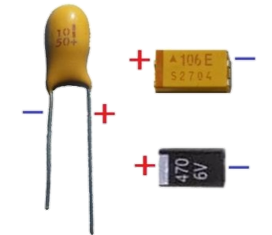
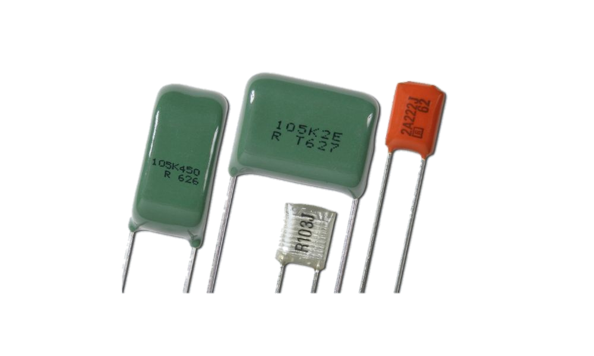
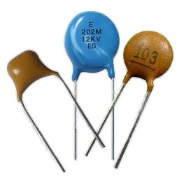
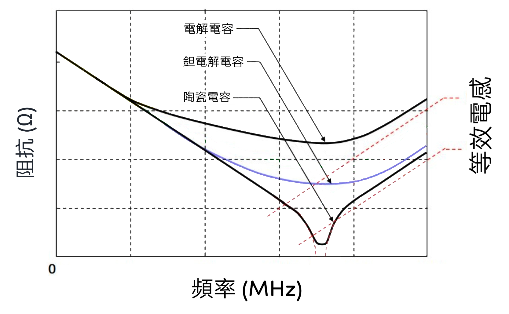
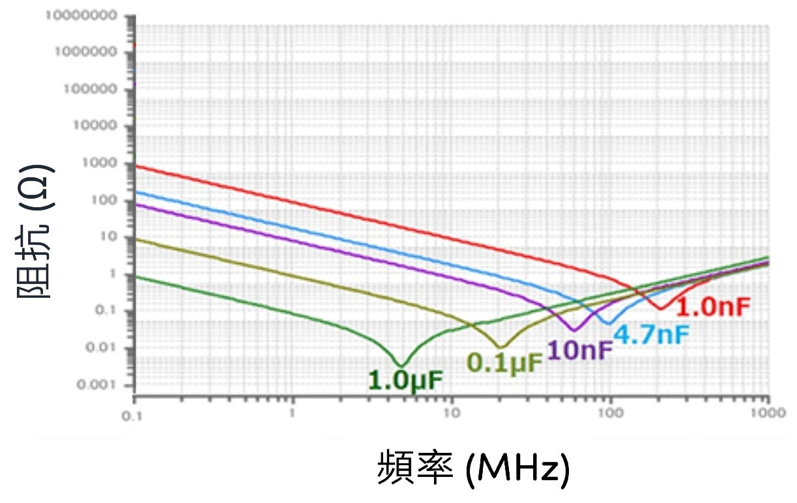
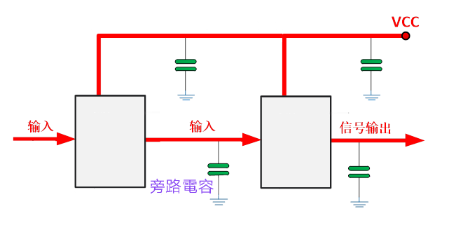

# 電容

## 容抗

電容容抗的方法是：結合信號頻率的高低，理解電容的容抗大小。 在每一個特定頻率下，電路中的電容都有一個特定的容抗。 給定頻率時，將電容的容抗用電阻去等效理解。

$$ X_{c} = \frac{1}{2\pi{fC}} $$

## RC 時間常數 (τ)

電阻值和電容值的乘積，即 *RC 時間常數*。 此常數存在於用來描述電容透過電阻的充電與放電方程式，代表此類電路改變電壓後，電容兩端電壓達到約63% 最終電壓所需的時間。 亦可計算電容充電至指定電壓後所儲存的總能量。

注意: 0.7 τ 相等於 $ \frac{1}{2}$ 電壓 (E)

## 電容分類

形狀

|名稱|圖片|
|:---:|:---:|
|電解電容||
|鉭質電容||
|聚合物薄膜電容||
|陶瓷電容||

分類

分類比較

## 電容特性

電容在超過諧振頻率俊呈現電感特性如下圖

不可電容的特性分別

真實陶瓷電容特性供參考

## 電容值

陶瓷电容上會印有三位數的編碼標示其電容值，前二個數字標示容值最高的二位數，最後一數字則標示 10 的次方，其單位為皮法拉 （pF : 10-12 F）。 第四位為誤差值，如不標示即為不決定。 

## 常用電路

### 濾波電路

濾波電容是指安裝在整流電路兩端用以降低交流脈動波紋係數提升高效平滑直流輸出的一種儲能器件。由於濾波電路要求儲能電容有較大電容量。所以，絕大多數濾波電路使用電解電容。電解電容由於其使用電解質作為電極（負極）而得名。

### 旁路電路

旁路電容是可將混有高頻電流和低頻電流的交流電中的高頻成分旁路濾掉的電容。 對於同一個電路來説，旁路（bypass）電容是把輸入信號中的高頻噪聲作為濾除對象，把前級攜帶的高頻雜波濾除。

### 退耦電路

退耦電路通常設置在兩級放大器之間，所以只有多級放大器才有退耦電路，這一電路用來消除多級放大器之間的有害交連。即電路之間通過電源內阻的有害信號耦合。去耦(decoupling)，也稱退耦。電容是把輸出信號的干擾作為濾除對象。

### 耦合電路

耦合電容的作用是將前級信號盡可能無損耗地加到後級電路中，同時去掉不需要的信號，例如耦合電容就能在將交流信號從前級耦合到後級的同時隔開前級電路中的直流成分，因為電容具有隔直通交的特性。

### 分頻電路

### 諧振電路

