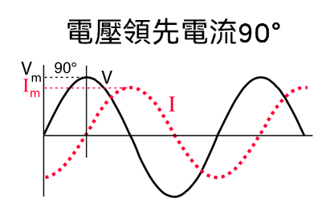

# 電容

## 容抗

電容容抗的方法是：結合信號頻率的高低，理解電容的容抗大小。 在每一個特定頻率下，電路中的電容都有一個特定的容抗。 給定頻率時，將電容的容抗用電阻去等效理解。

$$ X_{c} = \frac{1}{2\pi{f_{0}C}} $$

 - 容抗用 $X_{c}$ (Ω)
 - 電容用 $C$ (F)
 - 頻率用 $f_{0}$ (Hz)

注意: 電容電路分析中需要用到電容器兩端電壓不能突變的特性，這是分析電容電路工作原理時的一個重要特性。

<table class="inputT">
<tr><td>頻率值:</td><td><input type="text" id="f00" /></td><td>(kHz)</td></tr>
<tr><td>電容值:</td><td><input type="text" id="C00" /></td><td>(μF)</td></tr>
<tr><td colspan=3><input id="r00" type="button" onClick="multBy0()" Value="計算容抗" /></td></tr>
</table>

## RC 時間常數 (τ)

電阻值和電容值的乘積，即 *RC 時間常數*。 此常數存在於用來描述電容透過電阻的充電與放電方程式，代表此類電路改變電壓後，電容兩端電壓達到約63% 最終電壓所需的時間。 亦可計算電容充電至指定電壓後所儲存的總能量。

電容充電公式如下:

$$ V_{c} = V \times \left ( 1- e^{\frac{-\tau }{RC}}\right ) $$

$$ I_{c} = I \times e^{\frac{-\tau }{RC}} $$

注意: 當 τ = 0.7 時電容的兩端電壓等於 50% 外加電壓

電容放電公式如下:

$$ V_{c} = V \times e^{\frac{-\tau }{RC}} $$

$$ I_{c} = I \times \left ( 1- e^{\frac{-\tau }{RC}}\right ) $$

## 電阻,電容及頻率

### 並聯電阻及電容

$$ Z_p = \frac {RX_cj}{R+X_cj} = \frac {X_cRX_c}{R^2 + X_c^2} + \frac {RX_cR}{R^2 + X_c^2}j $$

### 串聯電阻及電容

$$ Z_s = \sqrt {R^2 + X_c^2}  $$

### 相位角

$$ \phi = tan^{-1} \left ( \frac{X_c}{R}\right ) $$

<table class="inputT">
<tr><td>電阻值:</td><td colspan=2><input type="text" id="Rx0" /> kΩ</td></tr>
<tr><td>電容值:</td><td colspan=2><input type="text" id="Cx0" /> μF</td></tr>
<tr><td>頻率值:</td><td colspan=2><input type="text" id="fx0" /> kHz</td></tr>
<tr><td><input type="button" onClick="mult0()" Value="計算"></td><td>最終阻抗</td><td>相位角</td></tr>
<tr><td>串聯</td><td><input id="s0"/></td><td><input id="sa0"/></td></tr>
<tr><td>並聯</td><td><input id="p0"/></td><td><input id="pa0"/></td></tr>
</table>

## 電阻和電容的截止頻率

截止頻率 $ ƒ_{cutoff} $ ，電路的響應以 -20dB/Decade 或 -6dB/Octave **滾降** 的斜率下降到零。滾降對於任何 RC 組合將始終相同。

對於 低通濾波器 電路，低於這個截止點 $ƒ_{cutoff}$ 點的所有頻率都沒有改變，幾乎沒有衰減，並且被稱為濾波器通帶區域。這個通帶區域也代表了濾波器的帶寬。任何高於該點截止點的信號頻率通常被認為是在濾波器阻帶區域，它們將被大大衰減。相位角為 $ -45^{\circ} $。

對於 高通濾波器 電路，高於這個截止點 $ƒ_{cutoff}$ 點的所有頻率都沒有改變，幾乎沒有衰減，並且被稱為濾波器通帶區域。這個通帶區域也代表了濾波器的帶寬。任何低於該點截止點的信號頻率通常被認為是在濾波器阻帶區域，它們將被大大衰減。相位角為 $ +45^{\circ} $。

這個 *截止*, *拐角* 或 *斷點* 頻率被定義為容抗和電阻相等的頻率點 $ R = X_c $ 。當這種情況發生時，輸出信號衰減到輸入信號值的 70.7% 或輸入的 $ -3dB = 20 log \frac {Vout}{Vin} $。雖然 $ R = X_c $ ，但輸出不是輸入信號的一半。這是因為它等於兩者的向量和，因此是輸入的 0.707。由於濾波器包含一個電容器，因此輸出信號的相位角 $ \phi $ 為 $ \pm45^{\circ} $ 取決於過濾器類型，並且在 $ -3dB $ 截止頻率 $ ƒ_{cutoff} $ 處。

$$ ƒ_{cutoff} = \frac {1} {2 \pi RC} $$

<table class="inputT">
<tr><td>電阻值:</td><td><input type="text" id="R0" /></td><td>(kΩ)</td></tr>
<tr><td>電容值:</td><td><input type="text" id="C0" /></td><td>(μF)</td></tr>
<tr><td colspan=3><input id="r0" type="button" onClick="multBy()" Value="計算截止頻率" /></td></tr>
</table>

## 電容分類

形狀

|名稱|圖片|
|:---:|:---:|
|電解電容||
|鉭質電容||
|聚合物薄膜電容||
|陶瓷電容||

分類

分類比較

## 電容特性

諧振頻率可以使用以下公式計算：

$$ f_{0} = \frac{1}{2\pi\sqrt{ESL\times{C}}} $$

- 等效串聯電感: $ESL (H)$

電容在超過諧振頻率後呈現電感特性如下圖

不可電容的特性分別

真實陶瓷電容特性供參考

## 電容值

陶瓷电容上會印有三位數的編碼標示其電容值，前二個數字標示容值最高的二位數，最後一數字則標示 10 的次方，其單位為皮法拉 （pF : 10-12 F）。 第四位為誤差值，如不標示即為不決定。

## 常用電容電路

### 分壓電路

對交流信號可以採用電容進行分壓，因採用電阻分壓電路對交流信號存在較大的損耗，而電容器在分壓衰減信號幅度的同時對交流信號的能量損耗小。

### 延時電路（積分電路和微分電路）

用到微分運算和積分運算時，可用積分電路和微分電路，通過對電容的充或放電過程控制，實現對時間的定量控制，如復位電路、阻容吸收迴路等。 但電容的充或放電電流不是隨時間以恆定速率變化的，應用中常以 **RC** 時間常數來進行衡量。當時間達到 *3RC* 時，電容上的充電電壓達到了 95% 以上；同理，在放電時，時間達到 *3RC* 時，電容上的電壓下降到滿電壓時的 5%。 因此，在積分電路、微分電路的應用場合，工程上估算用 *3RC* 來作為積分過程或微分過程的時間。

<table class="inputT">
<tr><td>電阻值:</td><td><input type="text" id="Resistance" /></td><td>(kΩ)</td></tr>
<tr><td>電容值:</td><td><input type="text" id="Capacitance" /></td><td>(μF)</td></tr>
<tr><td colspan=3><input id="result" type="button" onClick="multiplyBy()" Value="計算時間常數" /></td></tr>
</table>

### 濾波電路

濾波電容是指安裝在整流電路兩端用以降低交流脈動波紋係數提升高效平滑直流輸出的一種儲能器件。由於濾波電路要求儲能電容有較大電容量。所以，絕大多數濾波電路使用電解電容。電解電容由於其使用電解質作為電極（負極）而得名。

### 旁路電路

旁路電容是可將混有高頻電流和低頻電流的交流電中的高頻成分旁路濾掉的電容。 對於同一個電路來説，旁路（bypass）電容是把輸入信號中的高頻噪聲作為濾除對象，把前級攜帶的高頻雜波濾除。

### 退耦電路

退耦電路通常設置在兩級放大器之間，所以只有多級放大器才有退耦電路，這一電路用來消除多級放大器之間的有害交連。即電路之間通過電源內阻的有害信號耦合。去耦(decoupling)，也稱退耦。電容是把輸出信號的干擾作為濾除對象。

### 耦合電路

耦合電容的作用是將前級信號盡可能無損耗地加到後級電路中，同時去掉不需要的信號，例如耦合電容就能在將交流信號從前級耦合到後級的同時隔開前級電路中的直流成分，因為電容具有隔直流通交流的特性。

### 分頻電路

輸出端耦合電解電容輸出的是全頻域信號，用分頻電容的容量設計來決定能通過的高頻頻率，它對低及中頻域信號的容抗大，這樣低中頻域信號被衰減至可被忽略。

### 諧振電路

電容和電感及電阻元件的組合，可能呈現電容性、電感性或電阻性，當電路連接端的電壓 *U* 和電流 *I*，出現同相位，電路呈電阻性時。稱之為諧振現象，這樣的電路，稱之為諧振電路。諧振的實質是電容中的電場能與電感中的磁場能相互轉換，此增彼減，完全補償。電場能和磁場能的總和時刻保持不變，電源不必與電容或電感往返轉換能量，只需供給電路中電阻所消耗的電能。注意電壓或電流在諧振時會是最大值。

$$ f_{0} = \frac{1}{2\pi\sqrt{LC}} $$

<table class="inputT">
<tr><td>電容值:</td><td><input type="text" id="cValue" /></td><td>(μF)</td></tr>
<tr><td>電感值:</td><td><input type="text" id="iValue" /></td><td>(μH)</td></tr>
<tr><td colspan=3><input id="rValue" type="button" onClick="resonance()" Value="計算諧振頻率" /></td></tr>
</table>

### 溫度補償電路

聚酯電容，是正溫度係數電容。而聚丙烯電容，是負溫度係數電容。由於定時電容的容量大小決定了行振盪器的振盪頻率，所以要求定時電容的容量非常穩定，不隨環境溫度變化而變化，這樣才能使振盪器的振盪頻率穩定，所以採用正、負溫度係數的電容並聯，進行溫度互補。

# 電感

電感器的作用主要是通直流，阻交流，在電路中主要起到濾波、振盪、延遲、陷波等作用。電感線圈對交流電流有阻礙作用，阻礙作用的大小稱感抗。主要可分為高頻阻流線圈及低頻阻流線圈。

$$ X_{l} = 2\pi{f_{0}L} $$

 - 感抗用 $X_{l}$ (Ω)
 - 電感用 $L$ (H)
 - 頻率用 $f_{0}$ (Hz)

注意: 電感電路分析中需要用到電感器兩端電流不能突變的特性，這是分析電感電路工作原理時的一個重要特性。

<table class="inputT">
<tr><td>頻率值:</td><td><input type="text" id="f01" /></td><td>(kHz)</td></tr>
<tr><td>電感值:</td><td><input type="text" id="h01" /></td><td>(μH)</td></tr>
<tr><td colspan=3><input id="r01" type="button" onClick="multBy01()" Value="計算感抗" /></td></tr>
</table>

電感器的電感值可通過以下公式來獲得。

$$L = \frac{kμ_{r}μ_{0} SN^2}{I} $$

- $L$ : 電感 (H)
- $k$ : 長網系數 $\frac{2r}{I}$
- $r$ : 線圈半徑 (m)
- $μ_{r}$ : 相對磁導率
- $μ_{0}$ : 真空磁導率 $4π×10^-7 $ (H/m)
- $S$ : 線圈截面積 $πr^2$  (㎡)
- $N$ : 線圈圈數
- $I$ : 線圈長度 (m)

|物料|$μ_{r}$ : 相對磁導率|
|:---:|:---:|
|空氣，銅，鋁|≈ 1|
|鎳|≈ 600|
|鐵氧體|≈ 2,000|
|鐵|≈ 5,000|
|純鐵|≈ 200,000|

<table class="inputT">
<tr><td>線圈直徑:</td><td><input type="text" id="diaValue" value=21 /></td><td>(mm)</td></tr>
<tr><td>線圈圈數:</td><td><input type="text" id="coilValue" value=100 /></td><td></td></tr>
<tr><td>線圈層數:</td><td><input type="text" id="layerValue" value=1 /></td><td></td></tr>
<tr><td>銅線直徑:</td><td><input type="text" id="wireValue" value=1 /></td><td>(mm)</td></tr>
<tr><td>相對磁導率:</td><td><input type="text" id="mValue" value=5000 /></td><td></td></tr>
<tr><td colspan=3><input id="coilResult" type="button" onClick="coilCalulate()" Value="計算電感值" /></td></tr>
</table>

注意:
 - 線圈直徑 = 線圈內直徑 + 線圈層數 × 銅線直徑
 - 線圈長度 = 銅線直徑 ×（線圈圈數 -1）

## 電阻和電感的截止頻率

截止頻率 $ ƒ_{cutoff} $ ，電路的響應以 -20dB/Decade 或 -6dB/Octave **滾降** 的斜率下降到零。滾降對於任何 RL 組合將始終相同。

對於 低通濾波器 電路，低於這個截止點 $ ƒ_{cutoff}$ 點的所有頻率都沒有改變，幾乎沒有衰減，並且被稱為濾波器通帶區域。這個通帶區域也代表了濾波器的帶寬。任何高於該點截止點的信號頻率通常被認為是在濾波器阻帶區域，它們將被大大衰減。相位角為 $ +45^{\circ} $。

對於 高通濾波器 電路，高於這個截止點 $ ƒ_{cutoff}$ 點的所有頻率都沒有改變，幾乎沒有衰減，並且被稱為濾波器通帶區域。這個通帶區域也代表了濾波器的帶寬。任何低於該點截止點的信號頻率通常被認為是在濾波器阻帶區域，它們將被大大衰減。相位角為 $ -45^{\circ} $。

這個 *截止*, *拐角* 或 *斷點* 頻率被定義為感抗和電阻相等的頻率點 $ R = X_L $ 。當這種情況發生時，輸出信號衰減到輸入信號值的 70.7% 或輸入的 $ -3dB = 20 log \frac {Vout}{Vin} $。雖然 $ R = X_L $ ，但輸出不是輸入信號的一半。這是因為它等於兩者的向量和，因此是輸入的 0.707。由於濾波器包含一個電感器，因此輸出信號的相位角 $ \phi $ 為 $ \mp 45^{\circ} $ 取決於過濾器類型，並且在 $ -3dB $ 截止頻率 $ ƒ_{cutoff} $ 處。

$$  ƒ_{cutoff} = \frac {R} {2 \pi L} $$

<table class="inputT">
<tr><td>電阻值:</td><td><input type="text" id="R02" /></td><td>(kΩ)</td></tr>
<tr><td>電感值:</td><td><input type="text" id="H02" /></td><td>(μH)</td></tr>
<tr><td colspan=3><input id="re02" type="button" onClick="multBy02()" Value="計算截止頻率" /></td></tr>
</table>

## LC 時間常數 (τ)

電感值除以電阻值，即 *LC 時間常數*。 此常數存在於用來描述電感透過電阻的充電與放電方程式，代表此類電路改變電流後，電感兩端電流達到約63% 最終電説所需的時間。 亦可計算電感充電至指定電流後所儲存的總能量。

## 電感特性

諧振頻率可以使用以下公式計算：

$$ f_{0} = \frac{1}{2\pi\sqrt{EPC\times{L}}} $$

並聯寄生電容: $EPC (F)$

電感在超過諧振頻率後呈現電容特性如下圖

## 電感分類

## 電阻，電容，電感電路

電阻對不同頻率的交流電其電阻值不變，但是電容或電感的阻抗隨交流電的頻率變化而變化，而電容抗及電感抗是相差 180° 並且是能相互抵消。當在諧振頻率容抗等於感抗時，電路阻抗最終就只剩下電阻值。如不在諧振頻率。電阻，電容，電感電路總的阻抗是隨頻率變化而改變的。

### 電感 (電壓滯後電流 90°)

### 電容 (電壓領先電流 90°)

### 電容抗及電感抗相差 180°

## 電阻，電容，電感諧振電路

### 電阻，電容，電感串聯諧振電路

### 電阻，電容，電感並聯諧振電路

