

# 運算放大器

## 基本運算放大電路

### 電壓跟隨器

電壓跟隨器電路具有非常高的輸入阻抗。 這一特性使其成為許多需要隔離輸入和輸出信號的不同類型電路的流行選擇。你基本上沒有增益。

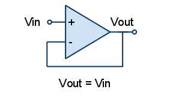

### 同相放大器

同相運算放大器的反饋控制是通過將一小部分輸出電壓信號通過 R2 – R1 分壓器網絡返回到反相 (–) 輸入端來實現的，從而再次產生負反饋。 這種閉環配置產生了一個非反相放大器電路，具有非常好的穩定性、非常高的輸入阻抗 Rin 接近無窮大，因為沒有電流流入正輸入端（理想條件）和低輸出阻抗 Rout，如圖所示 以下。

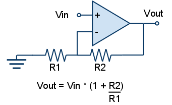

### 反相放大器

反相放大器具有出色的線性特性，使其成為直流放大器的理想選擇。 此外，它們通常用於以跨阻或跨阻放大器的形式將輸入電流轉換為輸出電壓。 此外，當以求和放大器的形式使用時，它們也可以用於音頻混合器。

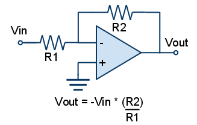

## 差分

差分放大器（也稱為差分放大器或運算放大器減法器）是一種電子放大器，可放大兩個輸入電壓之間的差異，但抑制兩個輸入共有的任何電壓。 差分放大器是一種模擬電路，具有兩個輸入（V1 和 V2）和一個輸出（Vout），其中輸出理想地與兩個電壓之間的差值成比例。

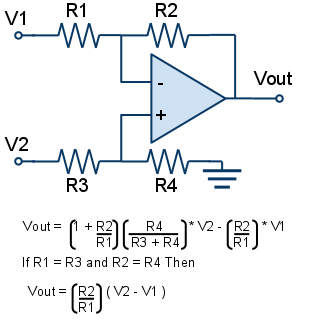

## 微分

微分放大器電路中，電容抗 Xc 連接到反相放大器的輸入端，而電阻器 R 正常形成運算放大器的負反饋元件。該運算放大器電路執行微分的數學運算，即產生與輸入電壓相對於時間的變化率成正比的電壓輸出。 換句話說，輸入電壓信號的變化越快或越大，輸入電流越大，響應的輸出電壓變化就越大，在形狀上變得更像“尖峰”。

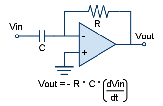

輸入及輸出波形參考:

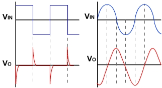

## 積分

積分器電路包括一個運算放大器，在輸出和反相輸入之間有一個電容器，以及一個從反相輸入到整個電路輸入的電阻器，要注意的一點是，當信號施加到反相輸入時，電路的輸出是基本 RC 積分器網絡的反相。

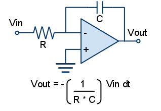

輸入及輸出波形參考:

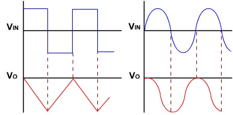

## 多諧振盪器電路

通過將正弦輸入替換為跨運算放大器輸出連接的 RC 定時電路，進一步將周期性波形轉換為矩形輸出。可以使用電容器充電電壓 Vc 來改變運算放大器的輸出狀態，而不是使用正弦波形來觸發運算放大器。

工作原理是首先假設電容器已完全放電，電容 C 從輸出電壓 Vout 開始充電，速率由其 RC 時間常數決定。因電容器充電到 Vout（即 +V(sat) ）時。運算放大器反相 (-) 端子處的電容器充電電壓等於或大於非反相端子處的電壓（運算放大器輸出電壓分數在電阻器 R1 和 R2 之間分壓），則輸出將改變狀態並被驅動到相反的負電源軌。在正電源 +V(sat) 充電的電容器現在在其極板上看到一個負電壓 -V(sat)。 輸出電壓的這種突然反轉導致電容器以 RC 時間常數放電。

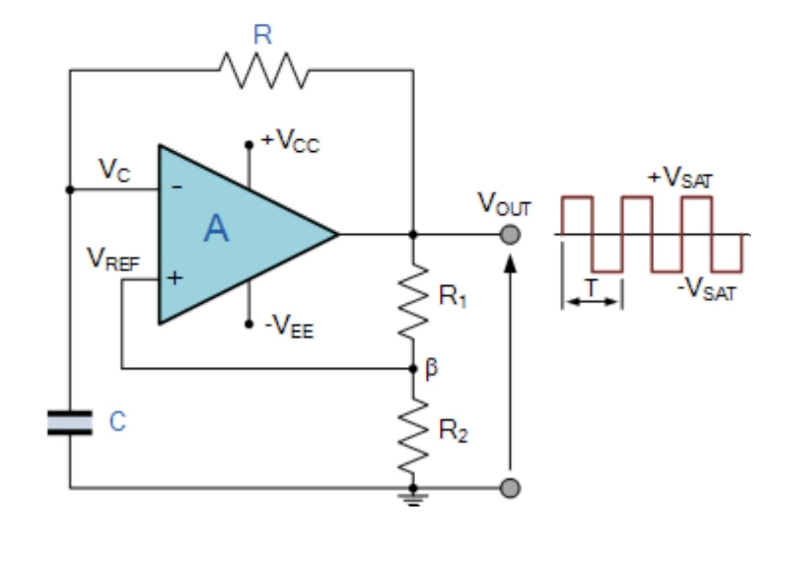

輸入及輸出波形參考:

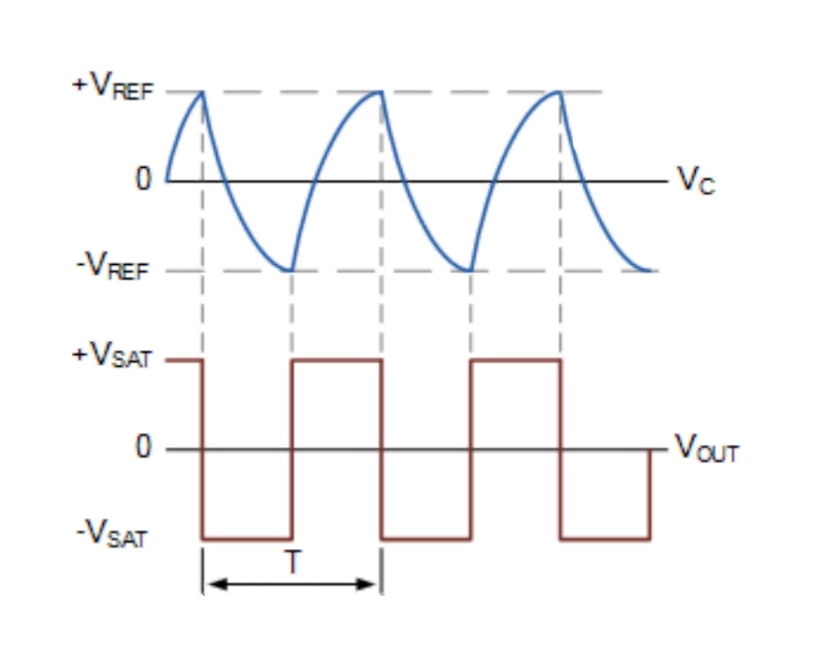

## 電路中的補償

反相輸入相關的所有寄生參數電容都集中在一個等效電容 Cn。 Cn 和周圍電路提供給它的電阻 R1 及 R2 在反饋迴路內建立了一個極點頻率。 因此，在環路中傳播的信號將不得不與兩個極點發生衝突，一個由運算放大器引起，另一個由 Cn 引起，存在相移接近 180° 的風險，從而危及電路穩定性。對抗由 Cn 引起的相位滯後的常用方法是通過 R2 兩端的反饋電容 Cf 引入相位超前。

$$  \frac{R_1}{R_2} = \frac{C_f}{C_n}$$

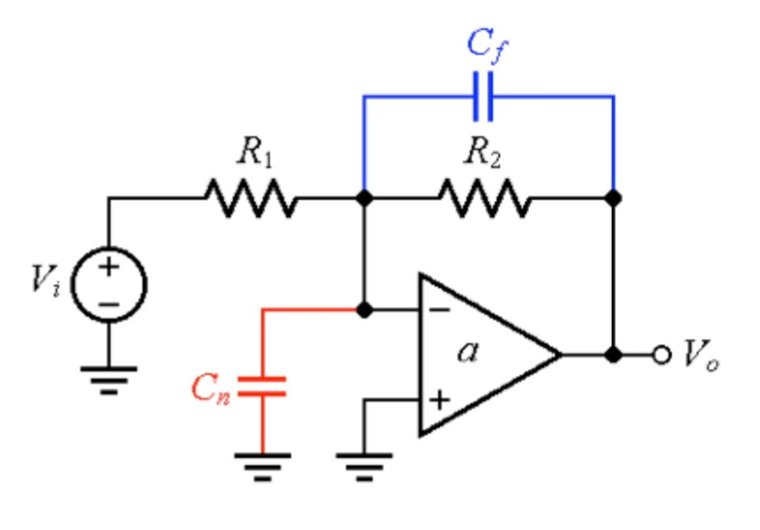

