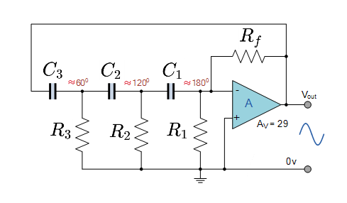
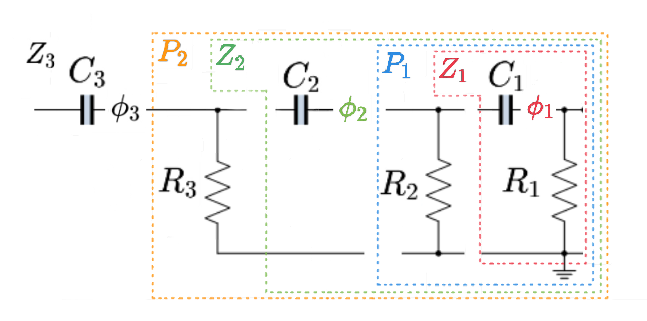
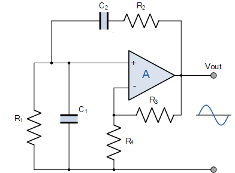
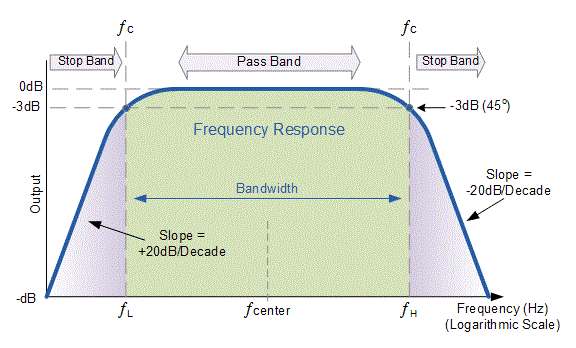

# 運算放大器

## 基本運算放大電路

### 電壓跟隨器

電壓跟隨器電路具有非常高的輸入阻抗。 這一特性使其成為許多需要隔離輸入和輸出信號的不同類型電路的流行選擇。你基本上沒有增益。

### 同相放大器

同相運算放大器的反饋控制是通過將一小部分輸出電壓信號通過 R2 – R1 分壓器網絡返回到反相 (–) 輸入端來實現的，從而再次產生負反饋。 這種閉環配置產生了一個非反相放大器電路，具有非常好的穩定性、非常高的輸入阻抗 Rin 接近無窮大，因為沒有電流流入正輸入端（理想條件）和低輸出阻抗 Rout，如圖所示 以下。

<table class="inputT">
<tr><td>R2:</td><td><input type="text" id="R2" value=1 /></td><td>(kΩ)</td></tr>
<tr><td>R1:</td><td><input type="text" id="R1" value=1 /></td><td>(kΩ)</td></tr>
<tr><td colspan=3><input id="result" type="button" onClick="multiplyBy()" Value="計算放大陪數" /></td></tr>
</table>

### 反相放大器

反相放大器具有出色的線性特性，使其成為直流放大器的理想選擇。 此外，它們通常用於以跨阻或跨阻放大器的形式將輸入電流轉換為輸出電壓。 此外，當以求和放大器的形式使用時，它們也可以用於音頻混合器。

<table class="inputT">
<tr><td>R2:</td><td><input type="text" id="R2_1" value=1 /></td><td>(kΩ)</td></tr>
<tr><td>R1:</td><td><input type="text" id="R1_1" value=1 /></td><td>(kΩ)</td></tr>
<tr><td colspan=3><input id="result_1" type="button" onClick="multiplyBy1()" Value="計算放大陪數" /></td></tr>
</table>

## 差分

差分放大器（也稱為差分放大器或運算放大器減法器）是一種電子放大器，可放大兩個輸入電壓之間的差異，但抑制兩個輸入共有的任何電壓。 差分放大器是一種模擬電路，具有兩個輸入（V1 和 V2）和一個輸出（Vout），其中輸出理想地與兩個電壓之間的差值成比例。

## 微分

微分放大器電路中，電容抗 Xc 連接到反相放大器的輸入端，而電阻器 R 正常形成運算放大器的負反饋元件。該運算放大器電路執行微分的數學運算，即產生與輸入電壓相對於時間的變化率成正比的電壓輸出。 換句話說，輸入電壓信號的變化越快或越大，輸入電流越大，響應的輸出電壓變化就越大，在形狀上變得更像“尖峰”。

<table class="inputT">
<tr><td>R:</td><td><input type="text" id="Resistance" value=1 /></td><td>(kΩ)</td></tr>
<tr><td>C:</td><td><input type="text" id="Capacitance" value=1 /></td><td>(μF)</td></tr>
<tr><td colspan=3><input id="result_2" type="button" onClick="multiplyBy3()" Value="計算時間常數" /></td></tr>
</table>

輸入及輸出波形參考:

## 積分

積分器電路包括一個運算放大器，在輸出和反相輸入之間有一個電容器，以及一個從反相輸入到整個電路輸入的電阻器，要注意的一點是，當信號施加到反相輸入時，電路的輸出是基本 RC 積分器網絡的反相。

<table class="inputT">
<tr><td>R:</td><td><input type="text" id="Resistance1" value=1 /></td><td>(kΩ)</td></tr>
<tr><td>C:</td><td><input type="text" id="Capacitance1" value=1 /></td><td>(μF)</td></tr>
<tr><td colspan=3><input id="result_3" type="button" onClick="multiplyBy4()" Value="計算值" /></td></tr>
</table>

輸入及輸出波形參考:

## 多諧振盪器電路

通過將正弦輸入替換為跨運算放大器輸出連接的 RC 定時電路，進一步將周期性波形轉換為矩形輸出。可以使用電容器充電電壓 Vc 來改變運算放大器的輸出狀態，而不是使用正弦波形來觸發運算放大器。

工作原理是首先假設電容器已完全放電，電容 C 從輸出電壓 $V_{out}$ 開始充電，速率由其 RC 時間常數決定。因電容器充電到 $V_{out}$（即 $+V_{sat}$時。運算放大器反相 (-) 端子處的電容器充電電壓等於或大於非反相端子處的電壓（運算放大器輸出電壓分數在電阻器 $R_1$ 和 $R_2$ 之間分壓），則輸出將改變狀態並被驅動到相反的負電源軌。在正電源 $+V_{sat}$ 充電的電容器現在在其極板上看到一個負電壓 $-V_{sat}$。 輸出電壓的這種突然反轉導致電容器以 RC 時間常數放電。

$$ \beta = \frac{R_2} {R_2 + R_1} $$

<table class="inputT">
<tr><td>R2:</td><td><input type="text" id="R2_2" value=1 /></td><td>(kΩ)</td></tr>
<tr><td>R1:</td><td><input type="text" id="R1_2" value=1 /></td><td>(kΩ)</td></tr>

<tr><td colspan=3><input id="result_4" type="button" onClick="multiplyBy5()" Value="β值" /></td></tr>
</table>

$$ T = 2 \pi RC \times\ln \left (\frac {1+\beta} {1-\beta} \right ) $$

$$ f_0 = \frac {1}{T} = \frac {1} {2 \pi RC \times\ln \left (\frac {1+\beta} {1-\beta} \right )} $$

<table class="inputT">
<tr><td>R2:</td><td><input type="text" id="R2_3" value=1 /></td><td>(kΩ)</td></tr>
<tr><td>R1:</td><td><input type="text" id="R1_3" value=1 /></td><td>(kΩ)</td></tr>
<tr><td>R:</td><td><input type="text" id="R3" value=1 /></td><td>(kΩ)</td></tr>
<tr><td>C:</td><td><input type="text" id="C3" value=1 /></td><td>(μF)</td></tr>
<tr><td colspan=3><input id="result_5" type="button" onClick="multiplyBy6()" Value="頻率" /></td></tr>
</table>

輸入及輸出波形參考:

## 電路中的補償

滯後補償和超前補償是常用於穩定運算放大器電路的兩種頻率補償方法。

輸入相關的所有寄生電容用一個等效電容 $C_n$ 代替。 $C_n$ 和周圍電路提供給它的電阻 $R_1$ 及 $R_2$ 在反饋迴路內建立了一個極點頻率。 因此，在環路中傳播的信號將不得不與兩個極點發生衝突，一個由運算放大器引起，另一個由 $C_n$ 引起，存在相移接近 180° 的風險，從而危及電路穩定性。

解決對由 $C_n$ 引起的相位滯後的常用方法是通過 $R_2$ 兩端的反饋電容 $C_f$ 引入相位超前。

補償電容 $C_f$ 主要有兩個作用:

 - 改變反饋網絡相移，補償運放相位滯後
 - 補償運放輸入端電容的影響 (其實最終還是補償相位)

$$  \frac{R_1}{R_2} = \frac{C_f}{C_n}$$

如沒有 $C_f$ 當輸入信號的頻率很高時，$C_n$ 的旁路作用使放大器的高頻響應變差，其頻帶的上限頻率約爲:

$$ f_{ω} = \frac {1}{2 \pi R_2 C_n } $$

若 $R_2$ 的阻值較大，放大器的上限頻率就將嚴重下降，同時 $C_n$、$R_2$ 引入的相位滯後可能引起寄生振盪，因而產生穩定性問題。

簡單的解決方法是減小 $R_2$ 的阻值，使 $f_{ω}$ 高出實際應用的頻率範圍，但這種方法將使運算放大器的電壓放大倍數 $-\frac{R_2}{R_1}$ 下降。

如要保持放大電路的電壓放大倍數，可在 $R_2$ 上並接一個補償電容 $C_f$ ，因 $R_2 C_f $ 將引起輸出電壓相位超前。使 $R_2 C_f$ 與 $R_2 C_n$ 電路構成相位互補。

由於不能準確知道 $C_n$ 的值，所以一般採用可變電容 $C_f$，用測量及調整 $C_f$ 的方法使附加相移最小。若 $R_2=10kΩ,C_f$ 的典型值約 *3～10pF*。對於電壓跟隨器而言，其 $C_f$ 值可以稍大一些。

輸出相關負載電容 $C_L$ 的值比 *100pF* 大很多，由於輸出電容(包括寄生電容)與輸出電阻將造成附加相移，可能產生寄生振盪。

解決這問題的方法是在輸出端串聯一個電阻 $R_o$，使負載電容 $C_L$ 與電路相位隔離，在 $R_o$ 的後面接反饋電阻 $R_2$，可補償直流衰減，加反饋電容 $C_f$ 會降低高頻閉環電壓放大倍數， $C_f$ 的選取方法是：

電路增益頻率 $f_ω$ 時的容抗

$$ X_{cf} ≤ \frac{R_2}{10}$$

$$ X_{cf} = \frac{1}{2\pi f_ω C_f}$$

通常 $C_f$ 約爲 $3～10 pF$。

$R_0$ 作用是引入了一個零點，從而會抵消該極點的作用，使得相位在沒有到達-180度之前再回到-90度。但因電流流過該電阻 $R_0$ 使得電阻將分得一部分電壓使得運放輸出端和電容電壓不同，所以電阻的阻值要很小。一般情況下，$R_0=50～200 Ω$。

除上述外，還存在其它不穩定因素。使用適當的補償方法，可使問題迎刃而解。例如。當放大器不需要太寬的頻帶和最佳轉換速率時，將補償電容倍數增加或爲實現穩定性所需要的倍數，其效果一般都較好。

## 相移振盪電路

相移振盪器是產生弦波的振盪器，由一個反向放大器，把相位移動 180° 回授濾波器組成。

最常見的作法是使用三級疊加的 RC 濾波器，濾波器在頻譜的一端的相位差是 0°，另一端的相位差大約為是 180°。

$$ R_f ≥ 29 R $$

$$ R = R_1 = R_2 = R_3， C = C_1 = C_2 = C_3 $$

$$ f_ω = \frac {1}{2\pi R C \sqrt{2N}} ，N=3  $$

 - $N$ 是 RC 電路數量

<table class="inputT">
<tr><td>R:</td><td><input type="text" id="R8" value=1 /></td><td>(kΩ)</td></tr>
<tr><td>C:</td><td><input type="text" id="C8" value=1 /></td><td>(μF)</td></tr>
<tr><td>$f_ω$:</td><td><input type="text" id="fw" value=65 /></td><td>(Hz)</td></tr>
</table>

相移角度 $ \phi $ 計算公式如下:

$$ X_c = \frac{1}{2\pi f_ω C} $$

<table class="inputT">
<tr><td colspan=3><input id="result_7" type="button" onClick="multiplyBy7()" Value="計算值" /></td></tr>
</table>

$$ Z = \sqrt {X_c^2 + R^2} $$

<table class="inputT">
<tr><td colspan=3><input id="result_8" type="button" onClick="multiplyBy8()" Value="計算值" /></td></tr>
</table>

$$ \phi = tan^{-1} \left ( \frac{X_c}{R}\right ) $$

$$ \phi = tan^{-1} \left ( \frac{1}{2\pi f_ω RC}\right ) $$

<table class="inputT">
<tr><td colspan=3><input id="result_9" type="button" onClick="multiplyBy9()" Value="計算值" /></td></tr>
</table>

考慮多級 RC 電路的複雜性，相移解釋如下:

 - 第一級電容器。提供了一個非常高阻抗的負載，電容上的相移約為 67.79°。

 - 下一級是由之前電容輸出饋入，這會影響相移。第二級的相移為 56.44°。

 - 最後一級是由之前電路之電容輸出饋入， 跨越這個上限的相移是 55.77°。

三個電容的總相移約為

$$ \phi = 55.77° + 56.44° + 67.79° = 180.0° $$

## 電阻，電容連接計算示例 (相移振盪電路)

### 計算阻抗: 電容串聯電阻

$$ X_c = \frac {-1}{2\pi f_\omega C} $$

$$  Z = R + X_c j = R - \frac{1}{2\pi f_\omega C} j $$

### 計算阻抗: 阻抗並聯電阻

$$ \frac {1}{Z} = \frac {1}{R} + \frac {1}{Z_p} $$

$$ Z = R \parallel Z_p = \frac {R Z_p}{Z_p + R} $$

### 計算電阻，電容和電感的並聯或串聯 (複數除法)

由於電容和電感是複數變量，所以可以用複數除法來計算電阻，電容和電感的並聯或串聯。

 - 複數相除比複數的加法，減法和乘法稍微複雜，因為很難將一個數除以一個虛數。為了除以復數，我們需要找到一個項，我們可以將分子和分母相乘，從而消除分母的虛部，從而得到分母中的實數。

$$  \frac {a+bj} {c+dj} $$

$$  \frac{a+bj} {c+dj} \times \frac{c-dj} {c-dj} $$

$$  \frac {ac+bd}{c^2+ d^2} + \frac {bc-ad} {c^2+d^2} j $$

$$  X + Y j $$

$$  X = \frac {ac+bd}{c^2+d^2}$$

$$  Y = \frac {bc-ad}{c^2+d^2} $$

<table class="inputT">
<tr><td>a:</td><td><input type="text" id="a" value=1 /></td><td></td></tr>
<tr><td>b:</td><td><input type="text" id="b" value=1 /></td><td>j</td></tr>
<tr><td>c:</td><td><input type="text" id="c" value=1 /></td></tr>
<tr><td>d:</td><td><input type="text" id="d" value=1 /></td><td>j</td></tr>
<tr><td colspan=3><input id="result_10" type="button" onClick="multiplyBy10()" Value="計算值" /></td></tr>
<tr><td>X:</td><td><input type="text" id="X" /></td></tr>
<tr><td>Y:</td><td><input type="text" id="Y" /></td><td>j</td></tr>
</table>

### 例子資料

第一部份 (電阻串聯電容)

$$ R_1 = 1000Ω, C_1 = 1 \mu F， f_ω = 65 H_z $$

$$ X_c = \frac {-1}{2\pi f_\omega C_1} = \color{Green} {-2449.5j} $$

 - 因 $C_1 = C_2 = C_3 = C$ , 所以 $ X_c$ 在整個計算中是固定不變的。

$$ Z_1 = R_1 + X_cj = a+bj $$

$$ \phi_1 = tan^{-1} \left ( \frac{b}{a}\right ) $$

 - 相角 $ \phi $ 為複數部分除以實部份，如上公式:

$$ Z_1 = 1000 + \color{Green}{-2449.5j} $$

$$ \phi_1 = tan^{-1} (\frac{-2449.5}{1000}) = \color{Red}{67.79°} $$

第二部份 (第一部分總阻抗並聯電阻)

$$ R_2 = 1000Ω, C_2 = 1 \mu F $$

$$ P_1 = R_2 \;//\; Z_1 = 1000 \;//\;  1000 - 2449.5j $$

$$ \frac {R_2 Z_1}{Z_1 + R_2} = \frac {1000 \times (1000-2449.5j)}{1000 - 2449.5j + 1000} $$

$$ P_1 = \frac {1000000-2449500j}{2000 - 2449.5j} = 800- 244.95j $$

第三部份 (第二部分總阻抗串聯電容)

$$ Z_2 = P_1 + X_cj = 800 - 244.95j + \color{Green}{-2449.5j} $$

$$ Z_2 = 800 - 2694.45j $$

$$ \phi_2 = tan^{-1} (\frac{-2694.45}{800}) - tan^{-1}(\frac{-244.95}{800}) $$

$$ \phi_2 = -73.46° - (-17.02°) = \color{Red}{56.44°} $$

第四部份 (第三部分總阻抗並聯電阻)

$$ R_3 = 1000Ω, C_3 = 1 \mu F $$

$$ P_2 = R_3 \;//\; Z_2 = 1000 \;//\;  800 - 2694.45j $$

$$  \frac {R_3 Z_2}{Z_2 + R_3} = \frac {1000 \times (800 - 2694.45j)}{800 - 2694.45j + 1000} $$

$$ P_2 = \frac {800000-2694450j}{1800 - 2694.45j} = 828.57 - 256.61j $$

第五部份 (第四部分總阻抗串聯電容)

$$ Z_3 = P_2 + X_cj = 828.57 - 256.61j + \color{Green}{-2449.5j}$$

$$ Z_3 = 828.57 - 2706.11j $$

$$ \phi_3 = tan^{-1} (\frac{-2706.11}{828.57}) - tan^{-1}(\frac{-256.61}{828.57}) $$

$$ \phi_3 = -72.98° - (-17.21°) = \color{Red} {55.77°} $$

總結以上計算如下:

$$ \phi_3 + \phi_2 + \phi_1 = 55.77° + 56.44° + 67.79° = 180.0° $$

## 維恩電橋振盪電路

$$ R_2 = R_1,\; C_2 = C_1,\; f_{gain}= \frac {R_3}{R_4} $$

$$ f_{cutoff} = \frac {1}{2 \pi RC},\; f_{gain} = 3 $$

因為 低通濾波器 電路相位角為 $ -45^{\circ} $, 而高通濾波器 電路相位角為 $ +45^{\circ} $, 所以最終的相位角為零。因為反饋電壓將衰減到 $ Vo = \frac {V_{out}}{3} $。 當帶通濾波器的高通濾波器和低通濾波器的截止頻率相同時，該頻率就是電路的振動頻率。

### 例子資料

在以下例子，信號衰減和過濾頻率考慮元件的組合不同

$$ R_1 = R_2 = 1000Ω,\; C_1 = C_2 = 1 \mu F $$

$$ f_{cutoff} = \frac {1}{2 \pi \times 1000 \times 0.000001} = 159.15 H_z$$

$$ 當振動頻率為 \;f_{cutoff} \;時, \;R_1 = X_{c1} = R_2 = X_{c2} $$

信號衰減 (從阻抗分壓器的角度來看)

$$ R_1 \;//\; X_{c1} \; , \; R_2 + X_{c2} $$

$$ Z_1 = R_1 \;//\; X_{c1} = \frac {R_1X_{c1}} {R_1 + X_{c1}} = \frac {X_{c1}R_1X_{c1}}{R_1^2 + X_{c1}^2} + \frac {R_1X_{c1}R_1}{R_1^2 + X_{c1}^2}j $$

$$ Z_1 = \frac {1000 \times 1000 \times 1000}{1000^2+1000^2} + \frac {1000 \times 1000 \times 1000}{1000^2+1000^2}j = 500 + 500j = 707.1Ω $$

$$ Z_2 = R_2 + X_{c2} = 1000 + 1000j = \sqrt {R_2^2 + X_{c2}^2} = 1414.2Ω $$

$$ f_{decay} = \frac {1}{f_{gain}} = \frac {Z_1}{Z_1+Z_2} = \frac {707.1}{707.1 + 1414.21} = \frac {1}{3} $$

相位角 (從功能的角度來看)

 - 低通濾波器 (lp), 高通濾波器 (hp), 相位角組合後變為零。

$$ 低通濾波器 \; = R_2 + X_{c1} \; , \; 高通濾波器 \; = R_1 + X_{c2} $$

$$ \phi_{hp} = tan^{-1} \left ( \frac{X_{c2}}{R1}\right ) = tan^{-1} \left ( \frac{1000}{1000}\right ) = 45°$$

$$ \phi_{lp} = tan^{-1} \left ( \frac{X_{c1}}{R2}\right ) = tan^{-1} \left ( \frac{1000}{1000}\right ) = -45°$$
