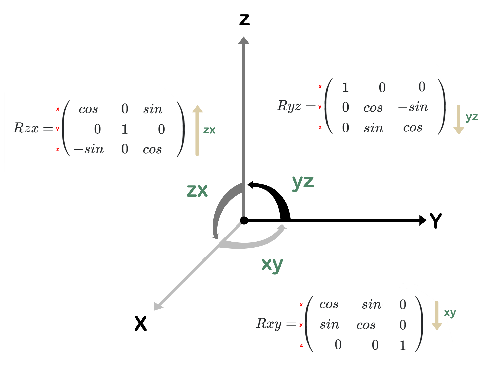
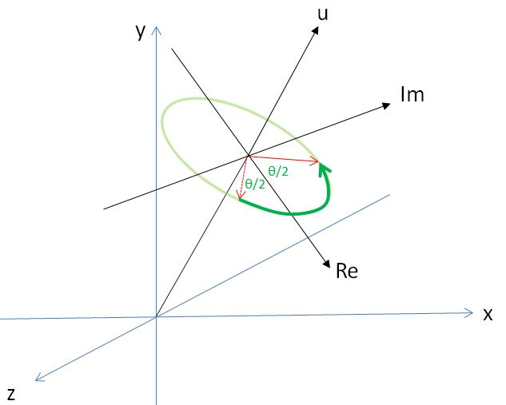
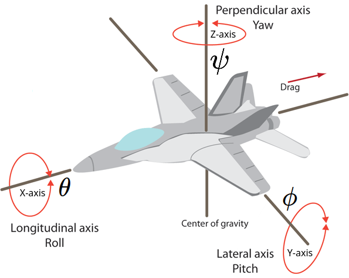
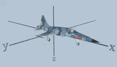

<style>
  table {
    width: 100%
    }
  td {
    vertical-align: center;
    text-align: center;
  }
  table.inputT{
    margin: 10px;
    width: auto;
    margin-left: auto;
    margin-right: auto;
    border: none;
  }
  input{
    text-align: center;
    padding: 0px 10px;
  }
</style>

# 3D 變換數學

矩陣在計算機圖形學中用於將幾何數據轉換為不同的坐標系。矩陣由按行和列排列的元素組成。矩陣將所有這些變換（縮放、旋轉、平移）組合成一個單一結構方式。將一個點或一個向量乘以這個結構（矩陣）會給一個變換的點或向量。組合這些變換意味著以下線性變換的任意組合：縮放、旋轉、平移。以下是矩陣的摘要，以便於參考。

## 矩陣

### 平移變換

$$ T_{(x,y,z)} = \begin{bmatrix}
 1 & 0 & 0 & x_t \\
 0 & 1 & 0 & y_t \\
 0 & 0 & 1 & z_t \\
 0 & 0 & 0 & 1 \\
\end{bmatrix} $$

#### 平移逆矩陣變換

$$ T_{(x,y,z)}^{-1} = T_{(-x,-y,-z)} $$

### 縮放變換

$$ S_{(x,y,z)} = \begin{bmatrix}
 x_s & 0 & 0 & 0 \\
 0 & y_s & 0 & 0 \\
 0 & 0 & z_s & 0 \\
 0 & 0 & 0 & 1 \\
\end{bmatrix} $$

#### 縮放逆矩陣變換

$$ S_{(x,y,z)}^{-1} = S_{(\frac {1}{x},\frac {1}{y},\frac {1}{z})} $$

### 旋轉變換

#### YZ 平面旋轉

$$ R_x(\theta) = \begin{bmatrix}
 1 & 0 & 0 & 0 \\
 0 & cos\theta & -sin\theta & 0 \\
 0 & sin\theta & cos\theta & 0 \\
 0 & 0 & 0 & 1 \\
\end{bmatrix} $$

#### ZX 平面旋轉

$$ R_y(\phi) = \begin{bmatrix}
 cos\phi & 0 & sin\phi & 0 \\
 0 & 1 & 0 & 0 \\
 -sin\phi & 0 & cos\phi & 0 \\
 0 & 0 & 0 & 1 \\
\end{bmatrix} $$

#### XY 平面旋轉

$$ R_z(\psi) = \begin{bmatrix}
 cos\psi & -sin\psi & 0 & 0 \\
 sin\psi & cos\psi & 0 & 0 \\
 0 & 0 & 1 & 0 \\
 0 & 0 & 0 & 1 \\
\end{bmatrix} $$

$$
R_z(\psi)
\times
R_y(\phi)
\times
R_x(\theta)=
\begin{bmatrix}
 cos\psi & -sin\psi & 0 & 0 \\
 sin\psi & cos\psi & 0 & 0 \\
 0 & 0 & 1 & 0 \\
 0 & 0 & 0 & 1 \\
\end{bmatrix}
\times
\begin{bmatrix}
 cos\phi & 0 & sin\phi & 0 \\
 0 & 1 & 0 & 0 \\
 -sin\phi & 0 & cos\phi & 0 \\
 0 & 0 & 0 & 1 \\
\end{bmatrix}
\times
\begin{bmatrix}
 1 & 0 & 0 & 0 \\
 0 & cos\theta & -sin\theta & 0 \\
 0 & sin\theta & cos\theta & 0 \\
 0 & 0 & 0 & 1 \\
\end{bmatrix}
$$

$$
R_{zyx}(\psi,\phi,\theta)=
\begin{bmatrix}
 cos(\phi)cos(\psi)  & sin(\theta)sin(\phi)cos(\psi)-cos(\theta)sin(\psi) & cos(\theta)sin(\phi)cos(\psi)+sin(\theta)sin(\psi) & 0 \\
 cos(\phi)sin(\psi)  & sin(\theta)sin(\phi)sin(\psi)+cos(\theta)cos(\psi)& cos(\theta)sin(\phi)sin(\psi)-sin(\theta)cos(\psi) & 0 \\
-sin(\phi) & sin(\theta)cos(\phi) & cos(\theta)cos(\phi) & 0 \\
 0 & 0 & 0 & 1 \\
\end{bmatrix}
$$



#### 旋轉逆矩陣變換

$$ R_{(\psi,\phi,\theta)}^{-1} = R_{(-\psi,-\phi,-\theta)} $$

### 3D 變換 (基於矩陣乘法的結合性質)

 - 當物體要<font color="#FF1000">旋轉</font>時，但參考點不是在原點 $(0,0,0)$，物體需要在旋轉之前將參考點平移到原點，旋轉後再平移回原參考點。

$$
\begin{bmatrix}
 x_1 \\
 y_1 \\
 z_1 \\
 1 \\
\end{bmatrix} =
\left (
\begin{bmatrix}
 1 & 0 & 0 & x_t \\
 0 & 1 & 0 & y_t \\
 0 & 0 & 1 & z_t \\
 0 & 0 & 0 & 1 \\
\end{bmatrix}
\times
\left (
R_{zyx}(\psi,\phi,\theta)
\times
\left (
\begin{bmatrix}
 1 & 0 & 0 & -x_t \\
 0 & 1 & 0 & -y_t \\
 0 & 0 & 1 & -z_t \\
 0 & 0 & 0 & 1 \\
\end{bmatrix}
\times
\begin{bmatrix}
 x_0 \\
 y_0 \\
 z_0 \\
 1 \\
\end{bmatrix}
\right ) \right ) \right )
$$

簡化為以下公式，方便實際計算。

$$
\begin{bmatrix}
 x_1 \\
 y_1 \\
 z_1 \\
 1 \\
\end{bmatrix} =
\left (
\begin{bmatrix}
 1 & 0 & 0 & x_t \\
 0 & 1 & 0 & y_t \\
 0 & 0 & 1 & z_t \\
 0 & 0 & 0 & 1 \\
\end{bmatrix}
\times
\left (
R_{zyx}(\psi,\phi,\theta)
\times
\begin{bmatrix}
 1 & 0 & 0 & -x_t \\
 0 & 1 & 0 & -y_t \\
 0 & 0 & 1 & -z_t \\
 0 & 0 & 0 & 1 \\
\end{bmatrix}
\right ) \right )
\times
\begin{bmatrix}
 x_0 \\
 y_0 \\
 z_0 \\
 1 \\
\end{bmatrix}
$$

$$ \begin{bmatrix}
 x_1 \\
 y_1 \\
 z_1 \\
 1 \\
\end{bmatrix} =
\left (
M_t
\times
R_{zyx}
\times
M_{-t} \right )
\times
\begin{bmatrix}
 x_0 \\
 y_0 \\
 z_0 \\
 1 \\
\end{bmatrix}
$$

 - 當物體要<font color="#FF1000">縮放</font>時，但參考點不是在原點 $(0,0,0)$，物體需要在縮放之前將參考點平移到原點，縮放後再平移回原參考點。

$$
\begin{bmatrix}
 x_1 \\
 y_1 \\
 z_1 \\
 1 \\
\end{bmatrix} =
\left (
 \begin{bmatrix}
 1 & 0 & 0 & x_t \\
 0 & 1 & 0 & y_t \\
 0 & 0 & 1 & z_t \\
 0 & 0 & 0 & 1 \\
\end{bmatrix}
\times
\left (
S_{(x,y,z)}
\times
\begin{bmatrix}
 1 & 0 & 0 & -x_t \\
 0 & 1 & 0 & -y_t \\
 0 & 0 & 1 & -z_t \\
 0 & 0 & 0 & 1 \\
\end{bmatrix}\right ) \right )
\times
\begin{bmatrix}
 x_0 \\
 y_0 \\
 z_0 \\
 1 \\
\end{bmatrix} $$

$$ \begin{bmatrix}
 x_1 \\
 y_1 \\
 z_1 \\
 1 \\
\end{bmatrix} =
\left (
M_t
\times
S_{zyx}
\times
M_{-t} \right )
\times
\begin{bmatrix}
 x_0 \\
 y_0 \\
 z_0 \\
 1 \\
\end{bmatrix}
$$

## 四元數

四元數是來描述四維空間中的數（這個四維空間有一個實數軸，三個虛數軸）。若將三維空間的物件，看成是四維空間的投影，四元數是四維空間中的一個點，投影在三維空間中也只是一個點，就像三維空間中的一個點投影在平面上是個點，平面上的點投影在某軸上也只是個點。

四元數主要用於計算機圖形當涉及到 *3D* 物件旋轉。四元數允許物件同時圍繞多個軸旋轉，而不是按照矩陣順序的旋轉。要先由參考點回原點再由原點回參考點。及可避免矩陣旋轉時的萬向節死鎖問題。

在內存上四元數僅需存儲 **4** 個浮點數，矩陣至少要用 **9** 個浮點數進行表示旋轉信息，即便加上旋轉縮放，也會比矩陣少存  **2-6** 個浮點數，對桌面電腦上開發可能並不顯著因內存大，但在嵌入式設備上或內存比較吃緊的情況下就相當有用。

在計算上因四元數無論是求逆、串聯等操作，相比矩陣更加高效。比如取反就等同於求逆，即是正交矩陣，轉置的操作代價也比取反要高得多，更何況大多數情況由於存在縮放，求逆的操作會更加複雜。但使用一四元數需要考慮將四元數與矩陣之間轉換的成本，但綜合考慮，還是四元數操作成本比較低。

描述關係的四元數公式如下:

$$ q = w + x_i + y_j + z_k = \begin{bmatrix}
 x \\
 y \\
 z \\
 w \\
\end{bmatrix}$$

 - 已歸一化四元數 $ \sqrt{w^2+x^2+y^2+z^2}=1 $ (三向量都已歸一化且相互垂直)

在 $\theta$ 變動時，其在四維空間中的軌跡，投影在三維世界的資訊會是什麼呢？會是在一個複數平面上旋轉角度 $\theta$ 的圓弧，也就是下圖中綠色箭頭的部份：



### 四元數的共軛 (負四元數)

  - 四元數公式 : $ q^{-1} = w + -x_i + -y_j + -z_k $

#### 四元數的逆 (正交矩陣)

  - 四元數公式 : $ q^{-1} = \frac{q} {\left \| q \right \|} $

<font color="#FF2F00">注意</font>: 正規化的四元數 *逆* 和 *共軛* 是相等的。

### 矩陣轉四元數

 - $(m_{0,0}+m_{1,1}+m_{2,2} > 0)$

|$S = 2\times \sqrt {1+m_{(0,0)}+m_{(1,1)}+m_{(2,2)}}$|
|:---:|
|$w = 0.25 \times S$|
|$x = \frac {m_{(2,1)}-m_{(1,2)}}{S}$|
|$y = \frac {m_{(0,2)}-m_{(2,0)}}{S}$|
|$z = \frac {m_{(1,0)}-m_{(0,1)}}{S}$|

 - $not (m_{(0,0)}+m_{(1,1)}+m_{(2,2)} > 0)$
   - $(m_{(0,0)} > m_{(1,1)}) (m_{(0,0)} > m_{(2,2)})$

|$S = 2\times\sqrt {1+m_{(0,0)}-m_{(1,1)}-m_{(2,2)}}$|
|:---:|
|$w = \frac {m_{(2,1)}-m_{(1,2)}}{S}$|
|$x = 0.25 \times S$|
|$y = \frac {m_{(0,1)}+m_{(1,0)}}{S}$|
|$z = \frac {m_{(0,2)}+m_{(2,0)}}{S}$|

 - $not(m_{(0,0)}+m_{(1,1)}+m_{(2,2)} > 0)$
   - $ not \left((m_{(0,0)} > m_{(1,1)})(m_{(0,0)} > m_{(2,2)}) \right) $
     - $(m_{(1,1)} > m_{(2,2)})$

|$S = 2\times\sqrt {1+m_{(1,1)}-m_{(0,0)}-m_{(2,2)}}$|
|:---:|
|$w = \frac {m_{(0,2)}-m_{(2,0)}}{S}$|
|$x = \frac {m_{(0,1)}+m_{(1,0)}}{S}$|
|$y = 0.25 \times S$|
|$z = \frac {m_{(1,2)}+m_{(2,1)}}{S}$|

 - $not(m_{(0,0)}+m_{(1,1)}+m_{(2,2)} > 0)$
   - $ not \left((m_{(0,0)} > m_{(1,1)})(m_{(0,0)} > m_{(2,2)}) \right) $
     - $ not(m_{(1,1)} > m_{(2,2)})$

|$S = 2\times\sqrt {1+m_{(2,2)}-m_{(0,0)}-m_{(1,1)}}$|
|:---:|
|$w = \frac {m_{(1,0)}-m_{(0,1)}}{S}$|
|$x = \frac {m_{(0,2)}+m_{(2,0)}}{S}$|
|$y = \frac {m_{(1,2)}+m_{(2,1)}}{S}$|
|$z = 0.25 \times S$|

### 歐拉角轉四元數

四元數可以藉由相乘來完成連續旋轉，所以我們將把 **側轉** (Roll)（$\theta$）, **俯仰** Pitch（$\phi$ ）, **偏轉** Yaw（$\psi$）分為三個四元數進行旋轉，最後再將它們串成同一個四元數如下。



$$ q = \begin{bmatrix}
 w \\
 x \\
 y \\
 z \\
\end{bmatrix} =
\begin{bmatrix}
 cos(\frac {\theta}{2})cos(\frac {\phi}{2})cos(\frac {\psi}{2}) + sin(\frac {\theta}{2})sin(\frac {\phi}{2})sin(\frac {\psi}{2})\\
 sin(\frac {\theta}{2})cos(\frac {\phi}{2})cos(\frac {\psi}{2}) - cos(\frac {\theta}{2})sin(\frac {\phi}{2})sin(\frac {\psi}{2}) \\
 cos(\frac {\theta}{2})sin(\frac {\phi}{2})cos(\frac {\psi}{2}) + sin(\frac {\theta}{2})cos(\frac {\phi}{2})sin(\frac {\psi}{2}) \\
 cos(\frac {\theta}{2})cos(\frac {\phi}{2})sin(\frac {\psi}{2}) - sin(\frac {\theta}{2})sin(\frac {\phi}{2})cos(\frac {\psi}{2}) \\
\end{bmatrix}
$$



### 四元數轉矩陣

$$ M =
\begin{bmatrix}
1-2(y^2+z^2)&2(xy-wz)&2(wy+xz)&0 \\
 2(xy+wz)&1-2(x^2+z^2)&2(yz-wx)&0 \\
 2(xz-wy)&2(yz+wx)&1-2(x^2+y^2)&0\\
 0 & 0 & 0 & 1 \\
\end{bmatrix}
$$

 - 四元數公式 : $ q = w + x_i + y_j + z_k $

### 四元數轉歐拉角

$$ \begin{bmatrix}
 \theta \\
 \phi \\
 \psi \\
\end{bmatrix} =
\begin{bmatrix}
 tan2^{-1} \left (\frac{2(yz+wx)}{1-2(x^2+y^2)} \right) \\
 sin^{-1} \left (2(xz-wy)\right) \\
 tan2^{-1} \left (\frac{(2(xy+wz)}{1-2(y^2+z^2)} \right) \\
\end{bmatrix}
$$

 - 四元數公式 : $ q = w + x_i + y_j + z_k $

## 旋轉四元數

### 旋轉四元數應用

只是在做旋轉時用的四元數被稱為旋轉四元數。 旋轉四元數的構造需要2個東西：
 - 笛卡爾坐標系下的旋轉軸 $\hat{v}$ 的 $3D$ 向量及
 - 繞著這個旋轉軸的旋轉角度 $ \theta $ 的弧度。

為了正確地將向量 $ \overrightarrow{p} $ 繞任意軸 $\hat{v}$ 旋轉一個角 $\theta$，我們必須考慮半角並構造以下四元數：

$$ q = \left [cos \frac {\theta}{2},sin \frac {\theta}{2} \hat{v} \right ]$$

$$ q^{-1} = \left [cos \frac {\theta}{2},-sin \frac {\theta}{2} \hat{v} \right ]$$

 - 以上是旋轉四元數的一般形式。

 構造了旋轉四元數後，剩下的就是怎麼使用的問題。 假設現在要對一個 $3D$ 坐標點 $\overrightarrow{p}$
 做以 $ \hat{v} $ 為軸心的 $ \theta $ 角度的旋轉，那麼變換公式如下：

$$ p = q \times \overrightarrow{p} \times  q^{-1} $$

 - $ q $ 為右手定則旋轉 $\frac {\theta}{2}$ 度， $ q^{-1} $ 為左手定則旋轉 $\frac {\theta}{2}$ 度。 使向量 $ \overrightarrow{p} $ 共旋轉 $ \theta $ 度。

 其中的四元數的虛部為 0，實部為向量。

### 只考慮單獨軸

根據四元數的定義，當選擇的軸沿 X 軸、Y 軸或 Z 軸時，公式可以簡單如下：

$$ q_{(w,\theta, \phi, \psi)} =
\overset {R_x(\theta,0,0)}{
\begin{bmatrix}
 cos \frac {\theta}{2} \\
 sin \frac {\theta}{2} \\
 0 \\
 0 \\
\end{bmatrix}}:
\overset {R_y(0,\phi,0)}{
\begin{bmatrix}
 cos \frac {\phi}{2} \\
 0 \\
 sin \frac {\phi}{2} \\
 0 \\
\end{bmatrix}}:
\overset {R_z(0,0,\psi)}{
\begin{bmatrix}
 cos \frac {\psi}{2} \\
 0 \\
 0 \\
 sin \frac {\psi}{2} \\
\end{bmatrix}}
$$

$$ q_{(w,\theta, \phi, \psi)}^{-1} =
\overset {R_x(\theta,0,0)}{
\begin{bmatrix}
 cos \frac {\theta}{2} \\
 -sin \frac {\theta}{2} \\
 0 \\
 0 \\
\end{bmatrix}}:
\overset {R_y(0,\phi,0)}{
\begin{bmatrix}
 cos \frac {\phi}{2} \\
 0 \\
 -sin \frac {\phi}{2} \\
 0 \\
\end{bmatrix}}:
\overset {R_z(0,0,\psi)}{
\begin{bmatrix}
 cos \frac {\psi}{2} \\
 0 \\
 0 \\
 -sin \frac {\psi}{2} \\
\end{bmatrix}
}
$$

### 計算實例

$$
\overrightarrow{p} =
\begin{bmatrix}
 1 & 0 & 0 & -x_t \\
 0 & 1 & 0 & -y_t \\
 0 & 0 & 1 & -z_t \\
 0 & 0 & 0 & 1 \\
\end{bmatrix}
\times
\begin{bmatrix}
 x_0 \\
 y_0 \\
 z_0 \\
 1 \\
\end{bmatrix}
$$

將平移矩陣乘以 $3D$ 坐標參考點,用於將參考點移動到原點以重建旋轉軸。計算出輸入點 $\overrightarrow{p}$ 用以作以下四元數的運算:

$$
q = R_z(\frac{\psi}{2})
\times
R_y(\frac{\phi}{2})
\times
R_x(\frac{\theta}{2})=
R_{zyx}(\frac{\psi}{2},\frac{\phi}{2},\frac{\theta}{2})
$$

$$ p = q \times \overrightarrow{p} \times  q^{-1}
$$

由計算後的四元數 $p$ 轉回矩陣 $M_q$ 用以繼續計算。(目的簡化運算及避免矩陣旋轉時的萬向節死鎖問題)

$$
\begin{bmatrix}
 x_1 \\
 y_1 \\
 z_1 \\
 1 \\
\end{bmatrix} =
\begin{bmatrix}
 1 & 0 & 0 & x_t \\
 0 & 1 & 0 & y_t \\
 0 & 0 & 1 & z_t \\
 0 & 0 & 0 & 1 \\
\end{bmatrix}
\times
M_q
$$

最後將計算點乘以平移矩陣,重回到參考點。


## 四元數插值

### 線性插值 (Lerp)

線性插值是沿著一條直線進行插值，它的公式如下:

$$ Lerp_{(p,q,t)} = q_t = (1-t)p+tq $$

插值的四元數不一定是單位四元數，因此任何產生四元數的操作都需要歸一化(正規化)，以避免浮點計算錯誤導致它不能滿足四元數的假設。

### 正規化線性插值 (Nlerp)

使用 *Lerp* 插值出來的 $q_t$ 因不是單位四元數，但是將 $q_t$ 除以它的模 $q_t$ 就將其轉化為單位四元數了。這種方法稱為 $q_t$ 正規化線性插值（Normalized Linear Interpolation)，NLerp 的輸入也一定要是單位向量，否則插值出來的結果不會經過初始和最終向量，其公式如下：

$$ Nlerp_{(p,q,t)} = q_t = \frac {(1-t)p+tq}{\left \| (1-t)p+tq \right \|} $$

以上兩揰插值方法存在一定的問題，當需要插值的弧比較大時，$v_t$ 的角速度會有顯著的變化。在轉通時會形成不平均的感覺。

### 球面線形插值 (Slerp)

球面線性插值是一個對四元數在四維超球面上的旋轉計算值，角速度㑹均衡分佈，公式如下:

$$ Slerp_{(p,q,t)} = q_t = \frac {sin[(1-t)\theta]p+sin[t\theta]q}{sin\theta} $$

 - 當 $\theta$ 太小時，可以用四元數<font color="#FF1000">正規化線性插值</font>
 - 四元數最短路徑的角度，用點積法測試，如果結果值為負(<font color="#FF1000">夾角大於90°</font>)，將 $p$ 或 $q$ 其中一個取反可以保證這個旋轉走的是最短路徑。

$$ q_t = \frac {sin[(1-t)\theta]p^{-1}+sin[t\theta]q}{sin\theta} = \frac {sin[(1-t)\theta]p+sin[t\theta]q^{-1}}{sin\theta} $$


### 四元數 C 頭文件

```c
#include <stdbool.h>
#include <stdint.h>
#include <stdio.h>
#include <stdlib.h>
#include <math.h>

#ifndef M_PI
  #define M_PI (3.14159265358979323846)
#endif

#define QUATERNION_EPS (1e-4)

typedef struct Quaternion
{
  double w;		  // 標量部分
  double v[3];	// 矢量部分
} Quaternion;

void Qu_print(char* info, Quaternion * q);
void Qu_set(double w, double v1, double v2, double v3, Quaternion * output);
void Qu_setIdentity(Quaternion * q);
void Qu_copy(Quaternion * q, Quaternion * output);
bool Qu_equal(Quaternion * q1, Quaternion * q2);
void Qu_fromAxisAngle(double axis[3], double angle, Quaternion * output);
double Qu_toAxisAngle(Quaternion * q, double output[3]);
void Qu_fromEulerZYX(double eulerZYX[3], Quaternion * output);
void Qu_toEulerZYX(Quaternion * q, double output[3]);
void Qu_fromXRotation(double angle, Quaternion * output);
void Qu_fromYRotation(double angle, Quaternion * output);
void Qu_fromZRotation(double angle, Quaternion * output);
double Qu_norm(Quaternion * q);
void Qu_normalize(Quaternion * q, Quaternion * output);
void Qu_conjugate(Quaternion * q, Quaternion * output);
void Qu_multiply(Quaternion * q1, Quaternion * q2, Quaternion * output);
void Qu_rotate(Quaternion * q, double v[3], double output[3]);
void Qu_slerp(Quaternion * q1, Quaternion * q2, double t, Quaternion * output);
```

### 四元數 C 源文件

```c
#include "Quaternion.h"

void Qu_print(char* info, Quaternion* q)
{
  printf("%s:w:%2.5f, x:%2.5f, y:%2.5f, z:%2.5f\n", info, q->w, q->v[0], q->v[1], q->v[2]);
}

void Qu_set(double w, double v1, double v2, double v3, Quaternion * output)
{
  output->w = w;
  output->v[0] = v1;
  output->v[1] = v2;
  output->v[2] = v3;
}

void Qu_setIdentity(Quaternion * q)
{
  Qu_set(1, 0, 0, 0, q);
}

void Qu_copy(Quaternion * q, Quaternion * output)
{
  Qu_set(q->w, q->v[0], q->v[1], q->v[2], output);
}

bool Qu_equal(Quaternion * q1, Quaternion * q2)
{
  bool equalW = fabs(q1->w - q2->w) <= QUATERNION_EPS;
  bool equalV0 = fabs(q1->v[0] - q2->v[0]) <= QUATERNION_EPS;
  bool equalV1 = fabs(q1->v[1] - q2->v[1]) <= QUATERNION_EPS;
  bool equalV2 = fabs(q1->v[2] - q2->v[2]) <= QUATERNION_EPS;
  return equalW && equalV0 && equalV1 && equalV2;
}

void Qu_fromAxisAngle(double axis[3], double angle, Quaternion * output)
{
  output->w = cos(angle / 2.0);
  double c = sin(angle / 2.0);
  output->v[0] = c * axis[0];
  output->v[1] = c * axis[1];
  output->v[2] = c * axis[2];
}

double Qu_toAxisAngle(Quaternion * q, double output[3])
{
  double angle = 2.0 * acos(q->w);
  double divider = sqrt(1.0 - q->w * q->w);
  if (divider != 0.0)	{
    // 計算軸
    output[0] = q->v[0] / divider;
    output[1] = q->v[1] / divider;
    output[2] = q->v[2] / divider;
  }	else	{
    // 任意歸一化軸
    output[0] = 1;
    output[1] = 0;
    output[2] = 0;
  }
  return angle;
}

void Qu_fromXRotation(double angle, Quaternion * output)
{
  double axis[3] = { 1.0, 0, 0 };
  Qu_fromAxisAngle(axis, angle, output);
}

void Qu_fromYRotation(double angle, Quaternion * output)
{
  double axis[3] = { 0, 1.0, 0 };
  Qu_fromAxisAngle(axis, angle, output);
}

void Qu_fromZRotation(double angle, Quaternion * output)
{
  double axis[3] = { 0, 0, 1.0 };
  Qu_fromAxisAngle(axis, angle, output);
}

void Qu_fromEulerZYX(double eulerZYX[3], Quaternion * output)
{
  double cy = cos(eulerZYX[2] * 0.5);
  double sy = sin(eulerZYX[2] * 0.5);
  double cr = cos(eulerZYX[0] * 0.5);
  double sr = sin(eulerZYX[0] * 0.5);
  double cp = cos(eulerZYX[1] * 0.5);
  double sp = sin(eulerZYX[1] * 0.5);
  output->w = cy * cr * cp + sy * sr * sp;
  output->v[0] = cy * sr * cp - sy * cr * sp;
  output->v[1] = cy * cr * sp + sy * sr * cp;
  output->v[2] = sy * cr * cp - cy * sr * sp;
}

void Qu_toEulerZYX(Quaternion * q, double output[3])
{
  // 側轉（X 軸旋轉）
  double sinr_cosp = +2.0 * (q->w * q->v[0] + q->v[1] * q->v[2]);
  double cosr_cosp = +1.0 - 2.0 * (q->v[0] * q->v[0] + q->v[1] * q->v[1]);
  output[0] = atan2(sinr_cosp, cosr_cosp);
  // 俯仰（Y 軸旋轉）
  double sinp = +2.0 * (q->w * q->v[1] - q->v[2] * q->v[0]);
  if (fabs(sinp) >= 1)
    output[1] = copysign(M_PI / 2, sinp);	// 超出 90 度範圍使用
  else
    output[1] = asin(sinp);
  // 偏轉（Z 軸旋轉）
  double siny_cosp = +2.0 * (q->w * q->v[2] + q->v[0] * q->v[1]);
  double cosy_cosp = +1.0 - 2.0 * (q->v[1] * q->v[1] + q->v[2] * q->v[2]);
  output[2] = atan2(siny_cosp, cosy_cosp);
}

void Qu_conjugate(Quaternion * q, Quaternion * output)
{
  output->w = q->w;
  output->v[0] = -q->v[0];
  output->v[1] = -q->v[1];
  output->v[2] = -q->v[2];
}

double Qu_norm(Quaternion * q)
{
  return sqrt(q->w * q->w + q->v[0] * q->v[0] + q->v[1] * q->v[1] + q->v[2] * q->v[2]);
}

void Qu_normalize(Quaternion * q, Quaternion * output)
{
  double len = Qu_norm(q);
  Qu_set(q->w / len, q->v[0] / len, q->v[1] / len, q->v[2] / len, output);
}

void Qu_multiply(Quaternion * q1, Quaternion * q2, Quaternion * output)
{
  Quaternion result;
  result.w = q1->w * q2->w - q1->v[0] * q2->v[0] - q1->v[1] * q2->v[1] - q1->v[2] * q2->v[2];
  result.v[0] = q1->v[0] * q2->w + q1->w * q2->v[0] + q1->v[1] * q2->v[2] - q1->v[2] * q2->v[1];
  result.v[1] = q1->w * q2->v[1] - q1->v[0] * q2->v[2] + q1->v[1] * q2->w + q1->v[2] * q2->v[0];
  result.v[2] = q1->w * q2->v[2] + q1->v[0] * q2->v[1] - q1->v[1] * q2->v[0] + q1->v[2] * q2->w;
  *output = result;
}

void Qu_rotate(Quaternion * q, double v[3], double output[3])
{
  double result[3];
  double ww = q->w * q->w;
  double xx = q->v[0] * q->v[0];
  double yy = q->v[1] * q->v[1];
  double zz = q->v[2] * q->v[2];
  double wx = q->w * q->v[0];
  double wy = q->w * q->v[1];
  double wz = q->w * q->v[2];
  double xy = q->v[0] * q->v[1];
  double xz = q->v[0] * q->v[2];
  double yz = q->v[1] * q->v[2];
  result[0] = ww * v[0] + 2 * wy * v[2] - 2 * wz * v[1] +
    xx * v[0] + 2 * xy * v[1] + 2 * xz * v[2] - zz * v[0] - yy * v[0];
  result[1] = 2 * xy * v[0] + yy * v[1] + 2 * yz * v[2] +
    2 * wz * v[0] - zz * v[1] + ww * v[1] - 2 * wx * v[2] - xx * v[1];
  result[2] = 2 * xz * v[0] + 2 * yz * v[1] + zz * v[2] -
    2 * wy * v[0] - yy * v[2] + 2 * wx * v[1] - xx * v[2] + ww * v[2];
  // 將結果復製到輸出
  output[0] = result[0];
  output[1] = result[1];
  output[2] = result[2];
}

void Qu_slerp(Quaternion * q1, Quaternion * q2, double t, Quaternion * output)
{
  Quaternion result;
  double cosHalfTheta =
    q1->w * q2->w + q1->v[0] * q2->v[0] + q1->v[1] * q2->v[1] + q1->v[2] * q2->v[2];
  if (fabs(cosHalfTheta) >= 1.0)	{
    Qu_copy(q1, output);
    return;
  }
  double halfTheta = acos(cosHalfTheta);
  double sinHalfTheta = sqrt(1.0 - cosHalfTheta * cosHalfTheta);
  if (fabs(sinHalfTheta) < QUATERNION_EPS)	{
    result.w = (q1->w * 0.5 + q2->w * 0.5);
    result.v[0] = (q1->v[0] * 0.5 + q2->v[0] * 0.5);
    result.v[1] = (q1->v[1] * 0.5 + q2->v[1] * 0.5);
    result.v[2] = (q1->v[2] * 0.5 + q2->v[2] * 0.5);
  }	else	{
    // 四元數計算
    double ratioA = sin((1 - t) * halfTheta) / sinHalfTheta;
    double ratioB = sin(t * halfTheta) / sinHalfTheta;
    result.w = (q1->w * ratioA + q2->w * ratioB);
    result.v[0] = (q1->v[0] * ratioA + q2->v[0] * ratioB);
    result.v[1] = (q1->v[1] * ratioA + q2->v[1] * ratioB);
    result.v[2] = (q1->v[2] * ratioA + q2->v[2] * ratioB);
  }
  *output = result;
}
```
