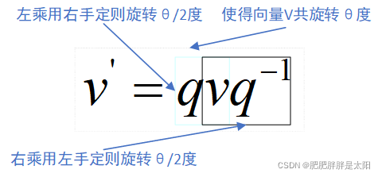

# 3D 變換數學 (矩陣)

## 平移變換

$$ T_{(x,y,z)} = \begin{bmatrix}
 1 & 0 & 0 & x_t \\
 0 & 1 & 0 & y_t \\
 0 & 0 & 1 & z_t \\
 0 & 0 & 0 & 1 \\
\end{bmatrix} $$

### 平移逆矩陣變換

$$ T_{(x,y,z)}^{-1} = T_{(-x,-y,-z)} $$

## 縮放變換

$$ S_{(x,y,z)} = \begin{bmatrix}
 x_s & 0 & 0 & 0 \\
 0 & y_s & 0 & 0 \\
 0 & 0 & z_s & 0 \\
 0 & 0 & 0 & 1 \\
\end{bmatrix} $$

### 縮放逆矩陣變換

$$ S_{(x,y,z)}^{-1} = S_{(\frac {1}{x},\frac {1}{y},\frac {1}{z})} $$

## 旋轉變換

### YZ 平面旋轉

$$ R_x(\theta) = \begin{bmatrix}
 1 & 0 & 0 & 0 \\
 0 & cos\theta & -sin\theta & 0 \\
 0 & sin\theta & cos\theta & 0 \\
 0 & 0 & 0 & 1 \\
\end{bmatrix} $$

### ZX 平面旋轉

$$ R_y(\phi) = \begin{bmatrix}
 cos\phi & 0 & sin\phi & 0 \\
 0 & 1 & 0 & 0 \\
 -sin\phi & 0 & cos\phi & 0 \\
 0 & 0 & 0 & 1 \\
\end{bmatrix} $$

### XY 平面旋轉

$$ R_z(\varphi) = \begin{bmatrix}
 cos\varphi & -sin\varphi & 0 & 0 \\
 sin\varphi & cos\varphi & 0 & 0 \\
 0 & 0 & 1 & 0 \\
 0 & 0 & 0 & 1 \\
\end{bmatrix} $$

### 旋轉逆矩陣變換

$$ R_{(\theta,\phi,\varphi)}^{-1} = R_{(-\theta,-\phi,-\varphi)} $$

## 3D 變換

 - 當物體要旋轉時，但參考點不是在原點 $(0,0,0)$，物體需要在旋轉之前將參考點平移到原點，旋轉後再平移回原參考點。

$$ \begin{bmatrix}
 1 & 0 & 0 & -x_t \\
 0 & 1 & 0 & -y_t \\
 0 & 0 & 1 & -z_t \\
 0 & 0 & 0 & 1 \\
\end{bmatrix}
\times
R_x(\theta)
\times
R_y(\phi)
\times
R_z(\varphi)
\times
\begin{bmatrix}
 1 & 0 & 0 & x_t \\
 0 & 1 & 0 & y_t \\
 0 & 0 & 1 & z_t \\
 0 & 0 & 0 & 1 \\
\end{bmatrix} $$

 - 當物體要縮放時，但參考點不是在原點 $(0,0,0)$，物體需要在縮放之前將參考點平移到原點，縮放後再平移回原參考點。

$$ \begin{bmatrix}
 1 & 0 & 0 & -x_t \\
 0 & 1 & 0 & -y_t \\
 0 & 0 & 1 & -z_t \\
 0 & 0 & 0 & 1 \\
\end{bmatrix}
\times
S_{(x,y,z)}
\times
\begin{bmatrix}
 1 & 0 & 0 & x_t \\
 0 & 1 & 0 & y_t \\
 0 & 0 & 1 & z_t \\
 0 & 0 & 0 & 1 \\
\end{bmatrix} $$

## 四元數

四元數是來描述四維空間中的數(這個四維空間有一個實數軸，三個虛數軸)。若將三維空間的物件，看成是四維空間的投影，四元數是四維空間中的一個點，投影在三維空間中也只是一個點，就像三維空間中的一個點投影在平面上是個點，平面上的點投影在某軸上也只是個點。

不過，有如上描述關係的四元數

$$ q = w + a_i + b_j + c_k $$

在 θ 變動時，其在四維空間中的軌跡，投影在三維世界的資訊會是什麼呢？會是在一個複數平面上旋轉角度 θ 的圓弧，也就是下圖中綠色箭頭的部份：

