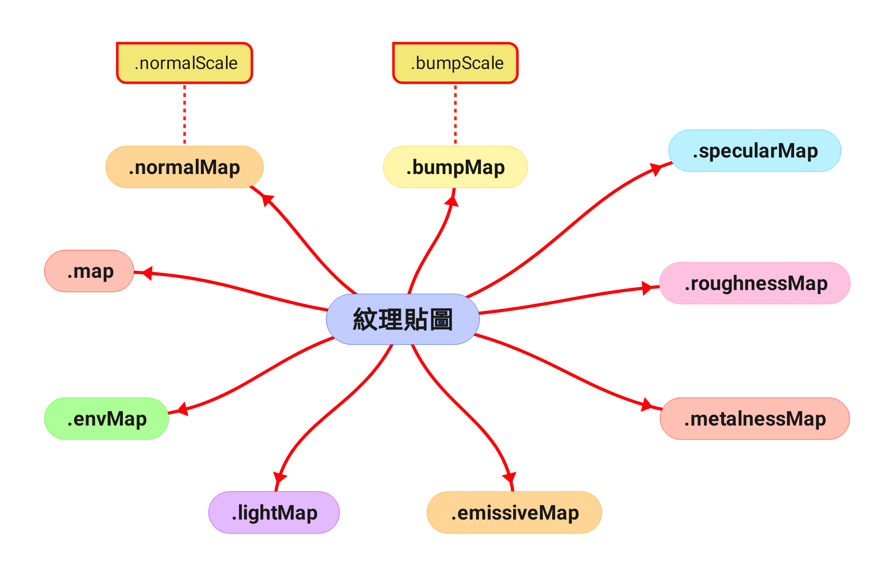

<style>
  table {
    width: 100%
    }
  td {
    vertical-align: center;
    text-align: center;
  }
  table.inputT{
    margin: 10px;
    width: auto;
    margin-left: auto;
    margin-right: auto;
    border: none;
  }
  input{
    text-align: center;
    padding: 0px 10px;
  }
</style>

# Three.js

Three.js 是一個 JavaScript 函數庫用於開發 WebGL，它封裝成物件導向的方法和屬性，可以使用物件導向的方法在網絡瀏覽器下開發 3D 模式繪製空間。
只介紹部分有用的功能來製作 **3D** 動畫。

[ThreeJS 互聯網資源](https://github.com/mrdoob/three.js/)

## 繪製基本流程

- 建立基本框架
- 建立場景
- 建立相機
- 建立材質
- 建立模型
- 建立繪製器
- 渲染場景

Three.js 提供兩種繪製器：

- WebGLRenderer: WebGLRenderingContext2D 實現 GPU 加速的 3D 和 2D 繪圖
- CanvasRenderer: CanvasRenderingContext2D 實現 2D 繪圖

在特定情況下，CanvasRenderer 也可以使用 _2D_ 環境模擬出 _3D_ 效果，但並非所有 _3D_ 功能，因此 _3D_ 處理建議使用 WebGLRender。如果瀏覽器不支援 WebGLRenderingContext，而要實現的 3D 影像剛好又不需要材質和光源，此時就可以使用 CanvasRenderer。

```js
// 如果瀏覽器支援 WebGLRenderingContext 就使用 WebGLRenderer
if (window.WebGLRenderingContext) {
  renderer = new THREE.WebGLRenderer();
} else {
  renderer = new THREE.CanvasRenderer();
}
```

## Three JS 概念框架


## 建立基本框架

- 開始使用 Three.js 之前，需要一個地方來顯示它。下列基本 _HTML_ 框架保存為一個 HTML 文件，同時將 _three.js_ 複製到該 _HTML_ 文件所在的目錄下的 _js/_ 目錄下，然後在瀏覽器中打開這個 HTML 文件。

```js
<!DOCTYPE html>
<html>
<head>
    <title>第一個 Three.js 應用</title>
    <style>
        body { margin: 0; }
        canvas { width: 100%; height: 100% }
    </style>
</head>
<body>
  <script type="module">
    // 1.導入需要的庫
    import * as THREE from "./src/Three.js";
    // 2.建立場景
    let scene = new THREE.Scene();
    // 3.建立相機
    let camera = new THREE.PerspectiveCamera(75, window.innerWidth/window.innerHeight, 0.1, 1000);
      camera.position.z = 5;
    // 4.建立燈光
    const light = new THREE.AmbientLight(0x404040); // 柔和的白光,強度 (沒有燈光就沒有顏色)
      scene.add(light);
    // 5.建立渲染器
    let renderer = new THREE.WebGLRenderer();
      renderer.setSize(window.innerWidth, window.innerHeight);
      renderer.setClearColor(0x888888);                // 背景顏色為淺灰色
      renderer.setPixelRatio(window.devicePixelRatio); // 根據設備設置像素分辨率
    document.body.appendChild(renderer.domElement);
    // 6.建立物體
    let geometry = new THREE.BoxGeometry(10, 10, 10);
    let material = new THREE.MeshBasicMaterial({color: 0x00ff00});
    let cube = new THREE.Mesh(geometry, material);
      scene.add(cube);
    // 7.渲染場景
    let render = function () {
      requestAnimationFrame(render);
      for(var i = 0, l = scene.children.length; i < l; i++){
        scene.children[i].rotation.x += 0.1;
        scene.children[i].rotation.y += 0.1;
      }
      renderer.render(scene, camera);
    };
    render();
  </script>
</body>
</html>
```

## 建立場景

- 場景可以放置 **模型** , **光源** 和 **相機**，然後繪製器根據這些進行繪製，相機在建立後自動增加到場景中，但模型和光源必須使用 add() 方法增加。

```js
// 建立場景
const scene = new THREE.Scene();
// 在場景中創建網格
let grid = new THREE.GridHelper(100, 10);
  scene.add(grid);
```

<font color="#FF1000">注意</font>: ThreeJS 的軸是視圖平面是 X-Y 軸，遠近是 z 軸


### 檢查建立物件

- 任何物件再加入到場景中，都會加入到 Scene 的 children 屬性陣列，可用來檢查所有物件：

```js
//檢查場景中的所有物件
for(var i = 0, l = scene.children.length; i < l; i++){
   ...
}
```

### 建立光源

|函數名稱|描述|
|:---:|:---|
| AmbientLight 環境光源 | 環境光不能用來投射陰影，因為它沒有方向的光 |

```js
const light = new THREE.AmbientLight(0x404040); // soft white light
  scene.add(light);
```

|函數名稱|描述|
|:---:|:---|
| PointLight 點光源 | 點光源從一個點向各個方向發射的光源。一個常見的例子是模擬一個燈泡發出的光 |

```js
let light = new THREE.PointLight(0xffff00, 1, 100);
  light.position.set(100, 100, 100);
  scene.add(light);
```

|函數名稱|描述|
|:---:|:---|
| DirectionalLight 平行光源 | 平行光源從頂部發出的半強度白色定向光的光 |

```js
const directionalLight = new THREE.DirectionalLight(0xffffff, 0.5);
  scene.add(directionalLight);
```

|函數名稱|描述|
|:---:|:---|
| SpotLight 聚光燈光源 | 光線從一個點沿一個方向射出，隨著光線照射的變遠，光線圓錐體的尺寸也逐漸增大 |

```js
const spotLight = new THREE.SpotLight(0xffffff);
  spotLight.position.set(100, 1000, 100);
  spotLight.map = new THREE.TextureLoader().load(url);
  spotLight.castShadow = true;
  spotLight.shadow.mapSize.width = 1024;
  spotLight.shadow.mapSize.height = 1024;
  spotLight.shadow.camera.near = 500;
  spotLight.shadow.camera.far = 4000;
  spotLight.shadow.camera.fov = 30;
  scene.add(spotLight);
```

|函數名稱|描述|
|:---:|:---|
| HemisphereLight 半球光源 | 光源直接放置於場景之上，光照顏色從天空光線顏色漸變到地面光線顏色 |

```js
const light = new THREE.HemisphereLight(0xffffbb, 0x080820, 1);
  scene.add(light);
```

|函數名稱|描述|
|:---:|:---|
| RectAreaLight 平面光光源 | 平面光光源從一個矩形平面上均勻地發射光線。這種光源可以用來模擬像明亮的窗戶或者條狀燈光光源 |

```js
const width = 10;
const height = 10;
const intensity = 1;
const rectLight = new THREE.RectAreaLight(0xffffff, intensity, width, height);
  rectLight.position.set(5, 5, 0);
  rectLight.lookAt(0, 0, 0);
  scene.add(rectLight);
```

### 建立相機

相機就是觀察點，有兩種類型，都繼承自 Camera 類別：
 - 透視投影相機（PerspectiveCamera）
 - 正交投影相機（OrthographicCamera）

#### 透視投影相機

從建構方法來看，PerspectiveCamera 參數都可以省略(因有預設值)。

THREE.PerspectiveCamera(fov, aspect, near, far);


- FOV 視野角度就是無論在什麼時候，你所能在顯示器上看到的場景的範圍，它的單位是角度(與弧度區分開)。
- aspect ratio 長寬比也就是用一個物體的寬除以它的高的值。
- near 近截面 當物體某些部分比攝像機的遠截面遠或者比近截面近的時候，該這些部分將不會被渲染到場景中。或許不用擔心這個值的影響，但為了獲得更好的渲染性能，將可以在應用程序裡去設置它。
- far 遠截面 當物體某些部分比攝像機的遠截面遠或者比近截面近的時候，該這些部分將不會被渲染到場景中。或許不用擔心這個值的影響，但為了獲得更好的渲染性能，將可以在應用程序裡去設置它。

#### 正交投影相機

只有後兩個參數可以省略,只有後兩個參數可以省略(因有預設值)。

THREE.OrthographicCamera(left, right, top, bottom, near, far);


### 增加觀察矩

可使用 Camera 增加觀察矩, Camera 的 lookAt() 方法:

Camera.lookAt(vector);

vector 表示焦點的位置，可透過建立相機後設定屬性 position (眼睛位置) 和 up (相機朝向)：

```js
let camera = new THREE.PerspectiveCamera(55, 640 / 480, 1, 10000);
  camera.position.z = 1000;
//改變相機的朝向，這裡設定倒置相機
  camera.up.y = -1;
//看向右上方
  camera.lookAt(new THREE.Vector3(320, 240, 0));
```

## 渲染場景

為了簡化流程，先解釋渲染場景，然後創建要渲染的對象 現在將寫好的代碼複製到 _HTML_ 文件中，你不會在頁面中看到任何東西。這是因為還沒有對它進行真正的渲染。為此需要使用一個被叫做“渲染循環”（render loop）或者“動畫循環”（animate loop）。在這創建了一個使渲染器能夠在每次屏幕刷新時對場景進行繪製的循環（在大多數屏幕上，刷新率一般是 _60_ 次/秒）。

```js
function animate() {
  requestAnimationFrame(animate);
  renderer.render(scene, camera);
}
animate();
```

## 建立材質

|函數名稱|描述|
|:---:|:---|
| MeshBasicMaterial 基本材質 | 是個簡單的顏色材質, 此材質並不會對光線產生反應, 如果你需要一個會對光線產生反應的材質, 就不該選擇基本材 |

```js
// 這個材質將會是黃色, 並且以wireframe方式呈現
let material = new THREE.MeshBasicMaterial({
  color: 0xfff000, // 物件顏色
  wireframe: true, // 是否以 wireframe 方式呈現
});
```

|函數名稱|描述|
|:---:|:---|
| MeshLambertMaterial 朗伯材質 | 是一個黯淡, 不光亮的材質, 可對光源產生反應, 一般使用方式很簡單, 只需要定義顏色即可 |

```js
let material = new THREE.MeshLambertMaterial({ color: 0xff0000 });
```

|函數名稱|描述|
|:---:|:---|
| MeshPhongMaterial 馮森材質 | 是一個光亮平滑的材質, 且可對光源產生反應, 使用方式一樣很簡單, 就跟朗伯材質 MeshLambertMaterial 一樣 |

```js
let material = new THREE.MeshPhongMaterial({ color: 0x00ff00 });
```


|函數名稱|描述|
|:---:|:---|
| TextureLoader 紋理進行材質創建 | 是一個紋理的材質 |

```js
const texture = new THREE.TextureLoader().load(
  "textures/land_ocean_ice_cloud_2048.jpg"
);
const material = new THREE.MeshBasicMaterial({ map: texture });
```



## 建立模型

### 曲線函數


|函數名稱|
|:---:|
| 路徑 Path |

```js
const path = new THREE.Path();
  path.lineTo(0, 0.8);
  path.quadraticCurveTo(0, 1, 0.2, 1);
  path.lineTo(1, 1);
```


|函數名稱|
|:---:|
| 緩衝區類型幾何體 BufferGeometry |

 - BufferGeometry 對原生 WebGL 中的頂點位置,頂點紋理坐標UV,頂點顏色,頂點法向量,頂點索引等頂點數據進行了封裝。
 - 檢索點可以從以上路徑 (Path) 或其他函數中獲取。

```js
const points = path.getPoints();
const geometry = new THREE.BufferGeometry().setFromPoints(points);
const material = new THREE.LineBasicMaterial({ color: 0xffffff });
const line = new THREE.Line(geometry, material);
  scene.add(line);
```

|函數名稱|
|:---:|
| 形状 Shape |

```js
const heartShape = new THREE.Shape();
  heartShape.moveTo(25, 25);
  heartShape.bezierCurveTo(25, 25, 20, 0, 0, 0);
  heartShape.bezierCurveTo(-30, 0, -30, 35, -30, 35);
  heartShape.bezierCurveTo(-30, 55, -10, 77, 25, 95);
  heartShape.bezierCurveTo(60, 77, 80, 55, 80, 35);
  heartShape.bezierCurveTo(80, 35, 80, 0, 50, 0);
  heartShape.bezierCurveTo(35, 0, 25, 25, 25, 25);
const extrudeSettings = {
  depth: 8,
  bevelEnabled: true,
  bevelSegments: 2,
  steps: 2,
  bevelSize: 1,
  bevelThickness: 1,
};
const geometry = new THREE.ExtrudeGeometry(heartShape, extrudeSettings);
const mesh = new THREE.Mesh(geometry, new THREE.MeshPhongMaterial());
```

|函數名稱|
|:---:|
| PlaneGeometry 平面模型 |

```js
let geometry = new THREE.PlaneGeometry(500, 200, 320);
let material = new THREE.MeshBasicMaterial({
  color: 0xffffff,
  side: THREE.DoubleSide,
});
let plane = new THREE.Mesh(geometry, material);
  scene.add(plane);
```

|函數名稱|
|:---:|
| CircleGeometry 圓形模型 |

```js
let geometry = new THREE.CircleGeometry(5, 32);
let material = new THREE.MeshBasicMaterial({ color: 0xffff00 });
let circle = new THREE.Mesh(geometry, material);
  scene.add(circle);
```

|函數名稱|
|:---:|
| ShapeGeometry 自定義二維模型 |

```js
function drawShape() {
  let shape = new THREE.Shape();
    shape.moveTo(10, 10);
    shape.lineTo(10, 40);
    shape.bezierCurveTo(15, 25, 25, 25, 30, 40);
        ...
}
let shape = createMesh(new THREE.ShapeGeometry(drawShape()));
  scene.add(shape);
```

|函數名稱|
|:---:|
| CubeGeometry 立方體模型 |

```js
let cube = new THREE.CubeGeometry(10, 10, 10);
  scene.add(cube);
```

|函數名稱|
|:---:|
| SphereGeometry 球狀模型 |

```js
let geometry = new THREE.SphereGeometry(5, 32, 32);
let material = new THREE.MeshBasicMaterial({ color: 0xffff00 });
let sphere = new THREE.Mesh(geometry, material);
  scene.add(sphere);
```

|函數名稱|
|:---:|
| CylinderGeometry 圓柱模型 |

```js
let geometry = new THREE.CylinderGeometry(5, 5, 20, 32);
let material = new THREE.MeshBasicMaterial({ color: 0xffff00 });
let cylinder = new THREE.Mesh(geometry, material);
  scene.add(cylinder);
```

|函數名稱|
|:---:|
| TorusGeometry 圓環模型 |

```js
let geometry = new THREE.TorusGeometry(10, 3, 16, 100);
let material = new THREE.MeshBasicMaterial({ color: 0xffff00 });
let torus = new THREE.Mesh(geometry, material);
  scene.add(torus);
```

|函數名稱|
|:---:|
| TorusKnotGeometry 環面扭結 |

```js
let geometry = new THREE.TorusKnotGeometry(10, 3, 100, 16, 2, 3);
let material = new THREE.MeshBasicMaterial({ color: 0xffff00 });
let torusKnot = new THREE.Mesh(geometry, material);
  scene.add(torusKnot);
```

|函數名稱|
|:---:|
| ConeGeotry 錐體模型 |

```js
var geometry = new THREE.ConeGeometry(5, 20, 32);
var material = new THREE.MeshBasicMaterial({ color: 0xffff00 });
let cone = new THREE.Mesh(geometry, material);
  scene.add(cone);
```

|函數名稱|
|:---:|
| ExtrudeGeometry 擠壓緩衝幾何體 |

```js
const length = 12,
  width = 8;
const shape = new THREE.Shape();
  shape.moveTo(0, 0);
  shape.lineTo(0, width);
  shape.lineTo(length, width);
  shape.lineTo(length, 0);
  shape.lineTo(0, 0);
const extrudeSettings = {
  steps: 2,
  depth: 16,
  bevelEnabled: true,
  bevelThickness: 1,
  bevelSize: 1,
  bevelOffset: 0,
  bevelSegments: 1,
};
const geometry = new THREE.ExtrudeGeometry(shape, extrudeSettings);
const material = new THREE.MeshBasicMaterial({ color: 0x00ff00 });
const mesh = new THREE.Mesh(geometry, material);
  scene.add(mesh);
```

|函數名稱|
|:---:|
| LatheGeometry 車削緩衝幾何體 |

```js
const points = [];
for (let i = 0; i < 10; i++) {
  points.push(new THREE.Vector2(Math.sin(i * 0.2) * 10 + 5, (i - 5) * 2));
}
const geometry = new THREE.LatheGeometry(points);
const material = new THREE.MeshBasicMaterial({ color: 0xffff00 });
const lathe = new THREE.Mesh(geometry, material);
  scene.add(lathe);
```

|函數名稱|
|:---:|
| TubeGeometry 管道緩衝幾何體 |

```js
class CustomSinCurve extends THREE.Curve {
  constructor(scale = 1) {
    super();
    this.scale = scale;
  }
  getPoint(t, optionalTarget = new THREE.Vector3()) {
    const tx = t * 3 - 1.5;
    const ty = Math.sin(2 * Math.PI * t);
    const tz = 0;
    return optionalTarget.set(tx, ty, tz).multiplyScalar(this.scale);
  }
}
const path = new CustomSinCurve(10);
const geometry = new THREE.TubeGeometry(path, 20, 2, 8, false);
const material = new THREE.MeshBasicMaterial({ color: 0x00ff00 });
const mesh = new THREE.Mesh(geometry, material);
  scene.add(mesh);
```

### 導入 3D 圖形模型 (OBJ)

OBJ 檔案是一種標準的 3D 模型檔案格式，最初是 Wavefront 公司為它的一套基於工作站的 3D 建模和動畫軟體 Advanced Visualizer 開發的一種檔案格式，目前通用性很強，幾乎所有主流建模軟體都支援這種格式。OBJ 檔案時會匯出時會同時產生一個名為 .mtl 的檔案，就是 .obj 的材質和貼圖資訊，因為 .obj 檔案中儲存的有紋理資訊，因此可使用單獨的圖片作為紋理。

通常從 .ob 檔案中取得必要的資訊用於 WebGL，必須比對格式轉換，而 Three.js 已經提供了這檔案格式的解析器，只需拿來使用即可，注意解析器預設使用 MeshLambertMaterial 材質，必須增加一個光源才看到到效果。

如果在建模時已經貼圖，那麼紋理座標已經存在模型中，此時在 WebGL 中重貼圖會導致不可預知的後果，所以建議使用建模時的紋理圖片，並且一個模型僅使用一張紋理圖片，才能確保在 WebGL 中重現。


ThreeJS 開發包中導入 *OBJ* 圖形模型及 *MTL* 紋理貼圖，所需文件的位置: **three.js-dev/three.js-dev/examples/jsm/loaders**

<video style="width:100%;max-height:100%" autoplay muted loop controls preload="auto"><source src="../assets/mp4/3d/f15.mp4" type="video/mp4"></video>

|函數名稱|
|:---:|
| 導入 OBJ 3D 圖形模型及紋理貼圖 |

```js
import {OBJLoader} from "./js/OBJLoader.js";
import {MTLLoader} from "./js/MTLLoader.js";

const gloader = new OBJLoader();
const mtlLoader = new MTLLoader();
mtlLoader.load("./F15/untitled.mtl", (mtl) => {
  gmtl.preload();
  gloader.setMaterials(mtl);
  gloader.load("./F15/untitled.obj", (root) => {
    scene.add(root);
  });
});
```

### 為 Three.JS 創建中文字體

簡單方法將 True Type 字體 (TTF) 文件轉換為 ThreeJS 的 typeface.json 字體文件

[互聯網資源](http://gero3.github.io/facetype.js/)

<video src="../assets/mp4/3d/facetype.mp4" height="100%" controls preload></video>

|函數名稱|
|:---:|
| TextGeometry 文本緩衝幾何體 |

```js
import { FontLoader } from "./js/FontLoader.js";
import { TextGeometry } from './js/TextGeometry.js'

const tloader = new FontLoader();
tloader.load("fonts/HanWangMingLight_Regular.json", function (font) {
  const geometry = new TextGeometry("渲染場景 ThreeJS!", {
    font: font,
    size: 2,
    height: 0.2,
  });
  let material = new THREE.MeshBasicMaterial({ color: 0xffff00 });
  let text = new THREE.Mesh(geometry, material);
  scene.add(text);
});
```

<video style="width:100%;max-height:100%" autoplay muted loop controls preload="auto"><source src="../assets/mp4/3d/textanim.mp4" type="video/mp4"></video>
