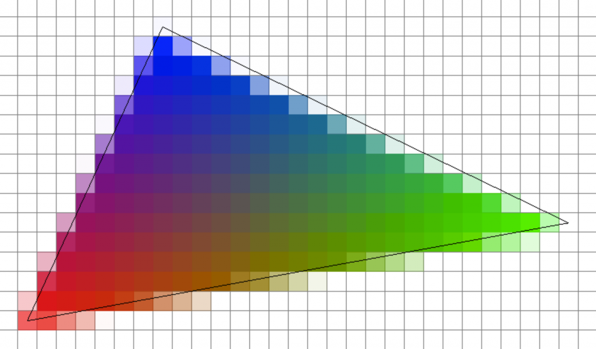

<style>
  table {
    width: 100%
    }
  td {
    vertical-align: center;
    text-align: center;
  }
  table.inputT{
    margin: 10px;
    width: auto;
    margin-left: auto;
    margin-right: auto;
    border: none;
  }
  input{
    text-align: center;
    padding: 0px 10px;
  }
  iframe{
    width: 100%;
    display: block;
    border-style:none;
    overflow:hidden
  }
</style>
<script>
function setFrame(id, src){
document.getElementById(id).src="../assets/html/" + src;
}

function water(){
setFrame("water","water/water.html");
}

function shader(){
setFrame("shader","shader/shader.html");
}

function shaderfs(){
setFrame("shaderfs","shader/shaderfs.html");
}

function shaderjs(){
setFrame("shaderjs","shader/shaderjs.html");
}
</script>

# ThreeJS ES6 (創意技巧)

## 所有 ThreeJS ES6 例子 代碼的通用代碼部分

```js
<!DOCTYPE html>
<html>
  <style>
    body {
      margin: 0;
    }
  </style>
  <body></body>
  <script type="module">
    import * as THREE from "../module/Three.js";
    import { OrbitControls } from "../module/js/OrbitControls.js";
    import { Water } from "../module/js/Water.js";
    let scene = new THREE.Scene();
    let camera = new THREE.PerspectiveCamera(
      75,
      window.innerWidth / window.innerHeight,
      0.1,
      1000
    );
    const light = new THREE.AmbientLight(0x404040);
    scene.add(light);
    var renderer = new THREE.WebGLRenderer({
      antialias: true,
    });
    renderer.setSize(window.innerWidth, window.innerHeight);
    renderer.setClearColor(0xdddddd, 1);
    renderer.setPixelRatio(window.devicePixelRatio);
    document.body.appendChild(renderer.domElement);
    var controls = new OrbitControls(camera, renderer.domElement);
    controls.enableZoom = true;
  //-----------------------------------------------------------------------------------
    camera.position.set(x, y, z);

        示例代碼區域

    function core(time){

    }
	//-----------------------------------------------------------------------------------
    function animate(time) {
      requestAnimationFrame(animate);
      core(time);
      renderer.render(scene, camera);
      controls.update();
    }
    animate();
  </script>
</html>
```

## 海面示例

海面紋理貼圖 *waternormals.png* 只是一張海面圖片，海面需要映射到材質上。

```js
camera.position.set(0, 100, 200);
const waterGeometry = new THREE.PlaneGeometry(10000, 10000);
let water = new Water(waterGeometry, {
  textureWidth: 512,
  textureHeight: 512,
  waterNormals: new THREE.TextureLoader().load(
    "../texture/waternormals.jpg",
    function (texture) {
      texture.wrapS = texture.wrapT = THREE.RepeatWrapping;
    }
  ),
  sunDirection: new THREE.Vector3(),
  sunColor: 0xffffff,
  waterColor: 0x5FC7F3,
  alpha: 0.8,
  distortionScale: 6.7,
  fog: scene.fog !== undefined,
});
water.rotation.x = -Math.PI / 2;
scene.add(water);
function core(time) {
  water.material.uniforms["time"].value += 1.0 / 60.0;
}
```

<div>
<button onclick="water()">點擊測試海面</button>
<iframe id="water" height="300px"></iframe>
</div>

## 著色器 shader

著色器，實際上是一種方式來介入GPU渲染流程，定制gpu如何組織數據和繪製數據到屏幕上。著色器會分為頂點著色器和片元著色器。 它們有著不同的功能和作用。

### 頂點著色器 Vertex Shader

頂點著色器主要負責處理頂點數據，其實頂點著色器能做的事情並不多，大部分就是在處理頂點的矩陣變換，將頂點的位置通過矩陣乘法最終變換到裁剪空間。

 - 輸入：頂點著色器的輸入數據一般是我們傳入的 *attribute*，*uniforms* 變量。

 - 輸出：一般頂點著色器的運算結果輸出是設置 *gl_Position*，也可以設置一些變量比如*gl_PointSize* 或者 *varying* 變量

### 片元著色器 Fragment Shader

片元著色器在整個渲染中起到了非常大的作用，一般顏色，貼圖採樣，光照，陰影等計算都會在片元著色器中計算。

 - 輸入：片元著色器的輸入數據一般是從頂點著色器傳入的 *varying* 或者全局的*uniforms* 變量。

 - 輸出：一般片元著色器的運算結果輸出是設置 *gl_FragColor* 。


Vertex Shader 分別透過 Varying 設定一個藍紅綠三色的點，那 Fragment Shader 直接用那個 Varying 的點著色。

Vertex Shader 代碼例子如下:

```c
attribute vec3 aPos;
attribute vec4 aColor;
varying vec4 vColor;

void main(void){
    gl_Position = vec4(aPos, 1);
    vColor = aColor;
}
```

以上代碼 *Vertex Shader* 中，出現了*attribute*:aColor，類型是 *vec4*，還有一個 *varying* 可把它理解成一種變量類型也是 *vec4*。 在 **main** 函數中我們看到除了給內置變量 *gl_Position* 賦值以外還把 aColor 賦值給了 vColor。

Fragment Shader 代碼例子如下:

```c
precision highp float;
varying vec4 vColor;

void main(void) {
    gl_FragColor = vColor;
}
```

在 *Fragment Shader* 中，首先出現 *precision* 被定義為 highp float; 作用是設置浮點數精度，也有默認精度可以不用顯式設置。但在兩 **Shader** 間精度要一致，否則會報錯。
接下來的一行同樣出現了*varying*，它定義和在 *Vertex Shader*中一樣。 在 **main** 函數中我們把 vColor 賦值給 gl_FragColor。

從上面的代碼我們可以看出 *varying* 的作用是將數據從 *Vertex Shader* 傳遞給 *Fragment Shader*，它是 *Vertex Shader* 的輸出，也是 *Fragment Shader* 的輸入。 使用時需要在兩個**Shader** 中對 *varying* 進行定義。


```
var color = [
    1, 0, 0, 1,
    0, 1, 0, 1,
    0, 0, 1, 1
];
var colorBuffer = gl.createBuffer();
gl.bindBuffer(gl.ARRAY_BUFFER, colorBuffer);
gl.bufferData(gl.ARRAY_BUFFER, new Float32Array(color), gl.STATIC_DRAW);

var aColorPosition = gl.getAttribLocation(glProgram, 'aColor');
gl.vertexAttribPointer(aColorPosition, 4, gl.FLOAT, false, 0, 0);
gl.enableVertexAttribArray(aColorPosition);
```

在 color 數組中，為每一個點添加顏色信息，每個點的顏色是個四元組，即 RGBA 四項內容，取值範圍0-1。 代碼如上，只！是創建緩衝區、獲取 attribute 索引並讓它指向顏色數據。




## 著色器示例

### GPU 文本合併到 javascript 文件中

```js
import { TextureLoader } from "../module/loaders/TextureLoader.js";

camera.position.set(0, 0, 10);
let textureLoader = new TextureLoader();

function createMatCap(texture) {
  let vertexShader = `
  varying vec2 Point;
  void main()
  {
  vec3 vNormal = (mat3(modelViewMatrix) * normal);
  vNormal = normalize(vNormal);
  Point.x = vNormal.x * 0.5 + 0.5;
  Point.y = vNormal.y * 0.5 + 0.5;
  gl_Position = projectionMatrix * modelViewMatrix * vec4(position, 1.0);}
  `;

let fragmentShader = `
  // Matcap纹理
  uniform sampler2D Matcap;
  varying vec2 Point;
  void main(void){
  // texture2D() 获取颜色值
  vec4 color = texture2D(Matcap, Point);
  gl_FragColor = color;}
  `;

  let Material = new THREE.ShaderMaterial({
  uniforms: {
    Matcap: { value: texture }
  },
  vertexShader,
  fragmentShader
  });
return Material;
}

const sphere_geometry = new THREE.SphereGeometry(2, 30, 30);
const sphere_material = createMatCap(
  textureLoader.load("../texture/metal-x.png"));
const sphere = new THREE.Mesh(sphere_geometry, sphere_material);
  scene.add(sphere);

function core(time) {};
```

<div>
<button onclick="shader()">點擊測試著色器 (GPU 文本合併到 javascript)</button>
<iframe id="shader" height="300px"></iframe>
</div>


### GPU 文本分別在 javascript 文件中

#### 著色器語言的附加腳本

將著色器語言存儲在單獨的 *type="x-shader/x-vertex"*, *type="x-shader/x-fragment"* 中

```js
<script type="x-shader/x-vertex" id="vertexShader">
  varying vec2 Point;
  void main(){
    vec3 vNormal = ( mat3( modelViewMatrix ) * normal );
    vNormal = normalize(vNormal);
    Point.x = vNormal.x * 0.5 + 0.5;
    Point.y = vNormal.y * 0.5 + 0.5;
    gl_Position = projectionMatrix * modelViewMatrix * vec4( position, 1.0 );
  }
</script>
<script type="x-shader/x-fragment" id="fragmentShader">
  uniform sampler2D Matcap;
  varying vec2 Point;
  void main(void){
    vec4 color = texture2D(Matcap, Point);
    gl_FragColor = color;
  }
</script>
```

#### 原始核心代碼區

```js
camera.position.set(0, 0, 10);
let textureLoader = new TextureLoader();
function createMatCap(texture) {
  let Material = new THREE.ShaderMaterial({
  uniforms: {
  Matcap: { value: texture }
  },
  vertexShader: document.getElementById('vertexShader').textContent,
  fragmentShader: document.getElementById('fragmentShader').textContent,
  });
  return Material;
}
const sphere_geometry = new THREE.SphereGeometry(2, 30, 30);
const sphere_material = createMatCap(textureLoader.load("../texture/metal.png"));
const sphere = new THREE.Mesh(sphere_geometry, sphere_material);
scene.add(sphere);
function core(time) {}
```

<div>
<button onclick="shaderjs()">點擊測試著色器附加腳本</button>
<iframe id="shaderjs" height="300px"></iframe>
</div>


### 從外部加載 GPU 文件示例

將著色器語言存儲在單獨的文本 *vertex.glsl*, *fragment.glsl* 中

```js
camera.position.set(0, 0, 10);
function loadFile(filename) {
  return new Promise((resolve, reject) => {
    const loader = new THREE.FileLoader();
    loader.load(filename, (data) => {
      resolve(data);
    });
  });
}
class setMatCap {
  constructor(geometry, textureFile, vertexFile, fragmentFile) {
    const shadersPromises = [
      loadFile(vertexFile),
      loadFile(fragmentFile),
      new TextureLoader().load(textureFile),
    ];
    this.loaded = Promise.all(shadersPromises).then(
      ([vertexShader, fragmentShader, texture]) => {
        this.material = new THREE.ShaderMaterial({
          uniforms: {
            Matcap: { value: texture },
          },
          vertexShader: vertexShader,
          fragmentShader: fragmentShader,
        });
        this.material.extensions = {
          derivatives: true,
        };
        this.mesh = new THREE.Mesh(geometry, this.material);
        scene.add(this.mesh);
      }
    );
  }
}
const sphere_geometry = new THREE.SphereGeometry(2, 30, 30);
new setMatCap(sphere_geometry, "../texture/metal-r.png", "./vertex.glsl", "./fragment.glsl");
function core(time) {};
```

<div>
<button onclick="shaderfs()">點擊測試著色器 (外部加載 GPU 文件)</button>
<iframe id="shaderfs" height="300px"></iframe>
</div>


