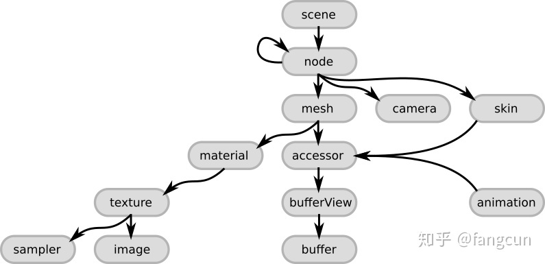
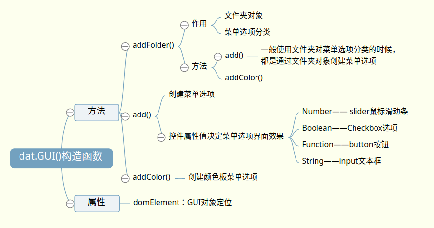

<style>
  table {
    width: 100%
    }
  td {
    vertical-align: center;
    text-align: center;
  }
  table.inputT{
    margin: 10px;
    width: auto;
    margin-left: auto;
    margin-right: auto;
    border: none;
  }
  input{
    text-align: center;
    padding: 0px 10px;
  }
  iframe{
    width: 100%;
    display: block;
    border-style:none;
    overflow:hidden
  }
</style>
<script>
function setFrame(id, src){
document.getElementById(id).src="../assets/html/" + src;
}

function gltf(){
setFrame("gltf","gltf/gltf.html");
}

function gui(){
setFrame("gui","gui/gui.html");
}
</script>

# ThreeJS ES6 (動畫技巧)

## 所有 ThreeJS ES6 例子 代碼的通用代碼部分

```js
<!DOCTYPE html>
<html>
  <style>
    body {
      margin: 0;
    }
  </style>
  <body></body>
  <script type="module">
    import * as THREE from "../module/Three.js";
    import { OrbitControls } from "../module/js/OrbitControls.js";
    let scene = new THREE.Scene();
    let camera = new THREE.PerspectiveCamera(
      75,
      window.innerWidth / window.innerHeight,
      0.1,
      1000
    );
    const light = new THREE.AmbientLight(0x404040);
    scene.add(light);
    var renderer = new THREE.WebGLRenderer({
      antialias: true,
    });
    renderer.setSize(window.innerWidth, window.innerHeight);
    renderer.setPixelRatio(window.devicePixelRatio);
    document.body.appendChild(renderer.domElement);
    var controls = new OrbitControls(camera, renderer.domElement);
    controls.enableZoom = true;
  //-----------------------------------------------------------------------------------
    camera.position.set(x, y, z);

        示例代碼區域

    function core(time){

    }
	//-----------------------------------------------------------------------------------
    function animate(time) {
      requestAnimationFrame(animate);
      core(time);
      renderer.render(scene, camera);
      controls.update();
    }
    animate();
  </script>
</html>
```

## glTF 格式介紹

glTF 是 *GL Transmission Format* 的縮寫。數據結構是為應用程序實時渲染而設計。有以下幾大特點：

 支持 3D 模型幾何體、材質、動畫及場景、攝影機等信息（因為 glTF 把整個場景
也收到檔案內)，更支持動畫蒙皮子類等等。
 glTF 導出格式有兩種後綴格式可供選擇：.gltf 和 .glb：

 *gltf* 文件導出時一般會輸出兩種文件類型，一是 .bin 文件，以二進制流的方式存儲頂點坐標、頂點法線坐標和貼圖紋理坐標、貼圖信息等模型基本數據信息；二是 .gltf 文件，本質是 json 文件，記錄對bin文件中模型頂點基本數據的索引、材質索引等信息，方便編輯，可讀性較好；

 *glb* 文件格式只導出一個 .glb 文件，將所有數據都輸出為二進制流，通常來說會更小一點，若不關心模型內的具體數據可直接選擇此類型。



|名稱|內容|
|:---:|:---|
|scene|場景結構描述條目。 它通過引用node來定義場景圖。|
|node|場景圖中的一個結點。它可以包含一個變換(比如旋轉或平移)，引用更多的子結點。 它可以引用網格和相機，以及描述網格變換的蒙皮|
|camer|定義了用於渲染場景的視錐體配置。|
|mesh|描述了場景中出現的3D對象的網格數據。它引用的accessor對象可以用來訪問真實的幾何數據。 它引用的material對象定義了3D對象的外觀。|
|skin|定義了用於蒙皮的參數，參數的值通過一個accessor對象獲得。|
|animation|描述了一些結點如何隨時間進行變換(比如旋轉或平移)。|
|accessor|一個訪問任意數據的抽像數據源。 被mesh、skin和animation元素使用來提供幾何數據，蒙皮參數和基於時間的動畫值。 它通過引用一個bufferView對象，來引用實際的二進制數據。|
|material|包含了定義3D對像外觀的參數。 它通常引用了用於3D對象渲染的texture對象。|
|texture|定義了一個sampler對象和一個image對象。 sampler對象定義了image對像在3D對像上的張貼方式。|


**Draco** 是一種庫，用於壓縮和解壓縮 3D 幾何網格（geometric mesh）和點雲（point cloud）。它顯著縮小了 3D 圖形文件的大小。使3D 圖形的應用程序可以小巧得多，又不影響視覺逼真度。 只需要少量的帶寬就可以傳輸虛擬現實和增強現實了，而且可以迅速呈現、畫面極其逼真。也能用在ThreeJS中。

如要添加埸景至 ThreeJS 中可用 scene.add(gltf.scene) 功能代碼。

|glTF 加載方法|類別|介紹|
|:---:|:---|:---|
|scene|THREE.Group|場景|
|animations|THREE.AnimationClip[]|動畫數組|
|scenes|THREE.Group[]|場景數組|
|cameras|THREE.Camera[]|相機數組|
|asset|Object|物件|


### Animation Clips

AnimationClip(name, duration, tracks)

|名稱	|說明|
|:---:|:---|
|name	|動畫名稱|
|duration	|動畫持續時間，若值為負數，傳入時間將會由回傳進陣列的數值計算|
|tracks|一組由 KeyframeTracks 回傳數值的陣列|

已經透過 glTF Blender exporter 將 animation 3D 物件，從 Blender 導出，並用 GLTFLoader 將物件渲染到 Three.js 環境中。這一整個過程就包含了 Animation Clips。

通常 Animation Clips 會保留物件的特定活動數據。舉例來說：若有一個動畫角色，那麼 Animation Clips 則會保存該動畫叫角色的 「1. 走路週期 2. 跳耀動作 3. 迴避動作」以此類推。

### Keyframe Tracks

KeyframeTrack(name, times, values, interpolation)

|名稱	|說明|
|:---:|:---|
|name|KeyframeTrack 名稱
|times|	關鍵幀回傳的陣列，其值會被計算轉變為 Float32Array|
|values|	由時間相關的值回傳的陣列，其值會被計算轉變為 Float32Array|
|interpolation|KeyframeTrack 的一種插件值，預設值為 InterpolateLinear|

在每一個 Animation Clips 會將每一個動畫屬性儲存在 Keyframe Tracks 中。
在 Keyframe Tracks 中會有兩個數值， time 按照順序儲存該 Tracks 的所有關鍵幀時間值，values 包含了動畫屬性相對的更改值。

舉例來說：若有一動畫角色擁有 Skeleton (骨架) 系統，那麼 會有一組 Keyframe Tracks 將會儲存下臂骨架的位置變化數據，另一組 Keyframe Tracks 儲存下臂骨架的旋轉變化數據。

### Animation Mixer

AnimationMixer(rootObject)

|名稱	|說明|
|:---:|:---|
|rootObject|Mixer 所播放的動畫物件|

儲存所有動畫構成的數據，其行為不僅僅只是播放動畫，而是真正的混合器控制台，可以同時混合多組動畫。

### Animation Actions

AnimationAction(mixer, clip, localRoot)

|名稱|說明|
|:---:|:---|
|mixer|被 Animation Actions 所控制的混合器|
|clip	|Animation Clip 內所保存得動畫片段|
|localRoot|	動作執行的 root 物件|

Animation Mixer 比較沒有 properties 或 methods，是因為我們都可以透過 Animation Actions 來控制。可以用 Animation Actions 來決定播放、暫停、終止某個 Animation Clip，以及決定某個 Animation Clip 是否需要重複播放或播放頻率。

要注意的是應該要使用 AnimationMixer.clipAction 來實例化一組 Animation Actions 而不是直接呼叫該 function 來使用。因為這個方法提供了缓存以提高動畫的性能。

### Animation Object Groups

AnimationObjectGroup( obj1, obj2, obj3, ... )

|名稱|說明|
|:---:|:---|
|obj|共享動畫屬性的物件|

若需要將多個物件共享同一組動畫屬性，我們就可以使用 Animation Object Groups

將作為 root 物件傳入的 constructor 或 AnimationMixer 的 clipAction method 先組成一個 Animation Object Groups 後，再將整組 Animation Object Groups 當作 root 物件傳出去使用。但動畫屬性必須要讓群組內的物件能兼容共用。

動畫範例程式碼

```js
let model = gltf.scene;
// 實例化 AnimationMixer，並且取得 AnimationClip 的instances
var mixer = new THREE.AnimationMixer(model);
// 將所有 animations 加到 clips[]
var clips = model.animations;
// 更新每一個 mixer 中的幀
function update(){
	 mixer.update(deltaSeconds);
}
// 尋找 clips 中名稱為 dance 的動畫
var clip = THREE.AnimationClip.findByName(clips,'dance');
// 加載 dance 至 mixer 內並播放
var action = mixer.clipAction(clip);
action.play();
// 播放所有在 clips 中的動畫
clips.forEach(function(clip){
 	mixer.clipAction(clip).play();
});
```

### glTF 動畫示例

```js
import { GLTFLoader } from "../module/js/GLTFLoader.js";

camera.position.set(7.4, 6.9, 5.2);
const mixers = [];
let actions = [];
const loader = new GLTFLoader();
let mixer, model;
let clock = new THREE.Clock();
loader.load("./wolf/Wolf.glb", function (gltf) {
  model = gltf.scene;
  model.scale.set(10, 10, 10);
  mixer = new THREE.AnimationMixer(gltf.scene);
  gltf.animations.forEach((clip) => {
    mixer.clipAction(clip).play();
  });
  scene.add(model);
});
function core(time) {
  var delta = clock.getDelta();
  if (mixer) mixer.update(delta);
  console.log(camera.position);
}
```

如要使用 *Draco* 壓縮，可參考以下代碼:

```js
import { DRACOLoader } from '../module/js/DRACOLoader';

const dracoLoader = new DRACOLoader();
dracoLoader.setDecoderPath(DECODER_PATH);
loader.setDRACOLoader(dracoLoader);

在 loader.load("./wolf/Wolf.glb", function (gltf) { ... 之前加載即可。

DECODER_PATH 為 Draco 需要用到的解壓程序庫目錄。
```

<div>
<button onclick="gltf()">點擊測試動畫</button>
<iframe id="gltf" height="300px"></iframe>
</div>

## 渲染效率

 - 如果知道物件將是靜態的，可以禁用它。並在需要時手動更新變換矩陣。

```js
object.matrixAutoUpdate = false;
object.updateMatrix();
```

 - JavaScript 中的對象的創建開銷很大，所以不要在循環中創建對象。應創建一個類似的方法來重用循環內的對象。

 - 如要刪除物件，可以隱藏它，如光源只要使它不可見或光強度為零即可。

```js
material.opacity = 0;
light.visible = false;
light.intensiy = 0;
```

 - 點光源陰影比其他陰影類型更消耗性能，因為它們必須渲染六次 (每個方向一次)，而 DirectionalLight 和 SpotLight 陰影則需渲染一次。

 - 高像素密度打開/關閉抗鋸齒之間幾乎沒有視覺差異。

```js
this.renderer = new THREE.WebGLRenderer({antialias: false});
```

 - MeshBasicMaterial 是一種不需要光線可見的材料。如無法顯示物件，可以使用 MeshBasicMaterial 臨時覆蓋場景中的所有材質。以作測試用。

```js
scene.overrideMaterial = new MeshBasicMaterial({color: "green"});
```

 - MeshLambertMaterial 不適用於閃亮拉絲的材質，但對於像布料這樣的啞光材質，它會產生非常相似 MeshPhongMaterial 的結果，但性能更高。

 - 紋理都需要是 2 的冪次方 (POT) 大小 1 、2 、4 、8 、16 ,…,512 ,2048 ,…。

 - 盡可能使用最小尺寸的紋理如 256x256 的平鋪紋理。

 - 可用 console.log 來看設定值

```js
console.log(camera.position);
```

 - 默認情況下，所有物件都在原點 (0,0,0) 點創建。

 - 在測試應用程序的性能時，就是要檢查它是受 CPU 限制還是受 GPU 限制。可使用基礎材質 *basic material* 替換所有材質 scene.overrideMaterial。如果性能提高，那麼應用程序受 GPU 限制。 如果性能沒有提高，則應用程序受 CPU 限制。

```js
scene.overrideMaterial = new MeshBasicMaterial({color: "green"});
```

## 輕量級的圖形用戶界面庫

輕量級的圖形用戶界面庫 *dat.gui.js* ，GUI組件只有幾 10KB，可以用於創建操作控制三維場景的菜單欄，比如渲染的時候通過鼠標調試光照參數，要比手動更改參數再刷新瀏覽器要快捷方便得多。*dat.gui.js* 基本思路是先創建一個對象，也就是一個控件，對象包含一系列的屬性，這些屬性用來存儲一系列的數據。控件的數據更改的 three.js 中三維場景相關數據對應，只要控件中的屬性值發生變化，three.js 三維場景中相關對象的數據就會變化。那控件對象的屬性值生成交互界面，同時通過鍵鼠與可視化界面的交互，可以實時動態改變控件中的數據。[網上下載 dat.gui](https://github.com/dataarts/dat.gui)



```js
import * as dat from "../module/js/dat.gui.module.js";

camera.position.set(0, 10, 20);

let lightp = new THREE.PointLight(0xffff00);
lightp.position.set(20, 20, 20);
scene.add(lightp);

let geometry = new THREE.SphereGeometry(1, 32, 32);
let material = new THREE.MeshPhongMaterial({
  color: "#ffff00",
  wireframe: true,
});
let sphere = new THREE.Mesh(geometry, material);
scene.add(sphere);

const gui = new dat.GUI();
var icrt = new (function () {
  this.rotationSpeed = 0.02;
  this.roX = 0;
  this.roY = 0;
  this.roZ = 0;
  this.visible = false;
  this.wireframe = true;
  this.color = "#ffffff";
  this.X = 0;
  this.Y = 0;
  this.Z = 0;
  this.radius = 1;
  this.test = function () {
    alert("Test function!");
  };
})();

function translate() {
  sphere.position.set(icrt.X, icrt.Y, icrt.Z);
}

function rotation() {
  sphere.rotation.set(icrt.roX, icrt.roY, icrt.roZ);
}

gui.domElement.style = "position:absolute;top:0px;right:0px";
var f1 = gui.addFolder("Position");

f1.add(icrt, "X", -10.0, 10.0)
  .onChange(function (value) {
    translate();
  })
  .step(0.001);
f1.add(icrt, "Y", -10.0, 10.0)
  .onChange(function (value) {
    translate();
  })
  .step(0.001);
f1.add(icrt, "Z", -10.0, 10.0)
  .onChange(function (value) {
    translate();
  })
  .step(0.001);
f1.open();

var f2 = gui.addFolder("Rotation");
f2.add(icrt, "roX", 0, Math.PI / 2)
  .onChange(function (value) {
    rotation();
  })
  .step(0.001);
f2.add(icrt, "roY", 0, Math.PI / 2)
  .onChange(function (value) {
    rotation();
  })
  .step(0.001);
f2.add(icrt, "roZ", 0, Math.PI / 2)
  .onChange(function (value) {
    rotation();
  })
  .step(0.001);
f2.open();

let fr = gui.add(icrt, "wireframe").name("線框");
let vi = gui.add(icrt, "visible").name("隱藏");

var f3 = gui.addFolder("Size");
let RC = f3.add(icrt, "radius", 1, 10);
let co = f3.addColor(icrt, "color");
f3.open();

gui.add(icrt, "rotationSpeed", { Stopped: 0, Slow: 0.02, Fast: 3 }).name("轉速");
gui.add(icrt, "test").name("自定函數");

fr.onChange(function (e) {
  if (e) material.wireframe = true;
  else material.wireframe = false;
});

vi.onChange(function (e) {
  if (e) sphere.visible = false;
  else sphere.visible = true;
});

co.onChange(function (colorV) {
  var cObj = new THREE.Color(colorV);
  sphere.material.color = cObj;
});

RC.onChange(function (r) {
  sphere.scale.set(r, r, r);
  console.log(r);
});

function core(time) {
  sphere.rotation.y += 0.0125 * icrt.rotationSpeed;
  sphere.rotation.x += 0.05 * icrt.rotationSpeed;
}
```

<div>
<button onclick="gui()">點擊測試</button>
<iframe id="gui" height="300px"></iframe>
</div>


