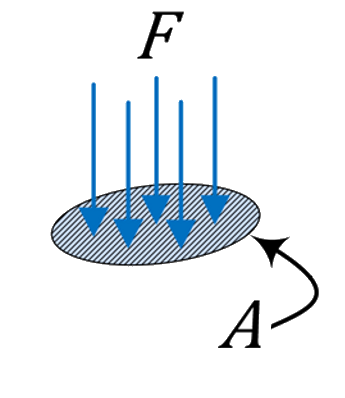
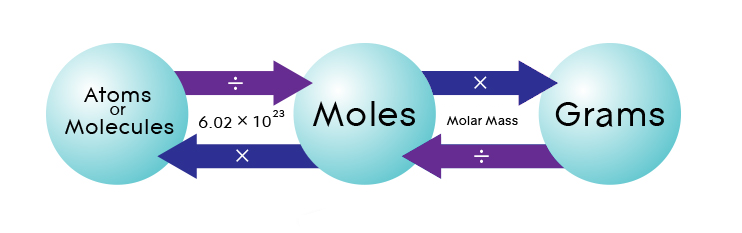
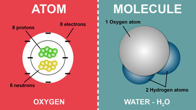

# Gas Law

## Pressure

$$ P = \frac {F}{A} $$

## Ideal Gas

$$ PV = nRT $$

$$ \frac {PV}{T} = nR $$

Noted: T is Kelvin Temperature

*Moles* n are a way to describe how many molecules are in a gas. 

1 *mole* is equal to $ 6.02 \times 10^{23}$ molecules。 

$$ n = \frac {N}{N_A} $$

 - N is the total number of molecules of the gas
 - $N_A$ is $6.02 \times 10^{23}$ molecules

This number is called Avogadro's constant $ N_A $ and it's a way to convert from **moles** to **molecules** (Atoms) or vice versa.

Atoms are single neutral particles. Molecules are neutral particles made of two or more atoms bonded together.

## Boyle's Law (PV)

$$ {\color{red}p} \propto \frac {1}{V} $$

Pressue increase Volume decrease

## Charles' Law (VT)

$$ V \propto {\color{green}T} $$

Volume increase  Temperature increase

## Pressure Law (TP)

$$ {\color{green}T}  \propto {\color{red}p}$$

Temperature increase Pressue increase

## Kinetic Energy of Gas

$$ E_{internal} = \frac {3}{2} nRT $$

$$ KE_{average} = \frac {3}{2} \frac {RT}{N_A} = \frac {KE_{mole}}{N_A}$$

$$ E_{internal} = KE_{average} = \frac {3}{2} nRT = \frac {1}{2} m V^2$$

$$ V^2 = \frac {n}{m} 3RT$$

$$ V = \sqrt {\frac {n}{m} 3RT} = \sqrt {\frac {3RT}{M}}$$

 - M is called the molecular mass of the gas ($M=\frac{m}{n}$ the mass of one mole of the gas). 