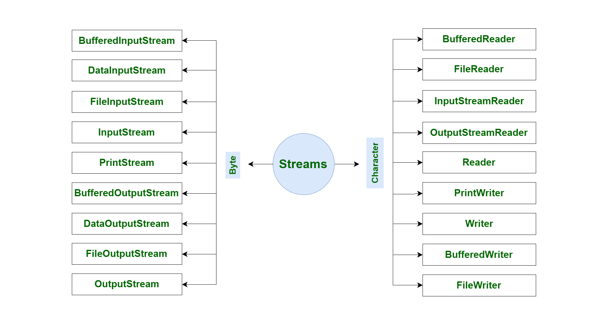

<style>
  table {
    width: 100%
    }
  td {
    vertical-align: center;
    text-align: center;
  }
  table.inputT{
    margin: 10px;
    width: auto;
    margin-left: auto;
    margin-right: auto;
    border: none;
  }
  input{
    text-align: center;
    padding: 0px 10px;
  }
  iframe{
    width: 100%;
    display: block;
    border-style:none;
  }
</style>

# 字符集編碼問題

 客戶端：java.net.Socket   

 服務端：System.Net.Sockets 

SOCKET 在接收與發送時都是以字節流的形式傳輸的，所以發送方與接收方的字節編碼一定要一致才行。

## 第一種情形

Android：

```java
InputStream in = socket.getInputStream();
PrintWriter out = new PrintWriter(new BufferedWriter(new OutputStreamWriter(socket.getOutputStream(),"utf-8")), true);
```

服務端用了預設的處理接收到字節流，所以在Android 端輸出，服務端有機會接收到亂碼，這是字節編碼不一致造成的。

## 第二種情形

Android：

```java
DataInputStream in = new DataInputStream(socket.getInputStream());
DataOutputStream out = new DataOutputStream(socket.getOutputStream());
```

發送:

```java
try {
  byte[] datas = msg.getBytes("utf-8"); 
  out.write(datas,0,datas.length);
} catch (IOException e) {
  e.printStackTrace();
}
```

接收:

```java
int result = in.available();
while (result == 0) {
  result = in.available();
}
byte[] data = new byte[result];
in.read(data);
String content = new String(data, "utf-8");
```

C# 服务端：

接收
```c
string result = System.Text.Encoding.UTF8.GetString(socketData.dataBuffer);
```

发送

```c
byte[] byData = System.Text.Encoding.UTF8.GetBytes(msg);
soket.Send(byData);
```

通過上述的問題。證明要確保在不同的平台下，客戶端輸入的中文可以被正確地解析、保存、讀取。 最好的辦法就是使用UTF-8編碼。


# StringBuffer vs StringBuilder


*StringBuffer* 是 *String* 操作的選擇。 但在公共方法都是同步的，這是一個缺點。 *StringBuffer* 提供線程安全性，但會降低性能。在大多數情況下，不在多線程環境中使用 *String*。 因此 *Java* 引入了一個新的 *StringBuilder* 類，該類與 *StringBuffer* 相似，除了線程安全性和同步性。

*StringBuffer* 具有一些額外的方法，例如子字符串，長度，容量等。 但由於在 *String* 中也存在這些方法，因此 *StringBuilder* 類中就不實現這些方法。

|函數名稱|測試次數|時間|內存|
|:---:|:---:|:---:|:---:|
|StringBuffer|1,000,000	|808|149,356,704|
|StringBuilder|1,000,000	|633|147,783,888|
|StringBuffer|10,000,000	|7,448|149,356,704|
|StringBuilder|10,000,000|6,179|147,783,888|


# 數據流

BufferedReader, BufferedWriter， DataOutputStream 及 DataInputStream 使用數據時始終要用相同類型的流。緩衝流的基本原理，是在創建流對象時，會創建一個內置的默認大小的緩衝區數組，通過緩衝區讀寫，減少系統 IO 次數，從而提高讀寫的效率。

```java
BufferedOutputStream bos = new BufferedOutputStream(socket.getOutputStream());
bos.write(os.getBytes("UTF-8"));
```

## 構造方法

 - public BufferedInputStream(InputStream in)
   - 創建一個 新的緩衝輸入流。
 - public BufferedOutputStream(OutputStream out)
   - 創建一個新的緩衝輸出流。
 - public BufferedReader(Reader in)
   - 創建一個 新的緩衝輸入流。
 - public BufferedWriter(Writer out)
   - 創建一個新的緩衝輸出流。


# 字符編碼

計算機中儲存的信息都是用二進制數表示的，而在屏幕上看到的數字、英文、標點符號、漢字等字符是二進制數轉換之後的結果。 按照某種規則，將字符存儲到計算機中，稱為編碼 。 反之，將存儲在計算機中的二進制數按照某種規則解析顯示出來，稱為解碼 。 比如說，按照 *A* 規則存儲，同樣按照 *A* 規則解析，那麼就能顯示正確的文本符號。 反之，按照 *A* 規則存儲，再按照 *B* 規則解析，就會導致亂碼現象。


字符(能看懂的) –> 編碼 -> 字節(看不懂的)

字節(看不懂的) –> 解碼 -> 字符(能看懂的)

## 構造方法

 - InputStreamReader(InputStream in)
    - 創建一個使用默認字符集的字符流。
 - InputStreamReader(InputStream in, String charsetName)
    - 創建一個指定字符集的字符流。
 - OutputStreamWriter(OutputStream in)
    - 創建一個使用默認字符集的字符流。
 - OutputStreamWriter(OutputStream in, String charsetName)
    - 創建一個指定字符集的字符流。

```java
InputStreamReader reader = new InputStreamReader(inputStream, StandardCharsets.UTF_8);

OutputStreamWriter writer = new OutputStreamWriter(outputStream, StandardCharsets.UTF_8);
```

# DataOutputStream & DataInputStream

DataOutputStream 的 writeUTF() 方法是將以 UTF-8 的編碼格式的數據寫入底層輸出流。

DataInputStream 的 String readUTF() 方法規則與寫入的規則相反。





*HttpURLConnection* 發送 *POST* 請求，需要同時上傳文件和其他參數，參數中如果有中文字符，*DataOutputStream* 使用 *writeBytes*，將中文字符傳入的話，服務端接收到的字符串會亂碼，但是使用 *write* 就不會，故截取了一部分代碼進行測試，看看到底是什麼原因。


最後可以使用 *write(byte[] byte)* 來達到正確傳輸中文的目的，需要將字符串傳入之前就轉換成 *byte[]* 。