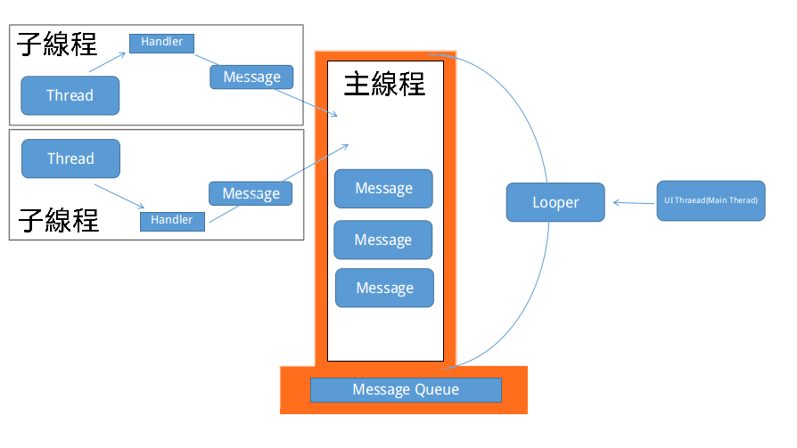
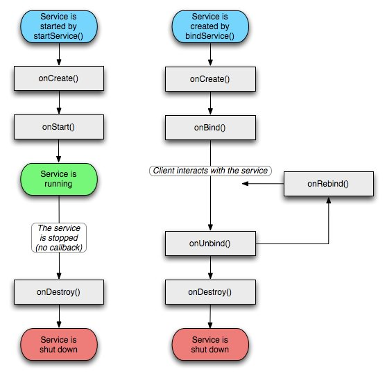

<style>
  table {
    width: 100%
    }
  td {
    vertical-align: center;
    text-align: center;
  }
  table.inputT{
    margin: 10px;
    width: auto;
    margin-left: auto;
    margin-right: auto;
    border: none;
  }
  input{
    text-align: center;
    padding: 0px 10px;
  }
</style>

# Android 佈局

## 以編程方式做佈局

```java
Button btn = (Button) findViewById(R.id.mybutton);

btn.setOnClickListener(new View.OnClickListener() {
    @Override
    public void onClick(View v) {
        addWord(v);
    }
});

```

## 以 XML 方式做佈局

文件存儲在佈局文件夾 *layout* 中，名稱為: *activity_main*

```xml
<LinearLayout xmlns:android="http://schemas.android.com/apk/res/android"
  android:layout_width="fill_parent"
  android:layout_height="fill_parent"
  android:orientation="vertical" >

  <TextView android:id="@+id/text"
    android:layout_width="wrap_content"
    android:layout_height="wrap_content"
    android:text="This is a TextView" />

  <Button android:id="@+id/button"
    android:layout_width="wrap_content"
    android:layout_height="wrap_content"
    android:text="This is a Button" />

</LinearLayout>
```

使用程序激活佈局

```java
setContentView(R.layout.activity_main);
```

## 佈局中的項目激活方法

```xml
<Button android:id="@+id/button"
    android:layout_width="wrap_content"
    android:layout_height="wrap_content"
    android:text="This is a Button"
    android:onClick="addWord" />
```

在 *XML* 中點擊動作設置為 *addWord*

```java
public void addWord(View v) {
    // 主程序中是否需要任務
}
```

## 在子類中調用 UI 線程

### **Handler** 方法

```java
final Handler mHandler = new Handler(mMainActivity.getAplicationContext().getMainLooper());
final Runnable mRunnable = new Runnable(){
    @override
    public void run(){
      UI Thread
    }
};
mHandler(mRunnable);
```

### **runOnUiThread** 方法

```java
runOnUiThread(new Runnable(){
    @override
    public void run(){
      UI Thread
    }
});
```
## 佈局動態更改方法

Android 中的每個可見組件都是一個 View 視圖。 這包括 Button、Spinner、TextView、EditText 等。 程序中的 XML 文件定義被編譯為視圖，常用方法是使用 setContentView() 方法。其實 setContentView() 方法的內部也是使用 LayoutInflater 來加載佈局的，只不過這部分源碼是內部的不容易查看到。

LayoutInflater 可以用來編譯佈局再<font color="#FF1000">動態地整合到已有的 View</font> 中。


獲取 LayoutInflater 的三種方式:

第一種方式
```java
LayoutInflater inflater = getLayoutInflater();
```

第二種方式
```java
LayoutInflater = (LayoutInflater) context.getSystemService(Context.LAYOUT_INFLATER_SERVICE);
```

第三種方式
```java
LayoutInflater inflater = LayoutInflater.from(context);
```

inflate 為 LayoutInflater 的方法用以編譯視圖部份。

inflate() 方法一般接收兩個參數，
 - 第一個參數就是要加載的佈局 ID，
 - 第二個參數是指給該佈局的外部再嵌套一層父佈局，如果不需要就直接傳 null。


這樣就成功成功創建了一個佈局的實例，之後再將它添加到指定的位置就可以顯示出來了。

例子如下：

MainActivity 對應的佈局文件叫做 activity_main.xml

```xml
<LinearLayout xmlns:android="http://schemas.android.com/apk/res/android"
  android:id="@+id/main_layout"
  android:layout_width="match_parent"
  android:layout_height="match_parent" >
</LinearLayout>
```

接下來再定義一個佈局文件，名為button_layout.xml

```xml
<Button xmlns:android="http://schemas.android.com/apk/res/android"
  android:layout_width="wrap_content"
  android:layout_height="wrap_content"
  android:text="Button" >
</Button>
```

這個佈局文件非常簡單，只有一個 Button 按鈕而已。現在我們要 LayoutInflater 來將 button_layout 這個佈局添加到主佈局文件的 LinearLayout 中。

```java
public class MainActivity extends Activity {
  private LinearLayout mainLayout;
  @Override
  protected void onCreate(Bundle savedInstanceState) {
    super.onCreate(savedInstanceState);
    setContentView(R.layout.activity_main);
    mainLayout = (LinearLayout) findViewById(R.id.main_layout);
    LayoutInflater layoutInflater = LayoutInflater.from(this);
    View buttonLayout = layoutInflater.inflate(R.layout.button_layout, null);
    mainLayout.addView(buttonLayout);
 }
}
```

先是獲取 LayoutInflater 的實例，然後調用它的 inflate() 方法來加載 button_layout 這個佈局，最後調用 LinearLayout 的 addView() 方法將它添加到LinearLayout 中。LayoutInflater 技術廣泛應用於需要<font color="#FF1000">動態添加 View</font> 的時候。


inflate() 方法還有個接收三個參數的方法重載，結構如下:

```java
public View inflate(@LayoutRes int resource, @Nullable ViewGroup root, boolean attachToRoot);
```

 - 第一個參數是資源文件的ID
 - 其他參數組合請參考下表


|root|attachToRoot|描述|使用方法|問題|
|:---:|:---:|:---|:---|:--:|
|null|失去作用|設置任何值都沒有意義|用 addView，如上例但可能會表現異常|有機會異常|
|不為 null|false|需要這個父元素的 LayoutParams 來在將來添加時決定佈局文件最外層的所有 layout 屬性|用 addView 將項目添加到視圖|安全|
|不為 null|true|會給加載的佈局文件的指定一個父佈局|已添加如下示例|安全|
|不為 null|-|不設置attachToRoot參數的情況下默認為 true|已添加如下示例|安全|


```java
public class MainActivity extends Activity {
  private LinearLayout mainLayout;
  @Override
  protected void onCreate(Bundle savedInstanceState) {
    super.onCreate(savedInstanceState);
    setContentView(R.layout.activity_main);
    mainLayout = (LinearLayout) findViewById(R.id.main_layout);
    LayoutInflater layoutInflater = LayoutInflater.from(this);
    View buttonLayout = layoutInflater.inflate(R.layout.button_layout, mainLayout, true);
  }
}
```


如果沒有外部佈局 layout_width 和 layout_height 的值修改成多少，都不會有任何效果的，因為這兩個值現在已經完全失去了作用。


平時經常使用 layout_width 和 layout_height 來設置 View 的大小，並且能正常工作，就像這兩個屬性<font color="#FF1000">確實是用於設置 View</font> 的大小的。而實際上則不然，它們其實是用於設置 View 在佈局中的大小的，也就是說，首先 View 必須存在於一個佈局中，之後如果將 layout_width 設置成 match_parent 表示讓 View 的寬度填充滿佈局，如果設置成 wrap_content 表示讓 View 的寬度剛好可以包含其內容，如果設置成具體的數值則 View 的寬度會變成相應的數值。


這也是為什麼這兩個屬性叫作 layout_width 和 layout_height，而不是width 和 height。


但對於 Button 這個控件不存在於任何佈局當中，所以 layout_width 和 layout_height 這兩個屬性理所當然沒有任何作用。


那麼怎樣修改才能讓按鈕的大小改變呢？解決方法其實有很多種，最簡單的方式就是在 Button 的外面再嵌套一層佈局。如下:

```xml
<RelativeLayout xmlns:android="http://schemas.android.com/apk/res/android"
  android:layout_width="match_parent"
  android:layout_height="match_parent" >
  <Button
    android:layout_width="300dp"
    android:layout_height="80dp"
    android:text="Button" >
  </Button>
</RelativeLayout>
```

### setContentView 和 inflate 區別：

setContentView() 一旦調用, layout就會立刻顯示 UI；而 inflate 只會把 Layout 形成一個以 View 類實現成的對象，有需要時再用 setContentView(view) 顯示出來。

# Thread，Looper 和 Handler 的關係

Android 是消息驅動型的系統。實現對應的消息驅動機制的四要素：

 - 接收消息的<font color="#FF1000">消息隊列</font>
   - 【MessageQueue】
 - 阻塞式地從消息隊列中接收消息並進行處理的<font color="#FF1000">線程</font>
   - 【Thread + Looper】
 - 可發送的<font color="#FF1000">消息的格式</font>
   - 【Message】
 - <font color="#FF1000">消息發送函數</font>
   - 【Handler 的 post 和 sendMessage】




## Looper

一個 Looper 類似一個消息泵。它本身是一個死循環，不斷地從 MessageQueue 中提取 Message 或者 Runnable。而 Handler 可以看做是一個 Looper 的暴露接口，向外部暴露一些事件，並暴露 sendMessage() 和 post() 函數。


除了 UI 線程 / 主線程以外，普通的線程是不自帶 Looper 的。想要通過 UI 線程與<font color="#FF1000">子線程通信需要在子線程內自己實現</font>一個 Looper 。開啟 Looper 分三步走：


 - 判定是否已有 Looper 並Looper.prepare()
 - 做一些準備工作(如暴露 handler 等)
 - 調用 Looper.loop()，線程進入阻塞態

示例如下:

```java
class LooperThread extends Thread {
  public Handler handler;
  public void run() {
    Looper.prepare();
    handler = new Handler() {
    public void handleMessage(Message msg) {
      // 在此處處理傳入的消息
    }
  };
  Looper.loop();
  }
}
```

## Handler 中的 Runnable vs Message

Handler 可以分發 <font color="#FF1000">Runnable</font> 對象和 <font color="#FF1000">Message</font> 對像到主線程中，每個 Handler 實例，都會綁定到創建他的線程中(一般是位於主線程)，它有兩個作用:

1. 安排 Runnable 或 Message 在某個主線程中某個地方執行，
2. 安排一個動作在不同的線程中執行

### Handler中分發消息的方法

*<font color="#FF1000">主線程隊列</font>*
  - post(Runnable);
  - postAtFrontOfQueue(Runnable);
  - postAtTime(Runnable,long);
  - postDelayed(Runnable long);

*<font color="#FF1000">Message 對像到隊列</font>*
  - sendEmptyMessage(int)
  - sendMessage(Message)
  - sendMessageAtFrontOfQueue(Message);
  - sendMessageAtTime(Message,long)
  - sendMessageDelayed(Message,long)

以上 post 類方法允許你排列一個 Runnable 對像到 *主線程隊列* 中，sendMessage 類方法，允許你安排一個帶數據的 *Message 對像到隊列* 中，等待更新。

### Runnable 下

Thread 是系統給出的資源，有了 Thread 才有<font color="#FF1000">從 CPU 那裡得到可執行時間片</font>的權力， Thread 並不認識程序，不知道有特設的類，Thread 只認識一個！ 那就是 Runnable。並且知道 Runnable 裡面有一個 run 的方法. 當調用 Thread 的 start 方法，Runnable 方法裡的 run 就會被 Thread 自動運行。所以複寫 run 方法。就能執行所要的功能。

1 在主線

```java
Handler handler = new Handler();
handler.postDelayed(new Runnable() {
  @Override
  public void run() {
  // 在此處做你需要的事
  }
},1500);
```

2. 在子線程

```java
Handler handler = new Handler(Looper.getMainLooper());
handler.postDelayed(new Runnable() {
  @Override
  public void run() {
    // 在此處做你需要的事
  }
},1500);
```

### Message 下

創建 Message 包

<font color="#FF1000">arg1</font>，<font color="#FF1000">arg2</font> 及 <font color="#FF1000">obj</font> 都是 Message 自帶的用來傳遞一些輕量級存儲 int，byte[] 類型的數據，比如進度條的數據或文字等等。

如果是複雜一點的數據類型， Message 也是可以傳遞的，傳遞的方式是就是採用 <font color="#FF1000">Bundle</font> 的方式。

Bundle 是一個載體，可以存放基本數據類型、對像等內容。它本質上是一個 <font color="#FF1000">Hash Map</font>，但被設計成一個專門的 Android 組件，而不是一個通用的數據結構。

Message 方法攜帶有 bundle 類型的數據到隊列中(需要實現 Handler 的子類)。消息在消息隊列中準備好就馬上被處理，也可以處理之前指定一些延時讓實現超時或者基於時間的行為。

以下是 Messsge 的使用方法：

```java
Message msg = Message.obtain();
  // 簡易傳送方法
  msg.arg1 = 1;
  msg.arg2 = 1;
  msg.obj = "test";
  // bundle 傳送方法
Bundle bundle = new Bundle();
  bundle.putString("someKey", result);
  msg.what = 2;
  msg.setData(bundle);
new Handler().sendMessage(msg);
```

1. 在主線程接收消息

```java
Handler handler= new Handler(){
  public void handleMessage(Message msg) {
  // 在此處處理傳入的消息
  }
};
```

2. 在子線程接收消息

```java
Handler handler= new Handler(Looper.getMainLooper()){
  public void handleMessage(Message msg) {
  // 在此處處理傳入的消息
  }
};
```

3. 在主線程發送消息

```java
Handler handler= new Handler();
handler.sendMessage(handler.obtainMessage());
```

4. 在子線程發送消息

```java
Handler handler= new Handler(Looper.getMainLooper());
handler.sendMessage(handler.obtainMessage());
```

Message.obtain() 或者 Handler.obtainMessage(), 都是從一個可<font color="#FF1000">回收對像池中獲取</font> Message 對象。兩種方式都比直接 new 一個 Message 對像在性能上更優越。


## runOnUiThread

在 Android 中一般用 Handler 做主線程和子線程之間的通信。現在有了一種更為簡潔的寫法，就是 Activity 裡面的 runOnUiThread（ Runnable ）方法。

Android 應用要記住應用主線程。主線程非常繁忙，因為它要處理繪製 UI，響應用戶的交互，默認情況下執行我們寫下的大部分代碼。

當需要更新 UI 的時候需要 “返回” 到主線程，因為只有主線程才可以更新應用 *UI*。

最常用的方式是調用 Activity 的 runOnUiThread() 方法。Runnable 對像就能在 UI 程序中被調用。

如果當前線程是 UI 線程，那麼行動是立即執行。如果當前線程不是 UI 線程，操作是發佈到事件隊列的 UI 線程。<font color="#FF1000">注意 UI 線程即是主線程</font>。

基本用法如下：

```java
runOnUiThread(new Runnable() {
     void run() {
         // 在此處做你需要的 UI 事情
     }
});
```

|函數|功能|
|:---:|:---|
|Runnable|直接給出處理的方法|
|Message|傳遞參數，獲取信息並判度如何處理|
|runOnUiThread|只針對 UI|


一般而言，推薦是 Messge 方式，這樣程序設計得可以更為靈活，而 Runnable 在某些簡單明確的方式中使用。


## 其它線程功能

方法一：（Thread+Runnable)

```java
new Thread(new Runnable() {
  public void run() {
    myView.invalidate();
  }
}).start();
```


方法二：（Thread+Handler)

常用的方法是利用 Handler 來實現 UI 線程的更新的。 Handler 來根據接收的消息，處理 UI 更新。  Thread 線程發出 Handler 消息，通知更新 UI。

```java
Handler myHandler = new Handler() {
  public void handleMessage(Message msg) {
  switch (msg.what) {
    case TestHandler.GUIUPDATEIDENTIFIER:
    myBounceView.invalidate();
    break;
    }
  super.handleMessage(msg);
  }
};

class myThread implements Runnable {
  public void run() {
    while (!Thread.currentThread().isInterrupted()) {
      Message message = new Message();
      message.what = TestHandler.GUIUPDATEIDENTIFIER;
      TestHandler.this.myHandler.sendMessage(message);
      try {
        Thread.sleep(100);
      } catch (InterruptedException e) {
        Thread.currentThread().interrupt();
      }
    }
  }
}
```

方法三：（java 用法，不安全）

在 Android 中需要反复按週期執行方法可以使用 Java 上自帶的 TimerTask 類，TimerTask 相對於 Thread 來說對於資源 消耗的更低，除了使用 Android 自帶的AlarmManager 使用 Timer 定時器是一種更好的解決方法。 我們需要引入

 - import java.util.Timer;
 - import java.util.TimerTask;

```java
public class JavaTimer extends Activity {

Timer timer = new Timer();
TimerTask task = new TimerTask(){
  public void run() {
    setTitle("hear me?");
  }
};

public void onCreate(Bundle savedInstanceState) {
  super.onCreate(savedInstanceState);
  setContentView(R.layout.main);
  timer.schedule(task, 10000);
  }
}
```

方法四：(TimerTask + Handler)

實際上方去三是不行的，這跟 Android 的線程安全有關！ 應該通過配合 Handler 來實現 timer 功能的！

```java
public class TestTimer extends Activity {
  Timer timer = new Timer();
  Handler handler = new Handler(){
  public void handleMessage(Message msg) {
    switch (msg.what) {
    case 1:
      setTitle("hear me?");
    break;
  }
  super.handleMessage(msg);
  }
};

TimerTask task = new TimerTask(){
  public void run() {
    Message message = new Message();
    message.what = 1;
    handler.sendMessage(message);
  }
};

public void onCreate(Bundle savedInstanceState) {
  super.onCreate(savedInstanceState);
  setContentView(R.layout.main);
  timer.schedule(task, 10000);
  }
}
```

方法五：(Runnable + Handler.postDelayed(runnable,time))

在 Android 裡定時更新 UI，通常使用的是

 - java.util.Timer;
 - java.util.TimerTask;

android.os.Handler 組合。 實際上Handler 自身已經提供了定時的功能用以取方法四。


```java
private Handler handler = new Handler();
private Runnable myRunnable= new Runnable() {
public void run() {
  if (run) {
    handler.postDelayed(this, 1000);
    count++;
    }
  tvCounter.setText("Count: " + count);
  }
};
```

然后在其他地方调用

```java
handler.post(myRunnable);
handler.post(myRunnable,time);
```

## HandlerThread

HandlerThread 是可以處理消息循環的線程，是一個擁有 Looper 的線程，可以處理消息循環。所以可在子線程進行消息處理和分發。


```java
// 實例對象，參數為線程名字
HandlerThread handlerThread = new HandlerThread("handlerThread");
// 啟動線程
handlerThread.start();
// 參數為 HandlerThread 內部的一個 looper
Handler handler = new Handler(handlerThread.getLooper()) {
  @Override
  public void handleMessage(Message msg) {
    super.handleMessage(msg);
  }
};
// 退出方法
handlerThread.quit();
```

主線程必須在子線程之前創建，否則子線程無法獲得主線程的 getLooper 方法。

### 為什麼要使用 HandlerThread

 - 經常要開啟線程，接著又是銷毀線程，這是很耗性能的，HandlerThread 很好的解決了這個問題；
 - 由於異步操作是放在 Handler 的消息隊列中的，所以是串行的，但只適合併發量較少的耗時操作；
 - 用完記得調用退出方法。否則 handler 會出現內存洩露。


## Service


Service 其實是運行在 UI 主執行緒，所以 Service 若需操作耗時的工作，一樣會產生應用程序無響應，所以還是要開啟新的執行緒來處理。

### 使用 Service 的理由

 - 將元件的生命週期跟 Thread 的生命週期分開 (避免 Thread 參考到元件, 在 Thread 結束前無法釋放物件導致 Memory leak)
 - 當一個 Process 內只剩下 Thread 在執行, 避免 Process 被系統意外回收, 導致 Thread 被提前結束。
 - 跨行程。

因為 Thread 需要不停地隔一段時間就要連接服務器做某種同步，該 Thread 需要在程序沒有創建的時候也在運行。這個時候當創建一個新的程序就沒有辦法在該程序裡面控制之前創建的 Thread。因此你便需要創建並啟動一個 Service ，在 Service 裡面創建、運行並控制該 Thread，這樣便解決了該問題（因為任何程序都可以控制同一個Service)。

Service 的生命週期



