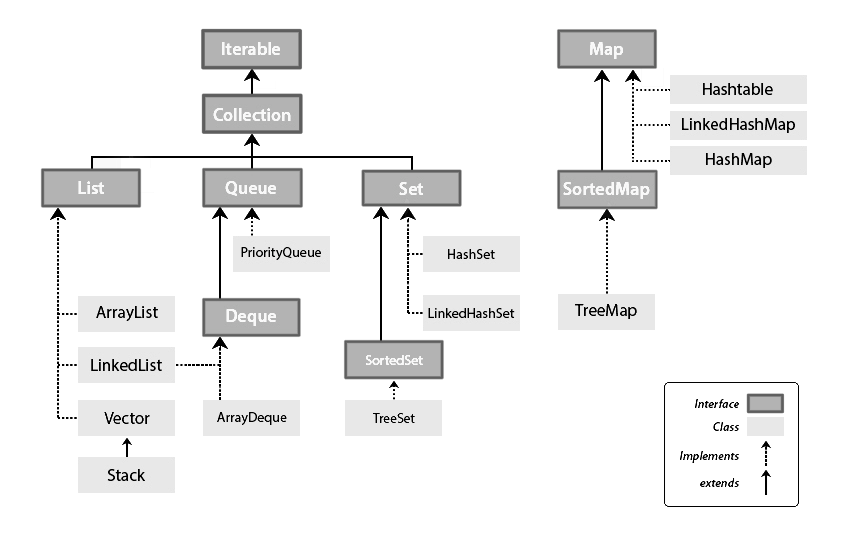
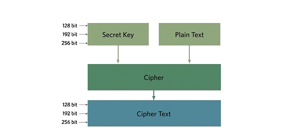
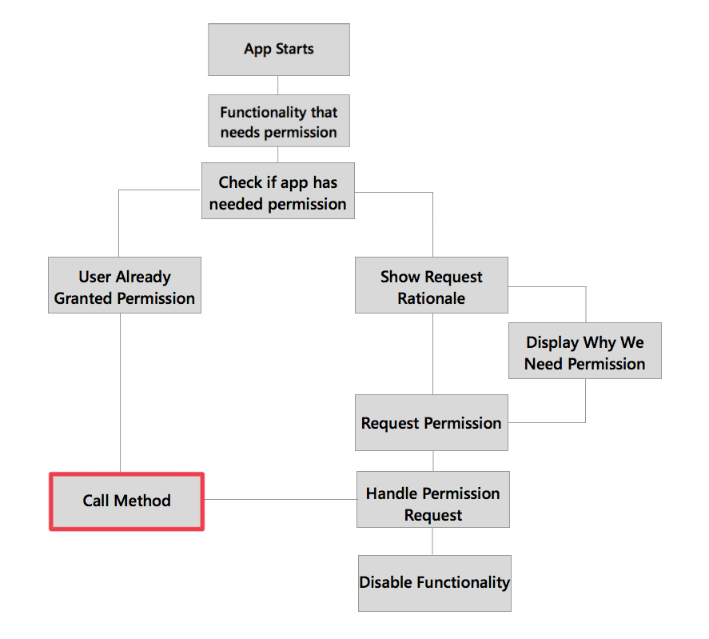

<style>
  table {
    width: 100%
    }
  td {
    vertical-align: center;
    text-align: center;
  }
  table.inputT{
    margin: 10px;
    width: auto;
    margin-left: auto;
    margin-right: auto;
    border: none;
  }
  input{
    text-align: center;
    padding: 0px 10px;
  }
</style>

# Android Webview 與 javascript 通信

Android 利用 Webview 提供給 HTML 和 javascript 通信。Java 方法通過一個特殊的類暴露給 Javascript。這方法使用 @JavascriptInterface 註釋進行。

## Android 部分

WebAppInterface 用於創建接口函數的類

```java
public class WebAppInterface {
  Context mContext;
  // 實例化接口並設置 Context
  WebAppInterface(Context c) {
    mContext = c;
  }
  // 從網頁顯示彈出窗口
  @JavascriptInterface
  public void showToast(String toast) {
    Toast.makeText(mContext, toast, Toast.LENGTH_SHORT).show();
  }
}
````

將網絡權限添加到 AndroidManifest.xml

```xml
<uses-permission android:name="android.permission.INTERNET" />
```

創建了這個項目 content_main.xml 文件，並使用 Basic Activity 作為主要活動添加 webview。

```xml
<WebView xmlns:android="http://schemas.android.com/apk/res/android"
  android:id="@+id/webview"
  android:layout_width="fill_parent"
  android:layout_height="fill_parent"
/>
```

創建 UI Webview 的主線程

```java
// 創建 mWebview 後應激活以下功能
WebView myWebView = (WebView) findViewById(R.id.webview);
  mWebView.addJavascriptInterface(new WebAppInterface(this), "JsBridge");
  mWebView.loadUrl("http://www.google.com");
```

第一個參數是帶有上下文的接口類，後者是變量在 Javascript 中使用的名稱 (區分大小寫)。

## Javascript 部分

```js
<input type="button" value="你好" onClick="showAndroidToast('你好 Android!')" />
<script type="text/javascript">
function showAndroidToast(toast) {
  if(typeof JsBridge !== "undefined" && JsBridge !== null) {
    JsBridge.showToast(toast);
  } else {
    alert("不能夠在網頁視圖中查看");
  }
}
</script>
```

在 Javascript 中有一個名為 JsBridge 的全局對象及來自 addJavascriptInterface 的方法。該對象具有接口，在本例中為 showToast(String toast)。 if 語句用於檢查 JsBridge 的名字對像是否已設置。有了這個 if 語句，如果 JsBridge 不存在，javascript會跳出函數，該網頁可以從其他瀏覽器使用以及不存在 JsBridge 界面的地方。


用 Android 管控 Webview 的 Storage 位置例子如下:

```java
public void readWebviewStorage(final String key)
{ 
  String cmd = "javascript:window.localStorage.getItem('" + key + "')";
  contentView.evaluateJavascript(cmd, new ValueCallback<String>(){
				 @Override
						public void onReceiveValue(String content)
						{
      // 返回 content 作需要的處理
						}
			});
}

public void writeWebviewStorage(final String key, final String content)
{
		String cmd = "javascript:window.localStorage.setItem('" + key + "'," + content + ")";
		contentView.evaluateJavascript(cmd, null);
  // null 為預設值，在找不到返回數值時返回。
}
```

注意: 要在 UI 線程或主線程下執行


# Dialog (對話方塊)

對話方塊是一個小型視窗，可提示使用者做決定或輸入其他資訊。對話方塊不會填滿螢幕，通常用於強制回應事件。

```java
public void openDialog() {
  final Dialog dialog = new Dialog(context);
  dialog.setContentView(R.layout.dialog_demo);
  dialog.setTitle(R.string.dialog_title);
  dialog.show();
}
```

創建 XML 佈局文件 dialog_demo.xml 並創建 UI 設計。

```xml
<?xml version="1.0" encoding="utf-8"?>
<RelativeLayout
    xmlns:android="http://schemas.android.com/apk/res/android"
    android:layout_width="match_parent"
    android:layout_height="wrap_content">

    <TextView
        android:id="@+id/dialog_info"
        android:layout_width="match_parent"
        android:layout_height="wrap_content"
        android:padding="10dp"
        android:text="@string/dialog_text"/>

    <LinearLayout
        android:layout_width="match_parent"
        android:layout_height="40dp"
        android:layout_below="@id/dialog_info">

        <Button
            android:id="@+id/dialog_cancel"
            android:layout_width="0dp"
            android:layout_height="match_parent"
            android:layout_weight="0.50"
            android:background="@color/dialog_cancel_bgcolor"
            android:text="Cancel"/>

        <Button
            android:id="@+id/dialog_ok"
            android:layout_width="0dp"
            android:layout_height="match_parent"
            android:layout_weight="0.50"
            android:background="@color/dialog_ok_bgcolor"
            android:text="Agree"/>
    </LinearLayout>
</RelativeLayout>
```

注意 strings.xml 和 colors.xml 中的字符和顏色可以很容易改變。

## AlertDialog (建立快訊對話方塊)

可以使用 AlertDialog 並使用其 Builder 類構造一個構造函數，該構造函數僅接受 Context，因為對話框將從傳入的 Context 繼承正確的主題，但可以將特定主題資源指定為第二個參數。

```java
AlertDialog.Builder builder1 = new AlertDialog.Builder(context);
builder1.setTitle("對話框的標題");
builder1.setMessage("在這裡寫下你的信息.");
builder1.setCancelable(true);
// 指定偵聽器允許在關閉對話框之前執行操作。單擊對話框按鈕時，對話框會自動關閉。
builder1.setPositiveButton(
  "確認",
  new DialogInterface.OnClickListener() {
    public void onClick(DialogInterface dialog, int id) {
      dialog.cancel();
    }
});

builder1.setNegativeButton(
  "取消",
  new DialogInterface.OnClickListener() {
    public void onClick(DialogInterface dialog, int id) {
      dialog.cancel();
    }
});

AlertDialog alert11 = builder1.create();
alert11.setIcon(android.R.drawable.ic_dialog_alert)
alert11.show();
```

如果你不在主線程中

```java
runOnUiThread(new Runnable() {
  @Override
  public void run() {
    if (!isFinishing()){
      new AlertDialog.Builder(YourActivity.this)
        .setTitle("Your Alert")
        .setMessage("Your Message")
        .setCancelable(false)
        .setPositiveButton("ok", new OnClickListener() {
        @Override
          public void onClick(DialogInterface dialog, int which) {
            // Whatever...
          }
        }).show();
    }
  }
});
```

創建 XML 佈局文件用於 AlertDialog 與對話框示例相同

```java
public Dialog onCreateDialog(Bundle savedInstanceState) {
  AlertDialog.Builder builder = new AlertDialog.Builder(getActivity());
  LayoutInflater inflater = requireActivity().getLayoutInflater();
  builder.setView(inflater.inflate(R.layout.dialog_demo, null))
    .setPositiveButton("確認", new DialogInterface.OnClickListener() {
      @Override
      public void onClick(DialogInterface dialog, int id) {
        dialog.cancel();
      }
    })
    .setNegativeButton("取消", new DialogInterface.OnClickListener() {
      public void onClick(DialogInterface dialog, int id) {
        dialog.cancel();
      }
    });
  return builder.create();
}
```

# 資料排序




|Array (數組)|Stack (堆棧)|Queue (隊列)|
|:---:|:---:|:---:|
|插入和刪除可以在任何指定的索引處進行。|插入和刪除僅發生在稱為頂部的列表的一端。|插入和刪除僅分別從後部和前部進行。|
|是一種線性數據結構，其中可以訪問任何指定的索引。可以用來實現棧和隊列。|基於LIFO原則的，即後進先出。|基於FIFO原則的，即先進先出。|
|有不同的類型維度，例如 1D、2D 等。|Stack 沒有特定類型。|有幾種可用的隊列類型，例如循環隊列、優先級隊列。|
|包含相同數據類型的元素。|可以包含不同類型的元素。|可以包含不同類型的元素|

## List

### ArrayList

List 裡頭可能是單一基本型別如 int, String。無論是對基本型別或自訂的類別作排序我們都可以透過  - Collections.sort(List l, Comparator c)
方法來做排序而其中的 Comparator 就是排序的關鍵。


```java
List<StringIntPair> list = new ArrayList<StringIntPair>();
   list.add(new StringIntPair("ab", 5));
   list.add(new StringIntPair("ca", 3));
   list.add(new StringIntPair("aa", 2));
   list.add(new StringIntPair("db", 4));
   list.add(new StringIntPair("bc", 1));


// 依 string 排序
Collections.sort(list, new Comparator<StringIntPair>() {
    public int compare(StringIntPair o1, StringIntPair o2) {
      return o1.getString().compareTo(o2.getString());
    }
});

// 依Integer排序
Collections.sort(list, new Comparator<StringIntPair>() {
   public int compare(StringIntPair o1, StringIntPair o2) {
     return o2.getInteger()-o1.getInteger();
   }
});
```


## Map

### HashMap

把資料的 (key, value) 放入 HashMap 以後要針對特定的 key 取得 value 是非常簡單的有效的方法。

HashMap 已經達到可以利用 key 值迅速取得 value。但是如果要印出所有資料卻又不知道 key 值時。只好利用HashMap 的 entrySet() 方法取得所有資料。然後把這些資料匯入 List 中做處理
只要資料匯入 List 後就可以依照 key 或 value 排序列印。

```java
HashMap<String, Integer> transcript;

transcript = new HashMap<String, Integer>();
// 加入資料
  transcript.put("Alex", 95);
  transcript.put("Bibby", 70);
  transcript.put("Charlie", 85);
  transcript.put("David", 75);
// 取出資料
  int value = transcript.get("Bibby");

// 想依 key 列出所有資料，先將所有HashMap 裡的 entry 放入 List
List<Map.Entry<String, Integer>> list_Data = new ArrayList<Map.Entry<String, Integer>>(transcript.entrySet());

// 依 key 排序並傳回
Collections.sort(list_Data, new Comparator<Map.Entry<String, Integer>>(){
  public int compare(Map.Entry<String, Integer> entry1, Map.Entry<String, Integer> entry2){
    return (entry1.getKey().compareTo(entry2.getKey()));
  }
});

```

### TreeMap

TreeMap 會自動將存入的 key 做排序，若是想要存入 Map 並有排序的話，TreeMap 較好用。而 TreeMap 也可使用自定的排序方法。

```java
TreeMap(Comparator<? super K> comparator);
```

若有指定compartor。put 進去的鍵值對會根據 comparator 的排序規則對 key 進行排序從而進行存儲。如不提供 comparator，那麼 key 就使用自然排序。


## Set

### HashSet


HashSet 是 實作 Set 介面的物件，Set 容器中的物件都是唯一的。所以 HashSet 是一個沒有重覆元素的集合。另外，它是由 HashMap 實現的，不保證元素的順序，而且 HashSet 允許使用 null 元素。


```java
Set hashset = new HashSet<String>();

// 向 hashset 中添加一個字符
hashset.add('a');
// 向 hashset 中添加一個數組
int[] abc = {10,11,12};
hashset.add(abc);
// 向 hashset 中添加一個自定義對象
Cat cat1=new Cat("asd", 2);
hashset.add(cat1);
```


# Shared Preferences

在 Android 中設計應用程式時，若想要儲存簡單資料，可使用 android.content.SharedPreferences 類別，儲存如帳號、設定、上一次登入時間、遊戲關卡或電子郵件等，好讓程式在下一次執行時可讀取到這些上一次儲存下來的資料。資料的儲存格式是 XML 檔，儲存在 Android 手機中每個程式都會擁有的一個專用目下錄。

 - SharedPreferences 以 Map 形式簡單的配置參數。

## 寫入資料

寫資料時應使用 SharedPreferences.Editor 這個編輯器介面，可由 edit() 方法取得 Editor 物件，putXX 方法寫入設定值，有 putString 方法為寫入字串設定值，使用 putInt 方法寫入整數設定值，以此類推，還有 putBoolean、putFloat、putLong 與 putStringSet 等方法可取得對應資料型態的設定值。

在 Activity 中寫入資料的片段程式碼如下：

參數的值與其說明如下：

 - MODE_PRIVATE
   - 只允許本應用程式內存取，這是最常用參數。
 - MODE_MULTI_PROCESS
   - 允許多個行程同時存取這個設定檔，要指定這個參數才允許多行程同時存取設定檔。


```java
// 步驟1：創建一個 SharedPreferences 對象 
SharedPreferences sharedPreferences= getSharedPreferences("data",Context.MODE_PRIVATE);  
// 步驟2： 實例化SharedPreferences.Editor對象 
SharedPreferences.Editor editor = sharedPreferences.edit();  
// 步驟：寫入獲取過來的值文件 
  editor.putString("姓名", "Tom");  
  editor.putInt("年齡", 28);  
  editor.putBoolean("結婚",false);
// 步驟：寫入獲取的圖片
ByteArrayOutputStream baos2 = new ByteArrayOutputStream();
  ((BitmapDrawable) getResources().getDrawable(R.drawable.lanbojini)).getBitmap().compress(Bitmap.CompressFormat.JPEG, 100, baos2);
String imageBase64 = Base64.encodeToString(baos2.toByteArray(), Base64.DEFAULT);
  editor.putString("結婚圖片", imageBase64);
// 步驟4：提交
  editor.commit();
```

## 讀取資料

使用 SharedPreferences 的方法 getXX 方法讀取先前已寫入的設定值，getString 方法為讀取字串設定值，使用 getInt 方法讀取整數設定值，以此類推，還有 getBoolean、getFloat、getLong 與 getStringSet 等方法可取得對應資料型態的設定值。利用 getSharedPreferences() 方法先取得物件後，再讀取所需的設定值，如下程式片段：


```java
SharedPreferences pref = getSharedPreferences("test", MODE_PRIVATE);
String userid = pref.getString("USER", "");
```

getString 方法的第二個參數是預設值 (default)，當讀取不到或設定檔內無該設定值時，會傳回這個預設值，本例預設是空字串。

## 刪除指定數據

```java
  editor.remove("name");
  editor.commit();
```

## 清空數據

```java
  editor.clear();
  editor.commit();
```

# JSON

JSON 代表 JavaScript 對象符號。它是一個獨立的數據交換格式，是 XML 的最佳替代品。

## JSON 元素

JSON文件包含許多組件。下表是定義一個 JSON 文件及其說明的組件：

|組件|說明|
|:---:|:---:|
|Array|方括號（[]）表示 JSON 數組|
|Objects|花括號（{}）表示 JSON 對象|
|Key|Object 中包含一個鍵，這是一個字符串。鍵 / 值對組成一個 JSON 對象|
|Value|每個鍵的值，可能是字符串，整數或 double 等|


## JSON - 解析

解析一個 JSON 對象，需要創建流的  JSONObject 對象，並指定包含 JSON數據給它一個字符串。其語法是：


```java
String in;
JSONObject reader = new JSONObject(in);
```

|組件|返回值|
|:---:|:---:|
|get(String name)|對象類型的形式|
|getBoolean(String name)| bool|
|getDouble(String name)|double |
|getInt(String name)|int|
|getLong(String name)|long|
|length()|對象的名稱 / 值映射關係的數量|
|names()|包含此對象的字符串名稱的數組。|


# Base64

Base64 是一種能將任意 Binary 資料用 64 種字元組合成字串的方法，而這個 Binary 資料和字串資料彼此之間是可以互相轉換的，十分方便。在實際應用上，Base64 除了能將 Binary 資料可視化之外，也常用來表示資料加密過後的內容。

## 編碼代碼


```java
public void encodeImage(Bitmap bitmap){
  ByteArrayOutputStream baos = new ByteArrayOutputStream();   bitmap.compress(Bitmap.CompressFormat.PNG, 40, baos); 
// 參數如果為 100 就不壓縮，現為 40
  byte[] bytes = baos.toByteArray();
  String strbm = Base64.encodeToString(bytes,Base64.DEFAULT);
}
```

## 解碼代碼

直接用 Base64 解碼

```java
public void sendImage(String bmMsg){
  byte [] input = Base64.decode(bmMsg, Base64.DEFAULT);
  Bitmap bitmap = BitmapFactory.decodeByteArray(input, 0, input.length);
}
```

網頁 img src 下取 Base64 資料

```java
public Bitmap stringToBitmap(String string) {
  Bitmap bitmap = null;
  try {
    byte[] bitmapArray = Base64.decode(string.split(",")[1], Base64.DEFAULT);
    bitmap = BitmapFactory.decodeByteArray(bitmapArray, 0, bitmapArray.length);
  } catch (Exception er) {
    er.printStackTrace();
  }
  return bitmap;
}
```

注意: 因編碼後的圖片會有 "data:image/*;base64," 的標識，在進行解碼時需要去掉這一部分，否則會導致解碼失敗。


# 加密、解密

## AES (Advanced Encryption Standard)

AES 的全稱是 Advanced Encryption Standard，是高級加密標準。它的出現主要是形容在加密算法上，因為知道 DES 算法的密鑰長度是 56Bit，因此算法的理論安全強度是 2 的 56 次 方。

所有對稱加密密碼都使用相同的密鑰進行加密和解密。 這意味著從某種意義上說，發送者和接收者都必須具有相同的密鑰。 通過使用 128 位、192 位或 256 位的加密密鑰，每次加密和解密都具有 128 位數據塊。用來轉換的純文本首先轉換為 Cipher，然後輸出為 128、192 和 256 的密文位。



```java
try {
  keyGenerator = KeyGenerator.getInstance("AES");
    keyGenerator.init(256);
    secretKey = keyGenerator.generateKey();
  } catch (Exception er)    
  {er.printStackTrace();}
}
```

現在代碼中使用 IV（初始化向量）。 這是 AES 加密中的一個可選部分，但使用起來更好。 將它與 SecureRandom 類一起使用。

```java
byte[] IV = new byte[16];
SecureRandom random;
  random = new SecureRandom();
  random.nextBytes(IV);
```

## 加密方式

```java
public static byte[] encrypt(byte[] plaintext, SecretKey key, byte[] IV) throws Exception {
  SecretKeySpec keySpec = new SecretKeySpec(key.getEncoded(), "AES");
  IvParameterSpec ivSpec = new IvParameterSpec(IV);
  Cipher cipher = Cipher.getInstance("AES");
    cipher.init(Cipher.ENCRYPT_MODE, keySpec, ivSpec);
  byte[] cipherText = cipher.doFinal(plaintext);
  return cipherText;
}
```

## 解密方法

```java
public static String decrypt(byte[] cipherText, SecretKey key, byte[] IV) {
try {
  SecretKeySpec keySpec = new SecretKeySpec(key.getEncoded(), "AES");
  IvParameterSpec ivSpec = new IvParameterSpec(IV);
  Cipher cipher = Cipher.getInstance("AES");
    cipher.init(Cipher.DECRYPT_MODE, keySpec, ivSpec);
  byte[] decryptedText = cipher.doFinal(cipherText);
    return new String(decryptedText);
  } catch (Exception er) 
  {er.printStackTrace();} 
  return null;
}
```

### 應用例子

```java
byte[] encrypt;

btn1.setOnClickListener(new View.OnClickListener() {
  @Override public void onClick(View v) {
  try { 
    encrypt = encrypt(et.getText().toString().getBytes(), secretKey, IV);
    String encryptText = new String(encrypt, "UTF-8");
      tv1.setText(encryptText);
  } catch (Exception e)     
  {e.printStackTrace();}
  } 
});

btn2.setOnClickListener(new View.OnClickListener() {
  @Override public void onClick(View v) {
  try { 
    String decrypt = decrypt(encrypt, secretKey, IV);
      tv2.setText(decrypt);
    } catch (Exception e)  
    {e.printStackTrace();}
  } 
});
```

# 權限


要加權限在 AndroidManifest.xml 文件





|函數|描述|
|:---:|:---:|
|ActivityCompat.requestPermissions|申請可以通過這個方法，調用後會主動提出一個權限提示用戶授權申請|
|ActivityCompat.shouldShowRequestPermissionRationale|如果之前申請請求過此權限，則此方法將返回 true。如果設備禁止應用具有此權限，則此方法將返回 false。|
|onRequestPermissionsResult|當應用請求時，系統將向用戶提供一個對話框。當用戶請求時，系統將調用應用程序的 onRequestPermissionsResult() 方法，向其顯示用戶請求，處理場景。|

```xml
<?xml version="1.0" encoding="utf-8"?>
<manifest xmlns:android="http://schemas.android.com/apk/res/android"
    package="com.photoeffect"
    android:versionCode="1"
    android:versionName="1.0" >

<uses-permission android:name="android.permission.WAKE_LOCK" />
<uses-permission android:name="android.permission.ACCESS_NETWORK_STATE" />
<uses-permission android:name="android.permission.INTERNET" />
<uses-permission android:name="android.permission.ACCESS_WIFI_STATE" />
<uses-permission android:name="android.permission.READ_EXTERNAL_STORAGE" />
<uses-permission android:name="android.permission.WRITE_EXTERNAL_STORAGE" />

<uses-permission android:name="android.permission.ACCESS_FINE_LOCATION" />
<uses-permission android:name="android.permission.ACCESS_LOCATION_EXTRA_COMMANDS" />
<uses-permission android:name="android.permission.ACCESS_COARSE_LOCATION" />
<uses-permission android:name="com.example.towntour.permission.MAPS_RECEIVE" />
<uses-permission android:name="android.permission.CALL_PHONE" />
<uses-permission android:name="android.permission.READ_PHONE_STATE" />
<uses-permission android:name="com.google.android.providers.gsf.permission.READ_GSERVICES" />

<application ...
</manifest>
```

## 讀取，及寫入權限例子

```java
private void checkPermission()
{
  if (ContextCompat.checkSelfPermission(this, 
     Manifest.permission.WRITE_EXTERNAL_STORAGE) != PackageManager.PERMISSION_GRANTED
     && ContextCompat.checkSelfPermission(this,
     Manifest.permission.READ_EXTERNAL_STORAGE) != PackageManager.PERMISSION_GRANTED) {
       ActivityCompat.requestPermissions(this,
         new String[] {Manifest.permission.WRITE_EXTERNAL_STORAGE,
         Manifest.permission.READ_EXTERNAL_STORAGE}, 123);
		}
}
```


