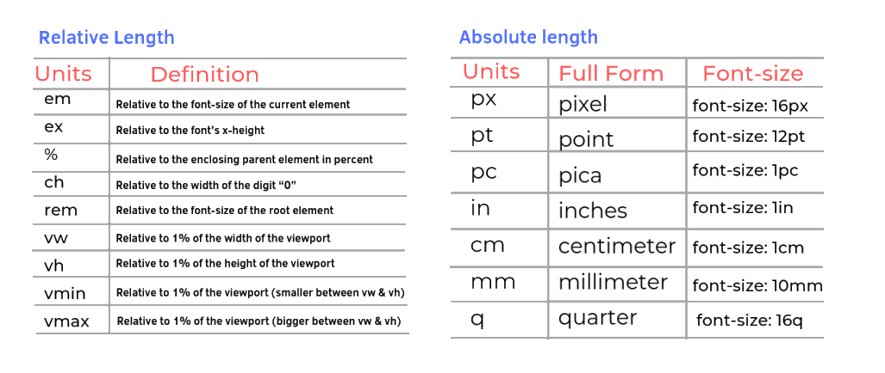

<style>
  table {
    width: 100%
    }
  td {
    vertical-align: center;
    text-align: center;
  }
  table.inputT{
    margin: 10px;
    width: auto;
    margin-left: auto;
    margin-right: auto;
    border: none;
  }
  input{
    text-align: center;
    padding: 0px 10px;
  }
</style>


# CSS 規範


## CSS 單位尺寸



### vh & vw

vh 代表的是 view height，也就是螢幕可視範圍高度的百分比；vw 表示的是 view width，也就是螢幕可是範圍寬度的百分比。
這兩個單位的使用上和百分比很類似，當填100vh 和 100vw 時，意思就是這個 div 要是整個螢幕的可視範圍，瀏覽器全部範圍都被選取，而且很重要的是，這個區塊會隨著瀏覽器的縮放而改變。

### % 百分比

％ 值是相對於某個數值的百分比，％ 的基準值為何，要看屬性的特性決定（比方 width 跟 height 的 % 基準是父層的 width 跟 height ; 例如 line-height 則是以元素本身的文字行高為基準）。％是生活中常用到的計算，大家應該都很熟悉。


## 對齊元件於中心位置


```html
<div class="center">
<p>The text within the div is centered horizontally.</p>
</div>
```

text-align 屬性在 div 中水平居中文本，並使用值 *center* 對其進行定義。

```css
.center {
  border: 5px solid #FFFF00;
  text-align: center;
}
```

display 屬性定義為 *flex* 以使 div 成為 flex 容器，並將 justify-content 屬性定義為 *center”*。

```css
.center {
border: 5px solid #FFFF00;
  display: flex;
  justify-content: center;
}
```


padding 只需設置兩個值。 第一個值將設置頂部和底部填充。 第二個將設置左右填充。 由於要使文本垂直居中，因此第一個值可以是任何正長度或百分比值。 第二個值應該是 0。


```css
.center {
  border: 5px solid #FFFF00;
  padding: 50px 0;
}
```

line-height 屬性設置為與容器元素的高度相等的值，使文本在 div 中垂直居中。


```css
.center {
border: 5px solid #FFFF00;
line-height: 150px;
height: 150px;
}
```

以人上方法僅適用於單行文本。 如果 div 中有多行文本，則必須定義更多屬性。

inline-block 屬性，用以段落在 div 內自然流動。 然後將 *line-height* 屬性設置為 *normal*，將 *vertical-align* 屬性設置為 *middle*。 這將確保 div 內的文本垂直居中，無論是一行文本還是多行。

```css
.center {
  border: 5px solid #FFFF00;
  line-height: 150px;
  height: 150px;
}
.center p {
  display: inline-block;
  line-height: normal;
  vertical-align: middle;
}
```

transform 屬性，能真正使 div 水平和垂直居中。具體來說，希望將 div 從其當前位置向左和向上移動 50%。 這將告訴瀏覽器將 div 的中心放在頁面的中心。

```css
.parent {
  background: #CCCCCC;
  height: 200px;
  width: 200px;
  position: relative;
}
.child {
  background: #FFFF00;
  position: absolute;
  top: 50%;
  left: 50%;
  transform: translate(-50%, -50%);
}
```

Flexbox 屬性 在 div 中將 div 居中。  也是一種很好的方法，因為它具有響應性並且不需要邊際計算，但需要記住一些額外的步驟。

要使用 Flexbox 將 div 水平和垂直居中，需要將 HTML 和 body 的高度設置為 100%。 也可以將父容器的高度設置為 100%，如果您希望它佔據整個視口，即使它已調整大小。

```css
html, body { 
  height: 100%;
}
.parent {
  height: 200px;
  background: #CCCCCC;
  display: flex;
  align-items: center;
  justify-content: center;
}
.child {
  background-color: #FFFF00;
  width: 100px;
  height: 100px;
}
```

## var

第一個步驟是宣告變數，可以將本範例中會運用到的變數都放在 :root 選取器內，並且使用 **--自訂名稱** 作為屬性的方式來宣告變數。


```css
:root {
  --primary: Aquamarine;
  --background-color: Teal;
}
```

接下來到取值的階段，取值時前方依然是撰寫需要套用的樣式屬性，後方再接著使用 var (--變數名稱) 來套用。

```css
body {
  background: var(--background-color);
}
```

注意：變數前要有 [--] 符號。CSS 的變數是可以再次改變的，且改變的方式也是依據 CSS 「後者覆蓋前者」的特性。


## calc

CSS 中更有一個神奇的運算方法 calc，此函式可以無視讓不同單位的數值直接做運算，如百分比與絕對單位運算（例如 100% - 30px）。CSS Variables 也同樣能夠搭配此方法產生新的值。


```css
.box-1 {
  width: calc(100% - var(--size));
}
```

注意：加減乘除 [+-*/] 間要有空格分開。

## CSS 偽類

偽類是基於元素的特徵而不是他們的 id、class、屬性或者者內容。 一般來說，元素的特徵是不可以從 DOM 上推斷得到的，而且其是動態的，當客戶和 DOM 進行交互的時候，元素可以取得或者者失去一個偽類。

<<<<<<< HEAD
|句法|解釋|
|:---:|:---:|
|:link|選擇未訪問的連結|
|:visited|選擇已訪問的連結|
|:hover|選擇滑鼠指針浮動在其上的元素|
|:active|選擇活動的連結|
|:focus|選擇獲取焦點的輸入欄位|
=======
|句法|CSS|描述|
|:---:|:---:|:---:|
|E:link|CSS1|設置超鏈接a在未被訪問前的樣式|
|E:visited|CSS1|設置超鏈接a在其鏈接地址已被訪問過時的樣式|
|E:hover|CSS1/2|設置元素在其鼠標縣停時的樣式。|
|E:active|CSS1/2|設置元素在披用戶激活（在鼠標點擊與釋放之間發生的事件）時的樣式|
|E:focus|CSS1/2|設置元素在成為輸入焦點（該元素的onfocus事件發生）時的樣式|
|E:lang(fr)|CSS2|匹配使用特殊語言的E元素|
|E:not(s)|CSS3|匹配不含有S選擇符的元素E|
|E:root|CSS3|匹配E元素在文檔的根元素|
|E:first-child|CSS2|匹配父元素的第一個子元素E|
|E:last-child|CSS3|匹配父元素的最後一個子元素在|
|E:only-child|CSS3|匹配父元素僅有的一個子元素E|
|E:nth-child(n)|CSS3|匹配父元素的第n個子元素E|
|E:nth-last-child(n)|CSS3|匹配父元素的倒數第n個子元素E|
|E:first-of-type|CSS3|匹配同類型中的第一個同級兄弟元素E|
|E:last-of-type|CSS3|匹配同類型中的最後一個同級兄弟元素E|
|E:only-of-type|CSS3|匹配同類型中的唯一的一個同級兄弟元素E|
|E:nth-of-type(n)|CSS3|匹配同類型中的第n個同級兄弟元素E|
|E:nth-last-of-type(n)|CSS3|匹配同類型中的倒數第個同級兄弟元素E|
|E:empty|CSS3|匹配沒有任何子元素（包括text節點）的元素E|
|E:checked|CSS3|匹配用戶界面上處於選中狀態的元素E（用於input type為radio與checkbox時）|
|E:enabled|CSS3|匹配用戶界面上處於可用狀態的元素E|
|E:disabled|CSS3|匹配用戶界面上處於禁用狀態的元素E|
|E:target|CSS3|匹配相關URL指向的E元素|
|＠page:first|CSS2|設置頁面容器第一頁使用的樣式。 僅用於＠page規則|
|＠page:left|CSS2|設置頁面容器位於裝訂線左邊的所有頁面使用的樣式。 僅用於＠page規則|
|＠page:right|CSS2|設置頁面容器位於裝訂線右邊的所有頁面使用的樣式。 僅用於＠page規則|
>>>>>>> 153a0b88745099e39c3447cd66a30ae4b259a723

## CSS 偽元素

偽元素用於創立少量不在文檔樹中的元素，並為其增加樣式。 比方說，我們可以通過 :before 來在一個元素前添加少量文本，並為這些文本增加樣式。 儘管可以看到這些文本，但是這些文本實際上不在文檔樹中。

|句法|CSS|描述|
|:---:|:---:|:---:|
|E:first-letter/<br>E::first-letter|CSS1/3|設置對象內的第一個字符的樣式。|
|E:first-line/<br>E:first-line|CSS1/3|設置對象內的第一行的樣式|
|E:before/<br>E::before|CSS2/3|設置在對象前（依據對象樹的邏輯結構）發生的內容。 用來和 *content* 屬性一起使用|
|E:after/<br>E::after|CSS2/3|設置在對像後（依據對象樹的邏輯結構）發生的內容，用來和 *content* 屬性一起使用|
|E:placeholder|CSS3|設置對象文字佔位符的樣式|
|E::selection|CSS3|設置對象披選擇時的顏色|

<<<<<<< HEAD
注意：雖然說偽元素很好用，但偽元素的內容實際上不存在網頁裡 ( 如果打開瀏覽器的開發者工具，是看不到內容的 )，所以如果在裡頭塞了太多的重要的內容，反而會影響到 SEO 的成效，因此對於使用偽元素的定位，還是當作「輔助」性質會比較恰當。
=======


## 選擇器


|選擇器|例子|描述|
|:---:|:---:|:---:|
|.class|.intro|選擇class＝＂intro＂的所有元素。|
|＃id|＃firstname|選擇id＝＂firstname＂的所有元素。|
|＊|*|選擇所有元素。|
|element|p|選擇所有＜p＞元素。|
|element，element| div，p|選擇所有＜div＞元素和所有＜p＞元素。
|element element|div p|選擇＜div＞元素內部的所有＜p＞元素。|
|element＞element|div＞p|選擇父元素為＜div＞元素的所有＜p＞元素。|
|element＋element|div＋p|選擇緊接在＜div＞元素之後的所有＜p＞元素。|
>>>>>>> 153a0b88745099e39c3447cd66a30ae4b259a723
