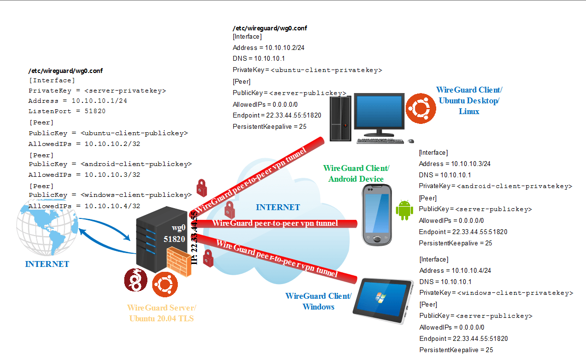

<style>
  table {
    width: 100%
    }
  td {
    vertical-align: center;
    text-align: center;
  }
  table.inputT{
    margin: 10px;
    width: auto;
    margin-left: auto;
    margin-right: auto;
    border: none;
  }
  input{
    text-align: center;
    padding: 0px 10px;
  }
  iframe{
    width: 100%;
    display: block;
    border-style:none;
    overflow:hidden;
  }
</style>

# WireGuard 简介

WireGuard 通过添加一个（或多个）网络接口来工作，一般为 wg0、wg1、wg2、wg3 等。所有接口可用特定 wg 工具进行配置。也可充当 VPN 接口。

Wireguard 是对等 VPN。根据配置，对等端 (<font color="#FF1000">peer</font>) 可以充当服务器。每个对等端设备上创建虚拟网络接口来工作。对等端通过交换和验证公钥，类似于使用 SSH 公钥模式来相互认证。並将加密隧道 IP 地址与公钥和远程端点相关联。


## 安裝教学

[Wireguard 的 deepin 網上资源](https://github.com/deepin-community/wireguard)

更新系統

```shell
$ sudo apt-get update && sudo apt-get upgrade -y
```

下載並解壓

```shell
$ cd src
$ make
```
除了需要安裝 C 编译器及相關的 libc 之外，没有其它依赖项目。

```shell
$ sudo make install
```

## 设置虚拟私人网路 VPN

### 公私钥生成

WireGuard 需要 base64 编码的公钥和私钥。可以使用 wg 实用程序生成步骤如下。

#### 生成服务器端私钥 (<font color="#FF0010">genkey</font>)

```shell
$ cd /etc
$ sudo chmod 777 /etc/wireguard
$ cd /etc/wireguard
$ umask 077
$ wg genkey > privatekey
```

创建私钥后可以从私钥中导出公钥如下。

#### 生成对等端公钥 (<font color="#FF1000">pubkey</font>)

```shell
$ cd /etc
$ sudo chmod 777 /etc/wireguard
$ umask 077
$ cd /etc/wireguard
$ wg pubkey < privatekey > publickey
```

**注意**：服务端及对等端也要生成各自的加密锁匙用作相互交换資料。

## 命令行添加新接口

可以通过 ip-link 添加新接口，它自动处理模块加载。

```
$ ip link add dev wg0 type wireguard
```

## 命令行添加 IP 地址

可以使用 ifconfig 或 ip-address 分配 IP 地址

```
$ ip address add dev wg0 192.168.2.1/24
```

### 配置文件 myconfig.conf 格式示例

此示例用作编写配置文件的模型，遵循类似 INI 的语法。 在 “#” 之后并包含 “#” 的字符被视为注释会被忽略。可使用任文本编辑器创建配置文件 /etc/wireguard/wg0.conf。

编辑設定檔案配置如下：

```
$ vi wg0.conf
```

#### 测试纲卡

```
sudo lslw -class network -short
```

設定檔案配置内容如下：

```
[Interface]
PrivateKey = <服务器端私钥>
ListenPort = 51820
Address = 10.0.0.1/24
SaveConfig = false

PostUp = iptables -A FORWARD -i wg0 -j ACCEPT; iptables -t nat -A POSTROUTING -o eth0 -j MASQUERADE

PostDown = iptables -D FORWARD -i wg0 -j ACCEPT; iptables -t nat -D POSTROUTING -o eth0 -j MASQUERADE

[Peer]
PublicKey = <对等端公钥>
Endpoint = 192.95.5.67:1234
AllowedIPs = 10.0.0.2/24

[Peer]
PublicKey = <对等端公钥>
Endpoint = [2607:5300:60:6b0::c05f:543]:2468
AllowedIPs = 10.0.0.3/24
```

**注意**：对等端需要各自生成相对的私钥及公钥。可使用 cat 命令查看<font color="#FF1000">私钥</font>和<font color="#FF1000">公钥</font>文件的内容。不要把私钥与任何人共享，并且应始终保证私钥的安全。

配置文件可能包含内容解释如下：

- PublicKey 由 <font color="#FF1000">wg pubkey</font> 从私钥计算出的 base64 公钥，通常带外传输给配置文件的作者。 可以使用 sudo cat /etc/wireguard/privatekey 命令要查看私钥文件的内容。

- ListenPort 指定了 WireGuard 应当使用哪一个接口作为入站的连接。默认值为 <font color="#FF1000">51820</font>，在此处设置的值会影响到之后对应防火墙规则的设置。

- AllowedIPs 一个逗号分隔的 IP（v4 或 v6）地址列表，带有 CIDR 掩码，允许此对等端的传入流量来自这些地址，并将此对等端的传出流量定向到该地址。 可以指定包罗万象的 0.0.0.0/0 来匹配所有 IPv4 地址，也可以指定 ::/0 来匹配所有 IPv6 地址。 可以指定多次。接口的 IP v4 或 IP v6 的地址。请保留给私有网络范围内的IP地址，比如 10.0.0.0/8、172.16.0.0/12 或192.168.0.0/16。

- PresharedKey 可选的。由 <font color="#FF1000">wg genpsk</font> 生成的 base64 预共享密钥。此选项添加了一个额外的对称密钥加密层，以混合到现有的公钥加密中，以实现后量子抵抗。

- Endpoint 可选的。端点 IP 或主机名，后跟冒号，然后是端口号。 此端点将自动更新为来自对等端的正确验证数据包的最新源 IP 地址和端口。

- PersistentKeepalive 可选的。一个秒间隔，介于 1 和 65535 之间，包括多长时间向对等端发送经过身份验证的空数据包，以保持状态防火墙或 NAT 映射持久有效。 例如，如果接口很少发送流量，但它可能随时从对等方接收流量，并且位于 NAT 之后，则接口可能受益于 25 秒的持久保持连接间隔。 如果设置为 0 或“关闭”，则禁用此选项。 默认情况下或未指定时，此选项处于关闭状态。 大多数用户不需要这个。

- SaveConfig 可选的。设置为 true 时，当关闭接口时将当前配置将保存到配置文件中。

- PostUp 可选的。用於转发流量。在启动接口之前执行的命令或脚本。在例子中，在 PostUp 钩子启用 <font color="#FF1000">iptables</font> 伪装。这允许流量离开服务器，使VPN客户端可以访问互联网。可通过以下 iptables 命令方式轻松设定可访问网络的接口。

```shell
PostUp = iptables -A FORWARD -i wg0 -j ACCEPT; iptables -t nat -A POSTROUTING -o eth0 -j MASQUERADE
```
- PostDown 可选的。用於转发流量。在关闭接口之前删除 <font color="#FF1000">iptables</font> 伪装。一旦接口关闭，iptablesnat 转发规则将被删除。

```shell
PostDown = iptables -D FORWARD -i wg0 -j ACCEPT; iptables -t nat -D POSTROUTING -o eth0 -j MASQUERADE
```

**注意**：为了保证私钥的安全，应将 wg0.conf 和 privatekey 文件设置为普通用户不可读。运行命令如下。

```
$ sudo chmod 600 /etc/wireguard/{privatekey,wg0.conf}
```

### 配置防火墙规则

配置防火墙以阻止任何不需要的连接并确保的服务器安全。在此使用 iptables 的配置方案。安装 ipset，为 iptables 提供一个方便的批量地址管理工具

```shell
$ sudo apt-get install ipset
```
 
新建一个 ip 集合，添加会用到的对等端公网 IP

```shell
ipset create wgclients hash:ip
ipset add wgclients 1.2.3.4 
# WireGuard的对等端公网 IP 為 1.2.3.4
```

编写 iptables 防火墙规则，仅允许安裝的对等端连接，丢弃所有非对等的数据包。

```shell
$ iptables -A INPUT -m set --match-set wgclients src -p udp --dport 51820 -j ACCEPT
$ iptables -A INPUT -p udp -m multiport --dport 51820 -j DROP
```
保存防火墙规则

```shell
$ iptables-save
```
## 启动服务器

配置就绪后，可以启动服务器。WireGuard 有一个名为 <font color="#FF1000">wg-quick</font> 的便捷包装器，可用于启动新界面而无需进入设置细节。使用以下命令开始配置。

```shell
# 手動配置
$ sudo wg-quick up wg0 # 启动
$ sudo wg-quick down wg0 # 停止

# 系統配置
$ sudo systemctl start wg-quick@wg0 # 启动
$ sudo systemctl stop wg-quick@wg0 # 停止
$ sudo systemctl restart wg-quick@wg0 # 重启
$ sudo systemctl enable wg-quick@wg0 # 开机自启
```

## 查看当前配置

用 wg show 或 wg showconf 命令，查看当前配置。 不带参数调用 wg 默认为调用 wg show。


## 配置 WireGuard 对等端

对等端的区别在于配置文件 wg0.conf，该文件包含了本网卡自己的 IP 地址，但不包含  

- ListenPort
- PostUP
- PostDown
- SaveConfig

```
[Interface]
PrivateKey = <Peer Private Key>
Address = 10.0.0.2/32, fd86:ea04:1116::/64
```

然后在 WireGuard 对等端上配置防火墙规则。並启动 WireGuard 服务，內容可参考服务器。

### 以下例子作参考

