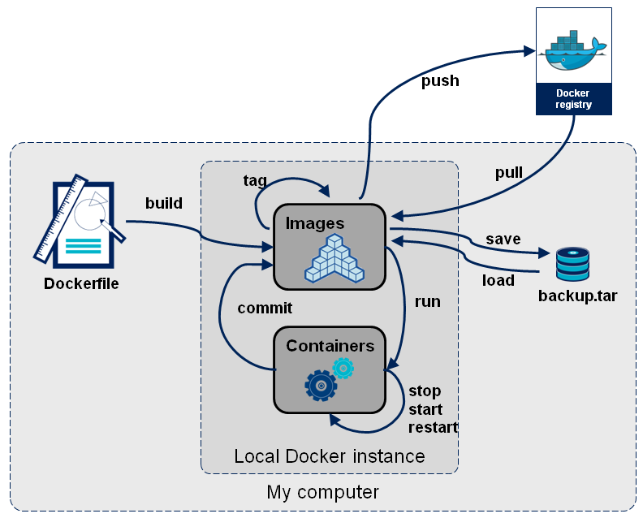
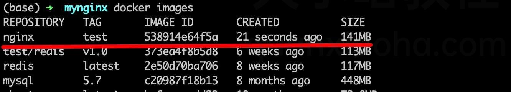
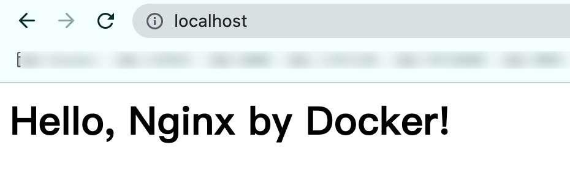

<style>
  table {
    width: 100%
    }
  td {
    vertical-align: center;
    text-align: center;
  }
  table.inputT{
    margin: 10px;
    width: auto;
    margin-left: auto;
    margin-right: auto;
    border: none;
  }
  input{
    text-align: center;
    padding: 0px 10px;
  }
  iframe{
    width: 100%;
    display: block;
    border-style:none;
    overflow:hidden;
  }
</style>

# Docker 简介

软件开发最大的麻烦事是环境配置。各计算机的环境都不相同，怎么知道软件能在那些机器跑起来？一般必须保证两件事。操作系统的设置，各种库和组件的安装都正确，软件才能运行。

**Docker** 将应用程序与该程序的依赖，打包在一个文件里面。运行这个文件，就会生成一个虚拟容器。程序在这个虚拟容器里运行，就好像在真实的物理机上运行一样。有了 Docker，就不用担心环境问题。

而且 **Docker** 的接口相当简单，可以方便地创建和使用容器，把应用放入容器。容器还可以进行版本管理、复制、分享、修改，就像管理普通的代码一样。

**Docker** 的主要用途，目前有三大类。

 - <font color="#5800FF">提供一次性的环境</font>。如测试其它的软件、持续集成的时候提供单元测试和构建的环境。

 - <font color="#5800FF">提供弹性的云服务</font>。因为 Docker 容器可以随开随关，很适合动态扩容和缩容。

 - <font color="#5800FF">组建微服务架构</font>。通过多个容器，一台机器可以跑多个服务，因此在本机就可以模拟出微服务架构。


## 以下是最基本 shell 脚本用在 deepin 下安装 docker


```
#!/bin/sh

# 将 docker-ce 添加到 Deepin Linux 仓库的 shell 脚本

# 删除旧的 docker 系统
sudo apt-get remove -y docker docker-engine docker.io containerd runc

# 安装依赖档案
sudo apt-get install -y apt-transport-https ca-certificates curl gnupg2 software-properties-common
    
# 添加 GPG 和指纹
curl -fsSL https://download.docker.com/linux/debian/gpg | sudo apt-key add -
sudo apt-key fingerprint 0EBFCD88

# 在 deepin 源列表中添加 debian 仓库
printf 'deb [arch=amd64] https://download.docker.com/linux/debian buster stable\n' \
| sudo tee /etc/apt/sources.list.d/docker-ce.list

# 更新包并安装
sudo apt-get update -y
sudo apt-get install -y docker-ce

# 将当前用户添加到 docker 用户组（可选）
sudo usermod -aG docker $(whoami)
```

## docker 的删除方法

```
sudo apt-get purge docker-ce
sudo apt-get purge docker-ce-cli
sudo rm -rf /var/lib/docker
```

### 列出 docker 信息验证是否安装成功

```
$ docker version
# 或者
$ docker info
```

### 安装完成后可进行以下测试

```
docker images
docker ps -a
```

Docker 需要用户具有 sudo 权限，为了避免每次命令都输入sudo，可以把用户加入 Docker 用户组。

```
$ sudo usermod -aG docker $USER
```

Docker 是服务器----客户端架构。命令行运行docker命令的时候，需要本机有 Docker 服务。如果这项服务没有启动，可以用下面的命令启动。

```
# service 命令的用法
$ sudo service docker start

# systemctl 命令的用法
$ sudo systemctl start docker
```

Docker 把应用程序及其依赖，打包在 image 文件里面。只有通过这个文件，才能生成 Docker 容器。image 文件可以看作是容器的模板。Docker 根据 image 文件生成容器的实例。同一个 image 文件，可以生成多个同时运行的容器实例。

image 是二进制文件。实际开发中，一个 image 文件往往通过继承另一个 image 文件，加上一些个性化设置而生成。

```
# 列出本机的所有 image 文件。
$ docker image ls

# 删除 image 文件
$ docker image rm [imageName]
```

## image 文件介绍

image 文件是通用的，一台机器的 image 文件拷贝到另一台机器，就能直接使用。为了节省时间，应尽量使用制作好的 image 文件。即使要定制，也应该基于已有的 image 文件进行加工，而不是从零开始制作。

为了方便共享，image 文件制作完成后，可以上传到网上的仓库。Docker 的官方仓库 Docker Hub 是最重要、最常用的 image 仓库。此外，出售独立制作的 image 文件也是可以的。

### 抓取官方的 image

由于 Docker 官方提供的 image 文件，都放在 library 组里面，所以它是默认的目录被省略。 格式为 NAME[:TAG|@DIGEST]。

```
$ docker image pull hello-world
```

抓取成功以后，就可以在本机看到这个 image 文件。注 hello-world 为 image 二进制文件。

### 查看下载 image 文件

```
$ docker image ls
```

### 运行这个 image 文件

```
$ docker container run hello-world
```

## container 文件介绍

image 文件生成的容器实例，是一个文件被称为 container 文件。即同时存在两个文件

  - image 文件
  - container 文件
  
而且关闭容器并不会删除容器文件，只是容器停止运行而已。

### 列出本机正在运行的容器

```
$ docker container ls
```

### 列出本机所有容器，包括终止运行的容器

```
$ docker container ls --all
```

上面命令的输出结果之中，包括容器的 ID。很多地方都需要提供这个 ID，比如终止的容器命令如下。

### 终止的容器

对于那些不会自动终止的容器，必须使用命令手动终止。而终止运行的容器文件后，依然会占据硬盘空间，需要用命令删除。

```
$ docker container kill [containID]
$ docker container rm [containerID]
```

### 释放容器空间

终止运行的容器文件，依然会占据硬盘空间，可以使用以下命令删除。

```
$ docker container rm [containerID]
```

运行上面的命令之后，再使用 *docker container ls --all* 命令，就会发现被删除的容器文件已经消失。


### 其它有用的命令


#### docker container start

- docker container run 命令是新建容器，每运行一次，就会新建一个容器。同样的命令运行两次，就会生成两个一模一样的容器文件。如果希望重复使用容器，就要使用 docker container start命 令，它用来启动已经生成、已经停止运行的容器文件。

```
$ docker container start [containerID]
```


#### docker container stop

- docker container kill 命令终止容器运行，相当于向容器里面的主进程发出 SIGKILL 信号。而 docker container stop 命令也是用来终止容器运行，相当于向容器里面的主进程发出 SIGTERM 信号，然后过一段时间再发出 SIGKILL 信号。

```
$ docker container stop [containerID]
```

- 这两个信号的差别是，应用程序收到 SIGTERM 信号以后，可以自行进行收尾清理工作，但也可以不理会这个信号。如果收到 SIGKILL 信号，就会强行立即终止，那些正在进行中的操作会全部丢失。


#### docker container logs

- 用来查看 docker 容器的输出，即容器里面 Shell 的标准输出。如果 docker run 命令运行容器的时候，没有使用 **-it** 参数，就要用这个命令查看输出。

```
$ docker container logs [containerID]
```


#### docker container exec

  - 用于进入一个正在运行的 docker 容器。如果 docker run 命令运行容器的时候，没有使用 **-it** 参数，就要用这个命令进入容器。一旦进入了容器，就可以在容器的 Shell 执行命令了。

```
$ docker container exec -it [containerID] /bin/bash
```


#### docker container cp

  - 用于从正在运行的 Docker 容器里面，将文件拷贝到本机。下面是拷贝到当前目录的写法。

```
$ docker container cp [containID]:[/path/to/file] 
```



### 权限配置

docker 进行 run 的时候如何将此容器的权限进行配置。主要是使用 --privileged 或 --cap-add、--cap-drop 来对容器本身的能力的开放或限制。

- privileged，权限全开，不利主机安全
- cap-add/cap-drop，细粒度权限设置


#### 用 --cap-add、--cap-drop 能修改的功能

下表功能选项是<font color="#FF1000">默认允许</font>的，可以删除。

|功能项|	功能描述|
|:---:|:---:|
|SETPCAP|	修改进程的权限|
|MKNOD	|使用 mknod 创建特殊文件|
|AUDIT_WRITE|	将记录写入内核审计日志|
|CHOWN	|任意更改文件 UIDs 和 GIDs 见 chown|
|NET_RAW	|使用 RAW 和 PACKET 套接字|
|DAC_OVERRIDE|绕过文件的读、写和执行权限检查|
|FOWNER|绕过对进程的文件系统 UID 与文件的 UID 进行权限匹配的检查操作|
|FSETID|	当文件被修改时，不要清除 set-user-ID 和 set-group-ID 权限位|
|KILL|	绕过发送信号的权限检查|
|SETGID|	自定义处理进程 GID 和补充 GID 列表|
|SETUID|	自定义处理进程 UID|
|NET_BIND_SERVICE|	将套接字绑定到互联网域名专用端口（端口号小于 1024）|
|SYS_CHROOT	|使用 chroot，更改根目录|
|SETFCAP|	设置文件功能|


下表<font color="#FF1000">默认未授予</font>的功能，可以手动添加。

|功能项|	功能描述|
|:---:|:---:|
|SYS_MODULE|	加载和卸载<font color="#FF1000">内核</font>模块|
|SYS_RAWIO|	执行 I / O 端口操作 iopl 和 ioperm |
|SYS_PACCT|	使用 acct，打开或关闭进程计数
|SYS_ADMIN|	执行一系列系统管理操作|
|SYS_NICE|提高进程的 nice 值 nice、setpriority 并更改任意进程的 nice 值|
|SYS_RESOURCE|	覆盖资源限制|
|SYS_TIME|	设置系统时钟 settimeofday、stime、adjtimex；设置实时硬件时钟|
|SYS_TTY_CONFIG|	使用 vhangup；在虚拟终端上使用各种特权的 ioctl 操作
|AUDIT_CONTROL|	启用和禁用内核审核；更改审核过滤器规则；检索审核状态和过滤规则|
|MAC_ADMIN|	允许 MAC 配置或状态更改。 为 Smack LSM 而实现的功能|
|MAC_OVERRIDE|	覆盖强制访问控制 MAC。 为 Smack Linux 安全模块 LSM 实现|
|NET_ADMIN|	执行各种与<font color="#FF1000">网络</font>相关的操作|
|SYSLOG|	执行 syslog 的权限操作|
|DAC_READ_SEARCH|	绕过文件读取权限检查以及目录读取和执行权限检查|
|LINUX_IMMUTABLE|	设置 FS_APPEND_FL 和 FS_IMMUTABLE_FL i-node 标志|
|NET_BROADCAST|	使套接字可以实现广播，并监听广播包|
|IPC_LOCK	|锁定内存 mlock、mlockall、mmap、shmctl|
|IPC_OWNER|	绕过对 System V IPC 对象操作的权限检查
|SYS_PTRACE|	使用 ptrace 跟踪任意进程|
|SYS_BOOT|	使用 reboot 和 kexec_load，重新引导并加载新内核以供程序执行|
|LEASE|	在任意文件上建立 Lease 租约 fcntl|
|WAKE_ALARM|	触发唤醒系统的操作|
|BLOCK_SUSPEND|	开启可以阻止系统挂起的功能|

## 在 docker 內安装 Wireguard-easy

[Wireguard-easy網上资源](https://hub.docker.com/r/weejewel/wg-easy)

```
$ docker run -d \
  --name=wg-easy \
  -e WG_HOST=61.238.204.44 \
  -e PASSWORD=admin \
  -e WG_DEFAULT_DNS=8.8.8.8,8.8.4.4 \
  -v ~/.wg-easy:/etc/wireguard \
  -p 51820:51820/udp \
  -p 51821:51821/tcp \
  --cap-add=NET_ADMIN \
  --cap-add=SYS_MODULE \
  --sysctl="net.ipv4.conf.all.src_valid_mark=1" \
  --sysctl="net.ipv4.ip_forward=1" \
  --restart unless-stopped \
  weejewel/wg-easy
```

要在电脑上我开通 51820 及 51821 端口， 用以作为 Wireguard 及Wireguard-ui 的通信端口。

用浏览器，输入 WG_HOST 的 IP 及:51821 (61.238.204.44:51821) 来你连接 Wireguard-ui。


## 制作自己的 Docker 容器

开始制作镜像，新建一个空白目录，创建一个名为 Dockerfile 的文本文件：

```
$ mkdir mynginx
$ cd mynginx
$ touch Dockerfile
```

编辑 Dockerfile，添加如下指令：

```
FROM nginx
RUN echo '<h1>Hello, Nginx by Docker!</h1>' > /usr/share/nginx/html/index.html
```

这个 Dockerfile 非常简单，总共也就运用了两条指令：FROM 和 RUN 。

### FROM 指定基础镜像

制作镜像必须要先声明一个基础镜像，FROM 指令可以指定基础镜像是必备指令，且必须是第一条指令。表示后续操作都是基于這指定的基础镜像。

通常情况下，基础镜像在 DockerHub 都能找到，如：

- 中间件相关：nginx、kafka、mongodb、redis、tomcat 等；
- 开发语言环境 ：openjdk、python、golang 等；
- 操作系统：centos 、alpine 、ubuntu 等；


除了这些常用的基础镜像外，还有个比较特殊的镜像 : scratch 。它表示一个空白的镜像：

```
FROM scratch
```

以 scratch 为基础镜像，表示你不以任何镜像为基础。


### RUN 执行命令

RUN 指令用于执行终端操作的 shell 命令，另外，RUN 指令也是编写 Dockerfile 最常用的指令之一。它支持的格式有如下两种：

- shell 格式: RUN <命令>，这种格式好比在命令行中输入的命令一样。举个栗子，上面编写的 Dockerfile 中的 RUN 指令就是使用的这种格式：

```
RUN echo '<h1>Hello, Nginx by Docker!</h1>' > /usr/share/nginx/html/index.html
```
- exec 格式: RUN ["可执行文件", "参数1", "参数2"], 这种格式好比编程中调用函数一样，指定函数名，以及传入的参数。

```
RUN ["./test.php", "dev", "offline"] # 等价于 RUN ./test.php dev offline
```

Dockerfile 中每一个 RUN 指令都会新建一层，过多无意义的层导致很多运行时不需要的东西，都被打包进了镜像内，比如编译环境、更新的软件包等，这就导致了构建出来的镜像体积非常大。可用 && 将各个命令串联起来。简化 RUN 为一层，同时可删除了无用的压缩包。

Dockerfile 支持 shell 格式命令末尾添加 空格及 \ 作换行，及首通过 # 进行注释。良好的编写习惯，如换行、注释、缩进等，可以让 Dockerfile 更易于维护。

```
FROM centos
RUN yum -y install wget \
    && wget -O redis.tar.gz "http://download.redis.io/releases/redis-5.0.3.tar.gz" \
    && tar -xvf redis.tar.gz \
    && rm redis.tar.gz
```

|选项 |说明|
|---|---|
|-a |stdin: 指定标准输入输出内容类型，可选 STDIN、STDOUT、STDERR 三项|
|-d|<font color="#FF1000">后台运行容器</font>，并返回容器ID|
|-i|使用時按<font color="#FF1000">键盘输入</font>会被容器接口接收，通常与 -t 同时使用|
|-t|使用時容器的显示屏会<font color="#FF1000">连接到显示屏</font>上，通常与 -i 同时使用。形式为 仓库:标签|
|-P|<font color="#FF1000">随机端口映射</font>，容器内部端口随机映射到主机的端口|
|-p|<font color="#FF1000">指定端口映射</font>，格式为：主机(宿主)端口:容器端口|
|--name|为容器<font color="#FF1000">指定名称</font>|
|--dns|指定容器使用的 <font color="#FF2F00">DNS</font> 服务器，默认和宿主一致；
|--dns-search|指定容器 DNS 搜索域名，默认和宿主一致|
|-h|指定容器的 hostname|
|-e|设置环境<font color="#FF1000">变量</font>|
|--env-file|从指定文件读入环境变量|
|--cpuset|"0-2" 绑定容器到指定CPU运行|
|-m|设置容器使用内存最大值|
|--net|指定容器的网络连接类型，支持 bridge、host、none、container 四种类型|
|--link|添加链接到另一个容器|
|--expose|开放一个端口或一组端口|
|-v|绑定一个卷|

### 构建镜像

Dockerfile 文件编写好后，就可以通过它构建镜像。

```
docker build -t nginx:test .
```

注意：命令的最后有个点 **.** , 很多時不注意会漏掉，这是指定路径，<font color="#FF1000">代表生成的文件储存于当前目录下</font>。

构建命令执行完成后，执行 docker images 命令查看本地镜像是否构建成功。如成功则有一個 TAG 为 test 的镜像文件。



镜像构建成功后，运行 Nginx 容器：

```
docker run -d -p 80:80 --name nginx nginx:test
```

容器运行成功后，用网页浏览器访问 localhost:80, 可以看到首页已经被成功修改了如下。



注意：上下文路径下不要放置一些无用的文件，否则会导致打包发送的体积过大，速度缓慢而导致构建失败。当然，也可以编写一个 .dockerignore，通过它可以忽略上传一些不必要的文件给 Docker 引擎。