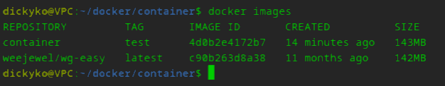
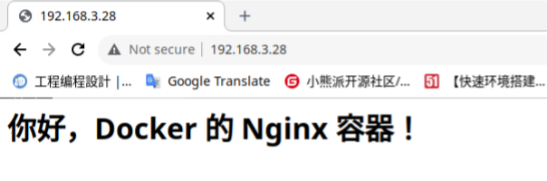
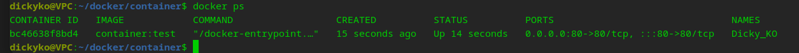

<style>
  table {
    width: 100%
    }
  td {
    vertical-align: center;
    text-align: center;
  }
  table.inputT{
    margin: 10px;
    width: auto;
    margin-left: auto;
    margin-right: auto;
    border: none;
  }
  input{
    text-align: center;
    padding: 0px 10px;
  }
  iframe{
    width: 100%;
    display: block;
    border-style:none;
    overflow:hidden;
  }
</style>

# 制作 Docker 容器

开始制作镜像，新建一个空白目录，创建一个名为 Dockerfile 的文本文件：

```
$ mkdir container
$ cd container
$ touch Dockerfile
```

编辑 Dockerfile，添加如下指令：

```
FROM nginx
RUN echo '<html><head><meta charset="utf-8"></head><body> \
          <h1>你好，Docker 的 Nginx 容器！</h1></body></html>' > \
          /usr/share/nginx/html/index.html
```

这个 Dockerfile 非常简单，总共也就运用了两条指令：FROM 和 RUN 。

### FROM 指定基础镜像

制作镜像必须要先声明一个基本参考镜像（底层运行程序），FROM 指令可以指定基础镜像是必备指令，且必须是第一条指令。表示后续操作都是基于這指定的基础镜像。

通常情况下，基础镜像在 DockerHub 都能找到，如：

- 中间件相关：nginx、mongodb、redis、tomcat 等；
- 开发语言环境 ：openjdk、python、golang 等；
- 操作系统：centos 、alpine 、ubuntu 等；

详细资料可参考，[DockerHub 官方网站](https://hub.docker.com/search?q=)。有关 image 之兼容问题。可用以下指令查阅 docker 安装版本與相关程序之兼容。

```
$ docker version
```

除了这些常用的基础镜像外，还有个比较特殊的镜像 : scratch 。它表示一个空白的镜像：

```
FROM scratch
```

以 scratch 为基础镜像，表示你不以任何镜像为基础。


### RUN 执行命令

RUN 指令用于执行终端操作的 shell 命令，另外，RUN 指令也是编写 Dockerfile 最常用的指令之一。它支持的格式有如下两种：

- shell 格式: RUN <命令>，这种格式好比在命令行中输入的命令一样。举个栗子，上面编写的 Dockerfile 中的 RUN 指令就是使用的这种格式：

```
RUN echo '<h1>你好，Docker 的 Nginx 容器！</h1>' > /usr/share/nginx/html/index.html
```
- exec 格式: RUN ["可执行文件", "参数1", "参数2"], 这种格式好比编程中调用函数一样，指定函数名，以及传入的参数。

```
RUN ["./test.php", "dev", "offline"] # 等价于 RUN ./test.php dev offline
```

Dockerfile 中每一个 RUN 指令都会新建一层，过多无意义的层导致很多运行时不需要的东西，都被打包进了镜像内，比如编译环境、更新的软件包等，这就导致了构建出来的镜像体积非常大。可用 && 将各个命令串联起来。简化 RUN 为一层，同时可删除了无用的压缩包。

Dockerfile 支持 shell 格式命令末尾添加 空格及 \ 作换行，及首通过 # 进行注释。良好的编写习惯，如换行、注释、缩进等，可以让 Dockerfile 更易于维护。
Linux shell 命令 <font color="#FF1000">&&</font> 解释为逻辑与。用此命令时，只有前一个命令成功执行后，才会执行这命令。
例子如下：


```
FROM centos
RUN yum -y install wget \
    && wget -O redis.tar.gz "http://download.redis.io/releases/redis-5.0.3.tar.gz" \
    && tar -xvf redis.tar.gz \
    && rm redis.tar.gz
```
<br/>

|选项 |说明|
|---|---|
|-a |stdin: 指定标准输入输出内容类型，可选 STDIN、STDOUT、STDERR 三项|
|-d|<font color="#FF1000">后台运行容器</font>，并返回容器ID|
|-i|使用時按<font color="#FF1000">键盘输入</font>会被容器接口接收，通常与 -t 同时使用|
|-t|使用時容器的显示屏会<font color="#FF1000">连接到显示屏</font>上，通常与 -i 同时使用。形式为 仓库:标签|
|-P|<font color="#FF1000">随机端口映射</font>，容器内部端口随机映射到主机的端口|
|-p|<font color="#FF1000">指定端口映射</font>，格式为：主机(宿主)端口:容器端口|
|--name|为容器<font color="#FF1000">指定名称</font>|
|--dns|指定容器使用的 <font color="#FF2F00">DNS</font> 服务器，默认和宿主一致；
|--dns-search|指定容器 DNS 搜索域名，默认和宿主一致|
|-h|指定容器的 hostname|
|-e|设置环境<font color="#FF1000">变量</font>|
|--env-file|从指定文件读入环境变量|
|--cpuset|"0-2" 绑定容器到指定CPU运行|
|-m|设置容器使用内存最大值|
|--net|指定容器的网络连接类型，支持 bridge、host、none、container 四种类型|
|--link|添加链接到另一个容器|
|--expose|开放一个端口或一组端口|
|-v|绑定一个卷|


### 构建镜像

Dockerfile 文件编写好后，就可以通过它构建镜像。其中 container 为存储库 (Repository) 名稱 test 为标签 (Tag) 名稱。


```
$ docker build -t container:test .
```

注意：命令的最后有个点 **.** , 很多時不注意会漏掉，这是指定路径，<font color="#FF1000">代表生成的文件储存于当前目录下</font>。

构建命令执行完成后，执行 docker images 命令查看本地镜像是否构建成功。如成功则有一個标签为 test 的镜像文件。image ID 也是相当有用请多注意。





镜像构建成功后，运行 Nginx 容器：

```
$ docker run -d -p 80:80 --name Dicky_KO container:test
```

容器运行成功后，用网页浏览器访问 localhost:80, 可以看到首页已经被成功修改了如下。





注意：上下文路径下不要放置一些无用的文件，否则会导致打包发送的体积过大，速度缓慢而导致构建失败。当然，也可以编写一个 .dockerignore，通过它可以忽略上传一些不必要的文件给 Docker 引擎。

### 查询运行情况资料 

```
$ docker ps
```




### 停止运行程序

```
$ docker stop [container ID]
```

### 强制删除构建镜像

```
$ docker image rm -f [Image ID]
```

### 列出全部 Image 资料

```
$ docker images
```

## 在 build 或 run 时传递变量


### ENV

ENV 是在 build 的時候，可以定義一些變數，讓後面指令在執行時候可以參考。


```
From nginx
ENV NODE_VER=node-v5
ADD ./${NODE_VER} /
RUN ln -s /${NODE_VER} /node
ENV PATH=/node/bin:$PATH
CMD ["node"]
```

### ARG

ARG在build時候是可以從外部以 --build-arg 帶入的變數，讓 build 的動作可結合外部的指令給定一些<font color="#FF1000">建構時</font>候所需的參數。


```
From nignx
ARG NODE_VER
ADD ./${NODE_VER:-node-v5} /
RUN ln -s /${NODE_VER} /node
ENV PATH=/node/bin:$PATH
CMD ["node"]
```

### 预设参数

在 ENV 與 ARG 參數的設定上，可以透過下面方式增加一些预设值。

 - ${variable:-word} 代表，如果 variable 有給值，則以 variable 設定的文字為主，如未設定，則以 word 字串為主。
 - ${variable:+word} 代表，如果 variable 有給值，則值為 word；如果 variable 未給值，則最後結果為空字串(empty)。


注意: build image 過程可以看到 **ENV** 與 **ARG** 有正常取值，但 docker run 的時候，則只剩下 ENV 而 ARG 不見了。這代表 <font color="#FF1000">ARG 只能活在 build image 階段</font>而已。