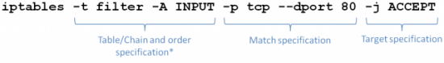
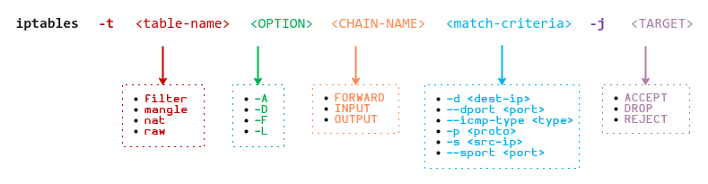
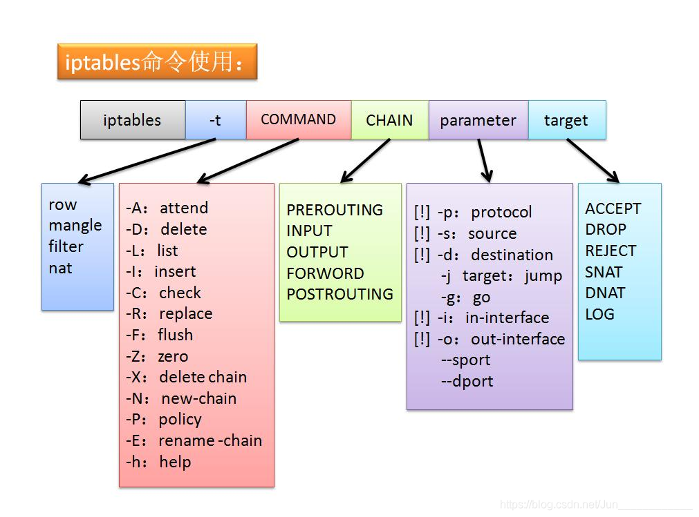
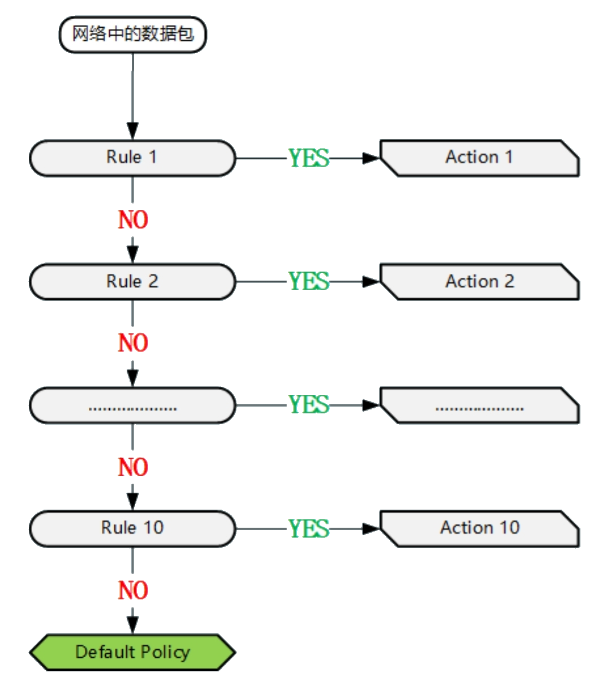
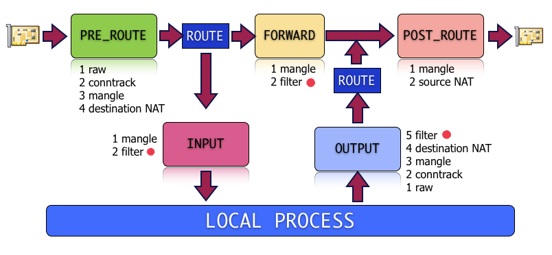

<style>
  table {
    width: 100%
    }
  td {
    vertical-align: center;
    text-align: center;
  }
  table.inputT{
    margin: 10px;
    width: auto;
    margin-left: auto;
    margin-right: auto;
    border: none;
  }
  input{
    text-align: center;
    padding: 0px 10px;
  }
  iframe{
    width: 100%;
    display: block;
    border-style:none;
    overflow:hidden;
  }
</style>

# 将 Linux 配置为路由器（IP 转发）


路由器是充当多个不同网络之间的中介的系统。 它接收来自一个网络的流量，这些流量最终发往另一个网络。 它能够识别特定数据包应该传送到哪里，然后通过适当的网络接口转发该数据包。

## 启用 IP 转发

 IP 转发在路由器上起着基础作用。 这是允许路由器将流量从一个网络接口转发到另一个网络接口的功能。 通过这种方式，它允许一个网络上的计算机访问不同网络上的计算机（当与路由软件一起配置时）。  IPv4 和 IPv6 地址的转发都在 Linux 内核中进行控制。 以下内核参数分别用于启用或禁用 IPv4 和 IPv6 转发。

IPv4：
```
$ net.ipv4.ip_forward
$ net.ipv4.conf.all.forwarding
```

IPv6：

```
net.ipv6.conf.all.forwarding
```

默认情况下，转发在大多数 Linux 系统上是禁用的。 要将 Linux 配置为路由器，需要启用它。 要启用转发，应将相应的参数设置为 1。值为 0 表示禁用转发。 要更新这些内核参数，请按以下步骤编辑 **/etc/sysctl.conf** 文件。

 在作路由器的 Linux 系统。 可以使用 SSH。确定当前是启用还是禁用 IPv4 转发。 下面的命令输出给定参数的值。 值 1 表示该设置已启用，而 0 表示它已禁用。 如果打算配置 IPv6 转发，请同时检查该内核参数。

```
$ sudo sysctl net.ipv4.ip_forward
```

如果此参数被禁用（或未处于所需状态），可续执行以下。使用编辑器（例如 vi）打开文件 **/etc/sysctl.conf**。

```
$ vi /etc/sysctl.conf
```

找到与启用的转发类型对应的行，取消注释并将值设置为 1。或者可以在文件中的任意位置添加这些行。

```
## Configure IPv4 forwarding
net.ipv4.ip_forward = 1

## Configure IPv6 forwarding
net.ipv6.conf.all.forwarding = 1
```

保存更改后，通过运行以下命令或重新启动计算机来应用更改。

```
$ sudo sysctl -p
```

## 配置 iptables

iptables 实用程序既可以用作防火墙（通过默认过滤表），也可以用作路由器（如使用 nat 表时）。 在此用 iptables 充当基本路由器。也可以使用任何其他防火墙或路由软件，例如 nftables 程序等。



**注意**：-t 预设值為 *filter* 可省略。而规则表的先后顺序: raw → mangle → nat → filter

登录到作路由器的 Linux 系统。 可以使用 SSH。查看现有的 iptables 规则。 如果您是全新安装的 Linux 并且没有任何预配置规则，则以下命令的输出应该为空。

```
$ iptables-save
```

可查找预期配置的任何规则。也可参与iptables 文档。或可刷新 iptables 规则并允许产生路由作用。

```
$ iptables -F
$ iptables -X
$ iptables -t nat -F
$ iptables -t nat -X
$ iptables -t mangle -F
$ iptables -t mangle -X
$ iptables -P INPUT ACCEPT
$ iptables -P OUTPUT ACCEPT
$ iptables -P FORWARD ACCEPT
```

接下来，在 iptables 上配置 NAT（网络地址转换）。 修改了网络数据包中的 IP 地址详细信息，允许专用网络上的所有系统共享路由器的相同公共 IP 地址。 添加以下 iptables 规则，将 10.0.2.0/24 替换为专用 VLAN 的子网。

```
$ iptables -t nat -s 10.0.2.0/24 -A POSTROUTING -j MASQUERADE
```

还可以放弃指定任何特定子网，并使用以下命令允许所有流量进行 NAT。

```
$ iptables -t nat -s 10.0.2.0/24 -A POSTROUTING -j MASQUERADE
```

还可以放弃指定任何特定子网，并使用以下命令允许所有流量进行 NAT。

```
$ iptables -t nat -A POSTROUTING -j MASQUERADE
```

 默认情况下，iptables 规则是临时的，如改持久化，可安装 iptables-persistent 软件包。 执行此操作时，系统启动时会加载保存在 **/etc/iptables/rules.v4**（以及 IPv6 的 rules.v6）中的规则。 也可以像往常一样继续对 iptables 进行更改。 当准备好保存时，将 iptables-save 的输出保存到 **/etc/iptables/rules.v4**（或 rules.v6）文件。 有关详细信息，请参阅使用 iptables 指南控制网络流量的相关部分。

``` 
$ iptables-save
$ sudo tee /etc/iptables/rules.v4
```

## 定义 Gateway

最后一步是手动调整除路由器之外的每个计算实例的网络配置设置。

 登录并部署每个非路由器计算实例禁用 Network Helper。 虽然 Network Helper 对于自动配置 VLAN IP 地址很有用，但现在需要手动编辑由 Network Helper 控制的配置文件。

 用 SSH 登录到未指定为路由器的每个 Linux 系统。编辑包含专用 VLAN 接口设置的配置文件。 此文件的名称和位置取决于使用的 Linux 发行版。对于在 Debian 10 上运行 ifupdown 的系统，网络配置通常存储在 **/etc/network/interfaces** 中。

```
$ sudo vi /etc/network/interfaces
```

在此文件中，调整为 VLAN 接口定义网关的参数。 该值应设置为分配给路由器 VLAN 接口的 IP 地址，例如 10.0.2.1，如果使用本示例。 对于在 Debian 10 上运行 ifupdown 的系统，可以在示例添加网关参数如下。


```
iface eth0 inet static address 10.0.2.2/24 gateway 10.0.2.1
```

保存这些设置后，重新启动计算实例或运行相应的命令以应用更改。 继续以 ifupdown 为例，运行以下命令作新的网络配置设置。

```
$ sudo ifdown eth0
$ sudo ip addr flush eth0
$ sudo ifup eth0
```

要验证配置设置是否正确，可从私有 VLAN（未指定为路由器）内的计算实例 ping 公共 IP 地址。 此 ping 现在应该成功完成，表明网络流量已成功通过路由器转发到公共互联网。

```
$ ping www.google.com
```

## 常用的 iptables 命令

### 1.检查 iptables 规则

因为安装了 iptables 服务并且没有添加任何规则，检查 iptables 规则应该给空输出。

```
$ iptables -nvL
```

### 2.白名单 IP 地址

有时用户无法访问网站或服务器，因此需要使用以下命令手动将其 IP 地址列入白名单：

```
$ iptables -A INPUT -s 192.168.1.1 -j ACCEPT
```

### 3.屏蔽 IP 地址

如服务器持续受到攻击，或者所有者不希望某些 IP 地址访问他的服务器，可以使用以下命令轻松阻止：

```
$ iptables -A INPUT -s 192.168.0.1 -j DROP
```

### 4.在 iptables 中屏蔽主机

有时需要在 iptables 规则中屏蔽整个主机。 例如，要首先在 iptables 规则中阻止 google.com，需要使用以下命令查找 IP 地址和 CIDR：

```
$ host google.com
```

应该收到以下输出：

```
google.com 的地址为 172.217.4.46
google.com 的 IPv6 地址为 2607:f8b0:4004:c07::64 
google.com 的 IPv6 地址为 2607:f8b0:4004:c07::8b  
google.com 的 IPv6 地址为 2607:f8b0:4004:c07::65 
google.com 的 IPv6 地址为 2607:f8b0:4004:c07::71 
google.com 邮件由 10 smtp.google.com 处理。
```
现查找 CIDR，请执行以下命令：

```
$ whois 172.217.4.46 | grep CIDR
```

应该收到以下输出：

```
CIDR：172.217.0.0/16
```

要阻止谷歌网络所需的一切。 只需执行以下命令：

```
$ iptables -A OUTPUT -p tcp -d 172.217.0.0/16 -j DROP
```

### 5.封锁特定端口

如果不希望某些特定端口可以从外部访问，可以轻松地阻止它。如要通过 iptables 规则阻止 MySQL 3306 端口上的传出连接，可执行以下命令：

```
$ iptables -A OUTPUT -p tcp --dport 3306 -j DROP
```

### 6.授予对多个端口的访问权限

要允许多个端口用于<font color="#FF1000">传入连接</font>，可执行以下命令：

```
$ iptables -A INPUT -p tcp -m multiport --dports 80,443 -j ACCEPT
```

要允许多个端口用于<font color="#FF1000">传出连接</font>，可执行以下命令：

```
$ iptables -A OUTPUT -p tcp -m multiport --sports 80,443 -j ACCEPT
```

### 7.端口转发

要设置端口转发，如将端口 80 转发到端口 443，可执行以下命令：

```
$ iptables -t nat -A PREROUTING -i eth0 -p tcp --dport 80 -j REDIRECT --to-port 443
```

### 8.保存 iptables 规则

要保存所有这些 iptables 命令，需要执行以下命令：

```
$ iptables-save > ~/iptables
```

应该收到以下输出：

```
# Generated by iptables-save v1.8.7 on Fri Jun 9 00:00:00 2023
*filter
:INPUT ACCEPT [0:0]
:FORWARD ACCEPT [0:0]
:OUTPUT ACCEPT [0:0]
-A INPUT -s 192.168.0.1/32 -j ACCEPT
-A INPUT -s 192.168.0.1/32 -j DROP
-A INPUT -p tcp -m multiport --dports 80,443 -j ACCEPT
-A OUTPUT -d 172.217.0.0/16 -p tcp -j DROP
-A OUTPUT -p tcp -m tcp --dport 3306 -j DROP
-A OUTPUT -p tcp -m multiport --sports 80,443 -j ACCEPT
COMMIT
# Completed on Fri Jul 22 23:52:08 2022
# Generated by iptables-save v1.8.7 on Fri Jul 22 23:52:08 2022
*nat
:PREROUTING ACCEPT [0:0]
:INPUT ACCEPT [0:0]
:OUTPUT ACCEPT [0:0]
:POSTROUTING ACCEPT [0:0]
-A PREROUTING -i eth0 -p tcp -m tcp --dport 80 -j REDIRECT --to-ports 443
COMMIT
# Completed on Fri Jun 9 00:00:00 2023
```

### 9.刷新 iptables 规则

要刷新前面的步骤中设置的所有 iptables 规则，需要执行命令 iptables -F 但首先检查 iptables -nvL 的输出以检查之前设置的规则：

```
$ iptables -nvL
```

如果您执行了前面的命令，应该会收到以下输出：

```
Chain INPUT (policy ACCEPT 0 packets, 0 bytes)
 pkts bytes target     prot opt in     out     source        destination
    0     0 ACCEPT     all  --  *      *       192.168.0.1    0.0.0.0/0
    0     0 DROP       all  --  *      *       192.168.0.1    0.0.0.0/0
    1    60 ACCEPT     tcp  --  *      *       0.0.0.0/0      0.0.0.0/0            multiport dports 80,443

Chain FORWARD (policy ACCEPT 0 packets, 0 bytes)
 pkts bytes target     prot opt in     out     source               destination

Chain OUTPUT (policy ACCEPT 0 packets, 0 bytes)
 pkts bytes target     prot opt in     out     source      destination
    0     0 DROP       tcp  --  *      *       0.0.0.0/0   172.217.0.0/16
    0     0 DROP       tcp  --  *      *       0.0.0.0/0   0.0.0.0/0            tcp dpt:3306
    1    40 ACCEPT     tcp  --  *      *       0.0.0.0/0   0.0.0.0/0            multiport sports 80,443
```

现在可以使用以下命令刷新规则：

```
$ iptables -F
```

执行命令 iptables -nvL 列出当前规则，应该会收到类似于上面第一步的空输出。

```
Chain INPUT (policy ACCEPT 0 packets, 0 bytes)
 pkts bytes target     prot opt in     out     source     destination

Chain FORWARD (policy ACCEPT 0 packets, 0 bytes)
 pkts bytes target     prot opt in     out     source     destination

Chain OUTPUT (policy ACCEPT 0 packets, 0 bytes)
 pkts bytes target     prot opt in     out     source     destination
```

### 10.iptables 的 man (手册) 命令

如想了解有关 iptables 命令的所有信息以及可以使用的参数，可执行 man iptables，将收到以下输出：

```
IPTABLES(8) iptables 1.8.7 
IPTABLES(8) 

名称 
iptables/ip6tables — IPv4/IPv6 数据包过滤和 NAT 的管理工具 

概要
 - iptables [-t table] {-A|-C|-D} chain rule-specification 
 - ip6tables [-t table] {-A|-C|-D} chain rule-specification 
 - iptables [-t table] -I chain [rulenum] rule-specification  
 - iptables [-t table] -R chain rulenum rule-specification 
 - iptables [-t table] -D chain rulenum 
 - iptables [-t table] -S [chain [rulenum]] 
 - iptables [-t table] {-F|-L|-Z} [chain [rulenum]] [options...] 
 - iptables [-t table] -N chain 
 - iptables [-t table] -X [chain] 
 - iptables [-t table] -P chain target 
 - iptables [-t table] -E old-chain-name new-chain-name 
 - rule-specification = [matches...] [target] 
 - match = -m matchname [per-match-options] 
 - target = -j targetname [per-target-options] 

描述

Iptables 和 ip6tables 用于设置、维护和检查表 Linux 内核中的 IPv4 和 IPv6 数据包过滤规则。 可以定义几个不同的表。 每个表都包含许多内置链，也可能包含用户定义的链。
```

### 11.从文件恢复 iptables 规则

如要恢复 iptables 规则列表，可以使用 iptables-restore。 命令如下：

```
$ iptables-restore < ~/iptables.
```

### 12.限制每个 IP 地址的并发连接数

如不想在给定端口上从单个 IP 地址建立太多并发连接，可以用以下命令：

```
$ iptables -A INPUT -p tcp --syn --dport 22 -m connlimit --connlimit-above 3 -j REJECT
```

上述命令允许每个客户端不超过 3 个连接。 当然可以更改端口号以匹配不同的服务。 还应更改 --connlimit-above 以满足您的要求。

### 13.阻止访问 iptables 上的特定 MAC 地址

可以使用以下方法阻止从特定 MAC 地址访问系统：

```
$ iptables -A INPUT -m mac --mac-source 00:00:00:00:00:00 -j DROP
```

当然需要将 <font color="#FF1000">00:00:00:00:00:00</font> 更改为要阻止的实际 MAC 地址。

### 14. 阻止 iptables 上的传入 ping 请求

出于安全考虑系统管理员㑹阻止传入的 ping 请求。

```
$ iptables -A INPUT -p icmp -i eth0 -j DROP
```

### 15.用 iptables 阻止 Apache 端口上的网络泛滥

有时 IP 地址可能会向网站上的 Web 端口请求过多的连接。 这可导致许多问题，为防止出现此类问题，可以使用以下规则：

```
$ iptables -A INPUT -p tcp --dport 80 -m limit --limit 100/minute --limit-burst 200 -j ACCEPT
```

上述命令将每分钟的传入连接限制为 100，并将限制突发设置为 200。可根据特定要求编辑限制和限制突发。


## MAC 筛选

只允许特定 MAC 能访问系统。

```
iptables -A FORWARD -i eth1 -o eth0 -m mac --mac-source aa:aa:aa:aa:aa:aa -j ACCEPT
for MAC in `cat mac_address_file`; do
  iptables -A FORWARD -i eth0 -o eth1 -m mac --mac-source $MAC -j ACCEPT
done
iptable -P FORWARD DROP
```

## 默认设置

执行以下三个命令，将链的默认策略更改为 DROP。它们将丢弃所有传入、传出和转发的数据包。

```
iptables -A INPUT -j DROP
iptables -A OUTPUT -j DROP
iptables -A FORWARD -j DROP
```
或

```
iptables -P INPUT DROP
iptables -P OUTPUT DROP
iptables -P FORWARD DROP
```

### 解释常用参数




```
iptables -A OUTPUT -o eth0 -p tcp --dport 22 -m state --state NEW,ESTABLISHED -j ACCEPT
```

在上面的例子中：

 - -A OUTPUT ：将新规则附加到 OUTPUT 链。 
    - 对于<font color="#FF1000">传出</font>连接请求，这始终必须是 <font color="#FF1000">OUTPUT</font>。
    - 对于<font color="#FF1000">传入</font>连接请求，这始终必须是 <font color="#FF1000">INTPUT</font>。
    - 对于<font color="#FF1000">转发</font>连接请求，这始终必须是 <font color="#FF1000">FORWARD</font>。
 - -o eth0 ：这是指输出接口。 
    - 对于<font color="#FF1000">传出</font>连接，这始终必须是“-o”。
    - 对于<font color="#FF1000">传入</font>连接，这始终必须是“-i”。
 - -p tcp ：表示这是针对 TCP <font color="#FF1000">协议</font>的。
 - –dport 22 ：这是指传出连接的目标<font color="#FF1000">端口</font>。
 - -m state ：这表示使用<font color="#FF1000">状态</font>匹配模块。
 - --state NEW, ESTABLISHED ：“状态”匹配模块的选项。 

在此示例中，仅允许 NEW 和 ESTABLISHED 状态。 第一次从服务器向外部发起的连接请求时，使用 NEW 状态。 ESTABLISHED 状态用于从服务器到外部的所有进一步请求。

### 完整例子

```
# 1. 删除所有现有规则
iptables -F

# 2. 设置默认链策略
iptables -P INPUT DROP
iptables -P FORWARD DROP
iptables -P OUTPUT DROP

# 3. 允许外部连接 SSH
iptables -A INPUT -i eth0 -p tcp --dport 22 -m state --state NEW,ESTABLISHED -j ACCEPT
iptables -A OUTPUT -o eth0 -p tcp --sport 22 -m state --state ESTABLISHED -j ACCEPT

# 4. 允许外部连接 HTTP
iptables -A INPUT -i eth0 -p tcp --dport 80 -m state --state NEW,ESTABLISHED -j ACCEPT
iptables -A OUTPUT -o eth0 -p tcp --sport 80 -m state --state ESTABLISHED -j ACCEPT

# 5. 允许对外连接 SSH
iptables -A OUTPUT -o eth0 -p tcp --dport 22 -m state --state NEW,ESTABLISHED -j ACCEPT
iptables -A INPUT -i eth0 -p tcp --sport 22 -m state --state ESTABLISHED -j ACCEPT
```

## 防火墙规则的匹配顺序

因 iptables 是利用数据包过滤的机制， 所以它会分析数据包的表头数据，将表头数据与定义的规则做匹配，根据匹配结果来决定该数据包是否可以进入主机或者是被丢弃。 也就是如果数据包能被防火墙规则匹配到就进行相应的动作（Target），否则就继续进行下一条规则的匹配，直到有一条规则能匹配到为止，而重点在于规则的匹配顺序。



一般不建议使用 raw 和 mangle 做包的过滤，因为它是用来做高级操作。

