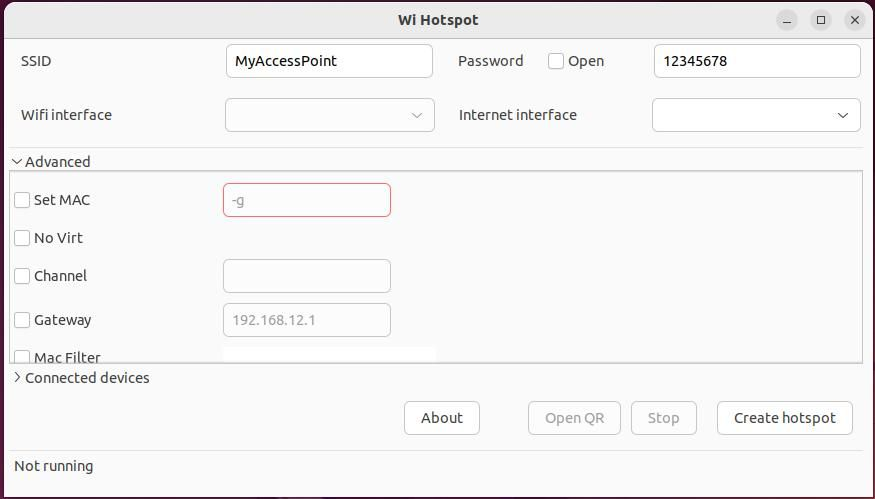

# Wifi 无线热点

使用 linux-wifi-hotspot 在 Linux 上创建无线热点。這能毫不费力地共享 PC 的互联网连接，同时扩展网络范围。linux-wifi-hotspot同时支持 *2.4GHz* 和 *5GHz* 网络，可以自定义频道和网关IP地址。 如果希望网络不被检测到可以隐藏 **SSID**。

首先，安装依赖项。 在 deepin 上，输入：

```
$ sudo apt install -y libgtk-3-dev build-essential gcc g++ pkg-config make hostapd libqrencode-dev libpng-dev
```

隆克 linux-wifi-hotspot 存储库并使用 cd 命令移动到其中：

```
$ git clone https://github.com/lakinduakash/linux-wifi-hotspot
$ cd linux-wifi-hotspot
```

使用以下命令编译 linux-wifi-hotspot：

```
$ make
```

并安装

```
$ sudo make install
```

该过程完成后，可以通过从系统菜单中选择 Wi-Fi 热点或在任何终端中输入 **wihotspot** 来运行 linux-wifi-hotspot 设定。




## Wi-Fi 接口名称

可以通过在终端中输入以下命令来找到 Wi-Fi 接口名称：

```
$ nmcli --get-values GENERAL.DEVICE,GENERAL.TYPE device show
```

启动 linux-wifi-hotspot，它会提示提供 **SSID** 和密码。

## 特征

 - 同时启用 wifi 及热点。
 - 可从任何网络接口共享 wifi 接入点。
 - 用 VPN 创建热点，通过 *VPN* 传输流量。 
 - 可通过二维码分享 wifi 連接。
 - 可使用 *MAC* 过滤器。
 - 能查看连接的设备
 - 可用命令行或图形用户界面。
 - 支持 2.4GHz 和 5GHz。
 - 可自定义 wifi 频道。
 - 可更改 *MAC* 地址。
 - 可隐藏 *SSID*。
 - 自定义网关 *IP* 地址
 - 启用 IEEE 80211*n*、IEEE 80211*ac* 模式
 - 可加密：WPA、WPA2、WPA/WPA2及Open。
 - 可通过参数传递 SSID 和密码。


单击 **Advanced**，将看到所有可用的高级选项。 这些通常是复选框选项，只需单击一个框即可。能够将热点设置为隐藏并选择频段。 更复杂的选项包括设置 **Mac** 地址 —— 它可以欺骗通过强制门户登录的设备，以及网关 —— 它允许在热点产生的网络上设置 PC 的 IP 地址。

当热点配置完成，点击 **Create hotspot** 按钮以创建热点。

当热点建立后，可以与其他设备共享 SSID 和密码，或者以点击打开二维码按钮创建二维码。 移动设备可以扫描二维码自动连接到您闪亮的新网络。也可以打印二维码并将其贴上供客人扫描。


wihotspot GUI 使用 create_ap 创建和管理访问点。


## 命令行創建

### WPA + WPA2 密码

```
$ create_ap wlp2s0 enp3s0 dickyRouter 12345678 
```

### 使用 IEEE 802.11n

```
$ create_ap --ieee80211n --ht_capab '[HT40+]' wlp2s0 enp3s0 dickyRouter 12345678
```

### 使用 IEEE 802.11ac

```
$ create_ap --ieee80211ac --ht_capab '[HT160+]' wlp2s0 enp3s0 dickyRouter 12345678
```

## 在启动时启动热点服务：

```
$ sudo systemctl enable create_ap
```

## 關閉無線上網

```
$ nmcli r wifi off
```

## 清除網絡錯誤

```
$ rfkill unblock wlan
```