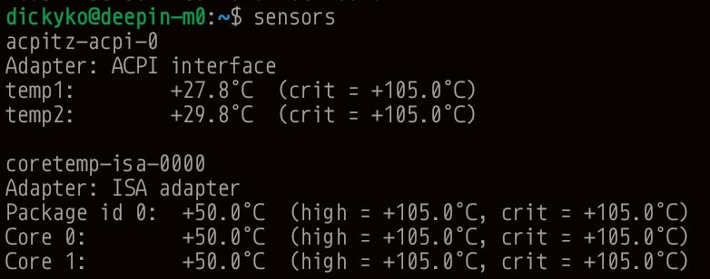

# 压力测试


如何在 Linux 中安装“压力”工具

要在 Deepin 上安装压力工具，请运行以下命令。

```
$ sudo apt-get install stress
```

可以在压力下使用的一些选项

 - 要在 sqrt() 函数上生成 N 个工作线程，请使用 –cpu N 选项，如下所示。
 - 要在 sync() 函数上生成 N 个工作线程，请使用 –io N 选项，如下所示。
 - 要在 malloc()/free() 函数上生成 N 个工作线程，请使用 –vm N 选项。
 - 要为每个 vm worker 分配内存，请使用 –vm-bytes N 选项。
 - 可以使用 –vm-keep 选项重新清理内存，而不是释放和重新分配内存资源。
 - 在使用 –vm-hang N 选项释放内存之前将睡眠设置为 N 秒。
 - 要在 write()/unlink() 函数上生成 N 个工作线程，请使用 –hdd N 选项。
 - 可以使用 –timeout N 选项在 N 秒后设置超时。
 - 使用 –backoff N 选项在任何工作开始之前设置 N 微秒的等待因子，如下所示。
 - 要在运行压力时显示更详细的信息，请使用 -v 选项。

使用例子

1.要在超时为 30 秒的 sqrt() 上生成 8 个工作线程，显示有关操作的详细信息，请运行以下命令：

```
$ sudo stress --cpu 8 -v --timeout 30s
```

2.要在 sqrt() 上生成 4 个 worker，在 sync() 上生成 2 个 worker，在 malloc()/free() 上生成 2 个 worker，超时 20 秒，并为每个 vm worker 分配 256MB 的内存，运行下面的命令：

```
$ sudo stress --cpu 4 --io 3 --vm 2 --vm-bytes 256M --timeout 20s 
```

# 温度测量

传感器命令在 Linux 中用于显示所有传感器芯片的当前读数，包括 CPU 温度。  hddtemp 命令将显示 SSD 和 HDD 的温度。 需要安装和配置 lm-sensors 包以及 hddtemp。 可以使用以下语法：

```
$ sudo apt install lm-sensors
```

接下来，需要检测电脑中安装的硬件监控芯片。 因此开始检测电脑硬件传感器，这些传感器将提供以下信息：

 嵌入 CPU 和其他超级 I/O 芯片中的传感器

 通过系统上的 I/O 端口和 SMBus/I2C 总线访问的硬件监控芯片

 键入以下命令：

```
$ sudo sensors-detect
```

## 在命令行中显示 CPU 温度

```
$ sensors
```



