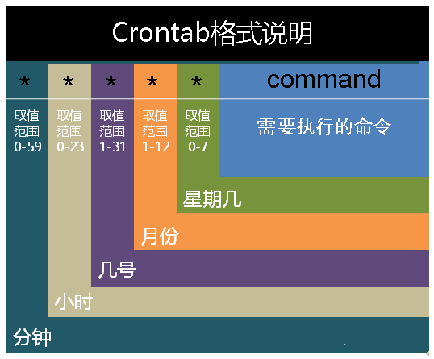

# sudo 

sudo（Super User DO）命令以系统管理者的身份执行指令，即经由 sudo 所执行的指令就是 root 亲自执行。

```
$ sudo -i
```

## 添加用户到sudo组

sudo 组的成员被授予 sudo 访问权限。如果将用户添加到 sudo 组，那么用户就可以授予 sudo 的访问权限。

```
$ usermod -aG sudo username
```

- -a 表示追加用户到指定组，
- -G 选项表示不要将用户从其它组中移除。

要验证是否具有sudo权限，可运行命令 sudo whoami 即可。如果用户具有sudo访问权限，命令将会打印 root。

```
$ sudo whoami

root
```

# mqtt 傳 IP 地址

基於沒有網址。可以使用 mqtt 格式及免費網站。傳輸 ip 地址到需要的設備。

## 安裝 nodeJS 及 mqtt

```
$ sudo apt install nodejs npm -y
$ npm install aedes
$ npm install http
$ npm install websocket-stream
$ npm install aedes-server-factory
$ npm install mqtt
```

## mqtt 發放 ip 地址

```
var mqtt = require("mqtt");

const options = {
  protocol: 'tcp',
  host: 'broker.hivemq.com',
  port: 1883,
};

var client = mqtt.connect(options);

function getIPAddress() {
  let interfaces = require('os').networkInterfaces();
  for (let devName in interfaces) {
    let iface = interfaces[devName];
    for (let i = 0; i < iface.length; i++) {
      let alias = iface[i];
      if (alias.family === 'IPv4' && alias.address !== '127.0.0.1' && !alias.internal)
        return alias.address;
    }
  }
  return '0.0.0.0';
}


// 将有效輸出資料设置为 空白 并將 retain 設为 true 以清除服务器信息。
client.publish('dicky', getIPAddress(), { retain: true, qos: 1 }, (err) => {
  if (err) {
    console.error('Failed to publish message:', err);
  } else {
    console.log('已发布 ip 地址！');
    client.end();
  }
});
```

# crontab 定時執行

在 Linux 系统的实际使用中，可能会经常碰到让系统在某个特定时间执行某些任务的情况，比如定时采集服务器的状态信息、负载状况；定时执行某些任务/脚本来对远端进行数据采集等。

Linux 分系统任务调度和用户任务调度。Linux系统任务是由 cron (crond) 这个系统服务来控制的，这个系统服务是默认启动的。用户自己设置的计划任务则使用 crontab 命令。



在以上各个字段中，还可以使用以下特殊字符：

- "*" 代表所有的取值范围内的数字，如月份字段为 *，则表示 1 到 12 个月；

- "/" 代表每一定时间间隔的意思，如分钟字段为 */10，表示每 10 分钟执行 1 次。

- "-" 代表从某个区间范围，是闭区间。如 “2-5” 表示 “2,3,4,5”，小时字段中 0-23/2 表示在 0~23 点范围内每 2 个小时执行一次。

- "," 分散的数字（不一定连续），如1,2,3,4,7,9。

注：Sunday=0（第一天）或 Sunday=7（最后1天）。

## crontab 要點

- crontab 有 2 种编辑方式：直接编辑 /etc/crontab 文件与 crontab –e，其中 /etc/crontab 里的计划任务是系统中的计划任务，而用户的计划任务需要通过 crontab –e 来编辑；
- 每次编辑完某个用户的 cron 设置后，cron 自动在 /var/spool/cron 下生成一个与此用户同名的文件，此用户的 cron 信息都记录在这个文件中，这个文件是不可以直接编辑的，只可以用 crontab -e 来编辑。
- crontab 中的 command 尽量使用绝对路径，否则会经常因为路径错误导致任务无法执行。
- 新创建的 cron job 不会马上执行，至少要等2分钟才能执行，可从起 cron 来立即执行。
- % 在 crontab 文件中表示 “换行”，因此假如脚本或命令含有 % ，需要使用 \% 来进行转义。

### 例子

```
# 每一分钟执行一次
*    *    *    *    *  command

# 每小时的第3和第15分钟执行
3,15   *    *    *    *  command

# 每天上午 8-11 点的第3和15分钟执行
3,15  8-11  *  *  *  command
```


# rc.local 开机自启

## 添加rc-local.service

```
$ cat > /etc/systemd/system/rc-local.service
$ vi /etc/systemd/system/rc-local.service
```
### 文件內容：

```
[Unit]
Description=/etc/rc.local
ConditionPathExists=/etc/rc.local

[Service]
Type=forking
ExecStart=/etc/rc.local start
TimeoutSec=0
StandardOutput=tty
RemainAfterExit=yes
SysVStartPriority=99

[Install]
WantedBy=multi-user.target
```

## 创建 /etc/rc.local 并写入内容。

```
$ vi /etc/rc.local
```

### 文件內容：

```
#!/bin/sh -e
#
# rc.local
#
# This script is executed at the end of each multiuser runlevel.
# Make sure that the script will "exit 0" on success or any other
# value on error.
#
# In order to enable or disable this script just change the execution
# bits.
#
# By default this script does nothing.

exit 0
```

**注意**：在 rc.local.文件中，可以添加想要在系统启动时执行的命令或脚本。
但请确保每个命令或脚本都在一行上，并且在命令或脚本的末尾添加 <font color="#FF1000">&</font> 符号，以确保以异步方式执行。

## 添加权限并设置开机自启

```
$ chmod a+x /etc/rc.local
$ systemctl enable rc-local.service
```

## 启動 rc.local 服务

```
$ systemctl start rc-local.service
```

## 检查状态

```
$ systemctl status rc-local.service
```

此时将要开机执行的命令添加到 /etc/rc.local 中 exit 0 的上面即可。

# Linux 開機文件夾解釋

|文件夹名称|功能|
|:---:|:---:|
|init.d|各种服务器和程序的二进制文件存放目录|
|rc0.d|停止，不要将 initdefault 设置为此|
|rc1.d|单用户模式|
|rc2.d|与 3 相同，但没有网络|
|rc3.d|完整的多用户模式|
|rc4.d|未使用|
|rc5.d|X11|
|rc6.d|重启，不要将 initdefault 设置为此|
|rc|根据其参数指定的运行模式(运行级别，inittab文件中可以设置)来执行相应目录下的脚本|
|rc.sysinit|各个运行模式中相同的初始化工作|
|rc.local|在系统启动时运行的工作|


**注意**：
- Linux 机器将启动到运行级别 3 。
因此，在下一步和最后一步中，操作系统将执行存储在 /etc/rc3.d 下的所有脚本，其中 rc3.d 用于运行级别 3.
- 所有脚本都以 S 或者 K 开头。S 开始（Start），K 杀死（Kill）。