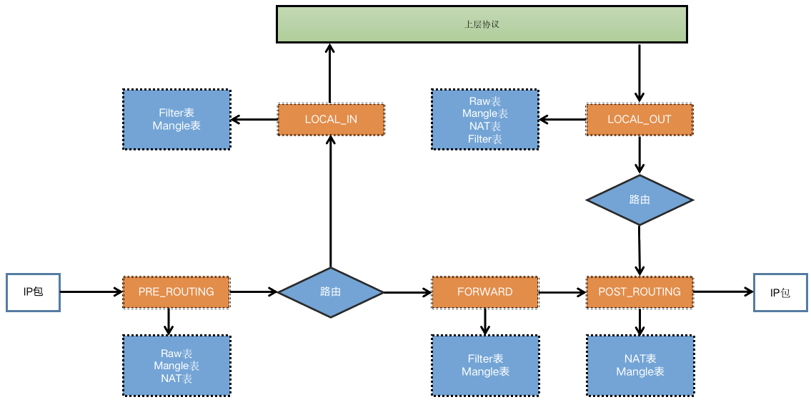
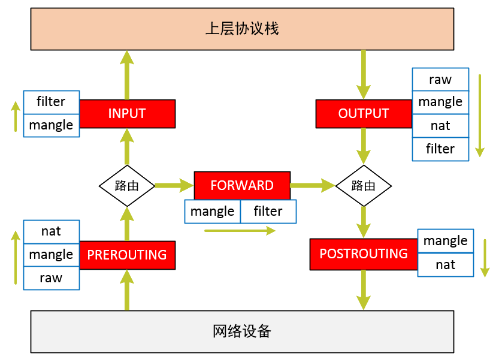
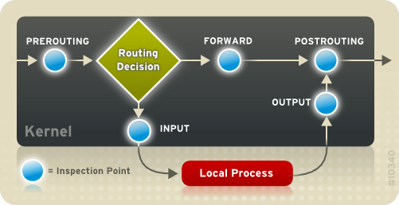
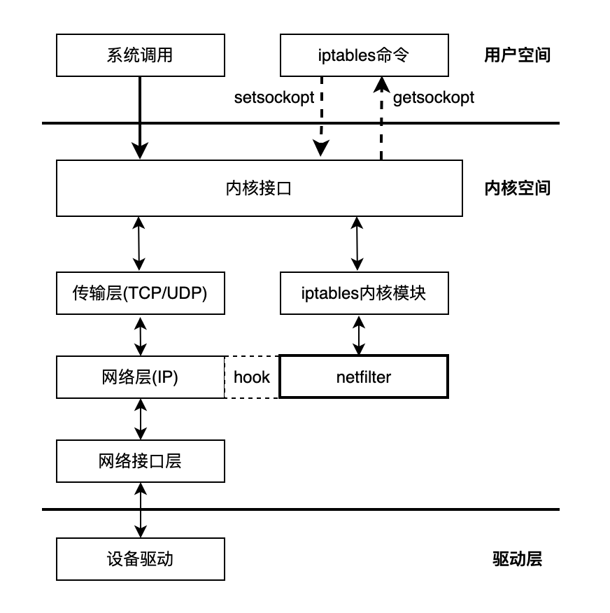
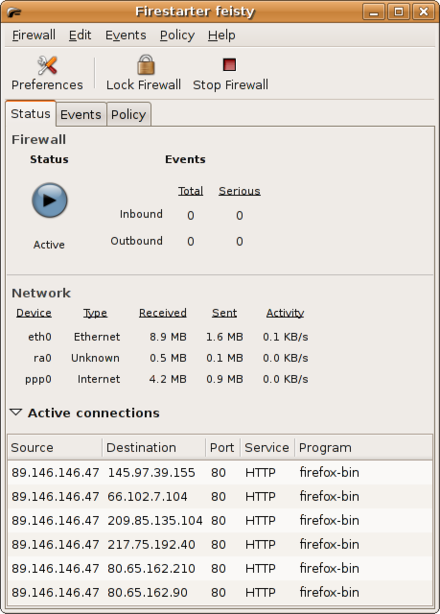
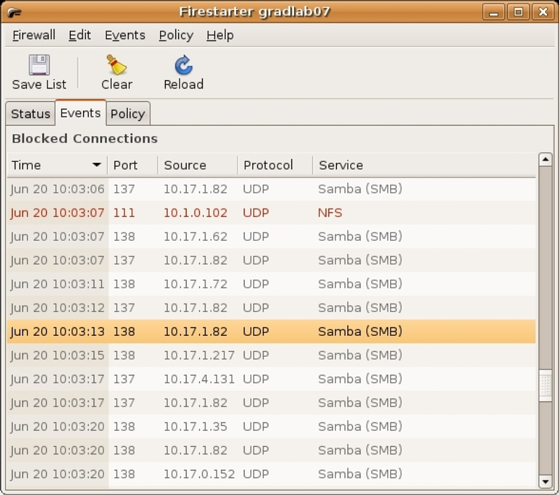
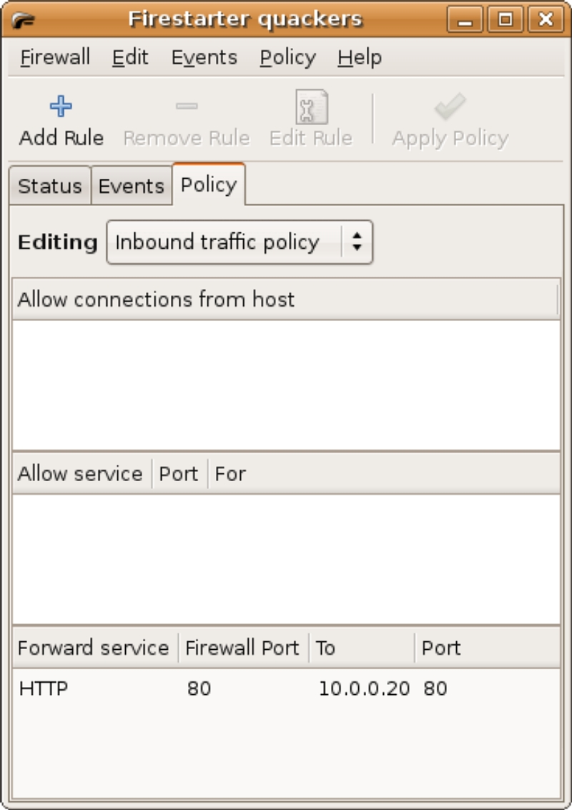

<style>
  table {
    width: 100%
    }
  td {
    vertical-align: center;
  }
  table.inputT{
    margin: 10px;
    width: auto;
    margin-left: auto;
    margin-right: auto;
    border: none;
  }
  input{
    text-align: center;
    padding: 0px 10px;
  }
  iframe{
    width: 100%;
    display: block;
    border-style:none;
    overflow:hidden;
  }
</style>


## iptables 简介

iptables 是建立在 Netfilter 之上的数据包过滤器，通过向 Netfilter 的挂载点上注册钩子函数来实现对数据包过滤的，从 iptables 这个名字上可以看出一定具有表的概念，iptables 通过把这些规则表挂载在 Netfilter 的不同链上，对进出内核协议栈的数据包进行过滤或者修改操作。

### iptables 安装

```
$ sudo apt-get update -y
$ apt upgrade
$ apt autoremove
$ sudo apt-get install iptables
```

### iptables包括四种表:

Filter表

> Filter表用于过滤数据包，是iptables的默认表，因此如果你配置规则时没有指定表，那么就默认使用Filter表，Filter表可以作用于INPUT链、OUTPUT链、PORWARD链；

NAT表

> NAT表用于对数据包的网络地址转换(IP、端口)，分别可以挂载到PREROUTING链、POSTOUTING链、OUTPUT链；

Mangle表

> Mangle表主要用来修改IP数据包头，比如修改TTL值，同时也用于给数据包添加一些标记，从而便于后续其它模块对数据包进行处理，可以作用在所有链上；

RAW 表

> Raw表用于判定数据包是否被状态跟踪处理，可以作用于PREROUTING链、OUTPUT链；



数据包从网络中进入到内核协议栈的过程中，要执行的 iptables 规则，如果在执行某条 iptables 规则失败后，会直接把数据包丢弃，不会继续执行下面的规则。

### iptables 命令添加规则分为四部分:

```
$ iptables -t表  -A链  匹配规则  处理动作
```


- <font color="#FF1000">匹配条件</font>分为基本匹配条件与扩展匹配条件，基本匹配条件包括源 IP 地址和目标 IP 地址等，扩展匹配条件包括源端口和目标端口等；

- <font color="#FF1000">处理动作</font>是指当匹配条件成功后要进行的一系列操作过程，动作也可以分为 基本动作 和 扩展动作，常用的动作如下:

  - ACCEPT：允许数据包通过。
  - DROP：直接丢弃数据包，不给任何回应信息。
  - REJECT：拒绝数据包通过，必要时会给数据发送端一个响应的信息，客户端刚请求就会收到拒绝的信息。
  - SNAT：源地址转换，解决内网用户用同一个公网地址上网的问题。
  - MASQUERADE：是 SNAT 的一种特殊形式，适用于动态的、临时会变的 ip 上。
  - DNAT：目标地址转换。
  - REDIRECT：在本机做端口映射。
  - LOG：日志记录。
  - SEMARK：添加SEMARK标记以供网域内强制访问控制（MAC）

#### 表种类介紹 (四个表)

|表类|用途|
|:---|:---|
|filter|<font color="#FF1000">过滤</font>，用于防火墙规则|
|nat|<font color="#FF1000">转址</font>，用于网关路由器|
|raw|高级功能，如：网址过滤|
|mangle|数据包修改(QOS)，用于实现服务质量|


#### 链类介紹 (五个链，也被称为勾子函数)


|链名|用途|
|:---|:---|
|INPUT|处理<font color="#FF1000">输入</font>数据包|
|OUTPUT|处理<font color="#FF1000">输出</font>数据包|
|FORWARD|处理<font color="#FF1000">转发</font>数据包|
|PREROUTING|用于<font color="#FF1000">目标地址转址</font> DNAT|
|POSTOUTING|用于<font color="#FF1000">源地址转址</font> SNAT|

#### 指定表命令

|命令|描述|
|:---:|:---|
|-t|<font color="#FF1000">指定表</font> table 进行操作，必须是<br/>filter<br>nat<br/>raw<br/>mangle<br/>中的一个。默认为 <font color="#FF1000">filter</font> 表。|

#### 通用匹配：源地址目标地址的匹配

|命令|描述|
|:---:|:---|
|-p|指定要匹配的数据包<font color="#FF1000">协议类型</font>，如 tcp, udp, icmp|
|-s|後加地址[/掩码]，把指定的一个／一组地址作为<font color="#FF1000">源地址</font>，按此规则进行过滤。当后面没有 mask 时，address 是一个地址，比如：192.168.1.1；当 mask 指定时，可以表示一组范围内的地址，比如：192.168.1.0/255.255.255.0。|
|-d|後加地址[/掩码]，地址格式同上，但这里是指定地址为<font color="#FF1000">目的地址</font>，按此进行过滤。|
|-i|後加网络接口，指定数据包的<font color="#FF1000">输入的网络接口</font>，如常见的 eth0。它只对 <br/>INPUT<br/>FORWARD<br/>PREROUTING<br/>链起作用。如果没指定則任何一个网络接口也可。|
|-o|後加网络接口，指定数据包<font color="#FF1000">输出的网络接口</font>。只对<br/>OUTPUT<br/>FORWARD<br/>POSTROUTING<br/>链起作用。|

**注意**：可在地址/网络接口前加 ! 表示取反

#### 查看管理命令

|命令|描述|
|:---:|:---|
|-L|後加列出<font color="#FF1000">列印链</font>。如果没有指定链，列出表上所有链的所有规则。|


#### 规则管理命令

|命令|描述|
|:---:|:---|
|-A|後加列出链。在指定链的<font color="#FF1000">末尾插入指定的规则</font>，也就是说，这条规则会被放到最后，最后才会被执行。规则是由后面的匹配来指定。|
|-I|後加列出链号。在链中的<font color="#FF1000">指定位置插入一条或多条规则</font>。如果指定的规则号为1或没有，则在链的头部插入。|
|-D|後加列出链号。在指定的链中<font color="#FF1000">删除一个或多个指定规则</font>。|
|-R|後加列出链号。<font color="#FF1000">替换/修改</font>第几条规则。|


#### 链管理命令（这都是立即生效的）

|命令|描述|
|:---:|:---|
|-P|为指定链<font color="#FF1000">默认设置</font>。注意，只有内置的链才允许有策略，用户自定义的是不允许的。|
|-F|<font color="#FF1000">空清</font>指定链上面的所有规则。如果没有指定链，清空该表上所有链的所有规则。|
|-N|用指定的名字<font color="#FF1000">创建</font>一个新的链。|
|-X|<font color="#FF1000">删除</font>指定的链，这链必须没有被引用及没有任何规则。如没有指定链名，则会删除该表中所有非内置的链。|
|-E|<font color="#FF1000">加或改</font>链名。这不会对链内部造成任何影响。|
|-Z|把指定链或所有链上的<font color="#FF1000">计数器清零</font>。|
|-j|指定目标。<font color="#FF1000">满足条件</font>时执行内置的目标：<br/>ACCEPT<br/>REJECT<br/>DROP<br/>SNAT<br/>MASQUERADE<br/>DNAT<br/>REDIRECT<br/>LOG
|-h|显示<font color="#FF1000">帮助</font>信息。|

#### 基本参数

|命令|描述|
|:---:|:---|
|-P|	<font color="#FF1000">设置默认</font>策略<br/>iptables -P INPUT (DROP)|
|-F|	<font color="#FF1000">清空</font>指定链|
|-L|	<font color="#FF1000">查看</font>指定链|
|-A	|在指定链的<font color="#FF1000">末尾</font>加入新规则|
|-I	|在指定链的<font color="#FF1000">头部</font>加入新规则|
|-D	|<font color="#FF1000">删除</font>某一条指定链|
|-s|<font color="#FF1000">匹配来源地址</font> IP/MASK，加叹号 "!" 表示除这个 IP 外。|
|-d|<font color="#FF1000">匹配目标地址</font>|
|-i|加<font color="#FF1000">流入</font>网卡名称，匹配从这块网卡流入的数据|
|-o|加<font color="#FF1000">流出</font>网卡名称，匹配从这块网卡流出的数据|
|-p|匹配<font color="#FF1000">协议</font>，如 tcp, udp, icmp|
|--dport|加<font color="#FF1000">目标</font>端口号，匹配目标端口号|
|--sport|加	<font color="#FF1000">来源</font>端口号，匹配来源端口号|
|-m|通过与参数匹配不同状态来选择所需的資料|


#### 命令选项输入顺序

```
$ iptables -t 表名 <-A/I/D/R> 规则链名 [规则号] <-i/o 网卡名> -p 协议名 <-s 源IP/源子网> --sport 源端口 <-d 目标IP/目标子网> --dport 目标端口 -j 动作
```
#### iptables 应用例子

##### 清空当前的所有规则和计数

```
$ iptables -F  # 清空所有的防火墙规则
$ iptables -X  # 删除用户自定义的空链
$ iptables -Z  # 清空计数配置允许ssh端口连接
```

##### 配置允许ssh端口连接

```
$ iptables -A INPUT -s 192.168.1.0/24 -p tcp --dport 22 -j ACCEPT
# 22为你的ssh端口，-s 192.168.1.0/24 表示允许这个网段的机器来连接，其它网段的 ip 地址是登陆不了你的机器的。-j ACCEPT表示接受这样的请求
```

##### 允许本地回环地址可以正常使用

```
$ iptables -A INPUT -i lo -j ACCEPT
# 本地圆环地址就是那个127.0.0.1，是本机上使用的，它进与出都设置为允许
$ iptables -A OUTPUT -o lo -j ACCEPT
```

##### 设置默认的规则

```
$ iptables -P INPUT DROP # 配置默认的不让进
$ iptables -P FORWARD DROP # 默认的不允许转发
$ iptables -P OUTPUT ACCEPT # 默认的可以出去
```

##### 配置白名单

```
$ iptables -A INPUT -p all -s 192.168.1.0/24 -j ACCEPT  
# 允许机房内网机器可以访问
$ iptables -A INPUT -p all -s 192.168.140.0/24 -j ACCEPT  
# 允许机房内网机器可以访问
$ iptables -A INPUT -p tcp -s 183.121.3.7 --dport 3380 -j ACCEPT 
# 允许183.121.3.7访问本机的3380端口
```

##### 开启相应的服务端口

```
$ iptables -A INPUT -p tcp --dport 80 -j ACCEPT 
# 开启80端口，因为web对外都是这个端口
$ iptables -A INPUT -p icmp --icmp-type 8 -j ACCEPT 
# 允许被ping
$ iptables -A INPUT -m state --state ESTABLISHED,RELATED -j ACCEPT 
# 已经建立的连接得让它进来
```

## filter 詳解

默认情况是 filter 配置链规则如下：

 - INPUT 应用于发往本地机器的数据包
 - OUTPUT 应用于来自本地机器的数据包
 - FORWARD 应用于通过主机路由的数据包



### 启用和启动服务

```
$ systemctl stop firewalld
$ systemctl disable firewalld
$ systemctl enable iptables
$ systemctl start iptables
``` 

### iptables 例子

如想将传入的 HTTP 请求转发到位于 172.31.0.23 的专用 Apache HTTP 服务器，请以根用户身份使用以下命令：

```
$ iptables -t nat -A PREROUTING -i eth0 -p tcp --dport 80 -j DNAT --to 172.31.0.23:80
```

詳解如下：

linux 网关从路由器接收到一个数据包。

- 來源为：x.x.x.x:y 来自互联网的数据包

- 目的地：192.168.1.1:80

- -t 为指定 nat 表處理(地址轉換)。
- -i 为輸入網絡接口。
- -p 为網絡協議。
  - -- dport 為網絡端口

- **Gateway** 应用 **PREROUTING** 链来查找匹配项。 假设输入了上面的内容，数据包匹配规则，然后调用（跳转 -j）到 目标网络地址转换(DNAT)，该函数将数据包标头的目标从最初的 192.168.1.1:80 更改为 172.31.0.23:80。然后数据包到达 **Routing Decision**。 数据包目的地现在是 172.31.0.23:80。

- **Gateway** 會问：它是给 192.168.1.1:80 吗？ 不，所以不会将它发送到 INPUT 链。而会将它发送到 **FORWARD** 链。

- 由于已将 filter 规则设置为全部 FORWARD 到本地网络，数据包应正确转发到本地 Apache HTTP 服务器。


### 查看规则表


```
$ iptables -L INPUT -- line-numbers
```

 - 查看 filter 表中 INPUT 链中的所有规则及显示各条规则的顺序号。


```
$ iptables –nvL
```
 - 查看 filter 表各链中所有规则的详细信息，及以数字形式显示地址和端口号。

**注意**：-L 选项放在最后，否则会将 vn 当成链名。

# netfilter

iptables 需要通过内核的 netfilter 来实现，作用都是用于维护规则，而真正使用规则干活的是内核的 netfilter 。iptables 服务不是真正的防火墙，只是用来定义防火墙规则功能的管理工具，通过 iptables 将定义好的规则交给内核中的 netfilter (网络过滤器来读取) 从而实现真正的防火墙功能。不过由于用户一般操作的都是iptables，所以称其为防火墙也并没有什么不妥的。

总结，Netfilter / Iptables 是 Linux 系统自带的防火墙，Iptables 管理规则，Netfilter 则是规则的执行者，它们一起实现 Linux 下安全防护。




## 应用例子

```
# 设定输入例子为 tcp
$ iptables -A INPUT -p tcp

# 设定输入原地址为192.168.1.1
$ iptables -A INPUT -s 192.168.1.1

# 设定输入目的地址为192.168.1.1
$ iptables -A INPUT -d 192.168.1.1

# 设定轉址到 eth0 网络接口
$ iptables -A FORWARD -o eth0

# 设定网络协议 tcp 的原端口 22 至 80 不能访问 22 端口
$ iptables -A INPUT -p tcp --sport 22:80 --dport 22 -j DROP

```

### 数据包在用户空间的状态

在 iptables 报文适合连接跟踪的四种状态分别为 NEW, ESTABLISHED, RELATED 及 INVALID。通过使用 -state 参数就能够轻易的控制谁或者什么能够发起新的会话。

所有连接跟踪都是通过内核 conntrack 的框架来实现， conntrack 可以被编译进内核或模块存在。大部分情况下，需要一个详细的连接跟踪而不是默认设置。因此，这儿就会有更 多的功能模块分别处理 TCP/UDP/ICMP 等协议。

|状态|描述|
|:---:|:---|
|NEW|	是 conntrack 模块看到的某个连接第一个包，比如，看到一个 SYN 包，是所留意的连接的第一个包。第一个包也可能不是 SYN 包，但它仍会被认为是 NEW 状态|
|ESTABLISHED	|两个方向上的数据传输，而且会继续匹配这个连接的包。处于 ESTABLISHED 状态的连接是非常容易理解的。只要发送并接到应答，连接就是 ESTABLISHED 的了。一个连接要从 NEW 变为 ESTABLISHED， 只需要接到应答包即可|
|RELATED	|是个比较麻烦的状态。当一个连接和某个已处于 ESTABLISHED 状态的连接有关系时，就被认为是 RELATED。换句话说，一个连接要想是 RELATED， 首先要有一个ESTABLISHED 的连接。这个ESTABLISHED连接再产生一个主连接之外的连接 ，这个新的连接就是 RELATED 的了，当然前提是 conntrack 模块要能理解 RELATED。|
|INVALID	|数据包不能被识别属于哪个连接或没有任何状态。有几个原因可以产生这种情况，比如，内存溢出， 收到不知属于哪个连接的 ICMP 错误信息。一般地，DROP 这个状态的任何东西|


## 图像界面设置 iptables

```
$ apt-get update
$ sudo apt-get install firestarter
```








