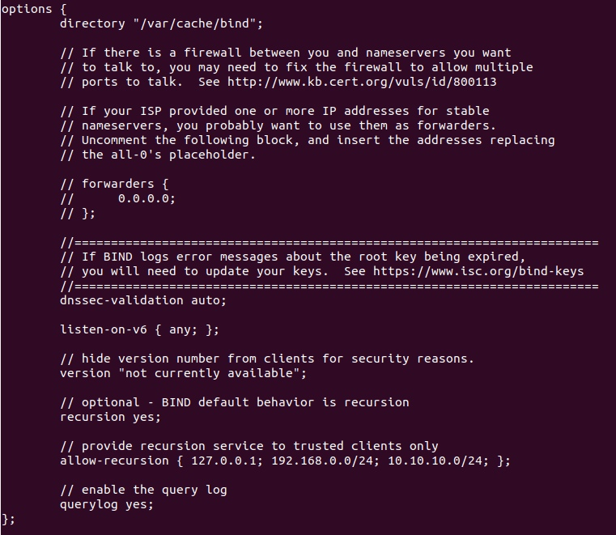

<style>
  table {
    width: 100%
    }
  td {
    vertical-align: center;
    text-align: center;
  }
  table.inputT{
    margin: 10px;
    width: auto;
    margin-left: auto;
    margin-right: auto;
    border: none;
  }
  input{
    text-align: center;
    padding: 0px 10px;
  }
  iframe{
    width: 100%;
    display: block;
    border-style:none;
    overflow:hidden;
  }
</style>


# 伺服器种类

 - 网页伺服器 Web server
 - 网域名称系统伺服器 DNS server
 - 网路地址转译伺服器 NAT server
 - 代理伺服器 Proxy server
 - 资料库伺服器 Database server
 - 档案伺服器 File server
 - 动态主机组态协定伺服器 DHCP server
 - 档案传输协定伺服器 FTP server
 - 邮件伺服器 Mail server
 - 应用伺服器 Application server
 - 网路录影伺服器 NVR Server
 - 游戏伺服器


## 网页服务器

网页服务器的主要工作是根据发送的请求，回传静态的网页文件（ HTML 页面、文件、图片、影片），并且通常通过 HTTP 协议来进行。

### 安裝

```
$ sudo apt update
$ sudo apt install apache2
$ sudo systemctl enable apache2
$ sudo systemctl status apache2
```

### 服务器配置

- /etc/apache2：Apache <font color="#FF1000">配置文件</font>都驻留在此处。
- /etc/apache2/apache2.conf：主要配置文件。 修改它以更改<font color="#FF1000">全局配置</font>及加载配置目录中的其他文件。
- /etc/apache2/ports.conf：此文件指定<font color="#FF1000">侦听的端口</font>。 默认端口为 80，及 SSL 端口 443。
- /etc/apache2/sites-available/：可以存储每个站点虚拟主机的目录。不会使用此目录中找到的配置文件，除非它们链接到启用站点的目录。 通常，所有服务器块配置都在此目录中完成，然后通过使用 a2ensite 命令链接到其他目录来启用。
- /etc/apache2/sites-enabled/：存储已启用的每站点虚拟主机的目录。 通常，这些是通过使用 a2ensite 链接到站点可用目录中的配置文件来创建的。在启动或重新加载时读取此目录中的配置文件和链接以编译完整的配置。
- /etc/apache2/conf-available/ & /etc/apache2/conf-enabled/：这些目录与sites-available 和 sites-enabled 目录具有相同的关系，但用于存储不属于某个目录的配置片段。 虚拟主机。  conf-available 目录中的文件可以使用 a2enconf 命令启用，使用 a2disconf 命令禁用。
- /etc/apache2/mods-available/ &/etc/apache2/mods-enabled/：这些目录分别包含可用和启用的模块。 以 .load 结尾的文件包含加载特定模块的片段，而以 .conf 结尾的文件包含这些模块的配置。 可以使用 a2enmod 和 a2dismod 命令启用和禁用模块。

## 网域名称系统伺服器

DNS 服务是一种全球分布的服务，将 www.example.com 名称转换为 192.0.2.1 等数字 IP 地址，供电脑用于互相连接。工作原理和电话簿类似，管理名称和数字之间的映射关系。以控制最终在 Web 浏览器中输入网域名称时要连接的地址。

### 安裝

```
$ sudo apt-get update
$ sudo apt-get install bind9
$ sudo apt-get install dnsutils
$ sudo systemctl enable bind9
```

### 本地 DNS 解析器的配置

- /etc/bind/：配置文件的目录
- named.conf：主要配置文件，包括其他三个文件的配置
   - /etc/bind/named.conf.options 添加递归语句中的 IP 地址替换为本地网络地址。
   - /etc/bind/named.conf.local
   - /etc/bind/named.conf.default-zones
 - db.127：localhost IPv4 反向映射区域文件
 - db.local：localhost 转发 IPv4 和 IPv6 映射区域文件
 - db.empty：空区域文件

#### named.conf.options



## 網路位址轉譯伺服器安裝

```
$ sudo apt-get install iptables
$ sudo sysctl -w net.ipv4.ip_forward=1
$ sudo iptables -t nat -A POSTROUTING -o <外网接口> -j MASQUERADE
$ sudo sh -c "iptables-save > /etc/iptables.rules"
$ sudo systemctl enable iptables.service 
```
### 开机自动加载 iptables 规则

启动系统时自动加载 iptables 规则，可以通过以下步骤实现：

- 创建 /etc/network/if-pre-up.d/iptablesload 文件

```
$ sudo vi /etc/network/if-pre-up.d/iptablesload
```

- 添加以下内容到文件中并保存

```
#!/bin/bash
iptables-restore < /etc/iptables.rules
```

- 执行权限

```
$ sudo chmod +x /etc/network/if-pre-up.d/iptablesload
```

### 例子

```
# 定义变量
WAN_IF="ppp0"
WAN_IP="212.xx.99.22"
LAN_IF="eth0"
LAN_IP="192.168.100.0/24"

# iptables 是内核模块，必须先加载
modprobe ip_tables
modprobe iptable_nat
modprobe iptable_filter
modprobe iptable_mangle
modprobe iptable_raw
modprobe ipt_state
modprobe ipt_limit
modprobe ipt_LOG

# 選擇性模组
modprobe ipt_owner
modprobe ipt_REJECT
modprobe ipt_REDIRECT
modprobe ipt_MASQUERADE

# 加载追踪连线模组
modprobe ip_conntrack
modprobe ip_conntrack_ftp
modprobe ip_conntrack_irc

# 清除防火牆设置
iptables -F
iptables -X
iptables -Z
iptables -t nat -F
iptables -t nat -X
iptables -t nat -Z
iptables -t mangle -F
iptables -t mangle -X

# 刷新防火牆设置
iptables -P INPUT DROP
iptables -P OUTPUT ACCEPT
iptables -P FORWARD ACCEPT
iptables -t nat -P PREROUTING ACCEPT
iptables -t nat -P POSTROUTING ACCEPT
iptables -t nat -P OUTPUT ACCEPT

# 接受来自 LOCALHOST 的连接 loopback
iptables -A INPUT -i lo -j ACCEPT

# 防火墙规则
iptables -A INPUT -m state --state NEW -p tcp --dport 80 -j ACCEPT
iptables -A INPUT -m state --state NEW -p tcp -s 210.xx.33.99 --dport 21 -j ACCEPT

# NAT 来源设置
iptables -A INPUT -i $LAN_IF -j ACCEPT
echo "1" > /proc/sys/net/ipv4/ip_forward
iptables -A POSTROUTING -t nat -o $WAN_IF -s $LAN_IP -j SNAT --to $WAN_IP

# NAT 目标设置
iptables -t nat -A PREROUTING -p tcp -i ppp0 --dport 80 -j DNAT --to 192.168.100.104:80

# 接受来自 ESTABLISHED 和 RELATED 的连接
iptables -A INPUT -m state --state ESTABLISHED,RELATED -j ACCEPT
```

## 代理伺服器

代理服务器接受用户的请求之后会先检查自己的服务器上有没有一个客户端要的数据，如果没有则代理客户端目的地到截取去除了一个给客户端。同样的下一个客户端用户提出请求时，代理服务器也会先在服务器中检查看看，如果有的话，则再检查与目的端的数据是否一致，若一致则由 Proxy 服务器直接给要求的客户端即可。

工作方式与防火墙规则类似。 Squid 从上到下读取规则，当一个规则匹配时，后面的规则，将不进行处理。

### 安裝

```
$ sudo apt-get update
$ sudo apt-get upgrade
$ sudo apt-get install squid
```

### 配置文件

```
$ sudo vi /etc/squid/squid.conf

acl client src 192.0.2.0 # Home IP
http_access allow client
http_access deny all
```
- <font color="#FF1000">端口配置</font>：Squid 默认监听 <font color="#FF1000">3128</font> 端口，如果想改变这个端口，可以修改配置文件中的 <font color="#FF1000">http_port</font> 选项。

- <font color="#FF1000">访问控制</font>：Squid 提供了多种访问控制功能，允许您控制客户端可以访问代理服务器。 可以使用 <font color="#FF1000">acl</font>（访问控制列表）和 <font color="#FF1000">http_access</font> 选项来定义客户端访问规则。

- <font color="#FF1000">缓存</font>：Squid 可用于缓存经常访问的网页，减少检索它们所需的带宽量。可以配置 <font color="#FF1000">cache_dir</font> 和 <font color="#FF1000">cache_mem</font> 选项来定义缓存存储选项。

- <font color="#FF1000">身份验证</font>：Squid 支持多种身份验证方法，可用于控制对代理服务器的访问。可以使用 <font color="#FF1000">auth_param</font> 和 <font color="#FF1000">auth_acl</font> 选项来定义身份验证设置。

### 设置代理身份验证

配置 Squid HTTP 代理以接受使用用户名和密码的身份验证。可以安装 Apache 实用程序来安装 htpasswd。 如果已安装 Apache，则已经拥有它并且可以跳过此步骤。

```
$ sudo apt-get install apache2-utils
$ sudo touch /etc/squid/squid_passwd
$ sudo chown proxy /etc/squid/squid_passwd

# 重复此步骤来创建新用户
$ sudo htpasswd /etc/squid/squid_passwd dicky

New password:
Re-type new password:
Adding password for user dicky

$ sudo dpkg -L squid | grep ncsa_auth
$ sudo vi /etc/squid/squid.conf

auth_param basic program /usr/lib/squid/basic_ncsa_auth /etc/squid/squid_passwd
acl ncsa_users proxy_auth REQUIRED
http_access allow ncsa_users
```


```
# 列出连接
$ netstat -tulnp

# 列出 log 文件
$ journalctl -xeu squid.service
```


```
$ sudo systemctl enable squid
```