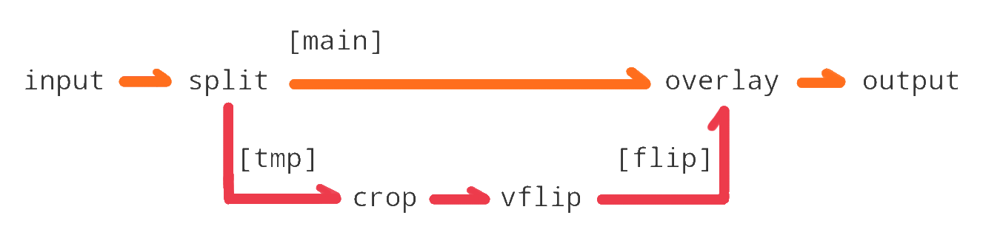
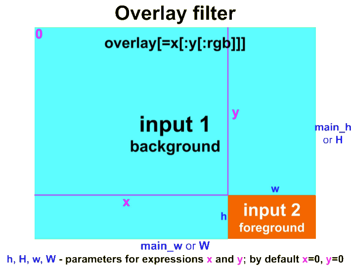

<style>
  table {
    width: 100%
    }
  td {
    vertical-align: center;
  }
  table.inputT{
    margin: 10px;
    width: auto;
    margin-left: auto;
    margin-right: auto;
    border: none;
  }
  input{
    text-align: center;
    padding: 0px 10px;
  }
  iframe{
    width: 100%;
    display: block;
    border-style:none;
  }
</style>


# 前言

FFmpeg 是一个完整的跨平台音视频解决方案，它可以用于处理音频和视频的转码、录制、流化处理等应用场景。

[官网：http://ffmpeg.org/](http://ffmpeg.org/)


## Linux 下安装方法

```
$ apt install ffmpeg
```

FFmpeg 有三大利器，分别是 

- **ffmpeg** 主要是多媒体的编解码工具，具体功能主要包括视频裁剪，去除水印，添加 logo，提取封面，提取音频，提取视频等功能。
   - ffmpeg的主要工作流程相对比较简单如下
   


   - 其中需要经过六个步骤，
      - ffmpeg 首先读取输入源
      - 用 Demuxer 将音视频包进行解封装
      - 通过 Decoder 进行解码，将音视频通过Decoder 解码成为 YUV 或者 PCM 数据
      - 再通过 Encoder 将对应的数据进行编码  
      - 将编码后的音视频数据包通过 Muxer 进行封装
      - 最终输出为输出流

- **ffprobe** 是多媒体分析工具，比如音视频的参数、媒体容器的参数信息等。也可以分析媒体文件中每个包的长度、包的类型、帧的信息等。
- **ffplay** 提供了音视频显示和播放相关的图像信息，音频的波形信息等。简而言之就是一个播放器。
 
# ffmpeg-python

## 字幕样式

要改变字幕样式的外观，需要考虑包括应该支持字幕的内容、时间性和外观细节的文本文件。
给出了详细的出现顺序、时间和字幕内容。指定有关字幕外观的任何细节。要更改字幕的外观，需要通过添加新属性来修改此文本文件。

### 字幕外观的属性列表

**Font**

  - FontName：字体名称（例如 Arial、Times New Roman 等）
 
**Fontsize**

 - Fontsize：字体大小（例如 20 表示 20 点字体大小）

**Color**

 - PrimaColour：字幕的 Prima 颜色，例如，“&H00FFFFFF”表示 ABGR 格式中的白色
 - OutlineColour：文本轮廓颜色，例如 “&H80000000” 表示 ABGR 格式的半透明轮廓
 - BackColour：字幕背景颜色，例如 “&H40000000” 表示半透明 ABGR 格式的背景

**Text style**

 - Bold：使文本变为粗体（1 为启用，0 为禁用） 
 - Italic：使文本变为斜体（1 为启用，0 为禁用） 
 - Underline：为文本添加下划线（1 为激活，0 为停用） 
 - StrikeOut：删除文本（1 为激活，0 禁用）

**Borders**

 - Outline：文本轮廓厚度（例如 2 表示 2 像素轮廓）
 - BorderStyle：边框样式（0为无边框，1为单边框）
 
**Alignment**

 - Alignment：字幕的水平对齐方式（例如2为中心，7为屏幕底部）
 
**Spacing**

 - MarginL、MarginR、MarginV：左、右和垂直文本边距（例如 20 表示 20
 像素）


## 字幕样式例子

```
import ffmpeg

videoSrc = "video.mp4"
audioSrc = "audio.mp3"
outFile = "output.mp4"
srtFile = "source.srt"

style="FontName=Roboto,Bold=1,Italic=0,Fontsize=10,PrimaryColour=&H00ff3333,OutlineColour=&H20ffffff,Outline=1,BorderStyle=1"
        
input_video = ffmpeg.input(videoSrc)
input_audio = ffmpeg.input(audioSrc)
out = (ffmpeg.concat(input_video, input_audio, v=1, a=1)
       .filter('crop', w=300, h=300, x=0, y=0)
       .filter("subtitles", srtFileName, force_style=style)
       .output(outFile, vcodec='libx264', crf=iCRF, loglevel="error")
       )
ffmpeg.run(out, overwrite_output=True)
```

**concat** 将视频和音频合并到一个文件，参数
 - n 例子中没有显示，n 默认为 2。 
 - v 表示视频：将存储在第 1 部分，默认为 1。
 - a 表示音频：将存储在第 1 部分，默认为 0。 即音频将存储在每个视频流中。


**crop** 过滤器将视频裁剪或调整为任意尺寸并删除无水印的黑色边框，
 - w 表示宽度
 - h 表示高度
 - x 表示左侧
 - y 表示顶部
 
如果不设置 x 和 y ，则参考位于视频流的中央

**CRF** (恒定速率因子) 的范围是 0-51，其中 0 是无损的仅适用于8位，10位使用-qp 0，23 是默认值，51 是可能的最差质量。 一般较低的值会带来更高的质量，合理的范围是 17-28。17 或 18 在视觉上是无损的；它看起来应该与输入相同或几乎相同，但事实并非如此只是技术上无损。


## 常用函数
- compile()：编译二进制文件。
- get_ffmpeg_version()：获取FFmpeg版本号。
- get_ffprobe_version()：获取FFprobe版本号。
- get_platform()：获取平台信息。
- get_available_filters()：获取可用的过滤器列表。
- get_available_formats()：获取可用的媒体格式列表。
- input()：指定输入文件或视频流。
- output()：指定输出文件或视频流。
- run()：运行命令进行转码处理。
- filter()：为指定的输入或输出添加过滤器。
- overlay()：将视频叠加到另一个视频上。
- concat()：将多个视频合并。
- split()：将视频拆分成多个片段。
- trim()：裁剪输入视频的指定部分。
- setpts()：调整视频帧速率。
- drawtext()：在视频中添加文本。
- scale()：调整视频大小和比例。
- pad()：调整视频的宽度和高度。
- hflip()：水平翻转视频。
- vflip()：垂直翻转视频。
- transpose()：旋转90度，逆时针或顺时针旋转。
- autorotate()：根据元数据自动旋转视频。
- mute()：去除音频轨道。
- audio：指定音频参数，如采样率、声道数等。
- video：指定视频参数，如帧率、像素格式等。


## 其它

- ffmpeg.get_ffmpeg_version()：获取FFmpeg的版本号
- ffmpeg.get_ffprobe_version()：获取FFprobe的版本号
- ffmpeg.get_media_info(filename)：获取媒体文件的信息，包括时长、码率、分辨率等
- ffmpeg.get_thumbnail(filename, time, output_path)：获取视频文件指定时间的缩略图
- ffmpeg.get_video_thumbnail(filename, time, output_path)：获取视频文件指定时间的视频缩略图
- ffmpeg.get_audio_thumbnail(filename, time, output_path)：获取音频文件指定时间的音频波形图
- ffmpeg.convert(input_path, output_path, options)：将媒体文件转换为指定格式，可以指定多种转换选项
- ffmpeg.trim(input_path, output_path, start_time, duration)：剪辑媒体文件，可以指定剪辑起始时间和持续时间
- ffmpeg.concat(input_paths, output_path)：将多个媒体文件拼接成一个文件
- ffmpeg.overlay_video(overlay_path, base_path, output_path, options)：将视频文件叠加到另一个视频文件上
- ffmpeg.overlay_audio(overlay_path, base_path, output_path, options)：将音频文件叠加到另一个音频文件上
- ffmpeg.add_watermark(input_path, output_path, watermark_path, options)：给视频文件添加水印
- ffmpeg.extract_audio(input_path, output_path, options)：从视频文件中提取音频
- ffmpeg.extract_video(input_path, output_path, options)：从视频文件中提取视频
- ffmpeg.extract_subtitle(input_path, output_path, options)：从视频文件中提取字幕
- ffmpeg.extract_frame(input_path, output_path, time, options)：从视频文件中提取指定时间的帧
- ffmpeg.add_subtitle(input_path, output_path, subtitle_path, options)：给视频文件添加字幕
- ffmpeg.add_audio(input_path, output_path, audio_path, options)：给视频文件添加音频
- ffmpeg.add_video(input_path, output_path, video_path, options)：给音频文件添加视频
- ffmpeg.add_effect(input_path, output_path, effect_name, options)：给媒体文件添加特效


## 基础用法例子

使用 FFmpeg-python 裁剪视频文件的前10秒钟

```
import ffmpeg
input_file = 'input.mp4'
output_file = 'output.mp4'
# 裁剪前十秒
ffmpeg.input(input_file).trim(start=0, duration=10).output(output_file).run()
```


## 更换音频

```
$ ffmpeg -i video.mp4 -i audio.wav -map 0:v -map 1:a -c:v copy -shortest output.mp4
```


- map 0:v (仅 0 频道视频), map 1:a (仅 1 频道音频) 选项允许手动选择流/轨道。 
- c:v copy 来流复制视频。不会发生视频重新编码。质量得到保证并且过程很快。如输入音频格式与输出格式兼容 -c:v copy 更改为 -c copy 以流复制视频和音频。如果重新编码视频和音频请删除 -c:v copy / -c copy。
- shortest 选项将使输出的持续时间与最短输入的持续时间相同。

```
$ ffmpeg -i video.mkv -i audio.mp3 -map 0 -map 1:a -c:v copy -shortest output.mkv
```


- map 0 (0频道 音频及视频) 选项允许手动选择流/轨道。

### map 选项选择流

 map 选项用于选择输入中的哪些流应包含在输出中。还可用于排除具有负映射的特定流。


第一个命令不使用任何流说明符。是一种绝对的映射方法，是绝对的映射方法，无论类型如何，都会选择特定的流 即使它被指定 -map 1:3 指“第二个输入：第四个流”。

第二个命令包括流说明符（v 表示视频，a 表示音频）以将流限制为特定类型。 -map 1: a:2 指“第二个输入：仅音频：第三个音频流”。

## 背景噪音降低

- 添加带通滤波器以降低噪声水平

```
$ ffmpeg -i input_file -af "highpass=f=200, lowpass=f=3000" output_file
```

- 使用快速傅立叶变换对音频样本进行降噪, 将信号转换为单独的频谱分量.

```
$ ffmpeg -i input.mp4 -af "afftdn=nf=-25" output.mp4
```

## 音频(响度)标准化

使用 ffmpeg 对音频进行 Loudness normalization使用的时EBU R.128标准，同时也需要进行两次处理，分别获取当前音频的具体数值，以及使用获取到的具体数值作为参数用 ffmpeg 对音频进行修正。

```
$ ffmpeg -i <b>input.wav</b> -af loudnorm=I=-16:TP=-1.5:LRA=11:print_format=json -f null -

{
  "input_i" : "-23.54",
  "input_tp" : "-7.96",
  "input_lra" : "0.00",
  "input_thresh" : "-34.17",
  "output_i" : "-23.09",
  "output_tp" : "-7.51",
  "output_lra" : "0.00",
  "output_thresh" : "-33.72",
  "normalization_type" : "linear",
  "target_offset" : "7.09"
}

$ ffmpeg -y -i input.wav -af loudnorm=I=-16:TP=-1.5:LRA=11: 
measured_I=-23.54:measured_TP=-7.96:measured_LRA=0.00:
measured_thresh=-34.1:offset=7.09:print_format=summary
-ar 16k out.wav
```

注意:的是 loudnorm 过滤器使用 3 秒 的重叠音频窗口来计算源中的短期响度，从而调整目标位置以符合目标参数。所以当文件时常不足3秒时，可能输出结果会出现较大偏差，这时候可以将文件多重复几次直到足够3秒，执行标准化之后在裁剪为原来的长度。

###  响度归一化 (Loudness Normalization) 

测量源文件的积分响度，计算适当的偏移增益，然后应用补偿增益。 这是一个非常简单的算法.当没有足够的空间来进行简单的向上线性增益调整时该怎么办？ 我们应该如何处理直播的响度标准化？

- 想要将该音频的响度标准化为 -16.0 LUFS IL，最大真实峰值为 -1.5 dBTP，这些值在 AES 流响度建议范围内，我们将需要一个动态的非线性算法。

### 真实峰值（True Peak）

峰值就是波形振幅的波峰值（波形有波谷和波峰之分），说白了就是波形瞬态的最大电平值。

当峰值的持续时间超过一定的时间时（通常是几毫秒），才会计算出比较准确的峰值，而 EBU 给出了一种新的算法，无论它的持续时间有多短，都能正确的测量出其波形的真实峰值水平，故此称其为真峰值。它是用来检测信号有没有过载的，一旦信号过载就会被削波造成信号失真，正因如此，EBU给出建议为真峰值不要超过 -1 dBTP，目的就是防止信号产生过载削波，其单位为 dBTP (dB True Peak真实峰值），对应的值是dBFS值。

### 响度范围（Loudness Range, LRA）

响度范围,用来描述音频的响度反差,即音频短时响度电平的离散度,或者说最常出现的那85％的响度的分布范围,它决定着是否根据目标受众对音频的动态范围进行压缩.响度范围的大小与节目类型有关.
    
 - 流行音乐、广告等节目通常都进行了良好的压缩、激励甚至削波处理,响度范围小（一般为 2～5 LU）能量集中,听起来很破甚至非常吵闹,压迫感强烈；
 - 新闻、访谈节目的响度范围比较适中,听感较为舒适（6～10 LU）；
 - 电影、电视剧、戏曲、交响乐等节目出于艺术表现,响度范围较大（10 LU以上）,声音比较闷, 经压限处理之后才能在电视上良好地重放.

## 音频的均衡化

```
$ ffmpeg -i input.wav -af "equalizer=f=1000:width_type=h:width=200:g=-10" output.wav
```

参数说明 (可以使用逗号添加不同的频谱)
        
 - f 中心频率，单位 Hz
 - width_type 用于定义带宽，可以是 
    - h Hz
    - q Q 因子
    - o 倍频程
    - s 斜率
 - width 所选带宽的值
 - g 增益


上述命令中的 <b>equalizer</b> 是一个平衡器滤镜，它可以对指定频率范围内的音频信号进行音量调整。在例子中选择了 1000Hz 的频率范围，设置带宽宽度为 200Hz ，并在该范围内减小 10dB 的音量。


## 滤镜

滤镜(filter) 指的是修改未编码的原始音视频数据帧的一种软件工具。滤镜分为音频滤镜和视频滤镜。FFmpeg 提供了很多内置滤镜，可以用很多方式将这些滤镜组合使用。通过一些复杂指令，可以将解码后的帧从一个滤镜引向另一个滤镜。这简化了媒体处理，因为有损编解码器对媒体流进行多次解码和编码操作会降低总体质量，而引入滤镜后，不需要多次解码编码操作，相关处理可以使用多个滤镜完成，而滤镜处理的是原始数据，不会造成数据损伤。


### 在视频上添加徽标

```
$ ffmpeg.exe -i input.mp4 -i logo.png -filter_complex “overlay=X:Y” output.mp4
```
 - -filter_complex "overlay=X:Y" 是指定要覆盖图像的选项，X 和 Y 是图像左侧和顶部像素位置。视频左上角参考为零。


### 过滤器链语法和结构 [ ]

- [0:v] **0** 为输入文件的**次序**，**v** 为所選**视频**的轨道。 [0\:v\:0] 是视频过滤器的默认输入视频轨道，注意由 **0** 开始。
  - 例子如下:  
    - 想要第一个输入文件的第一个视频轨道 - [0\:v\:0] 
    - 第二个输入文件的第二个音轨 [1\:a\:1]。
   

 - 根据需要命名。 通常，**-map** 用于对输出文件中的轨道进行重新排序。以下例子使新文件从两个输入文件重新排序
 
```
-map 1:v:0 -map 0:a:1 -map 0:a:0
```


 - filter 的输入上，[0:v] 和 [0:a] 指的是真实输入。
 经过过滤器后，可以设为的任何喜欢的名称如 [pad]。 如使用complex filter，[pad] 就成为一个虚拟的命名的输入。

 - complex filter 将真实输入 [0:v] 转换为虚拟输入 [ol]、[cr]、[v] 等。但此后它们将被后续过滤器和映射命令视为其他类型的输入。

### 参数括号表示法

ffmpeg 中的 **-filter** (简单滤镜)/**-vf** (视频滤镜)/**-af** (音频滤镜) 和 **-filter_complex** (特殊的滤镜) 选项以及 ffplay 中的 **-vf**/**-af** 中函数识别。过滤器链由一系列连接的过滤器组成，每个过滤器都连接到序列中的前一个过滤器。 过滤器链由 <font color="#FF0010">,</font> 分隔的过滤器描述列表表示。

 - 简单滤镜：“-vf” 等同 “-filter:v”，“-af” 等同 “-filter:a”
 - 复杂滤镜：“-lavfi” 等价于 “-filter_complex”


过滤器图由一系列过滤器链组成。 过滤器链序列由 **;** 分隔的过滤器链描述列表表示。

 
filter_name 是所描述的过滤器是实例的过滤器类的名称，且必须是程序中注册的过滤器类名称。 过滤器类的名称后面可以选择字符串“key=arguments”。

 参数是一个字符串，其中包含用于初始化过滤器实例的参数。 它可能有以下两种形式之一：

 - 短式 (要留心参数顺序) **:** 分隔的 **key=value** 对列表。

    - 在情况下，假定键是按照声明顺序排列的选项名称。 
    - 例如。 **fade** 过滤器按顺序声明有三个选项 - type、start_frame 和 nb_frames。 那么参数列表 **in:0:30** 表示将 **in** 中的值分配给选项类型，**0** 分配给 **start_frame**，**30** 分配给 **nb_frames**。

 - 長式 (参数顺序随意) **:** 分隔的混合直接值和长 **key=value** 对的列表
    - 直接值必须位于 **key=value** 对之前，并遵循与前一点相同的约束顺序。 可以按任何首选顺序设置以下 **key=value**，须加参数名称。


过滤器由以下形式的字符串表示：
 


 - 如果选项值本身是一个项目列表（例如，格式过滤器采用像素格式列表），则列表中的项目通常用 **\|** 分隔。

 - 参数列表可以使用字符 **'**  作为起始和结束标记，并使用字符 **\\** 来转义引用文本中的字符； 否则，当遇到下一个特殊字符（属于集合 **<font color="#FF0010">[]=;,</font>** ）时，参数字符串被视为终止。


 - 过滤器的名称和参数可以选择在前面和后面加上链接标签列表。 链接标签允许命名链接并将其关联到过滤器输出或输入板。 前面的标签 **i0 ... iN** 与滤波器输入板关联，后面的标签 **o0 ... oN** 与输出板关联。

 - 当在过滤器图中找到两个具有相同名称的链接标签时，将在相应的输入和输出之间创建链接。

 - 如输出未标记，则默认情况下它将链接到过滤器链中下一个过滤器的第一个未标记输入。

 - 在过滤器描述中，如未指定标记第一个过滤器的输入标签，则假定为 **in** ； 如果未指定标记最后一个过滤器的输出标签，则假定为 **out** 。在完整的滤波器链中，必须连接所有未标记的滤波器输入和输出。如所有滤波器链的所有滤波器输入和输出都已连接，则滤波器图被视为有效。

Filtergraph 规范中分隔标记的前导和尾随空格 (**space**, **tabs** 或 **line feeds**) 将被忽略。即过滤器图可以使用空行和空格来表达，以提高可读性。


#### 应用实例



命令行输入

```
$ ffmpeg -i INPUT -vf "split[main][tmp];[tmp]crop=iw:ih/2:0:0,vflip[flip];[main][flip]overlay=0:H/2" OUTPUT
```

同一线性链中的过滤器以 **,** 分隔，不同线性链的过滤器以 **;** 分隔。 在示例中，**crop**、**vflip** 位于一个线性链中，**split** 和 **overlay** 分别位于另一线性链中。线性链连接的点由方括号内的名称标记。 在示例中，分割过滤器生成与标签 [main] 和 [tmp] 关联的两个输出。

发送到 split 的第二个输出（标记为 **[tmp]**）的流通过裁剪过滤器进行处理，该过滤器会裁剪掉视频的下半部分，然后垂直翻转。 覆盖过滤器接收分割过滤器的第一个未更改的输出（标记为 **[main]**），并覆盖由 **crop** , **vflip** 过滤器链生成的输出的下半部分。

### Overlay 常用参数能介绍

[**背景窗口**][**前景窗口**]overlay[**输出窗口**]



 - 主畫面视频宽度和高度
   - main_w, W
   - main_h, H

 - 叠加视频宽度和高度
   - overlay_w, w 
   - overlay_h, h

 - X，Y
   - x 和 y 的计算值。它们会针对每个新帧进行评估。

 - eof_action
   - 当辅助输入遇到 EOF 时采取的操作； 它接受以下值之一：
       - repeat 重复最后一帧（默认）
       - endall 结束两个流。
       - pass 传递主输入

### 输入 movie

```
$ ffmpeg -i input.mp4 -filter_complex "movie=in.avi[over];[0][over]overlay=16:16[out]" -itsoffset 5 output.mp4
```

參数 -i 是 Main options 输入和处理分离，通过 [id:v] 来取输入源，缺点在于当输入源过多时，需要标记每个输入源的 **id**。


而 movie 是一个 filter 可以写在 filter_complex 中，好处是可以随时用随时输入，不需要去记输入源的id，缺点在于很多 Main options 参数用不了，如 itsoffset 延时播放。

### 视频拼接

```
ffmpeg -i input1.mp4 -i input2.webm -i input3.mov -filter_complex "[0:v:0][0:a:0][1:v:0][1:a:0][2:v:0][2:a:0]concat=n=3:v=1:a=1[outv][outa]" -map "[outv]" -map "[outa]" output.mkv
```

concat filter 方式实际上是把所有的视频音频全部解码，统一为原始的音视频流，然后塞进编码器重新编码，因此速度和视频转码的效率是差不多的，这种方式兼容性没得说，能够应付绝大部分场景。如果是在复杂场景编码器不一样，分辨率不一样，concat filter是唯一的选择。

