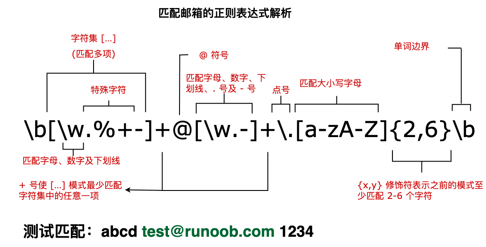

# 正則

正规表示式，简写为regex、regexp或RE，用简单字串来描述、符合文中全部符合指定格式的字串，很多文字编辑器都支援用正规表达式搜寻、取代符合指定格式的字串。

[在缐测试網站](https://regex101.com/)

一般例子

电邮例子

## 基本語法

|字元|	表示	|說明|
|:---:|:---|:---|
|字元|單純照字面上的意義|dog 可以用來匹配 dog 這字串；hello 101 則用來匹配 hello 101 這字串|
|\||管線符號用來將所有可能的選擇條件分隔開|gray \| grey 可以用來匹配 gray 或是 grey 字串|
|()|小括號，用來表示作用範圍或優先順序|gray\|grey 和 gr(a \| e) y 都同樣可以用來匹配 gray 或是 grey 字串|
|?|表示連續出現 0 次或 1 次|colou?r 可以用來匹配 color 或 colour|
|\*|表示連續出現 0 次或多次|ab*c 可以用來匹配 ac, abc, abbc, abbbc 或 abbbbbbc|
|+|表示連續出現 1 次或多次|ab+c 可以用來匹配 abc, abbc, abbbc, abbbbbbc，但 ac 不符合|
|{n}|匹配前面的模式恰好 n 次||
|{n,}|匹配前面的模式至少 n 次||
|{min,max}|表示至少連續出現 min 次，但最多連續出現 max 次|ab{1,3}c 可以用來匹配 "abc", "abbc", "abbbc" 等字串，但 "ac", "abbbbbbc", "adc", "a123" 不符合|
|.+|匹配到盡可能多的字|(.+)(\d+) 來匹配字串 "abcd1234"，group 1 會得到 "abcd123"，group 2 會得到 "4"，正是因為 greedy 的特性讓 .+ 匹配到盡可能多的字|
|+?, *?, {min,max}?, ??|匹配越少字為原則，盡可能匹配短結果| (.+?)(\d+) 來匹配字串 "abcd1234"，group 1 會得到 "abcd"，group 2 會得到 "1234"，正是因為 lazy 的特性讓 .+ 匹配到盡可能少的字|

## 字元類別 

|字元|	表示	|說明|
|:---:|:---|:---|
|. |匹配除了換行符號 (line breaks) \n \r 之外的任何一個字元|a.c 可以用來匹配 "abc", "aGc", "a c", "a5c", "a_c", "a#c" 等字串，但不能匹配 "a\nc"|
|[\s\S]|匹配任意一個字元，包含換行符號|a[\s\S]c 可以用來匹配 "abc", "aGc", "a c", "a5c", "a_c", "a#c", "a\nc" 等字串|
|\w |意思同等於 [A-Za-z0-9_]|pattern a\wc 可以用來匹配 "abc", "aGc", "a5c", "a_c" 等字串，但不能匹配 "a c", "a#c", "a\nc" 等字串|
|\W|匹配 \w 以外的所有字。等同於 [^A-Za-z0-9_]|a\Wc 可以用來匹配 "a c", "a#c", "a\nc" 等字串，但不能匹配 "abc", "aGc", "a5c", "a_c" 等字串|
|\d|匹配所有阿拉伯數字 0-9。等同於 [0-9]|a\dc 可以用來匹配 "a1c", "a5c" 等字串，但不能匹配 "abc", "aGc", "a_c", "a c", "a#c", "a\nc" 等字串|
|\D|匹配 \d 以外的所有字。等同於 [^0-9]|a\Dc 可以用來匹配 "abc", "aGc", "a_c", "a c", "a#c", "a\nc" 等字串，但不能匹配 "a1c", "a5c" 等字串|
|\s|匹配所有的空白字元 (whitespace) - 空白 (space)、tab 和換行符號 \r \n|a\sc 可以用來匹配 "a c", "a\nc" 等字串，但不能匹配 "abc", "aGc", "a_c", "a#c", "a1c", "a5c" 等字串|
|\S|匹配 \s 以外的所有字|a\Sc 可以用來匹配 "abc", "aGc", "a_c", "a#c", "a1c", "a5c" 等字串，但不能匹配 "a c", "a\nc" 等字串|
|[ ]|表示一個字元集合，整個中括號代表一個字元，裡面的內容就是這個字元的所有可能|a[abcde123]c 可以用來匹配 "abc", "a1c" 等字串，但不能匹配 "aGc", "a_c", "a#c", "a5c", "a c", "a\nc" 等字串。如果 [ ] 中有包含 ] 字元，你需要用反斜線 \ 來跳脫 (escape) 這一個特殊字元。a[\]]c 可以用來匹配 "a]c" 字串|
|[\^ ]|匹配不在字元集合裡面的字元|a[\^abcde123]c 可以用來匹配 "aGc", "a_c", "a#c", "a5c", "a c", "a\nc" 等字串，但不能匹配 "abc", "a1c" 等字串|
|[A-Z]|[ ] (或 [\^ ]) 中還可以用 - 符號來表示連續 (range) 的好幾個字元|a[a-zC-F3-7]c 其中 a-z 表示 a 到 z 所有的小寫英文字、C-F 表示大寫的 C 到 F (C D E F)、3-7 表示數字 3 到 7 (3 4 5 6 7)，可以用來匹配 "abc", "a5c" 等字串，但不能匹配 "a1c", "aGc", "a_c", "a#c", "a c", "a\nc" 等字串|

## 特殊字元列表

|特殊字元|	表示	|說明|
|:---:|:---|:---|
|\000	|octal escape character	|000 是一個 2~3 位數的數字，表示 ASCII 字元的八進位代碼。例如 \101 表示大寫英文字元 A|
|\xFF	|hexadecimal escaped character|	FF 是兩位數的數字，表示 ASCII 字元的十六進位代碼。例如 \x41 表示大寫英文字元 A|
|\uFFFF|	unicode escaped character	|FFFF 是一個 4 位數的數字，表示 UTF-16 code unit|
|\t	|tab character|标签字元|
|\n	|line feed character|換行字元|
|\v	|vertical tab character|垂直制表符字元|
|\f|form feed character|换页字元|
|\r	|carriage return character|回车字元
|\0	|null character|	无效字元|
|\\.	|"." character|	. 字元|
|\\\\ |	"\\" character|	\\ 字元|
|\+	|"+" character|\+ 字元|
|\*|	"*" character	|\* 字元|
|\?|	"?" character	|? 字元|
|\^	|"^" character|^ 字元
|\$|	"$" character	|$ 字元|
|\[|	"[" character|[ 字元|
|\]|	"]" character	|] 字元|
|\{	|"{" character	|{ 字元|
|\}	|"}" character|} 字元|
|\(	|"(" character	|( 字元|
|\)	|")" character|) 字元|
|\||"\|" character|\| 字元|
|\/	|"/" character|/ 字元|

## 群組

用小括號 ( ) 圈住的部分表示一個子樣式 (subexpression)，也稱作是一個群組 (group)。 有幾個用途：

- pattern 裡面的小括號可以用來擷取 (capture) 出子字串 (substring)，你最後可以從匹配群組 (capturing group) 的結果中取得這些子字串。
- pattern 裡面如果有小括號，那麼括號中匹配到的子字串是可以在 pattern 中再被取出來使用的，這行為稱作回朔 (backreference)。
- 小括號在 Regex 當中也有 group 的意思，用在把括號內的條件式當作是一個整體。例如 (foo){2,} 表示匹配連續出現兩次以上的 foo 字串，而不是像 foo{2,} 中的量詞 {2,} 只會作用在最後的 o 字元。

### 回朔

- 回朔 (backreference) 的語法用來引用一個 capturing group 的內容。回朔的語法是反斜線加上一個數字 \1，數字從 1 開始表示第一個 capturing group。

     - 例子：
        - pattern (\w)a\1，其中的 \1 表示 \w 擷取到的字元，我們拿來匹配字串 "hahaha"，得到的結果會是 "hah"。

### 群組命名

#### 加入命名

  - (?\<name\>regex)大多數程式語言的 Regex 引擎都支持 named group，意思就是幫每個 capturing group 命名，以方便後續的讀取和引用。

    - 例子：
       - (?\<x\>abc){3} 匹配 abcabcabc。 组 x 与 abc 匹配。。

#### 取出命名

  - \k\<name\> 則是用來取得 named group 的回朔 (backreference) 語法。

    - 例如
       -  (?\<x\>abc\|def)=\k\<x\> 匹配 abc=abc 或 def=def，但不匹配 abc=def 或 def=abc。。

## 錨點符號

|字元|	表示	|說明|
|:---:|:---|:---|
|^...開始|用來表示只匹配以 ...「開頭」的字串|^hello 可以用來匹配 "hello world" 字串，但不能匹配 "say hello 123"，因為 hello 出現在 "hello world" 的開頭，但 "say hello 123" 的 hello 不在開頭|
|...$|$ 用來表示只匹配以 ...「結尾」的字串|foo$ 可以用來匹配 "bar foo" 字串，但不能匹配 "foo bar"，因為 foo 出現在 "bar foo" 的結尾，但 "foo bar" 的 foo 不在結尾|
|\b|用來匹配單字邊界，表示字元的「前面」或「後面」除了空白字元、標點符號或是在字串開頭或結尾外不可再有其它字元。單字邊界可以看作是不屬於 \w 的字元|llo\b 可以用來匹配 "hello world", "hello\nworld", "hello", "hello, Mike"，但不能用來匹配 "hello_world", "helloworld", "hello101"。\bworld\b 可以用來匹配 "hello world", "hello~world", "world"，但不能用來匹配 "helloworld", "01world"|
|\B|用來匹配非單字邊界|llo\B 可以用來匹配 "hello_world", "helloworld", "hello101"，但不能用來匹配 "hello world", "hello\nworld", "hello", "hello, Mike"。\Bworld\B 可以用來匹配 "123worldxyz"，但不能用來匹配 "helloworld", "hello world", "world"|

## 環顧

錨點符號邊界條件是比較單純的單字邊界、行首、行末等，如果要處理匹配比較複雜的特定文字內容的邊界，這時就可以使用環顧語法。

### 正後環顧

用來檢視某文字後面連接的內容滿足指定條件的前提下，才會繼續進行匹配。

A(?=B) 括號中是想要檢視的內容，可以是一般的 Regex 語法，表示 A 後面必須是接著 B。

例如
- a(?=[bcd]) 表示 a 後面接的必須是 b, c 或 d 字元，可以用來匹配 "ab", "123acxyz" 等字串，但不能匹配 "a101", "ahi" 等字串。
- (?:foo)(?=hello) 表示找出 foo 且後面接的必須是 hello，可以用來匹配 "foohello", "this is foohello 123" 等字串，但不能匹配 "foohell", "123 foo hi", "oohello" 等字串。

### 負後環顧

用來檢視某文字後面連接的內容不滿足指定條件的前提下，才會繼續進行匹配。

A(?!B)  括號中是想要檢視的內容，可以是一般的 Regex 語法，表示 A 後面不能是接著 B。

例如

- a(?![bcd]) 表示 a 後面接的不能是 b, c 或 d 字元，可以用來匹配 "a101", "ahi" 等字串，但不能匹配 "ab", "123acxyz" 等字串。
- (?:foo)(?!hello) 表示找出 foo 且後面接的不能是 hello，可以用來匹配 "foohell", "123 foo hi" 等字串，但不能匹配 "foohello", "this is foohello 123", "oohello" 等字串。

### 正前環顧

用來檢視某文字前面連接的內容滿足指定條件的前提下，才會繼續進行匹配。

(?<=B)A 括號中是想要檢視的內容，可以是一般的 Regex 語法，表示 A 前面必須是接著 B。

例如
- (?<=[bcd])a 表示 a 前面接的必須是 b, c 或 d 字元，可以用來匹配 "ba", "123caxyz" 等字串，但不能匹配 "a101", "helloa" 等字串。
- (?<=hello)(?:foo) 表示找出 foo 且前面接的必須是 hello，可以用來匹配 "hellofoo", "this is hellofoo 123" 等字串，但不能匹配 "foohell", "123 foo hi", "hellooo" 等字串。

### 負前環顧

用來檢視某文字前面連接的內容不滿足指定條件的前提下，才會繼續進行匹配。

(?<!B)A 括號中是想要檢視的內容，可以是一般的 Regex 語法，表示 A 前面不能接著 B。

例如
- (?<![bcd])a 表示 a 前面接的不能是 b, c 或 d 字元，可以用來匹配 "a101", "helloa" 等字串，但不能匹配 "ba", "123caxyz" 等字串。
- (?<!hello)(?:foo) 表示找出 foo 且前面接的不能是 hello，可以用來匹配 "foohell", "123 foo hi" 等字串，但不能匹配 "hellofoo", "this is hellofoo 123", "hellooo" 等字串。

## 替換

|語法|	表示	|說明|
|:---:|:---|:---|
|$数字|表示匹配的群組，從 1 開始|如 $1 是第 1 個|
|${数字}|表示匹配的群組，從 1 開始。|如 ${1} 是第 1 個|
|${name}|	用來引用群組命名的值| 如 ${f} 是名为 f 的值|
|$$|用來跳脫的特殊意義，表示 $ 字元|如 $$ 是显示一个 $ 符号 |
|$&|用來引用整個匹配的字串|如 $& 是显示原文 ||
|$`|用來引用匹配字串的前面的所有字 (before match)||
|$'|用來引用匹配字串的後面的所有字 (after match)||
|$+|用來引用匹配的最後一個群組||
|$_|用來引用整個輸入的字|如 $_ 是将搜索文本替换为原始文本 |

## 修飾詞

|修飾詞|	表示	|說明|
|:---:|:---|:---|
|i|ignore case|	使用不區分大小寫的比對方式|
|m|multiline|使用多行模式，使 ^ 和 $ 會比對每一行的開頭與結尾，而不是輸入字串的開頭和結尾|
|s|singleline|使用單行模式，使句點會比對每個字元，而不是換行符號 \n 以外的每個字元|
|g|global search|	使用全局匹配模式。有時候希望重複匹配目標字串多次，使用 g flag 就可以保留 lastIndex 的狀態，讓下一次再匹配時，可以從 lastIndex 的位置開始找起，就可以遍歷整個文本中的所有可匹配字串，而不是每一次再匹配時都得到一樣的結果 (文本中從頭開始第一個找到的字串)。另外預設上，如果沒有開啟 g flag，Regex 引擎只會返回「第一個」匹配到的字串結果|