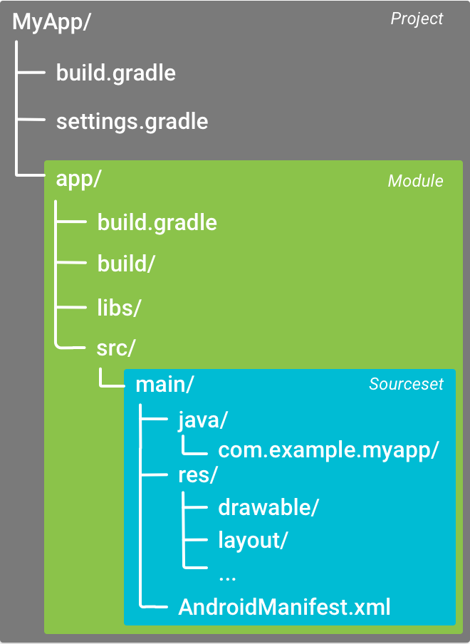

<style>
  table {
    width: 100%git clone https://github.com/hkdickyko/hkdickyko.github.io
    }
  td {
    vertical-align: center;
  }
  table.inputT{
    margin: 10px;
    width: auto;
    margin-left: auto;
    margin-right: auto;
    border: none;
  }
  input{
    text-align: center;
    padding: 0px 10px;
  }
  iframe{
    width: 100%;
    display: block;
    border-style:none;
  }
</style>

# Androidide

从 [Androidide 网站](https://androidide.com) 下载 Android ide 工具


## 使用 Gradle 创建发布签名的 apk 文件

signingConfigs 加 <font color="#FF1000">release</font> 内容及 buildTypes 加上 <font color="#FF1000">signingConfig signingConfigs.release</font> 这句

```
signingConfigs {    
  release {
    storeFile file('/storage/emulated/0/AndroidIDEProjects/mdnotes/keystore.jks')
    storePassword 'password'
    keyPassword 'password'
    keyAlias 'mdnotes'
  }

buildTypes {
  release {
    signingConfig signingConfigs.release
    minifyEnabled true
    proguardFiles getDefaultProguardFile('proguard-android-optimize.txt'), 'proguard-rules.pro'
    debuggable false
    multiDexEnabled true
  }
}

dependencies {
  implementation 'androidx.appcompat:appcompat:1.6.1'
  implementation 'com.google.android.material:material:1.8.0'
  implementation 'androidx.constraintlayout:constraintlayout:2.1.4'
  // adding Admob SDK
  implementation 'com.google.android.gms:play-services-ads:22.2.0'
}
```

## Android 项目的一般目录结构




