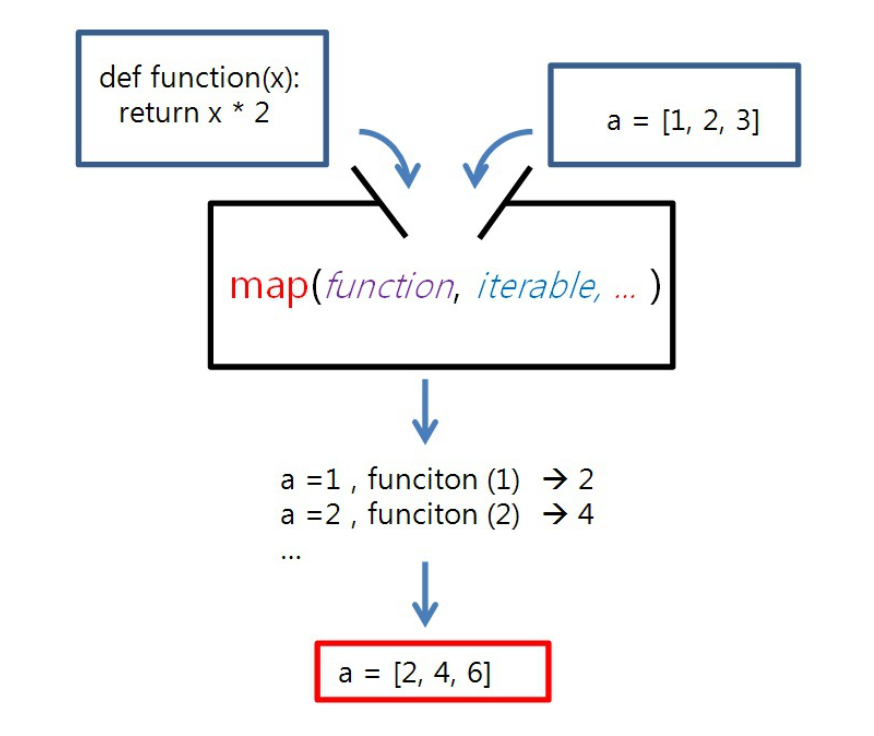
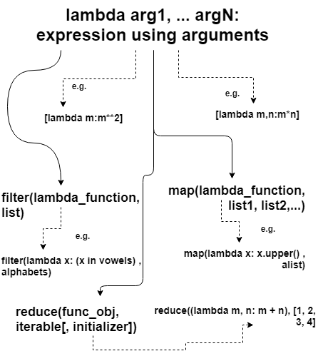

# 經常使用的 Python 功能

## subprocess

运行python時，都是在创建并运行一个进程，Python是通过标准库中的 subprocess 包来 fork 一个子进程，并且运行一个外部的程序。subprocess 包中定义有数个创建子进程的函数，这些函数分别以不同的方式创建子进程，所欲可以根据需要来从中选取一个使用。另外 subprocess 还提供了一些管理标准流 (standard stream) 和管道 (pipe) 的工具，从而在进程间使用文本通信。

 - subprocess.run()
   - 父程序等待子程序完成。完成返回的不是执行结果，而是一个CompletedProcess类型对象。
   - CompletedProcess类有下面这些属性：
       - args 启动进程的参数。
       - returncode 进程结束码。0表示成功状态。
       - stdout 获取子进程的输出结果。
       - stderr 获取子进程的错误信息。
       - check_returncode 用于检查返回码。如返回状态码不为零则为错误。
    - 当args是个字符串是，请设置shell=True，当args是个列表的时候，shell保持默认的alse。

 - subprocess.call()
   - 父程序等待子程序完成。成功則返回0。


 留意: **args** 可以是字符串，也可以是列表，如果是字符串的话，会被当做shell命令，必须指定 **shell=True**。

 ## list & map

 ### 将文本数组转换为整数

```
$ list(map(int, array))
```   





