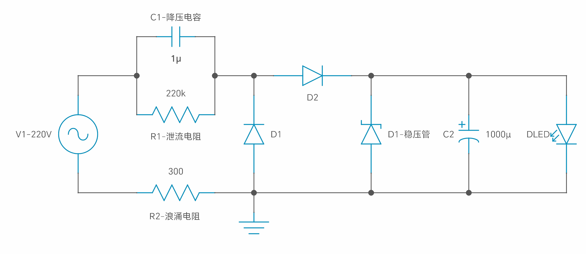
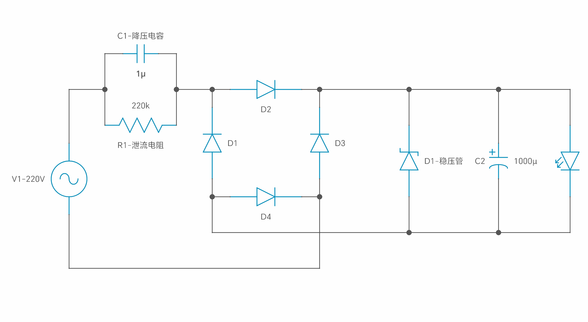

# 无火牛电源供应器

- 根据负载电流和交流工作频率选择合适的电容器，而不是依据负载的电压和功率；
- 限流电容器必须是无极性电容器，不得使用电解电容器。电容电压必须在400V以上，最理想的电容器是铁壳油浸电容器；
- 电容降压器不能在大功率条件下使用，因为它不安全；
- 电容降压器不适用于动态负载条件；
- 电容降压器不适用于容性和感性负载；
- 当需要直流操作时，应尽量采用半波整流。不建议使用桥式整流器。而要满足恒载的条件。

### 降压电容

电容值设计

由以下公式，电容一般都是以 μF 计算，换算一下，就可以得出，每 1μF 电容的输出电流如下：

 > 半波整流：整流的平均值系数为 0.44 ，所以电压 U 为 0.44* 220 V，此时可以计算出电流：

 - Ic = 0.44 * 220 * 2 * 3.14 * 50 * C（A）≈ 30000 C （A）

 - 半波整流得到的电流平均值为 30 mA/μF，

 > 全波整流：整流的平均值系数为 0.89 ，所以电压 U 为 0.89* 220 V，此时可以计算出电流：

 - Ic = 0.89 * 220 * 2 * 3.14 * 50 * C（A）≈ 60000 C （A）

 - 全波整流得到的电流平均值为 60 mA/μF。

电容可以限流，但是不能限压，所以需要一个稳压二极管匹配负载所需要的电压。阻容降压电路中，所限制的是这个电路工作的最大电流，电流大小由电容的值决定，而最终的输出电压由稳压二极管决定。

 - 注意，阻容降压电路的寿命关键在于 **降压电容**，所有的电容都会有衰减，容量会变得越来越低，在选取的时候应该选择专用的阻容降压电容，相对来说衰减慢一些，电路寿命也会更长。

### 泄流电阻

耐压大于降压电容的电压，功率要注意，也可以使用两个电阻串联起来，比较安全。

断电后为降压电路提供放电回路，一般要求断电后降压电容电压衰减到 **37%** 的时间应小于 **1** 秒

 - RC < 0.37
 - R < 0.37 / C

取值一般在 470K ~ 1M。

### 稳压管

根据负载需要的电压来选择，具体采用型号由电压和功率决定。

 - 注意：电流属性。稳压管的最大稳定电流必须大于降压电容确定的电流。原因是电容降压电源提供的是恒定电流，因此一般不怕负载短路，但当负载完全开路时，限流电阻及稳压管回路中将通过全部的电流。