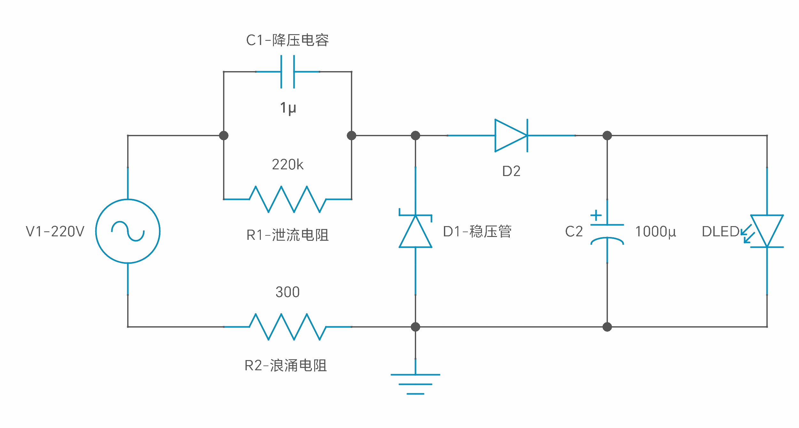
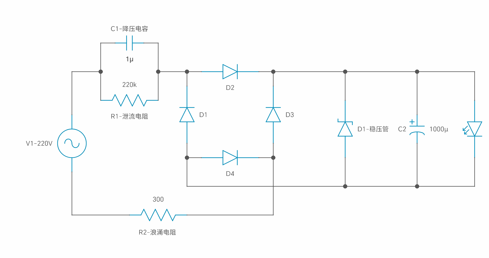

# 无火牛电源供应器

- 根据负载电流和交流工作频率选择合适的电容器，而不是依据负载的电压和功率；
- 限流电容器必须是无极性电容器，不得使用电解电容器。电容电压必须在400V以上，最理想的电容器是铁壳油浸电容器；
- 电容降压器不能在大功率条件下使用，因为它不安全；
- 电容降压器不适用于动态负载条件；
- 电容降压器不适用于容性和感性负载；
- 当需要直流操作时，应尽量采用半波整流。不建议使用桥式整流器。而要满足恒载的条件。

### 降压电容

电容值设计

由以下公式，电容一般都是以 μF 计算，换算一下，就可以得出，每 1μF 电容的输出电流如下：

 > 半波整流：整流的平均值系数为 0.44 ，所以电压 U 为 0.44* 220 V，此时可以计算出电流：

 - Ic = 0.44 * 220 * 2 * 3.14 * 50 * C（A）≈ 30000 C （A）

以下电路避免电容放电，输出电压比较稳定(建议使用)。

 - 半波整流得到的电流平均值为 30 mA/μF，

 > 全波整流：整流的平均值系数为 0.89 ，所以电压 U 为 0.89* 220 V，此时可以计算出电流：

 - Ic = 0.89 * 220 * 2 * 3.14 * 50 * C（A）≈ 60000 C （A）

 - 全波整流得到的电流平均值为 60 mA/μF。

电容可以限流，但是不能限压，所以需要一个稳压二极管匹配负载所需要的电压。阻容降压电路中，所限制的是这个电路工作的最大电流，电流大小由电容的值决定，而最终的输出电压由稳压二极管决定。

 - 注意，阻容降压电路的寿命关键在于 **降压电容**，所有的电容都会有衰减，容量会变得越来越低，在选取的时候应该选择专用的阻容降压电容，相对来说衰减慢一些，电路寿命也会更长。

### 泄流电阻

耐压大于降压电容的电压，功率要注意，也可以使用两个电阻串联起来，比较安全。一般耐压值为为使用电压的两倍。

断电后为降压电路提供放电回路，一般要求断电后降压电容电压衰减到 **37%** 的时间应小于 **1** 秒

 - RC < 0.37
 - R < 0.37 / C

取值一般在 470K ~ 1M。

### 稳压管

根据负载需要的电压来选择，具体采用型号由电压和功率决定。

 - 注意：电流属性。稳压管的最大稳定电流必须大于降压电容确定的电流。原因是电容降压电源提供的是恒定电流，因此一般不怕负载短路，但当负载完全开路时，限流电阻及稳压管回路中将通过全部的电流。

### 浪涌电流电阻

浪涌电流是电源或电气设备在开启时吸收的瞬时高输入电流。浪涌电流限制器是一种用于限制浪涌电流的元件，可避免元件逐渐损坏，并避免保险丝烧断或断路器跳闸。负温度系数 (NTC) 热敏电阻和固定电阻通常用于限制浪涌电流。

在知道电容值的情况下估算浪涌电流值，是可能的。但随着电路的复杂性增加，估算浪涌电流值变得越来越困难，特别是使用某种电流控制机制，其行为不是线性的。如电路只是简单的 RC 电路，其时域中的电流可由以下公式给出：

$$ V_t = V_0 \times e^{\frac{-t}{RC}}$$

$$ I_t = \frac {V_0} {R} \times e^{\frac{-t}{RC}}$$

$$ P_2 = {I_t}^2 R_2 = \left(\frac {V_0} {R} \right)^2 \times e^{\frac{-2t}{RC}} \times R_2$$

其中 $I_t $ 是电容电流(与时间相关)，$V_0$ 是电源电压，$R$ 是电源的输出电阻加上电容的電容的等效串聯電阻 $ESR$ 和任何互连电阻，$C$ 是输入电容。$R_2$ 为浪涌电阻。$P_2$ 浪涌电阻最少瓦数要求。为在 $t=0$ 时，指数为 1，因此输入电流的唯一限制是电阻 $R$ 和电源的电流能力。在 $t >> 1$ 时，指数为零，输入电流与工作电流相同。

对于更复杂的电路，确定这样的方程可能具有挑战性，并且走线电感也会限制峰值电流。此外，还依赖于电源电压的斜率，这可以形成浪涌峰值电流。为估计浪涌电流的最佳方法是通过模拟它并考虑电路中最大的电容。

#### 电阻值及功率瓦数估计

假设最大限流电流为 1 A，而电压为 220 V 则电阻值为：

$$ 电阻值 = \frac {峰值电压} {电流} = \frac {220 * 1.414} {1} = 283 \Omega \simeq 200 \Omega $$

#### 为了避免複杂的计算。可使用以下假设作计算：

- 如没有滤波电容器，则假设浪涌持续时间为一个 (1) 周期，一个周期等于 50 Hz，相当于 0.02 秒。
- 如没有示波器跟踪，则假设浪涌电流为稳态电流的 30 倍。

$$ 能量 = 30 \times 稳态电流 \times 0.02 \times 输入电压 $$

例子：

如稳态电流为 70 毫安倍， 电压为 220 伏特， 忽略滤波电容，计算如下，要使用约 10 瓦电阻：

$$ 能量 = 30 \times 70mA \times 0.02s \times 220V = 9.24 瓦$$