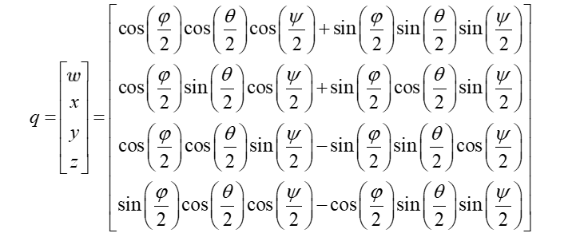

# 四元数

四元数本质上是一种高阶复数，是一个四维空间，相对于复数的二维空间。如学过复数，一个复数由实部和虚部组成，即 x = a + b*i*， *i* 是虚数单位，如果你还记得的话应该知道 *i* ² = -1。而四元数其实是类似的，不同的是，它的虚部包含了三个虚数单位，*i*、*j*、*k*，即一个四元数可以表示为 x = a + b*i* + c*j* + d*k*。

应用四元数的优点:

- 解决万向节死锁（Gimbal Lock）问题
- 仅需存储4个浮点数，相比矩阵更加轻量
- 四元数无论是求逆、串联等操作，相比矩阵更加高效

当然也可以理解四元数为一种旋转算法，在使用时与旋转矩阵及变换矩阵相似。四元数如何表示旋转以及如何进行坐标系转换如下。

$$
p=\left[0,x,y,z\right]^T
$$

一个內容为旋转量的四元数 q。乘以三维点 p。 经过旋转之后的p 变为 p'。公式如下：

$$
p'=qpq^{−1}
$$

以上为四元数乘法，结果也是四元数。最后把 p' 的虚部取出，即得旋转之后点的坐标。

非常重要：向量叉积跟四元数中的 **虚数单位** 相比，最大的一点不同就是：在向量叉积中，

$$  i \times i = 0 $$

，但是在四元数的乘法中，

$$  i \times i = -1 $$

### 四元数共轭

对四元数的所有“虚部”取负数，即是四元数的共轭 q*：

$$
q^*=w-ix-jy-kz
$$

### 单位四元数

四元数的模的定义跟复数是一致的：

$$|q|=\sqrt{w^2+x^2+y^2 +z^2}=\sqrt{qq^*}$$

而单位四元数的定义即是模为 1 的四元数：

$$
|q|=\sqrt{w^2+x^2+y^2 +z^2}=1
$$

如果给定的一个四元数不是单位四元数，那么可以对其进行规范化如下：

$$
q' = \frac {q}{\sqrt{w^2+x^2+y^2+z^2}}
$$

### 四元数的逆

对于一个单位四元数而言，因为有

$$ q q^∗=1 $$

单位四元数的逆就是其共轭四元数。

$$ q^{-1}= q^* $$

对于更加一般的场景，我们可以这样考虑：

$$ q^{-1}= \frac {q^*}{|q|^2} $$

## 四元数与欧拉角的转化

### 欧拉角转四元数

### 四元数转欧拉角

### 四元数相乘

