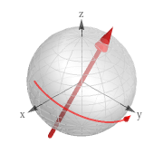
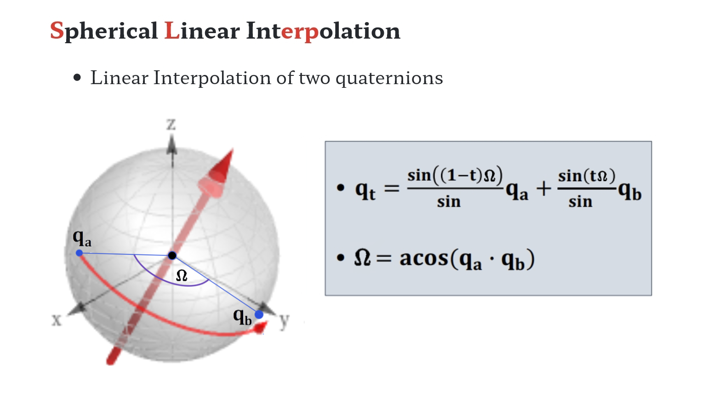

# 四元数（Quaternion）

四元数本质上是一种高阶复数，是一个四维空间，相对于复数的二维空间。如学过复数，一个复数由实部和虚部组成，即 c = a + b*i*， *i* 是虚数单位，如果你还记得的话应该知道 *i* ² = -1。而四元数其实是类似的，不同的是，它的虚部包含了三个虚数单位，*i*、*j*、*k*，即一个四元数可以表示为 q = a + b*i* + c*j* + d*k*。

应用四元数的优点:

- 平滑插值。 (矩阵基本没有，欧拉角可以做插值，但可能遭遇万向锁（Gimbal Lock）问题
- 仅需存储4个浮点数，相比矩阵更加轻量
- 四元数无论是求逆、串联等操作，相比矩阵更加高效

当然也可以理解四元数为一种旋转算法，在使用时与旋转矩阵及变换矩阵相似。四元数如何表示旋转以及如何进行坐标系转换如下。

$$
q=\left[ w,α,β,γ \right]^T
$$

- 纯四元数，实部为零

$$
q=\left[ 0,α,β,γ \right]^T
$$

- 一个內容为旋转 θ 量的四元数

$$
q = [cos \frac{θ}{2}, x sin \frac{θ}{2},y sin \frac{θ}{2},z sin \frac{θ}{2}]
$$

註注意：单位四元数没有旋转量時为

$$
q = [1, 0, 0, 0]^T
$$

乘以三维点

$$v => v_f$$

公式如下：

$$
v=\left[ 0,x,y,z \right]
$$

$$
v_f=qvq^{−1}
$$

以上为四元数乘法，结果也是四元数。最后把 v 的虚部取出，即得旋转之后点的坐标。

$$
v_f=( x,y,z )
$$

註非常重要：向量叉积跟四元数中的 **虚数单位** 相比，最大的一点不同就是：在向量叉积中，

$$  i \times i = 0 $$

，但是在四元数的乘法中，

$$  i \times i = -1 $$

### 单位四元数

四元数的模的定义跟复数是一致的：

$$|q|=\sqrt{w^2+x^2+y^2 +z^2}=\sqrt{qq^*}$$

而单位四元数的定义即是模为 1 的四元数：

$$
|q|=\sqrt{w^2+x^2+y^2 +z^2}=1
$$

如果给定的一个四元数不是单位四元数，那么可以对其进行规范化如下：

$$
q' = \frac {q}{\sqrt{w^2+x^2+y^2+z^2}}
$$

$$
q'= \frac {q} {|q|}
$$

注意： q' 为单位四元数

### 四元数共轭

复数里面有个概念是共轭复数，就是实轴不变，虚轴倒过来。

如四元数为 q：

$$
q=w+ix+jy+kz
$$

对四元数的所有“虚部”取负数，即是四元数的共轭 q*：

$$
q^*=w-ix-jy-kz
$$

### 四元数的逆 q⁻¹

对于一个单位四元数而言，因为有

$$ q q^∗=1 $$

註单位四元数的逆就是共轭四元数

$$ q^{-1}= q^* $$

对于不是单位四元数下，可以用以下方法计算四元数的逆。

$$ q^{-1}= \frac {q^*}{|q|^2} $$

### 四元数相乘

$$ q_0 = q_1 \bullet q_2 $$

$$ \begin{bmatrix} w_0 \\ x_0 \\ y_0 \\ z_0\end{bmatrix} ＝ \begin{bmatrix}
{w_1 w_2 - x_1 x_2 - y_1 y_2 - z_1 z_2} \\ 
{w_1 x_2 + x_1 w_2 + y_1 z_2 - z_1 y_2} \\ 
{w_1 y_2 - x_1 z_2 + y_1 w_2 + z_1 x_2} \\ 
{w_1 z_2 + x_1 y_2 - y_1 x_2 + z_1 w_2} \end{bmatrix} 
$$

## 四元数绕轴旋转详解

基于已知旋转点、旋转轴、旋转角度，求旋转后的位置和朝向。

### 计算旋转后的坐标

上图中的 point 即下图中的圆心 (0,0,0) 位置。axi2 则为轴心即红色箭咀部分。 θ 为以 axi2 为轴心的转量。

根据以上解释。四元数是在指定轴心上的运转角度，我同时出现三种不同角度如下：
- 绕 X 轴旋转 roll 滚动
- 绕 Y 轴旋转 pitch 倾斜
- 绕 Z 轴旋转 yaw 偏航

- 先计算旋转点和当前位置点的向量（起始向量：朝向计算)

$$
u = (x,y,z)
$$

- 四元数形态为

$$
v=\left[ 0,x,y,z \right]
$$

- 计算旋转四元数(轴角到四元数)
    - 给定一个单位长度的旋转轴 (x, y, z) 和一个角度θ。对应的四元数如下：
    
$$
q = [cos \frac{θ}{2}, x sin \frac{θ}{2},y sin \frac{θ}{2},z sin \frac{θ}{2}]
$$

- 计算单位四元数以方便之後運算

$$
q' = \frac {q}{\sqrt{w^2+x^2+y^2+z^2}} = \frac {q}{τ}
$$

$$
q' = [\frac{1}{τ}cos \frac{θ}{2}, \frac{x}{τ} sin \frac{θ}{2},\frac{y}{τ} sin \frac{θ}{2},\frac{z}{τ} sin \frac{θ}{2}]
$$

$$
q' = [\frac{1}{τ}cos \frac{θ}{2}, α sin \frac{θ}{2},β sin \frac{θ}{2},γ sin \frac{θ}{2}]
$$

- 计算起始向量旋转后的向量
    - 假设起始向量为 
    
$$v=(x_1, y_1, z_1)$$

$$
v=\left[ 0,x,y,z \right]
$$

- 計算转后向量
    
$$v' = q'  v  q'^{-1}$$

$$q'^{-1}=q'^{*}=[\frac{1}{τ}cos \frac{θ}{2}, -α sin \frac{θ}{2},-β sin \frac{θ}{2},-γ sin \frac{θ}{2}]$$

$$v_f=[0, x_2, y_2, z_2]$$

- 计算旋转后的坐标点

    - 计算后的四元素虚部，即点的坐标

$$v_f=(x_2, y_2, z_2)$$

## 四元数与欧拉角转换

### 欧拉角转四元数

用以下公式计算多个轴心旋转的最终四元数

$$
q = \begin{bmatrix} w \\ x \\ y \\ z\end{bmatrix} ＝ \begin{bmatrix}
cos\frac{\varphi}{2}cos\frac{\theta}{2}cos\frac{\psi}{2}+sin\frac{\varphi}{2}sin\frac{\theta}{2}sin\frac{\psi}{2} \\
cos\frac{\varphi}{2}sin\frac{\theta}{2}cos\frac{\psi}{2}+sin\frac{\varphi}{2}cos\frac{\theta}{2}sin\frac{\psi}{2} \\
cos\frac{\varphi}{2}cos\frac{\theta}{2}sin\frac{\psi}{2}-sin\frac{\varphi}{2}sin\frac{\theta}{2}cos\frac{\psi}{2} \\
sin\frac{\varphi}{2}cos\frac{\theta}{2}cos\frac{\psi}{2}-cos\frac{\varphi}{2}sin\frac{\theta}{2}sin\frac{\psi}{2}
\end{bmatrix} 
$$

### 四元数转欧拉角

$$
\begin{bmatrix} \varphi \\ \theta \\ \psi \end{bmatrix} ＝ \begin{bmatrix}
atan2(2(wz+xy), 1-2(z^2 + x^2)\\
arcsin(2(wz-yz)) \\
atan2(2(wy+zx), 1-2(x^2+y^2))
\end{bmatrix} ， \begin{cases} \varphi：绕&x&轴旋转角度； \\ \theta：绕&y&轴旋转角度； \\ \psi：绕&z&轴旋转角度。 \end{cases}
$$

$$
atan2(y,x) = \begin{cases}
arctan \frac{y}{x} \\
arctan \frac{y}{x} + \pi \\
arctan \frac{y}{x} - \pi \\
+\frac {\pi} {2} \\
-\frac {\pi} {2} \\
undefined
\end{cases}， \begin{matrix}
x > 0; \\
y \geqslant 0, x < 0; \\
y < 0 , x < 0; \\
y > 0 , x = 0; \\
y < 0 , x = 0; \\
y = 0, x = 0。
\end{matrix}
$$

## 四元数与矩阵转换

$$
R = \begin{bmatrix}
r_{11} & r_{12} & r_{13} \\
r_{21} & r_{22} & r_{23} \\
r_{311} & r_{32} & r_{33}
\end{bmatrix}
$$

$$
q = \begin{bmatrix} w \\ x \\ y \\ z \end{bmatrix} ^ T
$$

### 矩阵转四元数

$$
q = \begin{bmatrix} w \\ x \\ y \\ z \end{bmatrix} ＝ 
\begin{bmatrix} 
\frac {\sqrt{r_{11} + r_{22} + r_{33} + 1}} {2} \\
\frac {r_{32} - r_{23}}{4w} \\
\frac {r_{13} - r_{31}}{4w} \\
\frac {r_{21} - r_{12}}{4w}
\end{bmatrix}
$$

### 四元数转矩阵

$$
R = \begin{bmatrix}
r_{11} & r_{12} & r_{13} \\
r_{21} & r_{22} & r_{23} \\
r_{311} & r_{32} & r_{33}
\end{bmatrix} ＝ 
\begin{bmatrix} 
1-2y^2-2z^2 & 2xy-2wz & 2xz+2wy \\
2xy+2wz & 1-2x^2-2z^2 & 2yz-2wx \\
2xz-2wy & 2yz+2wx & 1-2x^2-2y^2 \\
\end{bmatrix}
$$

## 四元数转换为单位四元数

将四元数转换为单位四元数，以避免输入累积错误，方便之后计算。

$$
q' = \frac {q}{\sqrt{w^2+x^2+y^2+z^2}}
$$

## 四元数的球面线性插值 (Slerp)

球面线性插值（Spherical linear interpolation，通常简称 Slerp），是四元数的一种线性插值运算，主要用于在两个表示旋转的四元数之间平滑差值。

假设初始四元数轴心为 (0,0,0)

$$
q_a = [1,0,0,0]
$$

最终单位四元数为

$$
q_b = [w,α,β,γ]
$$

球面线性插值公式

$$
q_t = \frac {sin((1-t)\theta)} {sin \theta} q_a + \frac {sin(t \theta)} {sin \theta} q_b
$$

t 的数值为 0 至 1 之间的数值

$$
θ = arcCos(q_a \bullet q_b)
$$

## 3D 矩阵

如果旋转由四即元数计算。则如下的放大及位移由矩阵計算即矩阵可设定如下:

$$
R = \begin{bmatrix}
S_x & 0 & 0 & T_x \\
0 & S_y & 0 & T_y \\
0 & 0 & S_z & T_z \\
0 & 0 & 0 & 1 \\
\end{bmatrix}， \begin{cases} T 位移部份; \\ S 为缩放部份； \\ R 旋转部分省略。\end{cases}
$$