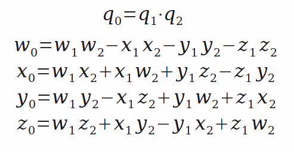

# 四元数

四元数本质上是一种高阶复数，是一个四维空间，相对于复数的二维空间。如学过复数，一个复数由实部和虚部组成，即 x = a + b*i*， *i* 是虚数单位，如果你还记得的话应该知道 *i* ² = -1。而四元数其实是类似的，不同的是，它的虚部包含了三个虚数单位，*i*、*j*、*k*，即一个四元数可以表示为 x = a + b*i* + c*j* + d*k*。

应用四元数的优点:

- 平滑插值。 (矩阵基本没有，欧拉角可以做插值，但可能遭遇万向锁（Gimbal Lock）问题
- 仅需存储4个浮点数，相比矩阵更加轻量
- 四元数无论是求逆、串联等操作，相比矩阵更加高效

当然也可以理解四元数为一种旋转算法，在使用时与旋转矩阵及变换矩阵相似。四元数如何表示旋转以及如何进行坐标系转换如下。

$$
p=\left[0,x,y,z\right]^T
$$

一个內容为旋转量的四元数 q。乘以三维点 p。 经过旋转之后的p 变为 p'。公式如下：

$$
p'=qpq^{−1}
$$

以上为四元数乘法，结果也是四元数。最后把 p' 的虚部取出，即得旋转之后点的坐标。

非常重要：向量叉积跟四元数中的 **虚数单位** 相比，最大的一点不同就是：在向量叉积中，

$$  i \times i = 0 $$

，但是在四元数的乘法中，

$$  i \times i = -1 $$

### 单位四元数

四元数的模的定义跟复数是一致的：

$$|q|=\sqrt{w^2+x^2+y^2 +z^2}=\sqrt{qq^*}$$

而单位四元数的定义即是模为 1 的四元数：

$$
|q|=\sqrt{w^2+x^2+y^2 +z^2}=1
$$

如果给定的一个四元数不是单位四元数，那么可以对其进行规范化如下：

$$
q' = \frac {q}{\sqrt{w^2+x^2+y^2+z^2}}
$$

$$
q'= \frac {q} {|q|}
$$

注意： q' 为单位四元数

### 四元数共轭

复数里面有个概念是共轭复数，就是实轴不变，虚轴倒过来。

如四元数为 q：

$$
q=w+ix+jy+kz
$$

对四元数的所有“虚部”取负数，即是四元数的共轭 q*：

$$
q^*=w-ix-jy-kz
$$

### 四元数的逆 q⁻¹

对于一个单位四元数而言，因为有

$$ q q^∗=1 $$

单位四元数的逆就是共轭四元数。

$$ q^{-1}= q^* $$

对于不是单位四元数下，可以用以下方法计算四元数的逆。

$$ q^{-1}= \frac {q^*}{|q|^2} $$

## 四元数与欧拉角的转化

### 欧拉角转四元数

### 四元数转欧拉角

### 四元数相乘

## 绕轴旋转

基于已知旋转点、旋转轴、旋转角度，求旋转后的位置和朝向。

### 朝向计算

当前点和下一个点，如何求出角色的朝向四元数

- 先算出前下一个点相对当前点的向量
- 根据视口上方向求出四元数
- 转换为单位四元数

### 计算旋转后的坐标

- 先计算旋转点和当前位置点的向量（起始向量：朝向计算)

$$
u = [0,x,y,z]
$$

- 计算旋转四元数(轴角到四元数)
    - 给定一个单位长度的旋转轴 (x, y, z) 和一个角度θ。对应的四元数如下：
    
$$
q = [cos \frac{θ}{2}, x sin \frac{θ}{2},y sin \frac{θ}{2},z sin \frac{θ}{2}]
$$

- 计算单位四元数

$$
q_1 = \frac {q}{\sqrt{w^2+x^2+y^2+z^2}} = \frac {q}{τ}
$$

$$
q_1 = [\frac{1}{τ}cos \frac{θ}{2}, \frac{x}{τ} sin \frac{θ}{2},\frac{y}{τ} sin \frac{θ}{2},\frac{z}{τ} sin \frac{θ}{2}]
$$

$$
q_1 = [\frac{1}{τ}cos \frac{θ}{2}, α sin \frac{θ}{2},β sin \frac{θ}{2},γ sin \frac{θ}{2}]
$$

- 计算起始向量旋转后的向量
    - 假设起始向量为 
    
$$v=[0, x_1, y_1, z_1]$$

- 計算转后向量
    
$$v' = q_1  v  q_1^{-1}$$

$$q_1^{-1}=q_1^{*}=[\frac{1}{τ}cos \frac{θ}{2}, -α sin \frac{θ}{2},-β sin \frac{θ}{2},-γ sin \frac{θ}{2}]$$

$$v'=[0, x₂, y₂, z₂]$$

- 计算旋转后的坐标点

