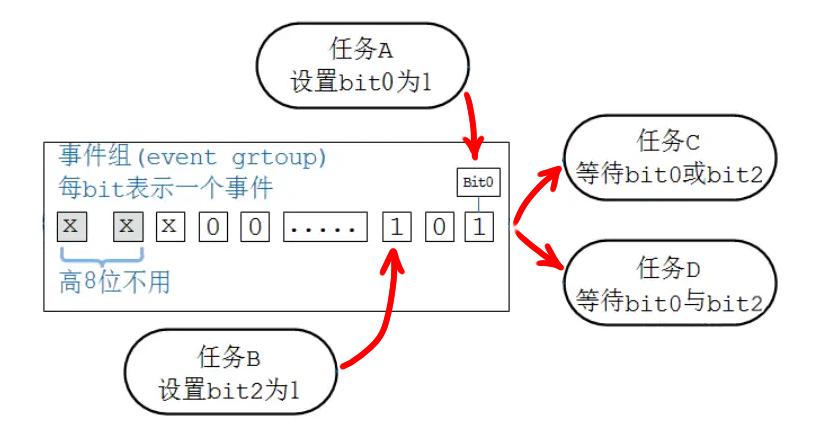
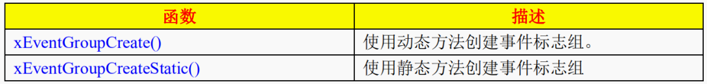
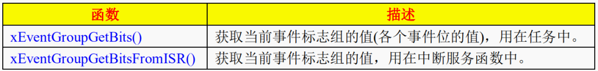
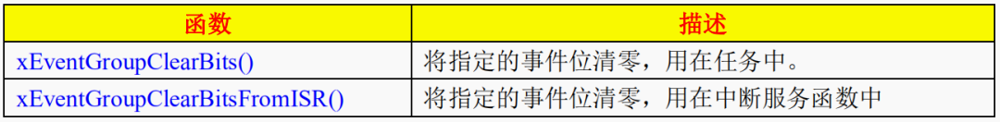
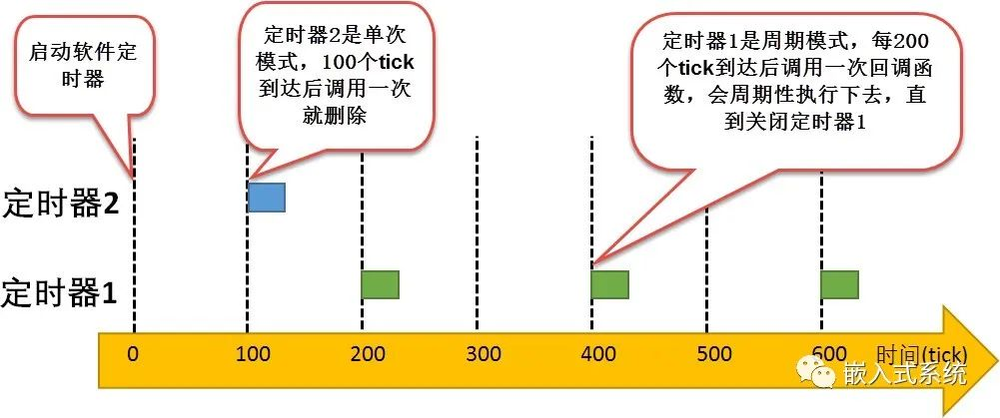
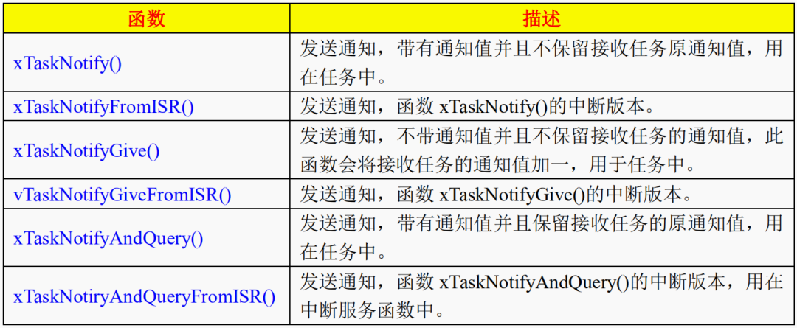
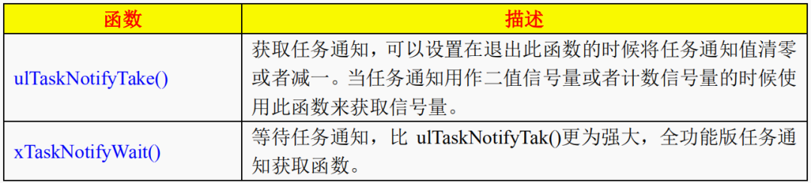

# FreeRTOS

FreeRTOS 是一種適用於微型控制器的開放原始碼即時作業系統，可讓小型、低功率的邊緣裝置易於進行程式設計、部署、保護、連接及管理。 FreeRTOS 自由分散於MIT 開放原始碼授權下，包含一顆核心和一套不斷擴充的軟體程式庫，適用於各種產業和應用程式。

FreeRTOS 有四种状态，每种状态都有对应的状态链表管理。


- 运行态：占用CPU使用权时的状态。
- 就绪态：能够运行（没有被阻塞和挂起），但是当前没有运行的任务的状态。
- 阻塞态：由于等待信号量、消息队列、事件标志组、调用延迟函数等而处于的状态被称之为阻塞态。
- 挂起态：调用函数 vTaskSuspend() 对指定任务进行挂起，挂起后这个任务将不被执行。

<font color="#FF1000">网络资源寻找位置</font>：[FreeRTOS API](https://www.freertos.org/zh-cn-cmn-s/RTOS-message-buffer-API.html)

调用函数 xTaskResume() 可退出挂起状态。

不可以指定超时周期事件（不可以通过设定超时事件而退出挂起状态）

## 创建任务

任务的创建有两种：

 - 静态内存任务
 - 动态内存任务

### 创建静态内存任务

静态内存分配的好处是，可以更好的对应用程序的内存的利用，具有更好的控制代码的编写。RTOS 对象可以放置在特定的内存位置。最大 RAM 占用空间可以在链路时确定，而不是 运行时。应用程序编写者不需要关心如何 处理内存分配失败的问题。

它允许在不允许任何动态内存分配的应用程序中使用 RTOS (尽管 FreeRTOS 包括可以克服大多数异议的分配方案)。

如果 configSUPPORT_STATIC_ALLOCATION 设置为 1 ，则下列 API 可用:

```c
1 xTaskCreateStatic()
2 xQueueCreateStatic()


3 TimerCreateStatic（）
4 EventGroupCreateStatic()
5 SemaphoreCreateBinaryStatic()
6 SemaphoreCreateCountingStatic()
7 SemaphoreCreateMutexStatic()
8 SemaphoreCreateRecursiveMutexStatic()
```

- 配置静态内存创建静态内存任务需要先实现以下内容：
    - 需要在  FreeRTOSConfig.h 打开 configSUPPORT_STATIC_ALLOCATION 宏，开启静态内存。 
- 开启静态内存的同时需要实现两个函数：（使用静态内存分配任务堆栈和任务控制块内存）
     - vApplicationGetIdleTaskMemory()：空闲任务堆栈函数。
     - vApplicationGetTimerTaskMemory()：定时器任务堆栈函数。

注意静态内存对齐的配置在 portmacro.h 里面的 portBYTE_ALIGNMENT 宏，按自己需求配置即可。

在任务堆栈初始化时会把栈顶指针纠正为内存对齐。参考下列代码：

参考下列代码：

```c
pxTopOfStack = &(pxNewTCB->pxStack[ulStackDepth-(uint32_t) 1 ]);
pxTopOfStack = (StackType_t *) (((portPOINTER_SIZE_TYPE) pxTopOfStack) &
               (~((portPOINTER_SIZE_TYPE) portBYTE_ALIGNMENT_MASK)));
```

#### 任务函数原型

```c
TaskHandle_t xTaskCreateStatic(           // 返回任务句柄
     TaskFunction_t pxTaskCode,           // 任务入口函数
     const char * const pcName,           // 任务名称
     const uint32_t ulStackDepth,         // 任务堆栈大小
     void * const pvParameters,           // 传递给任务入口函数的参数
     UBaseType_t uxPriority,              // 任务优先级
     StackType_t * const puxStackBuffer,  // 任务堆栈
     StaticTask_t * const pxTaskBuffer)   // 任务控制块
```

#### 创建例子

```c
/* 创建静态内存任务 */
lzmStaticTestTaskHandle = xTaskCreateStatic(
   (TaskFunction_t) lzmStaticTestTask,        // 任务入口函数
   (const char*) "lzm static test task",      // 任务函数名                           
   (uint32_t) 256,                            // 任务堆栈大小                                           
   (void*) NULL,                              // 传递给任务入口函数的参数
   (UBaseType_t) 5,                           // 任务优先
   (StackType_t*) lzmStaticTestTaskStack,     // 任务堆栈地址  
   (StaticTask_t* ) & lzmStaticTestTaskTCB);  // 任务控制块地址
```

### 创建动态内存任务

动态内存配置是在 FreeRTOSConfig.h 配置的，这些内存主要供给 FreeRTOS 动态内存分配函数使用。创建对象时需要的函数参数较少。内存分配在  RTOS API 函数中自动进行。应用程序员不需要关心分配内存的问题。如果删除 RTOS 对象，则可以重新使用该对象所使用的 RAM ，从而可能减少应用程序的最大 RAM 占用。 RTOS API 函数提供了返回堆使用信息的功能，允许优化堆大小。

若 configSUPPORT_DYNAMIC_ALLOCATION 设置为 1 ，那么下列 API 函数，可以使用动态内存分配创建：

```c
1 xTaskCreate()
2 xQueueCreate()

3 TimerCreate()
4 EventGroupCreate()
5 SemaphoreCreateBinary()
6 SemaphoreCreateCounting()
7 SemaphoreCreateMutex()
8 SemaphoreCreateRecursiveMutex()
```

### 配置动态内存

动态内存配置是在 FreeRTOSConfig.h 配置的，这些内存主要供给 FreeRTOS 动态内存分配函数使用。

```c
#define configTOTAL_HEAP_SIZE	((size_t)(32*1024)) // 系统总堆大小
```

而 freertos 的动态内存管理是有文件 heap_x.c 实现的，具体实现算法，后面讲到内存时会分析。

```c
uint8_t ucHeap[configTOTAL_HEAP_SIZE];      // 系统总堆 
static TaskHandle_t lzmTestTaskHandle = NULL; // 任务句柄
```

#### 创建任务原型

```c
BaseType_t xTaskCreate(                       // 返回任务句柄
   TaskFunction_t pxTaskCode,                 // 任务入口函数
   const char * const pcName,                 // 任务名称
   const configSTACK_DEPTH_TYPE usStackDepth, // 任务堆栈大小
   void * const pvParameters,                 // 传递给任务入口函数的参数
   UBaseType_t uxPriority,                    // 任务优先级
   TaskHandle_t* const pxCreatedTask)        // 任务控制块指针  
```
#### 创建任务

```c
xReturn = xTaskCreate(
   (TaskFunction_t) lzmTestTask,        // 任务入口函数
   (const char*) "lzm test task",       // 任务函数名
   (uint16_t)256,                       // 任务堆栈大小
   (void*)NULL,                         // 传递给任务入口函数的参数
   (UBaseType_t)5,                      // 任务优先及
   (TaskHandle_t*) &lzmTestTaskHandle); // 任务句柄
```

### 调度程序

vTaskStartScheduler 启动 RTOS 调度器。调用后，RTOS 内核可以控制在何时执行哪些任务。空闲任务和可选的 定时器守护进程任务会自动创建(当 RTOS 调度器启动时)。 vTaskStartScheduler() 仅在没有足够的 RTOS 堆 可用来创建空闲或定时器守护进程任务时才会返回。

如果有多过一个任务。因任何时候只有一个任务可以处于运行状态。 因此，当一个任务进入运行状态（任务被切入）时，其他任务进入非运行状态（任务被切出）。

### 删除任务

在文件 FreeRTOSConfig.h 中，必须定义宏 INCLUDE_vTaskDelete  为 1，删除任务的 API 才会失效。调用API删除任务后，将会从就绪、阻塞、暂停和事件列表中移除该任务。如果是动态内存创建任务，删除任务后，其占用的空间资源有空闲任务释放，所以删除任务后尽量保证空闲任务获取一定的 CPU 时间。如果是静态内存创建任务，删除任务后，需要自己处理释放任务占用的空间资源。

#### 删除任务原型

```c
void vTaskDelete(TaskHandle_t xTaskToDelete); // 参数为任务句柄
```

注意：传入的参数为任务句柄，当出入的参数为 NULL 时，表示删除调用者当前的任务。 


#### 延迟任务原型

```
void vTaskDelay(const TickType_t xTicksToDelay);
```

必须将 INCLUDE_vTaskDelay 定义为 1，此函数才可用。 请参阅 RTOS 配置文档，了解更多信息，

按给定的 tick 数延迟任务。任务保持阻塞的实际时间取决于 tick 频率。 常量 portTICK_PERIOD_MS 配合 tick 周期分辨率可用于从 tick 频率计算实际时间。

vTaskDelay() 会指定任务想要取消阻塞的时间，该时间是相对于 vTaskDelay() 被调用的时间。 例如，如果指定时间块为 100 个 tick，那么在调用 vTaskDelay() 100 个 tick 后任务会取消阻塞。 vTaskDelay() 并不会因此提供一种控制周期性任务频率的好办法，因为途径代码的路径以及其它任务和中断活动将影响 vTaskDelay() 被调用的频率，进而会影响下一个任务执行的时间。 请参阅 vTaskDelayUntil()，了解为便于任务以固定频率执行而设计的替代 API 函数。 它通过指定调用任务应取消阻塞的绝对时间（而非相对时间）来实现这一点。

请<font color="#FF1000">注意</font>：vTaskDelay() 指定相对于调用该函数的时间的唤醒时间，而 vTaskDelayUntil() 指定希望解除阻塞的绝对（精确）时间。常量 portTICK_PERIOD_MS 可用于根据滴答率计算实时时间 - 分辨率为一个滴答周期。<font color="#FF1000">当在 vTaskDelay 周期中，CPU 会继续做其他任务。</font>

#### 事件组 (Event Group)

事件组可以简单地认为就是一个整数：

- 每一位表示一个事件
- 每一位事件的含义由程序员决定，比如： Bit0 表示用来串口是否就绪，Bit1 表示按键是否被按下
- 这些位，值为 1 表示事件发生了，值为 0 表示事件没发生
- 一个或多个任务、ISR 都可以去写这些位；一个或多个任务、ISR 都可以去读这些位
- 可以等待某一位、某些位中的任意一个，也可以等待多位

事件组用一个整数来表示，其中的高8位留给内核使用，只能用其他的位来表示事件。那么这个整数是多少位的？

- 如果 configUSE_16_BIT_TICKS 是 1，那么这个整数就是 16 位的，低 8 位用来表示事件
- 如果 configUSE_16_BIT_TICKS 是 0，那么这个整数就是 32 位的，低 24 位用来表示事件
- configUSE_16_BIT_TICKS 是用来表示 Tick Count 的，怎么会影响事件组？这只是基于效率来考虑
    - 如果 configUSE_16_BIT_TICKS 是 1，就表示该处理器使用 16 位更高效，所以事件组也使用 16 位
    - 如果 configUSE_16_BIT_TICKS 是 0，就表示该处理器使用 32 位更高效，所以事件组也使用 32 位










使用事件组之前，要先创建，得到一个句柄；使用事件组时，要使用句柄来表明使用哪个事件组。
有两种创建方法：
- 动态分配内存
- 静态分配内存

函数原型如下：

```c
// 创建一个事件组，返回它的句柄。此函数内部会分配事件组结构体返回值，非NULL表示成功
EventGroupHandle_t xEventGroupCreate(void);
// 创建一个事件组，返回它的句柄。此函数无需动态分配内存，
// 所以需要先有一个 StaticEventGroup_t 结构体，并传入它的指针返回值，非NULL表示成功
EventGroupHandle_t xEventGroupCreateStatic(StaticEventGroup_t * pxEventGroupBuffer);
// 如果 uxBitsToSet 的 bitX, bitY 为 1, 那么事件组中的 bitX, bitY 被设置为 1
// 可以用来设置多个位，比如 0x15 就表示设置 bit4, bit2, bit0
EventBits_t xEventGroupSetBits(EventGroupHandle_t xEventGroup,
                               const EventBits_t uxBitsToSet);
// 如果 xEventGroup 及 uxBitsToSet 如 xEventGroupSetBits 
// pxHigherPriorityTaskWoken: 有没有导致更高优先级的任务进入就绪态? pdTRUE-有, pdFALSE-没有
// 返回值: pdPASS-成功, pdFALSE-失败
BaseType_t xEventGroupSetBitsFromISR(EventGroupHandle_t xEventGroup,
									                             const EventBits_t uxBitsToSet,
									                             BaseType_t * pxHigherPriorityTaskWoken);
// 删除哪个事件组
void vEventGroupDelete(EventGroupHandle_t xEventGroup);
// 事件组等待
EventBits_t xEventGroupWaitBits(EventGroupHandle_t xEventGroup,    // 所操作事件组的句柄
                                const EventBits_t uxBitsToWaitFor, // 指定事件组中要测试的一个或多个事件位的按位值
                                const BaseType_t xClearOnExit,     // pdTRUE,pdFALSE
                                const BaseType_t xWaitForAllBits,  // pdTRUE,pdFALSE
                                TickType_t xTicksToWait            // 任务进入阻塞状态等待时间成立的超时节拍数
                                );
// 事件查询 (将事件组某些位清零)
#define xEventGroupGetBits(xEventGroup) xEventGroupClearBits(xEventGroup, 0);
EventBits_t xEventGroupClearBits(EventGroupHandle_t xEventGroup, 
                                 const EventBits_t uxBitsToClear);
```

#### 软件定时器

软件定时器需先创建才允许使用，动态创建方式是 xTimerCreate()，返回一个句柄。软件定时器在创建成功后是处于休眠状态的，没有开始计时运行。FreeRTOS的软件定时器支持单次模式和周期模式。

- 单次模式：当用户创建了定时器并启动了定时器后，定时时间到了，只执行一次回调函数，之后不再执行。
- 周期模式：定时器会按照设置的定时时间循环执行回调函数，直到用户将定时器停止或删除。



##### 软件定时器开启

```c
xTimerStart()
xTimerReset()
xTimerStartFromISR()
xTimerResetFromISR() 
xTimerChangePeriod()
xTimerChangePeriodFromISR()
```

##### 软件定时器停止

```c
xTimerStop()         // 用于停止一个已经启动的软件定时器
xTimerStopFromISR()  // 中断版本。
```
##### 软件定时器例子

```c
static void btn_read_task(void *pvParameters);
static void led_toggle_callback(TimerHandle_t xTimer)
TimerHandle_t led_timer;

// 声明一个变量来保存创建的事件组
static EventGroupHandle_t xFlagsEventGroup;
int main(void)
{
   xFlagsEventGroup = xEventGroupCreate();
	  xTaskCreate(btn_read_task,
               "button_read_task", 
               configMINIMAL_STACK_SIZE + 10, 
               NULL, 
               btn_press_task_PRIO,
               NULL);

	  led_timer = xTimerCreate("LED_toggle_timer",
	                           200/portTICK_PERIOD_MS,  // 定时器周期（以刻数表示）必须大于 0
	                           pdTRUE,                  // 计时器到期后会自动重新加载
	                           (void *) 0,              // 用于存储计时器到期次数，初始化为 0
	                           led_toggle_callback      // 每个计时器到期时都会调用相同的回调
	                           );
	  xTimerStart(led_timer,0);
   vTaskStartScheduler();
   for (;;);
}

static void led_toggle_callback( TimerHandle_t xTimer) {
	  EventBits_t event_bits;
  	static uint8_t toggle_en = 0;
	  // 获取按钮按下事件位并清除它
	  event_bits = xEventGroupClearBits(xFlagsEventGroup, BTN_PRESSED_Msk);
  	if (event_bits & BTN_PRESSED_Msk) {
		    toggle_en = ~toggle_en;
	     // 如果启用了切换，则关闭 LED。如果禁用了切换，则 LED 无论如何都会关闭
      LED_OFF();
	     }
	  if (toggle_en) {
		    LED_TOGGLE();
	     }
}
```


## 最基本 FreeRTOS 程序

- FreeRTOS_Init()：硬件初始化 FreeRTOS 的中断向量表。
- SocSetup()：初始化控制组件和全局变量
- xTaskCreate(...)：创建新的任务实例
- vTaskStartScheduler()：启动 FreeRTOS 调度程序。如果一切顺利，调度程序将运行，并且永远不会到达下一个无限循环
- 无限循环：如果执行此代码，则意味着 FreeRTOS 堆内存不足以创建空闲和/或计时器任务

### 最基本程序代码

```c
#include <project.h>
#include <stdio.h>
#include <stdlib.h>
#include <stdint.h>
#include <stdbool.h>

// FreeRTOS 头文件
#include "FreeRTOS_PSoC.h"
#include "FreeRTOS.h"
#include "task.h"
#include "queue.h"
#include "semphr.h"
#include "timers.h"
#include "event_groups.h"

// 工具函数
void vAppTask(void *pvParameters);

void SocSetup(void)
{
	   // 周边设定，开启及清理 LCD 屏幕
    LCD_Start();
	   LCD_ClearDisplay();
}

int main(void)
{
    BaseType_t  err;
    FreeRTOS_Init();
    // 设定开启代码
	   SocSetup();
    //主要任务程序
    err = xTaskCreate(
        vAppTask,                   // 任务入口函数
        "Task 1",                   // 任务名字方便除错
        configMINIMAL_STACK_SIZE,   // 任务栈大小
        NULL,                       // 任务入口函数参数
        5,                          // 任务的优先级
        NULL);                      // 任务控制块指

    if (err != pdPASS){
        LCD_Position(1,0);
        LCD_PrintString("Cannot create task!");
        while(1){};
    }
    
    // 启动调度程序以便任务开始执行
    	vTaskStartScheduler();

    // 仅当堆空间不足以启动调度程序时，执行才会到达此处。正常应到达此处，
    // 因为内核现在正在运行。 如果 vTaskStartScheduler() 确实返回，
    // 则很可能没有足够的（FreeRTOS）堆空间来创建所有任务。
	   for(;;){
        vTaskDelay(1000);
    }
}

void vAppTask(void *pvParameters)
{
    for(;;){
        LED_Write(!LED_Read());
        // 调用 vTaskDelay() 会将任务置于阻塞状态，直到延迟时间结束。
        // 使用 pdMS_TO_TICKS() 将 500 毫秒转换为滴答的等效时间。
        vTaskDelay(pdMS_TO_TICKS(500));    
    }
}
```


```
void vTaskFunction(void *pvParameters) 
{ 
char *pcTaskName; 
const TickType_t xDelay250ms = pdMS_TO_TICKS(250);

    /* 要打印的字符串通过参数传入。将此转换为字符指针。 */
    pcTaskName = (char *) pvParameters;

    /* 对于大多数任务，都是在一个无限循环中实现的。 */
    for(;;)
    {
        /* 打印出此任务的名称。 */
        vPrintString(pcTaskName);

        /* 延迟一段时间。 这次调用 vTaskDelay() 会将任务置于阻塞状态，直到延迟时间结束。
        参数需要 'ticks' 中指定的时间，并使用 pdMS_TO_TICKS() 宏（声明 xDelay250ms 
        常量）将 250 毫秒转换为滴答的等效时间。*/
        vTaskDelay(xDelay250ms);
    }
}
```

## 消息队列收发双方处理机制 （Queue)

消息序列是当有消息时才执行相对的任务。没有消息时程序不会被执行。


 - 创建消息队列， FreeRTOS 系统会分配一块单个消息大小与消息队列长度乘积的空间；(创建成功后，每个消息的大小及消息队列长度无法更改，不能写入大于单个消息大小的数据，并且只有删除消息队列时，才能释放队列占用的内存。)
 - 写入消息队列，当消息队列未满或允许覆盖入队时，FreeRTOS 系统会直接将消息复制到队列末端；否则，程序会根据指定的阻塞时间进入阻塞状态，直到消息列未满或者是阻塞时间超时，程序就会进入就绪状态；
 - 写入紧急消息，本质上与普通消息差不多，不同的是其将消息直接复制到消息队列队首；
 - 读取消息队列，在指定阻塞时间内，未读取到消息队列中的数据（消息队列为空），程序进入阻塞状态，等待消息队列中有数据；一旦阻塞时间超时，程序进入就绪态；
 - 消息队列不再使用时，应该将其删除；（此时会永久删除）

### 向队列发送消息


### 从队列读取消息


### 消息队列例子 (阻塞式发送与接收)

```c
// FreeRTOS 头文件 
#include "FreeRTOS.h"
#include "task.h"
#include "queue.h"
// 开发板硬件 bsp 头文件
#include "bsp_led.h"
#include "bsp_usart.h"
#include "bsp_key.h"
// 任务句柄
// 任务句柄是一个指针，用于指向一个任务，当任务创建好之后，它就具有了一个任务句柄
// 以后我们要想操作这个任务都需要通过这个任务句柄，如果是自身的任务操作自己，那么
// 这个句柄可以为 NULL
static TaskHandle_t AppTaskCreate_Handle = NULL;  /* 创建任务句柄 */
static TaskHandle_t Receive_Task_Handle = NULL;   /* LED 任务句柄 */
static TaskHandle_t Send_Task_Handle = NULL;      /* KEY 任务句柄 */
 
// 内核对象句柄 
// 信号量，消息队列，事件标志组，软件定时器这些都属于内核的对象，要想使用这些内核
// 对象，必须先创建，创建成功之后会返回一个相应的句柄。实际上就是一个指针，然后就
// 可以通过这个句柄操作这些内核对象。
// 内核对象说白了就是一种全局的数据结构，通过这些数据结构实现任务间的通信，任务间
// 的事件同步等各种功能。这些功能是通过调用这些内核对象的函数来完成的

QueueHandle_t Test_Queue = NULL;

// 宏定义 
#define QUEUE_LEN 4   /* 队列的长度，最大可包含多少个消息 */ 
#define QUEUE_SIZE 4  /* 队列中每个消息大小（字节） */

// 函数声明
static void AppTaskCreate(void);                /* 用于创建任务 */
static void Receive_Task(void* pvParameters);   /* Receive_Task 任务实现 */
static void Send_Task(void* pvParameters);      /* Send_Task 任务实现 */
static void BSP_Init(void);                     /* 用于初始化板载相关资源 */

int main(void)
{
    BaseType_t xReturn = pdPASS;  /* 定义一个创建信息返回值，默认为 pdPASS */
    /* 开发板硬件初始化 */
    BSP_Init();
    /* 创建 AppTaskCreate 任务 */
    xReturn = xTaskCreate((TaskFunction_t) AppTaskCreate,  /* 任务入口函数 */
                   (const char*) "AppTaskCreate",          /* 任务名字 */
                   (uint16_t) 512,                         /* 任务栈大小 */
                   (void*) NULL,                           /* 任务入口函数参数 */
                   (UBaseType_t) 1,                        /* 任务的优先级 */
                   (TaskHandle_t*) &AppTaskCreate_Handle); /* 任务控制块指*/
    /* 启动任务调度 */
    if (pdPASS == xReturn)
    {
        vTaskStartScheduler();     /* 启动任务，开启调度 */
    }
    else
    {
        return -1;
    }
    while (1); /* 正常不会执行到这里 */
}

// 功能说明： 为了方便管理，所有的任务创建函数都放在这个函数里面
static void AppTaskCreate(void)
{
    BaseType_t xReturn = pdPASS; /* 定义一个创建信息返回值，默认为 pdPASS */ 
    taskENTER_CRITICAL();        //进入临界区
    /* 创建 Test_Queue */ 
    Test_Queue = xQueueCreate((UBaseType_t ) QUEUE_LEN,  /* 消息队列的长度 */ 
                            (UBaseType_t ) QUEUE_SIZE);  /* 消息的大小 */ 
    if (NULL != Test_Queue) 
    {
        printf("创建 Test_Queue 消息队列成功!\r\n"); 
    }
    /* 创建 Receive_Task 任务 */
    xReturn = xTaskCreate((TaskFunction_t) Receive_Task,            /* 任务入口函数 */
                            (const char*) "Receive_Task",           /* 任务名字 */
                            (uint16_t) 512,                         /* 任务栈大小 */
                            (void*) NULL,                           /* 任务入口函数参数 */
                            (UBaseType_t) 2,                        /* 任务的优先级 */
                            (TaskHandle_t*) &Receive_Task_Handle);  /* 任务控制块指针*/
    if (pdPASS == xReturn)
    {
        printf("创建 Receive_Task 任务成功!\r\n");
    }
    /* 创建 Send_Task 任务 */
    xReturn = xTaskCreate((TaskFunction_t) Send_Task,           /* 任务入口函数 */
                            (const char*) "Send_Task",          /* 任务名字 */
                            (uint16_t) 512,                     /* 任务栈大小 */
                            (void*) NULL,                       /* 任务入口函数参数 */
                            (UBaseType_t) 3,                    /* 任务的优先级 */
                            (TaskHandle_t*) &Send_Task_Handle); /* 任务控制块指针 */
    if (pdPASS == xReturn)
    {
        printf("创建 Send_Task 任务成功!\n\n");
    }
    vTaskDelete(AppTaskCreate_Handle);                          //删除任务
    taskEXIT_CRITICAL();                                        //退出临界区
}

// 功能说明： Receive_Task 任务主体
static void Receive_Task(void* parameter) 
{ 
    BaseType_t xReturn = pdTRUE;  /* 定义一个创建信息返回值，默认为 pdTRUE */ 
    uint32_t r_queue;             /* 定义一个接收消息的变量 */ 
    while (1) 
    { 
        xReturn = xQueueReceive(Test_Queue,      /* 消息队列的句柄 */ 
                                &r_queue,        /* 发送的消息内容 */ 
                                portMAX_DELAY);  /* 等待时间一直等 */ 
        if (pdTRUE == xReturn) 
        {
            printf("本次接收到的数据是%d\n\n",r_queue); 
        }
        else 
        {
            printf("数据接收出错,错误代码: 0x%lx\n",xReturn); 
        }
    } 
} 

// 功能说明： Send_Task 任务主体
static void Send_Task(void* parameter) 
{ 
    BaseType_t xReturn = pdPASS;  /* 定义一个创建信息返回值，默认为 pdPASS */ 
    uint32_t send_data1 = 1; 
    uint32_t send_data2 = 2; 
    while (1) 
    { 
        if (Key_Scan(KEY1_GPIO_PORT,KEY1_GPIO_PIN) == KEY_ON) 
        { 
            /* KEY1 被按下 */ 
            printf("发送消息 send_data1！\n"); 
            xReturn = xQueueSend(Test_Queue,   /* 消息队列的句柄 */ 
                                 &send_data1,  /* 发送的消息内容 */ 
                                 0 );          /* 等待时间 0 */ 
            if (pdPASS == xReturn) 
            {
                printf("消息 send_data1 发送成功!\n\n"); 
            }
        } 
        if (Key_Scan(KEY2_GPIO_PORT,KEY2_GPIO_PIN) == KEY_ON) 
        { 
            /* KEY2 被按下 */ 
            printf("发送消息 send_data2！\n"); 
            xReturn = xQueueSend(Test_Queue,   /* 消息队列的句柄 */ 
                                 &send_data2,  /* 发送的消息内容 */ 
                                 0);           /* 等待时间 0 */ 
            if (pdPASS == xReturn) 
            {
                printf("消息 send_data2 发送成功!\n\n"); 
            } 
            vTaskDelay(20);                     /* 延时 20 个 tick */ 
        } 
    } 
}

// 功能说明： 板级外设初始化，所有板子上的初始化均可放在这个函数里面
static void BSP_Init(void)
{
    // STM32 中断优先级分组为 4，即 4bit 都用来表示抢占优先级，范围为：0~15
    // 优先级分组只需要分组一次即可，以后如果有其他的任务需要用到中断，
    // 都统一用这个优先级分组，千万不要再分组，切忌。
   
    NVIC_PriorityGroupConfig(NVIC_PriorityGroup_4);
    
    /* LED 初始化 */
    LED_GPIO_Config();
    
    /* 串口初始化 */
    USART_Config();
    
    /* 按键初始化 */
    Key_GPIO_Config();
}
```

### 非阻塞式发送与接收 (中断服务 ISR)

中断版本，用于在中断服务程序中接收一个队列消息并把消息从队列中删除。

```c
void vBufferISR(void)
{
    char cIn;
    BaseType_t xHigherPriorityTaskWoken; 
    /* 在 ISR 开始的时候，我们并没有唤醒任务 */
    xHigherPriorityTaskWoken = pdFALSE; 
    /* 直到缓冲区为空 */
    do 
    {
        /* 从缓冲区获取一个字节的数据 */
        cIn = portINPUT_BYTE(RX_REGISTER_ADDRESS);
        /* 发送这个数据 */ 
        xQueueSendFromISR(xRxQueue, &cIn, &xHigherPriorityTaskWoken); 
    } while (portINPUT_BYTE(BUFFER_COUNT));

    /* 这时候 buffer 已经为空，如果需要则进行上下文切换 */ 
    if (xHigherPriorityTaskWoken) 
    { 
        /* 上下文切换，这是一个宏，不同的处理器，具体的方法不一样 */ 
        portYIELD_FROM_ISR(); 
    } 
}

QueueHandle_t xQueue;

/* 创建一个队列，并往队列里面发送一些数据 */
void vAFunction(void *pvParameters)
{
    char cValueToPost;
    const TickType_t xTicksToWait = (TickType_t) 0xff;
     */
    xQueue = xQueueCreate(10, sizeof(char)); // 创建一个 10 个字符的队列
    if (xQueue == 0) 
    {
        /* 队列创建失败 */
    }
    // 往队列里面发送两个字符，如果队列满了则等待 xTicksToWait 个系统节拍周期
    cValueToPost = 'a';
    xQueueSend(xQueue, (void *) &cValueToPost, xTicksToWait);
    cValueToPost = 'b';
    xQueueSend(xQueue, (void *) &cValueToPost, xTicksToWait);
    /* 继续往队列里面发送字符，当队列满的时候该任务将被阻塞*/
    cValueToPost = 'c';
    xQueueSend(xQueue, (void *) &cValueToPost, xTicksToWait);
}

/* 中断服务程序：输出所有从队列中接收到的字符 */
void vISR_Routine(void)
{
    BaseType_t xTaskWokenByReceive = pdFALSE;
    char cRxedChar;
    while (xQueueReceiveFromISR(xQueue, (void *) &cRxedChar, &xTaskWokenByReceive)) 
    { 
        vOutputCharacter(cRxedChar); // 接收到一个字符，然后输出这个字符
        /* 如果从队列移除一个字符串后唤醒了向此队列投递字符的任务，
        那么参数 xTaskWokenByReceive 将会设置成 pdTRUE，这个循环无论重复多少次，
        仅会有一个任务被唤醒 */
    }
    if (xTaskWokenByReceive != pdFALSE) 
    { 
        /* 我们应该进行一次上下文切换，当 ISR 返回的时候则执行另外一个任务 */
        /* 这是一个上下文切换的宏，不同的处理器，具体处理的方式不一样 */ 
        taskYIELD(); 
    }
}
```

## 任务通知 (Task Notifictions)

任务通知在 FreeRTOS 中是一个可选的功能，要使用任务通知的话就需要将宏 configUSE_TASK_NOTIFICATIONS 定义为 1。

FreeRTOS 的每个任务都有一个 32 位的通知值，任务控制块中的成员变量 ulNotifiedValue 就是这个通知值。任务通知是一个事件，假如某个任务通知的接收任务因为等待任务通知而阻塞的话，向这个接收任务发送任务通知以后就会解除这个任务的阻塞状态。也可以更新接收任务的任务通知值，任务通知可以通过如下方法更新接收任务的通知值：

- 不覆盖接收任务的通知值(如果上次发送给接收任务的通知还没被处理)。
- 覆盖接收任务的通知值。
- 更新接收任务通知值的一个或多个 bit。
- 增加接收任务的通知值。

### 向通知发送消息



### 从通知读取消息




### 通知例子

```c
// 通用外设驱动程序中的传输函数的一个例子。
// RTOS任务调用传输函数，然后处于阻塞状态(因此不占用CPU时间)，
// 直到收到传输完成的通知。传输由DMA执行，DMA端中断用于通知任务。
/ 存储传输完成时将收到通知的任务句柄
static TaskHandle_t xTaskToNotify = NULL;
// 目标任务要使用的任务通知数组中的索引
const UBaseType_t xArrayIndex = 1;

// 外设驱动的传输功能
void StartTransmission(uint8_t *pcData, size_t xDataLength)
{
    /*此时xTaskToNotify应该为NULL，因为没有正在进行传输。
    如果有必要，可以使用互斥量来保护对外设的访问。*/
    configASSERT(xTaskToNotify == NULL);
    /* 存储调用任务的句柄。 */
    xTaskToNotify = xTaskGetCurrentTaskHandle();
    /* 开始传输:在传输完成时产生一个中断。 */
    vStartTransmit(pcData, xDatalength );
}

/* 结束中断传输 */
void vTransmitEndISR(void)
{
BaseType_t xHigherPriorityTaskWoken = pdFALSE;

    // 此时，xTaskToNotify 不应该为 NULL，因为传输正在进行中
    configASSERT(xTaskToNotify != NULL);
    // 通知任务传输已完成
    vTaskNotifyGiveIndexedFromISR(xTaskToNotify,
                                  xArrayIndex,
                                  &xHigherPriorityTaskWoken);
    // 此时，xTaskToNotify不应该为NULL，因为传输正在进行中
    xTaskToNotify = NULL;
    // 如果 xHigherPriorityTaskWoken 现在设置为pdTRUE，
    // 那么应该执行切换，以确保中断直接返回到最高优先级的任务。
    // 用于该目的的宏取决于所使用的端口，可以称为 portEND_SWITCHING_ISR()
    portYIELD_FROM_ISR( xHigherPriorityTaskWoken );
}

// 发起传输的任务，然后进入阻塞状态(因此不消耗任何CPU时间)，以等待传输完成
void vAFunctionCalledFromATask(uint8_t ucDataToTransmit,
                               size_t xDataLength)
{
uint32_t ulNotificationValue;
const TickType_t xMaxBlockTime = pdMS_TO_TICKS(200);
    // 通过调用上面显示的函数开始传输。 */
    StartTransmission(ucDataToTransmit, xDataLength);
    // 等待传输完成的通知。注意，第一个参数是 pdTRUE，
    // 它的作用是将任务的通知值清除回 0，使通知值类似于二进制(而不是计数)信号量。
    ulNotificationValue = ulTaskNotifyTakeIndexed(xArrayIndex,
                                                  pdTRUE,
                                                  xMaxBlockTime);
    if(ulNotificationValue == 1)
    {
        // 传输按预期结束
    }
    else
    {
        // 对 ulTask​​NotifyTake() 的调用超时
    }
}