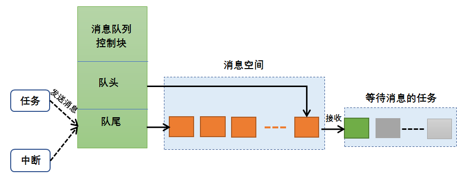

# FreeRTOS

FreeRTOS 是一種適用於微型控制器的開放原始碼即時作業系統，可讓小型、低功率的邊緣裝置易於進行程式設計、部署、保護、連接及管理。 FreeRTOS 自由分散於MIT 開放原始碼授權下，包含一顆核心和一套不斷擴充的軟體程式庫，適用於各種產業和應用程式。

FreeRTOS 有四种状态，每种状态都有对应的状态链表管理。


- 运行态：占用CPU使用权时的状态。
- 就绪态：能够运行（没有被阻塞和挂起），但是当前没有运行的任务的状态。
- 阻塞态：由于等待信号量、消息队列、事件标志组、调用延迟函数等而处于的状态被称之为阻塞态。
- 挂起态：调用函数 vTaskSuspend() 对指定任务进行挂起，挂起后这个任务将不被执行。

调用函数 xTaskResume() 可退出挂起状态。

不可以指定超时周期事件（不可以通过设定超时事件而退出挂起状态）

## 创建任务

任务的创建有两种：

 - 静态内存任务
 - 动态内存任务

### 创建静态内存任务

静态内存分配的好处是，可以更好的对应用程序的内存的利用，具有更好的控制代码的编写。RTOS 对象可以放置在特定的内存位置。最大 RAM 占用空间可以在链路时确定，而不是 运行时。应用程序编写者不需要关心如何 处理内存分配失败的问题。

它允许在不允许任何动态内存分配的应用程序中使用 RTOS (尽管 FreeRTOS 包括可以克服大多数异议的分配方案)。

如果 configSUPPORT_STATIC_ALLOCATION 设置为 1 ，则下列 API 可用:

```c
1 xTaskCreateStatic()
2 xQueueCreateStatic()


3 TimerCreateStatic（）
4 EventGroupCreateStatic()
5 SemaphoreCreateBinaryStatic()
6 SemaphoreCreateCountingStatic()
7 SemaphoreCreateMutexStatic()
8 SemaphoreCreateRecursiveMutexStatic()
```

- 配置静态内存创建静态内存任务需要先实现以下内容：
    - 需要在  FreeRTOSConfig.h 打开 configSUPPORT_STATIC_ALLOCATION 宏，开启静态内存。 
- 开启静态内存的同时需要实现两个函数：（使用静态内存分配任务堆栈和任务控制块内存）
     - vApplicationGetIdleTaskMemory()：空闲任务堆栈函数。
     - vApplicationGetTimerTaskMemory()：定时器任务堆栈函数。

注意静态内存对齐的配置在 portmacro.h 里面的 portBYTE_ALIGNMENT 宏，按自己需求配置即可。

在任务堆栈初始化时会把栈顶指针纠正为内存对齐。参考下列代码：

参考下列代码：

```c
pxTopOfStack = &(pxNewTCB->pxStack[ulStackDepth-(uint32_t) 1 ]);
pxTopOfStack = (StackType_t *) (((portPOINTER_SIZE_TYPE) pxTopOfStack) &
               (~((portPOINTER_SIZE_TYPE) portBYTE_ALIGNMENT_MASK)));
```

#### 任务函数原型

```c
TaskHandle_t xTaskCreateStatic(           // 返回任务句柄
     TaskFunction_t pxTaskCode,           // 任务入口函数
     const char * const pcName,           // 任务名称
     const uint32_t ulStackDepth,         // 任务堆栈大小
     void * const pvParameters,           // 传递给任务入口函数的参数
     UBaseType_t uxPriority,              // 任务优先级
     StackType_t * const puxStackBuffer,  // 任务堆栈
     StaticTask_t * const pxTaskBuffer)   // 任务控制块
```

#### 创建例子

```c
/* 创建静态内存任务 */
lzmStaticTestTaskHandle = xTaskCreateStatic(
   (TaskFunction_t) lzmStaticTestTask,        // 任务入口函数
   (const char*) "lzm static test task",      // 任务函数名                           
   (uint32_t) 256,                            // 任务堆栈大小                                           
   (void*) NULL,                              // 传递给任务入口函数的参数
   (UBaseType_t) 5,                           // 任务优先
   (StackType_t*) lzmStaticTestTaskStack,     // 任务堆栈地址  
   (StaticTask_t* ) & lzmStaticTestTaskTCB);  // 任务控制块地址
```

### 创建动态内存任务

动态内存配置是在 FreeRTOSConfig.h 配置的，这些内存主要供给 FreeRTOS 动态内存分配函数使用。创建对象时需要的函数参数较少。内存分配在  RTOS API 函数中自动进行。应用程序员不需要关心分配内存的问题。如果删除 RTOS 对象，则可以重新使用该对象所使用的 RAM ，从而可能减少应用程序的最大 RAM 占用。 RTOS API 函数提供了返回堆使用信息的功能，允许优化堆大小。

若 configSUPPORT_DYNAMIC_ALLOCATION 设置为 1 ，那么下列 API 函数，可以使用动态内存分配创建：

```c
1 xTaskCreate()
2 xQueueCreate()

3 TimerCreate()
4 EventGroupCreate()
5 SemaphoreCreateBinary()
6 SemaphoreCreateCounting()
7 SemaphoreCreateMutex()
8 SemaphoreCreateRecursiveMutex()
```

### 配置动态内存

动态内存配置是在 FreeRTOSConfig.h 配置的，这些内存主要供给 FreeRTOS 动态内存分配函数使用。

```c
#define configTOTAL_HEAP_SIZE	( ( size_t ) ( 32 * 1024 ) ) // 系统总堆大小
```

而 freertos 的动态内存管理是有文件 heap_x.c 实现的，具体实现算法，后面讲到内存时会分析。

```c
uint8_t ucHeap[ configTOTAL_HEAP_SIZE ];      // 系统总堆 
static TaskHandle_t lzmTestTaskHandle = NULL; // 任务句柄
```

#### 创建任务原型

```c
BaseType_t xTaskCreate(                       // 返回任务句柄
   TaskFunction_t pxTaskCode,                 // 任务入口函数
   const char * const pcName,                 // 任务名称
   const configSTACK_DEPTH_TYPE usStackDepth, // 任务堆栈大小
   void * const pvParameters,                 // 传递给任务入口函数的参数
   UBaseType_t uxPriority,                    // 任务优先级
   TaskHandle_t* const pxCreatedTask )        // 任务控制块指针  
```
#### 创建任务

```c
xReturn = xTaskCreate(
   (TaskFunction_t) lzmTestTask,        // 任务入口函数
   (const char*) "lzm test task",       // 任务函数名
   (uint16_t)256,                       // 任务堆栈大小
   (void*)NULL,                         // 传递给任务入口函数的参数
   (UBaseType_t)5,                      // 任务优先及
   (TaskHandle_t*) &lzmTestTaskHandle); // 任务句柄
```

### 删除任务

在文件 FreeRTOSConfig.h 中，必须定义宏 INCLUDE_vTaskDelete  为 1，删除任务的 API 才会失效。调用API删除任务后，将会从就绪、阻塞、暂停和事件列表中移除该任务。如果是动态内存创建任务，删除任务后，其占用的空间资源有空闲任务释放，所以删除任务后尽量保证空闲任务获取一定的 CPU 时间。如果是静态内存创建任务，删除任务后，需要自己处理释放任务占用的空间资源。

#### 删除任务原型

```c
void vTaskDelete( TaskHandle_t xTaskToDelete ); // 参数为任务句柄
```

注意：传入的参数为任务句柄，当出入的参数为 NULL 时，表示删除调用者当前的任务。 


## 消息队列收发双方处理机制 （Queue)




 - 创建消息队列， FreeRTOS 系统会分配一块单个消息大小与消息队列长度乘积的空间；(创建成功后，每个消息的大小及消息队列长度无法更改，不能写入大于单个消息大小的数据，并且只有删除消息队列时，才能释放队列占用的内存。)
 - 写入消息队列，当消息队列未满或允许覆盖入队时，FreeRTOS系统会直接将消息复制到队列末端；否则，程序会根据指定的阻塞时间进入阻塞状态，直到消息列未满或者是阻塞时间超时，程序就会进入就绪状态；
 - 写入紧急消息，本质上与普通消息差不多，不同的是其将消息直接复制到消息队列队首；
 - 读取消息队列，在指定阻塞时间内，未读取到消息队列中的数据（消息队列为空），程序进入阻塞状态，等待消息队列中有数据；一旦阻塞时间超时，程序进入就绪态；
 - 消息队列不再使用时，应该将其删除；（此时会永久删除）

### 向队列发送消息


### 从队列读取消息


### 消息队列例子 (阻塞式发送与接收)

```c
// FreeRTOS 头文件 
#include "FreeRTOS.h"
#include "task.h"
#include "queue.h"
// 开发板硬件 bsp 头文件
#include "bsp_led.h"
#include "bsp_usart.h"
#include "bsp_key.h"
// 任务句柄
// 任务句柄是一个指针，用于指向一个任务，当任务创建好之后，它就具有了一个任务句柄
// 以后我们要想操作这个任务都需要通过这个任务句柄，如果是自身的任务操作自己，那么
// 这个句柄可以为 NULL
static TaskHandle_t AppTaskCreate_Handle = NULL;  /* 创建任务句柄 */
static TaskHandle_t Receive_Task_Handle = NULL;   /* LED 任务句柄 */
static TaskHandle_t Send_Task_Handle = NULL;      /* KEY 任务句柄 */
 
// 内核对象句柄 
// 信号量，消息队列，事件标志组，软件定时器这些都属于内核的对象，要想使用这些内核
// 对象，必须先创建，创建成功之后会返回一个相应的句柄。实际上就是一个指针，然后就
// 可以通过这个句柄操作这些内核对象。
// 内核对象说白了就是一种全局的数据结构，通过这些数据结构实现任务间的通信，任务间
// 的事件同步等各种功能。这些功能是通过调用这些内核对象的函数来完成的

QueueHandle_t Test_Queue = NULL;

// 宏定义 
#define QUEUE_LEN 4   /* 队列的长度，最大可包含多少个消息 */ 
#define QUEUE_SIZE 4  /* 队列中每个消息大小（字节） */

// 函数声明
static void AppTaskCreate(void);                /* 用于创建任务 */
static void Receive_Task(void* pvParameters);   /* Receive_Task 任务实现 */
static void Send_Task(void* pvParameters);      /* Send_Task 任务实现 */
static void BSP_Init(void);                     /* 用于初始化板载相关资源 */

int main(void)
{
    BaseType_t xReturn = pdPASS;  /* 定义一个创建信息返回值，默认为 pdPASS */
    /* 开发板硬件初始化 */
    BSP_Init();
    /* 创建 AppTaskCreate 任务 */
    xReturn = xTaskCreate((TaskFunction_t) AppTaskCreate,  /* 任务入口函数 */
                   (const char*) "AppTaskCreate",          /* 任务名字 */
                   (uint16_t) 512,                         /* 任务栈大小 */
                   (void*) NULL,                           /* 任务入口函数参数 */
                   (UBaseType_t) 1,                        /* 任务的优先级 */
                   (TaskHandle_t*) &AppTaskCreate_Handle); /* 任务控制块指*/
    /* 启动任务调度 */
    if (pdPASS == xReturn)
    {
        vTaskStartScheduler();     /* 启动任务，开启调度 */
    }
    else
    {
        return -1;
    }
    while (1); /* 正常不会执行到这里 */
}

// 功能说明： 为了方便管理，所有的任务创建函数都放在这个函数里面
static void AppTaskCreate(void)
{
    BaseType_t xReturn = pdPASS; /* 定义一个创建信息返回值，默认为 pdPASS */ 
    taskENTER_CRITICAL();        //进入临界区
    /* 创建 Test_Queue */ 
    Test_Queue = xQueueCreate((UBaseType_t ) QUEUE_LEN,  /* 消息队列的长度 */ 
                            (UBaseType_t ) QUEUE_SIZE);  /* 消息的大小 */ 
    if (NULL != Test_Queue) 
    {
        printf("创建 Test_Queue 消息队列成功!\r\n"); 
    }
    /* 创建 Receive_Task 任务 */
    xReturn = xTaskCreate((TaskFunction_t) Receive_Task,            /* 任务入口函数 */
                            (const char*) "Receive_Task",           /* 任务名字 */
                            (uint16_t) 512,                         /* 任务栈大小 */
                            (void*) NULL,                           /* 任务入口函数参数 */
                            (UBaseType_t) 2,                        /* 任务的优先级 */
                            (TaskHandle_t*) &Receive_Task_Handle);  /* 任务控制块指针*/
    if (pdPASS == xReturn)
    {
        printf("创建 Receive_Task 任务成功!\r\n");
    }
    /* 创建 Send_Task 任务 */
    xReturn = xTaskCreate((TaskFunction_t) Send_Task,           /* 任务入口函数 */
                            (const char*) "Send_Task",          /* 任务名字 */
                            (uint16_t) 512,                     /* 任务栈大小 */
                            (void*) NULL,                       /* 任务入口函数参数 */
                            (UBaseType_t) 3,                    /* 任务的优先级 */
                            (TaskHandle_t*) &Send_Task_Handle); /* 任务控制块指针 */
    if (pdPASS == xReturn)
    {
        printf("创建 Send_Task 任务成功!\n\n");
    }
    vTaskDelete(AppTaskCreate_Handle);                          //删除任务
    taskEXIT_CRITICAL();                                        //退出临界区
}

// 功能说明： Receive_Task 任务主体
static void Receive_Task(void* parameter) 
{ 
    BaseType_t xReturn = pdTRUE;  /* 定义一个创建信息返回值，默认为 pdTRUE */ 
    uint32_t r_queue;             /* 定义一个接收消息的变量 */ 
    while (1) 
    { 
        xReturn = xQueueReceive(Test_Queue,      /* 消息队列的句柄 */ 
                                &r_queue,        /* 发送的消息内容 */ 
                                portMAX_DELAY);  /* 等待时间一直等 */ 
        if (pdTRUE == xReturn) 
        {
            printf("本次接收到的数据是%d\n\n",r_queue); 
        }
        else 
        {
            printf("数据接收出错,错误代码: 0x%lx\n",xReturn); 
        }
    } 
} 

// 功能说明： Send_Task 任务主体
static void Send_Task(void* parameter) 
{ 
    BaseType_t xReturn = pdPASS;  /* 定义一个创建信息返回值，默认为 pdPASS */ 
    uint32_t send_data1 = 1; 
    uint32_t send_data2 = 2; 
    while (1) 
    { 
        if (Key_Scan(KEY1_GPIO_PORT,KEY1_GPIO_PIN) == KEY_ON) 
        { 
            /* KEY1 被按下 */ 
            printf("发送消息 send_data1！\n"); 
            xReturn = xQueueSend(Test_Queue,   /* 消息队列的句柄 */ 
                                 &send_data1,  /* 发送的消息内容 */ 
                                 0 );          /* 等待时间 0 */ 
            if (pdPASS == xReturn) 
            {
                printf("消息 send_data1 发送成功!\n\n"); 
            }
        } 
        if (Key_Scan(KEY2_GPIO_PORT,KEY2_GPIO_PIN) == KEY_ON) 
        { 
            /* KEY2 被按下 */ 
            printf("发送消息 send_data2！\n"); 
            xReturn = xQueueSend(Test_Queue,   /* 消息队列的句柄 */ 
                                 &send_data2,  /* 发送的消息内容 */ 
                                 0);           /* 等待时间 0 */ 
            if (pdPASS == xReturn) 
            {
                printf("消息 send_data2 发送成功!\n\n"); 
            } 
            vTaskDelay(20);                     /* 延时 20 个 tick */ 
        } 
    } 
}

// 功能说明： 板级外设初始化，所有板子上的初始化均可放在这个函数里面
static void BSP_Init(void)
{
    // STM32 中断优先级分组为 4，即 4bit 都用来表示抢占优先级，范围为：0~15
    // 优先级分组只需要分组一次即可，以后如果有其他的任务需要用到中断，
    // 都统一用这个优先级分组，千万不要再分组，切忌。
   
    NVIC_PriorityGroupConfig(NVIC_PriorityGroup_4);
    
    /* LED 初始化 */
    LED_GPIO_Config();
    
    /* 串口初始化 */
    USART_Config();
    
    /* 按键初始化 */
    Key_GPIO_Config();
}
```