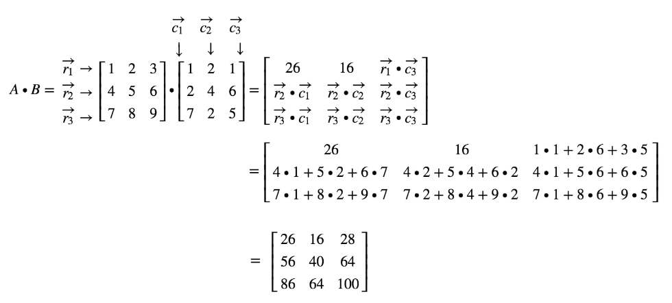
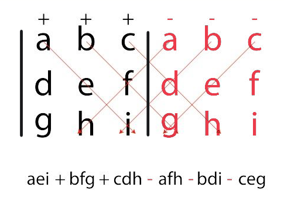
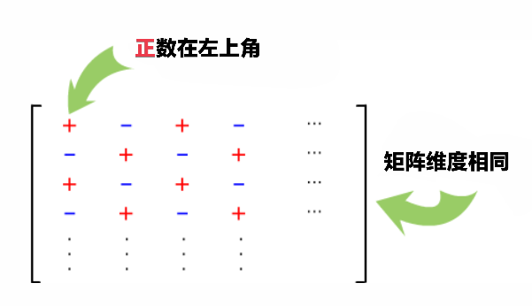
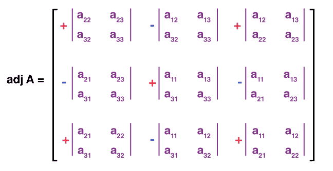

# 矩阵

## 点积运算

矩阵相乘不能像加法和标量乘法那样简单。点积两个矩阵（不一定是同一维度）组合成第三个矩阵。了解每个元素的位置将有助于您了解最终点积的位置。

第一个矩阵的列维度需要与第二个矩阵的行维度相同。确定这一点的最简单方法是通过视觉或按顺序写出维度。

请注意 3x3 和 3x1 中间都有一个 3。这些匹配的 3 表示可以执行点积运算。最终乘积将是外部维度，这里我们有一个 3X1 最终矩阵。

## 矩阵的逆

还记得定义实数的逆元吗？任何数（零除外）与其乘法逆元的乘积都是 1。例如，2x1/2=1。在实数系统中，乘法逆元就是倒数。对于矩阵，逆元的理解会更深入一些，但其性质是一样的。

### 计算行列式 (Determinant)

要找到矩阵的行列式，对于每个方阵   $[A]_{nxn}$ ，都存在一个行列式，该行列式表示通过应用一些行列式查找技术给出的唯一值 $|A|$。以下黑色部分为矩阵。红色为外加部分以计算唯一值。

### 矩阵的辅助因子

方阵中任何元素的辅助因子都是带有正/負符号的子式。如下所示：

详细的辅助因子如下，紫色部分係辅助因子。红黑部分为正負部分如上图。

