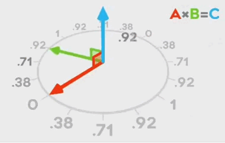

# 向量（Vector）

在空间中有两个向量：
$ \overrightarrow {a} = (x_1, y_1, z_1) $ ，
$ \overrightarrow {b} = (x_2, y_2, z_2) $
 与 
之间夹角为 $ \theta $
。

## 点积 (dot product)

点乘（Dot Product）的结果是点积，又称数量积或标量积（Scalar Product）。

从代数角度看，点积是对两个向量对应位置上的值相乘再相加的操作，其结果即为点积。

$$ \overrightarrow {a} \overrightarrow {b}= x_1 x_2+ y_1 y_2 + z_1 z_2 $$

从几何角度看，点积是两个向量的长度与它们夹角余弦的积。

$$ \overrightarrow {a}  \overrightarrow {b}= \overrightarrow {|a|} \overrightarrow {|b|} cos{\theta}$$

### 几何意义

点乘的结果表示 $\overrightarrow {a}$ 在 $\overrightarrow {b}$
 方向上的投影与 $\overrightarrow {|b|}$
 的乘积，反映了两个向量在方向上的相似度，结果越大越相似。基于结果可以判断这两个向量是否是同一方向，是否正交垂直，具体对应关系为：
 

$$ \theta = cos^{-1}\left(\frac {\overrightarrow {a}  \overrightarrow {b}} {\overrightarrow {|a|} \overrightarrow {|b|}}\right)
$$

点积测试结果相对夹角啲关係

## 叉积 (cross product)

叉乘（Cross Product）又称向量积（Vector Product）。

从代数角度计算：

$$ \overrightarrow {a} \times \overrightarrow {b}= (y_1 z_2- z_1 y_2， z_1 x_2 - x_1 z_2，x_1 y_2 - x_2 y_1)
$$

从几何角度计算：( $\overrightarrow {n}$
 为 $\overrightarrow {a} $ 与 $\overrightarrow {b}$ 所构成平面的单位向量)

$$ \overrightarrow {a} \times \overrightarrow {b}= \overrightarrow {|a|} \overrightarrow {|b|} sin{\theta} \overrightarrow {n} $$

其运算结果是一个向量，并且与这两个向量都垂直，是这两个向量所在平面的法线向量。使用右手定则确定其方向。

### 几何意义

如果以向量 $ \overrightarrow {a} $ 和 $ \overrightarrow {b} $ 为边构成一个平行四边形，那么这两个向量外积的模长与这个平行四边形的面积相等。

