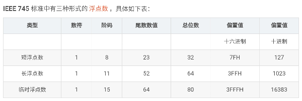
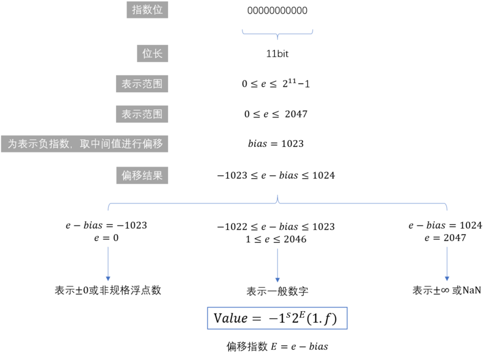
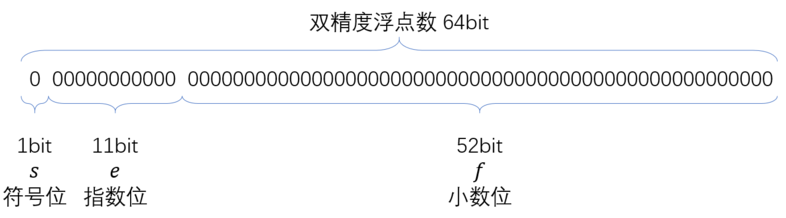

# 强制类型转换 (int 到 float)

**C** 语言中为什么 **32** 位 int 型数据强制转换到 **float** 型会出现精度不能完全保留的现象：

首先来看看的 int 型变量，在一台典型的 **32** 位机器上一个有符号的 int 型的取值范围为 -2147483648 ~ 2147483647 

注在一个 4 字节（32 位 2 进制），首位用于符号位表示正负，其余的 31 位都是数字的有效位。因每个数的值皆为 2 的次方，尾数为 2 的負次方。所以准确度就受次方的限制。

 - 符号位 第一个位为的数值 $s[1]$， 
 - 指数域 第一个位为的数值 $e[1]$，第二个位为的数值 $e[2]$ 如此类推; 其原理为将数值用 2 的指数方法将数值向前或向后改动。目的是增加在小数域内可显示的数字。
 - 小数域 第一个位为的数值 $f[1]$，第二个位为的数值 $f[2]$ 如此类推;

[网上浮点小数计法详细教程](https://m.youtube.com/watch?v=RuKkePyo9zk)

请注意由左为 **1** 向右方向递增直至最后

## IEEE-745浮点数表示法存储结构

### 用 32 位的 float 作为解释这以上 **IEEE-745** 的浮点数规则：

- 首位表示(符号位) **s**，**s** 等于 **1** 则为負数。当 **s** 为 **0** 则为正数。隐含的最高位不是 1，而是 0；
- 接下来的 **8** 位（指数域）用于表示 **2** 的指数 **e**，固定为 -126，而非 -127，即时以下的规格化值；
  - 可以分成三种情况：
    - 规格化值。当指数域的 8 个二进制数字既非全 **0** 又非全 **1** 时：
    
        $$ 2^{指数} ,  指数 = e - (2^7 - 1) ＝ e - 127 = 2^{e-127}； e>0 $$
    - 非规格化值。当指数域的 8 个二进制数字为全 **0** 时：
    
        $$ 2^{指数} ,  指数 = e - (2^7 - 1) = 0 - 127 ＝ -127 = 2^{-127} $$
        
    - 特殊值。当指数域的 8 个二进制数字为全 **1** 时即为这种情况。当小数域为全零 **0** 时：
      - 当 $e$ 全为 1 ，$f$ 全为 0，表示 正负无穷大 +/- ∞
      - 当 $e$ 全为 1 ，$f$ 不全为 0，表示非数值 NaN（Not a Number）

      
- 剩余的 **23** 位（小数域）表示 **f**
  - 此时小数域的值仍表示
     $$ f = 2^{-1} + 2^{-2} + 2^{-3} + 2^{-4} + ... + 2^{-23} = \sum_{i=1}^{23} 2^{-f[i]} $$

最终结果为：

$$ 数值 ＝ s \times e \times (1 + f) \\
  => -1^s \times 2^{e-127} \times \left( 1 + \sum_{i=1}^{23} 2^{-f[i]} \right)； 由左为\enspace 1 \enspace 到右为 \enspace 23 \enspace 方向。
 $$

长浮点数。大致参考以上 32 位数计算方法。

### 计算 IEEE-754 标准浮点数 32 位的真值例子

在上述内容的分析之后，再通过观察分析以下这个 IEEE 754 单精度浮点数格式表示的数，系统性了解如何计算出 IEEE 754 标准浮点数的真值：

0 100 0001 0 001 0001 1001 1001 1001 1001

上数分别对应图1-1的中 s（符号码，0 正，1 负），e (阶码) ，f (尾数数值)为：

s (绿色部分) ：0

 - 0，数符，表示这个浮点数是个正数：
  $$ 2^0 = 1，任何数值 0 次方也等如 1 $$

e (红色部分)：100 0001 0

 - 1000 0010，阶码，其真值为：移码 (1000 0010) - 偏置值 (0111 1111) 

  $$ => 1000 \enspace 0010 - 0111 \enspace 1111 = 130 - 127 = 3；$$
  $$ e = 2^3 = 8 $$

f (黑色部分)：001 0001 1001 1001 1001 1001

 - 001 0001 1001 1001 1001 1001 表示这个浮点数的尾数部分：

  $$ => 2^{-3} + 2^{-7} + 2^{-8} + 2^{-11} + 2^{-12} + 2^{-15} + 2^{-16} + 2^{-19} + 2^{-20} + 2^{-23} \\
= \frac{1}{2^3} + \frac{1}{2^7} + \frac{1}{2^8} + \frac{1}{2^{11}} + \frac{1}{2^{12}} + \frac{1}{2^{15}} +  \frac{1}{2^{16}} + \frac{1}{2^{19}} + \frac{1}{2^{20}} + \frac{1}{2^{23}} \\
 = 0.137499928 \\
 f = 1 + 0.137499928 = 1.137499928 $$

通过对 s，e，f 的分析，我们可以计算出该浮点数的真值，即：

$$ -1^0 \times 2^8 \times 1.137499928 = 9.099999428 $$ 

## 浮点舍入问题

因为将二进制值转换为十进制与原始十进制值不同。将二进制值转换为十进制时，如数值不是能用二进制制除尽的数，则无法获得实际值。这是浮点算术中的问题。它被称为浮点舍入问题。它不会达到零，而是从正负两侧取近似零值。
