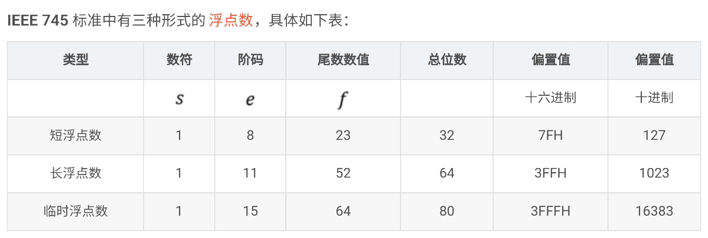

# 强制类型转换 (int 到 float)

**C** 语言中为什么 **32** 位 int 型数据强制转换到 **float** 型会出现精度不能完全保留的现象：

首先来看看的 int 型变量，在一台典型的 **32** 位机器上一个有符号的 int 型的取值范围为 -2147483648 ~ 2147483647 

注在一个 4 字节（32 位 2 进制），除去首位用于符号位表示正负外，其余的 31 位都是数字的有效位。因每个数的值皆为 2 的次方，尾数为 2 的負次方。所以准确度就受次方的限制。

IEEE-745浮点数表示法存储结构：

用 C 语言中， 32 位的 float 型变量作为解释这以上 **IEEE-745** 浮点数规定：

- 首位表示符号位 **s**，**s** 等于 **1** 则为負数。当 **s** 为 **0** 则为正数。隐含的最高位不是 1，而是 0；
- 接下来的 **8** 位（指数域）用于表示 **2** 的指数 **e**，固定为 -126，而非 -127，即时以下的规格化值；
  - 可以分成三种情况：
    - 规格化值。当指数域的 8 个二进制数字既非全 **0** 又非全 **1** 时：
        $$ 2^{指数} ,  指数 = e - (2^7 - 1) ＝ e - 127 = 2^{e-127}； e>0 $$
    - 非规格化值。当指数域的 8 个二进制数字为全 **0** 时：
        $$ 2^{指数} ,  指数 = e - (2^7 - 1) = 0 - 127 ＝ -127 = 2^{-127} $$
    - 特殊值。当指数域的 8 个二进制数字为全 **1** 时即为这种情况。当小数域为全零 **0** 时：
      - 当 $e$ 全为 1 ，$f$ 全为 0，表示 正负无穷大 +/- ∞
      - 当 $e$ 全为 1 ，$f$ 不全为 0，表示非数值 NaN（Not a Number）
- 剩余的 **23** 位（小数域）表示 **f**
  - 此时小数域的值仍表示
     $$ f = 2^{-1} + 2^{-2} + 2^{-3} + 2^{-4} + ... $$

最终结果为：

长浮点数。大致参考你上 32 位数计算方法。

在上述内容的分析之后，再通过观察分析以下这个 IEEE 754 单精度浮点数格式表示的数，系统性了解如何计算出 IEEE 754 标准浮点数的真值：

1 100 0000 1010 0000 0000 0000 0000 0000

上数分别对应图1-1的中 S（符号码，0 正，1 负），E (阶码) ，M (尾数数值)为：

1. 关于 IEEE 754 浮点数标准中的阶码
在 IEEE 754 浮点数标准中，阶码是用移码表示的，移码的定义：移码 = 真值 + 偏置值；

1. 普通情况下，移码的偏置值为 2^(n-1)， 8 位的移码的偏置值为 2^(8-1) = 128D = 1000 0000B；

​ 例如：-127D = -0111 1111B ， 其移码为 -0111 1111 + 1000 0000 = 0000 0001；

2. 在 IEEE 754 标准中，移码的偏置值是 2^(n-1)-1，8 位的移码的偏置值为 2^(8-1)-1 = 127D = 0111 1111B；

​ 例如：-126D = -0111 1110B ，其移码为 -0111 1110 + 0111 1111 = 0000 0001

注意：8 位中，-127D 和 128D 这 2 个阶码有特殊用途，一般不在正常讨论范围（-126～127），他们的移码分别是：

-127D：-0111 1111 + 0111 1111 = 0000 0000；
128D：1000 0000 + 0111 1111 = 1111 1111；
2. 关于 IEEE 754 浮点数标准中的尾数
在 IEEE 754 浮点数标准中，尾数码部分采用原码表示，且尾数码隐含了最高位 1，在计算时我们需要加上最高位1，即 1.M，我们通过一个例子来表示：

​ 例如：有一个浮点数，真值为 0.11B ，那么其简略版的 IEEE 754 标准表示为（忽略 符号码 和 阶码）：

S(1) E(8) 100 0000 0000 0000 0000 0000
​ 即当 0.11B 这个数在记录为 IEEE 754 标准浮点数时，会这样处理，令 0.11 = 1.1 * 2^(-1) ，尾数码是 1.1000…，然后隐含最高位1，即 1 .1000…。

3. 计算 IEEE 754 标准浮点数的真值

在上述内容的分析之后，再通过观察分析以下这个 IEEE 754 单精度浮点数格式表示的数，系统性了解如何计算出 IEEE 754 标准浮点数的真值：

1 100 0000 1010 0000 0000 0000 0000 0000

上数分别对应图1-1的中 s（符号码，0 正，1 负），e (阶码) ，f (尾数数值)为：

s (红色部分) ：1

 - 1，表示这个浮点数是个负数；

e (蓝色部分) ：100 0000 0

100 0000 1，阶码，其真值为 ：移码 - 偏置值 => 1000 0001 - 0111 1111 = 0000 0010 = 2D；

f (黑色部分) ：010 0000 0000 0000 0000 0000

010 0000 0000 0000 0000 0000 表示这个浮点数的尾数部分，其真值为：被隐含的最高位 1 + 0.尾数部分 => 1 + 0.01 = 1.01B;

通过对 S，E，M 的分析，我们可以计算出该浮点数的真值，即：

$$ -1.01B * 2^{10B} = 1.25D * 2^{2D} = -5.0D $$

或 

$$ -1.01B * 2^10B = -101.0B = -5.0D $$

将a展开为二进制，其值为0000 0000 0011 0101 0100 0011 0010 0001，其十六进制即为0x00354321。 因为要转化为float型，所以首先要对上述二进制的表示形式改变为 M * 2^E 的形式.由于该数明显大于1，所以按照IEEE的标准，其浮点形势必然为规格化值。因此 ，转化后的形式为
a = 1.101010100001100100001 * 2^21

根据 规格化值的定义，M = 1 + f. 所以f = 0.101010100001100100001.因为float型变量的小数域一共23位。所以b的最后23位可以得出，其值为10101010000110010000100; ?& e& o" A% g, I# G
; }. r8 Y* k; t) ^+ \
下面再演绎指数域的值：因为a的指数表示法中，指数E = 21。根据公式2，e = E + (2^7 -1) = 148.所以可以得出b的指数域的二进制表示为：10010100。在加上原数为正，所以符号位s=0。
8 K% c% ^9 P: ]4 V# s! s7 e
所以，可以得出b的二进制表示为0 10010100 10101010000110010000100。转化为十六位进制则是0x4A550C84。换句话说，它存储在内存中的值是与a是完全不同的。但是其间还是有关联性的——a的首位为1的数值位后的二进制表示是与b的小数域完全相同的。

很快，问题就出现了。int型的有效位数是31，而float型小数域的有效位只有23位，也就是说如果上面的a的二进制的有效位超过了24位，那么float型的小数域的精度就不够了。因此必须进行舍入。比如：如果上面的a的二进制为0000 0001 1111 0101 0100 0011 0010 0001。这时b的小数域必须有24位才够，但是，这显然是不现实的，因此必须舍入到23位，舍入的原则是：所得结果的最低有效位为0。因此这个a在转换到float时，其精度就会丢失，因为该float的最后23位变成了11110101010000110010000——这显然是与原值不符的。