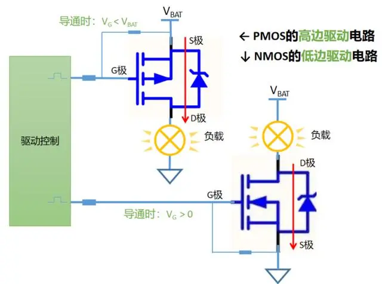
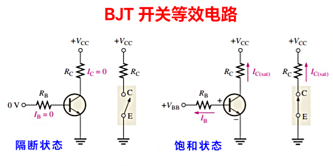
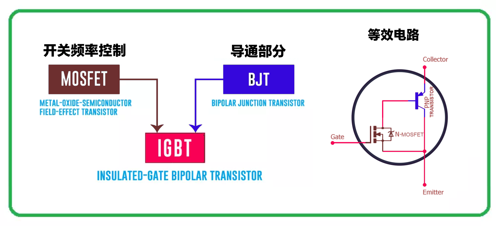

# MOSFET 和 IGBT

IGBT （Insulated Gate Bipolar Transistor）和 MOSFET (Metal-Oxide-Semiconductor Field-Effect Transistor) 在栅极和其他端子之间都有绝缘，两种器件全部具有较高的输入阻抗。在应用中，IGBT和MOSFET都可以用作静态电子开关。

特性参数上，MOSFET 和 IGBT 的主要区别体现在以下9个方面：

- MOSFET 正向特性对温度具有很强的正向依赖性，在**低电流区**的导通电压低于 IGBT。IGBT **高温**特性更好导通电压比 MOSFET 低，在**大电流区**的正向电压特性优于 MOSFET。
- IGBT 适用于中到极**高电流**的传导和控制，MOSFET 仅适用于**低到中电流**的传导和控制。
- IGBT 仅适合**低频**应用，能在千 Hz 频率下运行良好。MOSFET特别**适合非常高频**的应用，它可以在兆 Hz 频率下运行良好。
- IGBT 的**开关速度比较低**，MOSFET *8开关速度非常高**。
- IGBT 可以承受**非常高**的电压以及大功率，MOSFET 仅适用于**低至中**压应用。
- IGBT 具有较大的关断时间，MOSFET 的关断时间较小。
- IGBT **可以处理任何瞬态电压和电流**，MOSFET **在发生瞬态电压时会受到干扰**。
- MOSFET 器件**成本低**，价格便宜，而 IGBT 至今仍属于**成本高**器件。
- IGBT 适合**高功率交流**应用，MOSFET 适合**低功率直流**应用。

在不间断电源 (UPS) 、工业逆变器、功率控制、电机驱动、脉宽调制 (PWM) 、开关电源 (SMPS) 等开关应用中，MOSFET 和 IGBT 因其具有的优越特性，性能上明显优于其他开关器件。其中，MOSFET 主要用于较低的电压和功率系统，而 IGBT 更适合较高的电压和功率应用。

## MOSFET (金氧半場效電晶體)

MOSFET 是由电压驱动的，输入阻抗较高，控制时消耗的功耗较少。另外，由于是电子或空穴一种载流子的单极晶体管，所以具有开关速度快的优点。但是，与双极晶体管不同的是，不能利用电导调制效应，因此存在导通电阻随耐压增加而增加的缺点。

## BJT (双极晶体管)

双极晶体管具有高耐压且导通电阻低的优点。应用于电流放大工作，因此允许流过比所施加电流更大的电流。缺点是输入阻抗低消耗的功耗大及开关速度较慢。

## IGBT (絕緣柵雙極電晶體)

IGBT 是输入部分为 **MOSFET** 结构、输出部分为 **BJT** 结构的复合型器件，同时具备 **MOSFET** 和 **双极晶体管** 两者的优点。输入阻抗高，可以用小功率驱动，可以将电流放大为大电流。此外，即使在高耐压条件下，导通电阻可保持在较低水平。开关速度不如 MOSFET 快，但比双极晶体管要快。

|元件|Bipolar|MOSFET|IGBT| 
|:---:|:---:|:---:|:---:|
|电压|高<1kV|高<1kV|極高>1kV|
|电流|高<500A|低<200A|高>500A|
|控制电路|複习|简单|简单|
|控制方法|hFE电流  20-200|VGS 电压 3-10V|VGE电压 4-8V|
|控制功耗|高|低|低|
|输入阻抗|低|高|高|
|输出阻抗|低|中|低|
|饱和电压|低|高|低|
|频率限制|<100kHz|<1MHz|中速|
|开关速度|慢 10-6秒|快 10-9秒|中|
|安全工作区|窄|宽|宽|
|价格|低|中|高|

## 逆变器

逆变器是把直流电能转变成定频定压或调频调压交流电的转换器。它由逆变桥、控制逻辑和滤波电路组成。直流变换：由 MOSFET/ IGBT 和储能电感组成电压变换电路，输入的脉冲经过推挽放大器放大后驱动 MOSFET/IGBT 做开关动作，使得直流电压对电感进行充放电，这样电感的另一端就能得到交流电压。逆变器的主功率元件的选择至关重要，较多的功率元件有达林顿功率晶体管（BJT），功率场效应管（MOSFET），绝缘栅晶体管（IGBT）和可关断晶闸管（GTO）等。

 - 在**小容量低压系统** 中使用较多的器件为 MOSFET ，因 MOSFET 具有较低的通态压降和较高的开关频率，
 - 在**高压大容量系统** 中一般均采用 IGBT 模块，因 MOSFET 随着电压的升高其通态电阻也随之增大，而 IGBT 在中容量系统中占有较大的优势，
 - 在**特大容量系统**（100KVA以上）系统中，一般均采用 GTO 作为功率元件。