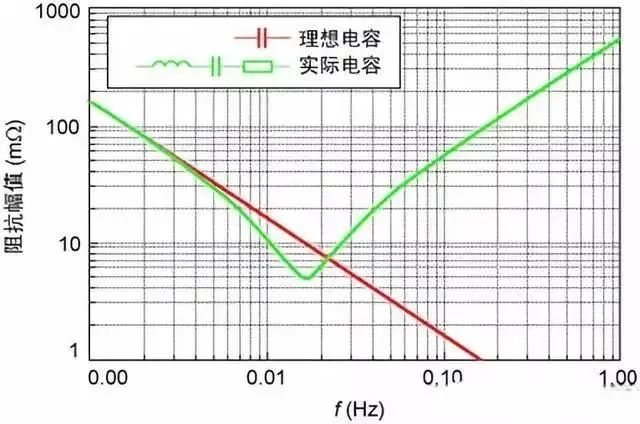
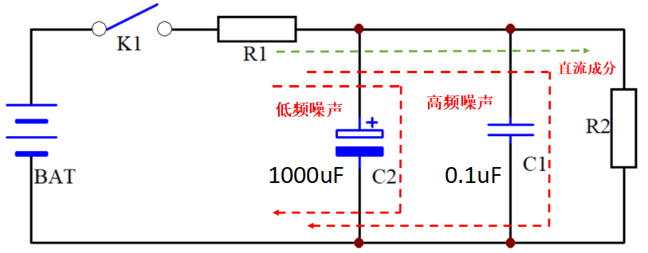
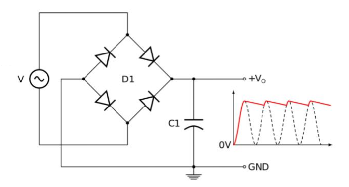
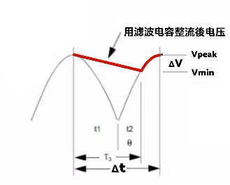
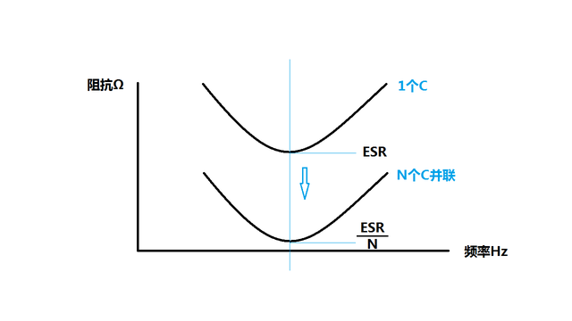
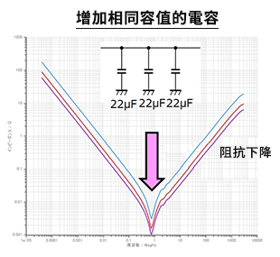
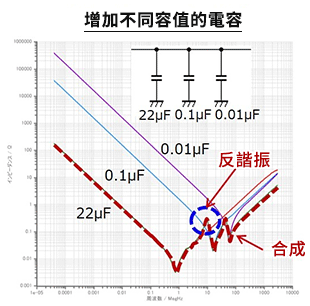
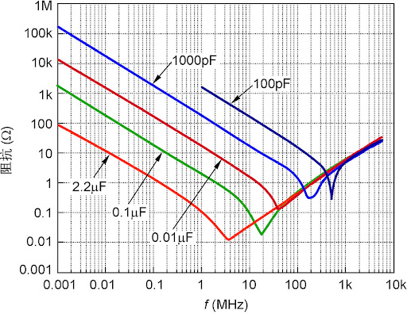
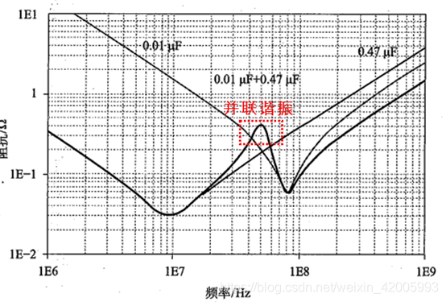

# 电容

## 电容特性

因制造电容的材料有电阻，电容的绝缘介质有损耗，各种原因导致电容等于等效串联电感**ESL**、等效串联电阻**ESR**、与理想电容的串联，其特性与频率有关，如下图。

从上图中，我们看到阻抗在自谐振频率（也就是最低那个点）之前是容性的，（阻抗随频率升高而减少，呈现容性）而与 ESL 值无关；然后在高于自谐振频率之后变为感性(因这时候阻抗随着频率升高而增大，呈现感性)。

电容的最佳滤波效果就是这个自谐振频率点，所以对于 **EMC** 的 **RE** 辐射问题，一般都是将辐射超标点频率作为自谐振频率点，然后根据这个曲线去选电容。

注意：一般电容容值越高，ESL 越大，这就是为什么一般用大电容滤低频，小电容滤高频的原因(因为小电容 **ESL** 小，自谐振频率高)。

$$
\displaystyle v = \dfrac{1}{\text C}\, \int_{\,0}^{\,T} i\,\text dt + v_0
$$

C 是电容，是电容器的物理特性。
C 是 i 和 dv/dt 之间关系的比例因子。
C 确定在给定 dv/dt 量的情况下产生多少 i。

### 电容基本特性

 - 电容两端的电压不能突变；
 - 电容通交流，隔直流；
 - 电容通高频，阻低频；
 - 电容电压滞后于电流；
 - 电容刚通电瞬间，相当于短路；
 - 电容的容抗随信号频率升高而降低，随信号频率降低而升高。

### 电容在电路中发挥的主要作用

 - 隔直流：作用是阻止直流而只让交流通过；
 - 旁路/去耦：为交流电路中某些并联的元件提供低阻抗通路；
 - 耦合：作为两个电路之间的连接，只允许交流信号通过并传输到下一级电路；
 - 平滑或滤波：将整流以后的脉状波变为接近直流的平滑波，或将纹波及干扰波虑除；
 - 温度补偿：针对其它元件对温度的适应性不够带来的影响，而进行补偿；
 - 计时：电容器与电阻器配合使用，确定电路的时间常数；
 - 调谐：对与频率相关的电路进行系统调谐，比如收音机；
 - 储能：储能型电容器将存储的能量通过变换器引线传送至电源的输出端；
 - 浪涌电压保护：开关频率很高电路器件易受到损害性电压尖峰脉冲影响。电容器吸收电压脉冲限制了峰值电压，从而起到保护作用；
 - EMI/RFI 抑制：这些电容器连接在电源的输入端，以减轻由半导体所产生的电磁或无线电干扰。由于直接与主输入线相连，这些电容器易遭受到破坏性的过压和瞬态电压。采用塑膜技术的 X- 级和 Y- 级电容器提供了最为廉价的抑制方法之一。抑制电容器的阻抗随着频率的增加而减小，允许高频电流通过电容器。 X 电容器在线路之间对此电流提供“短路”， Y 电容器则在线路与接地设备之间对此电流提供“短路”；
 - 控制和逻辑电路：各类电容器均可能被应用于电源控制电路中。除非是在恶劣环境条件的要求，否则这些电容器的选择一般都是低电压低损耗的通用型元件；
 - 波形变化：积分、微分、整形等。
 
注意：在同一个电路中的同一个电容，可发挥的作用有多种。

对于 **1000uF** 的大电容 C2，可以认为它是滤波电容，也可以认为它是旁路电容，它通过将低频扰动旁路到地而达到滤波的目的。

## 滤波电容设计

假设变压器输出端的额定值为 12 V 和 4 A（直流值），假设电网频率为 50 Hz，因此周期为 T=20 ms，假设纹波为 10%。

在这种情况下 $$ \Delta V = 1.2V $$，因为在带有电容器的全波桥式整流器中，它会放电约半个周期 $$ \Delta t = \frac {T}{2} = \frac {20 ms}{2} = 0.01s $$，然后在下一个交流峰值时重新充电。则 C 的表达式及其值为：

$$ C_{min} = \frac {Q}{U} =   \frac {I \times T_3}{\Delta V} \simeq \frac {I \times \Delta t}{\Delta V}$$

由于 T3 小于Δt，为方便计算用 Δt 代替 T3。

$$\frac {I \times \Delta t}{\Delta V} = \frac {P_{in}} {V_{Peak} - \frac {\Delta V}{2}} \times {\frac {\Delta t}{\Delta V} }
$$

即

$$ C_{min} = \frac {4 \times 0.01}{1.2} = 0.0333 F = 33000 \mu F $$

$$ i = C \times \frac {dv} {dt} $$

- 注意：电容值不能太大，如太大会增加输入电流，使电路不稳定及发热。

## 旁路电容设计

旁路电容提供低阻抗的新途径，期望信号另走它路。

旁路电容的电抗应不大于并联电阻的<b>10%</b>。 可以使用以下公式计算要使用的旁路电容器的电容值。 计算出的单位为 μF。
 
$$ C_{min}=\frac{10^6}{2\pi{f}\times({X_{R}\times{0.1}})}$$

### 电容值越大电阻越小

## 去耦电容设计

去耦是提高阻抗至无穷大，期望信号被直接阻断。

 - 高Q电容窄带电阻急剧下降。 低Q电容在较宽频段相对平缓下降。
 - PCB布局的热风焊盘等会增加电感分量，使谐振频率向低频端移动。。

### 有效使用去耦电容的方法

 - 使用多個电容
 - 降低电容的ESL

#### 相同容值电容

因电容在谐振点上的电阻 ESL及电感 ESL 是相等于并联。假设 3 个电容的特性完全相同，则 ESR 及 ESL 会减少至原本电容的 1/3。

#### 不相同容值电容

曲线是在 22µF 的电容上并联 0.1µF、及 0.01µF 的电容后的频率特性。

通过增加容值更小的电容，可降低高频段的电阻。 相对于一个 22µF 电容的频率特性，0.1µF 和 0.01µF 的特性是合成后的特性(红色虚线)。但必须注意，有些频率点产生反谐振，电阻反而增高，EMI恶化。 反谐振发生于容性特性和感性特性的交叉点。所以增加电容的电容量時要根据目标降噪频率进行选择。

## 耦合电容设计

隔断偏置直流信号。

耦合电容选择 0.1uF-0.5uF 之间，输入信号衰减比较严重。如果电路要求信号耦合之后不能衰减，那么耦合电容就不能小于 0.5uF。

但如电容太大。充电时间过长，输出信号會出现延迟，特别是输入信号幅度很小的时侯就要特别注意这个问题，否则电路会变得非常缓慢。

 - 抑制噪声：电容值应该尽可能小，以避免引入噪声或失真。
 - 阻隔直流：电容值必须足够大，以便隔离前级和后级之间的直流偏置电压。

低频情况下，原则上是越大越好，计算时一般选择下限频率、补偿低频频响，音响电路里面很多时候就是这么干。如果还要照顾高频，那就采用两个一大一小电容并联的办法。但要注意关联谐振问题如下图。

一般估算时候采用的低端截止频率要比你需要的最低频率低 5－10 倍，高频则要选高 5－10 倍。还要注意电容的材料和工艺，音频频段常用电解、聚丙烯和涤纶电容。
 - 几百 kHz 用独石(低频瓷介)的足够了，
 - 上 MHz 的就用高频瓷介，
 - 在 30MHz 以上的最好不用涤纶、低频瓷介和有长引线的铝电解，电容很有可能已经变成电感特性。