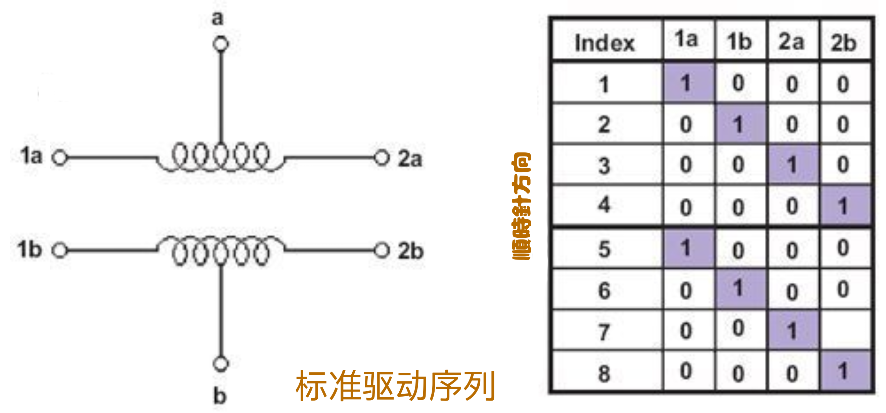
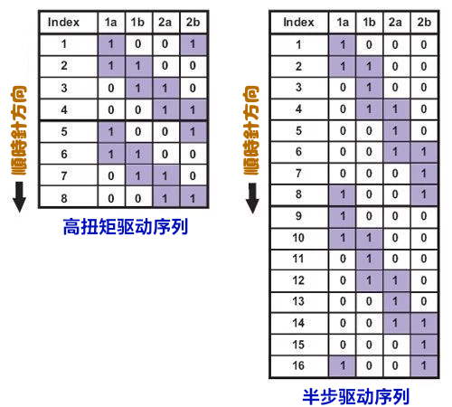

<style>
  table {
    width: 100%
    }
  td {
    vertical-align: center;
  }
  table.inputT{
    margin: 10px;
    width: auto;
    margin-left: auto;
    margin-right: auto;
    border: none;
  }
  input{
    text-align: center;
    padding: 0px 10px;
  }
  iframe{
    width: 100%;
    display: block;
    border-style:none;
  }
</style>

# 步进电动机介紹

步进电机的轴在通常相隔几度的离散旋转位置之间移动。由于这种精确的位置可控性，步进电机非常适合需要高定位精度的应用。

## 步进电动机特性

步进电机的行为与标准直流电机不同。每次移动一点点。步进电机在扭矩-速度关系上也不同于直流电机。

直流电机通常在没有齿轮机构的情况下，在低速下产生高扭矩的能力并不好。而步进电机的工作方式相反。它们在低速时产生最大的扭矩。

步进电机还有另一个特性，即**保持扭矩**，这是直流电机所没有的。保持扭矩使步进电机在不转动时能够牢牢保持其位置。这对于电机可能启动和停止的应用非常有用，而作用在电机上的力仍然存在。 这样就无需机械制动机制。

步进电机不仅仅**响应时钟信号**，它们还有多个绕组，需要按照正确的顺序通电后电机轴才会转动。颠倒顺序将导致电机反方向转动。如果控制信号发送顺序不正确，电机将无法正常转动。它可能只是嗡嗡作响而不转动。或者实际上会转动但不稳定。负责将步进和方向信号转换为绕组通电模式的电路称为转换器。大多数步进电机控制系统除了转换器之外还包含驱动器，以处理电机绕组所吸收的电流。

## 每步度数

这通常是为特定应用选择步进电机时最重要的因素。该因素指定了轴每完整步进旋转的度数。电机的半步操作将使步数/转数加倍，并将每步度数减半。对于未标记的电机，通常可以手动仔细计算电机每转的步数。每步度数可以通过将 360 除以 1 完整旋转中的步数来计算。常见的<font color="#FF1000">度数/步数</font>包括：<font color="#FF1000">0.72、1.8、3.6、7.5、15</font> 甚至 <font color="#FF1000">90</font>。每步度数通常称为电机的分辨率。与未标记的电机一样，如果电机上只印有**步数/转数**，则将 <font color="#FF1000">360</font> 除以该数字将得出度数/步数值。

## 步进电机的类型

步进电机分为两个基本类别：

- 永磁步进电机
- 可变磁阻步进电机

电机类型决定了驱动器类型和所用转换器的类型。永磁步进电机有几种子类型可供选择。这些类型包括单极、双极和多相。

## 驱动序列

### 标准驱动序列



电机每步都同时激活一个绕组。

### **高扭矩**和**半步**驱动序列

在高扭矩序列中，电机每步都同时激活两个绕组。这种双绕组组合产生的扭矩比标准序列高出约 1.5 倍，但消耗的电流是标准序列的两倍。



半步进是通过组合两个序列实现的。首先，激活其中一个绕组，然后激活两个绕组，然后激活一个绕组，等等。这实际上使电机轴每转一圈前进的步数加倍，并将每步的度数减半。


### 如何计算步进电机的步进延迟


- 将电机的 RPM 转换为 RPS 

$$ RPS = \frac {RPM}{60} $$
 
- 取倒数可得到每转秒数 

$$ \frac {1}{RPS} = \frac {60}{RPM} $$

- 除以 360 可得到每度秒数 

$$ \frac {60}{RPM \times 360} = \frac {1}{6 \times RPM} $$

- 乘以 1.8 可得到<font color="#FF1000">每步秒数</font>

$$ \frac {1.8}{6 \times RPM} = \frac {0.3}{RPM} $$

### 示例代码

#### steppers.h

```h
#include <stdint.h>
#include <stdbool.h>

#define CW 1
#define CCW 0
#define FULLSPEED 0
#define HALFSPEED 1
#define HIGHTORQUE 2

struct stepper_pins{
    uint8_t pin1;
    uint8_t pin2;
    uint8_t pin3;
    uint8_t pin4;
};

void stepper_init(struct stepper_pins *stepper_ptr);
void step(struct stepper_pins *stepper_ptr, int step);
void steps(struct stepper_pins *stepper_ptr,int steps, int direction, int speed, int ms);

```

#### steppers.c

```c
#include "freertos/FreeRTOS.h"
#include "esp_wifi.h"
#include "esp_system.h"
#include "esp_event.h"
#include "esp_event.h"
#include "nvs_flash.h"
#include "driver/gpio.h"
#include "./include/stepper.h"

const uint8_t steps_port[3][8] =
		{{0x08, 0x04, 0x02, 0x01, 0x08, 0x04, 0x02, 0x01},
		 {0x09, 0x01, 0x03, 0x02, 0x06, 0x04, 0x0c, 0x08},
		 {0x0C, 0x06, 0x03, 0x09, 0x0C, 0x06, 0x03, 0x09}};


```