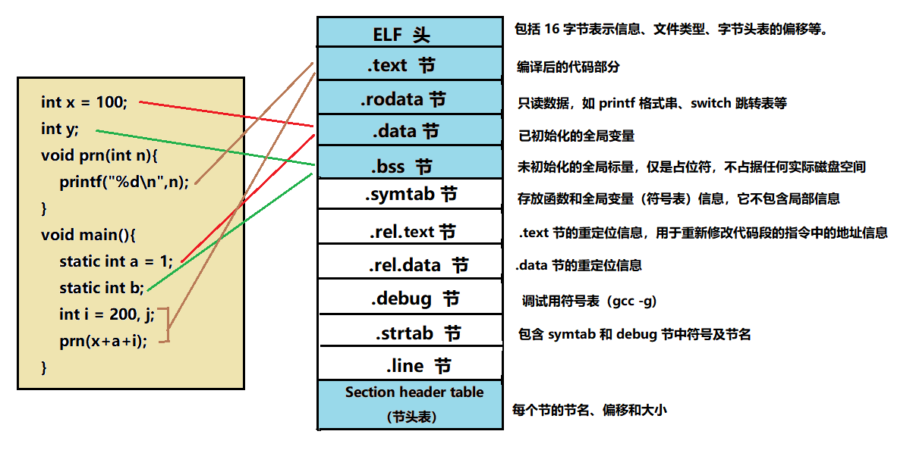
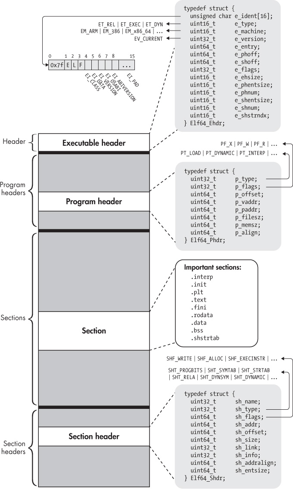
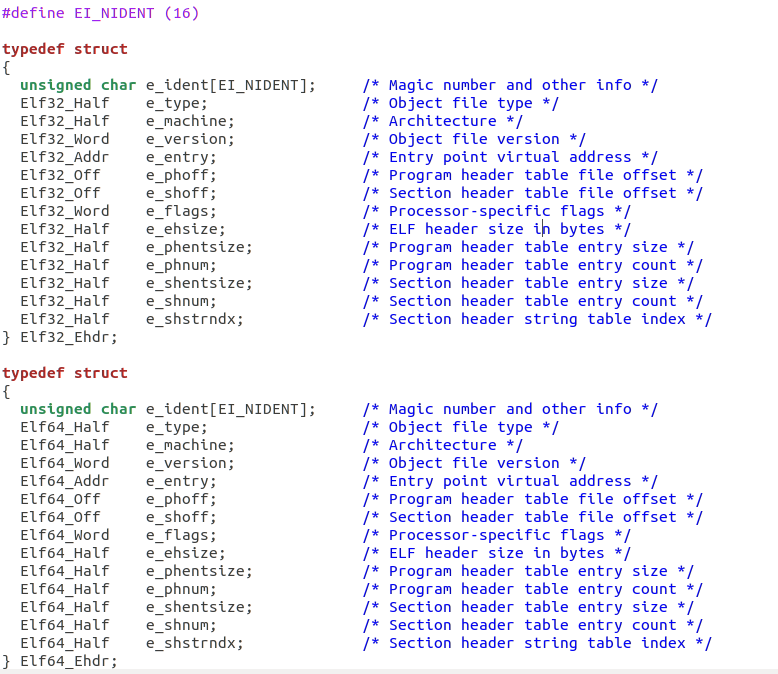
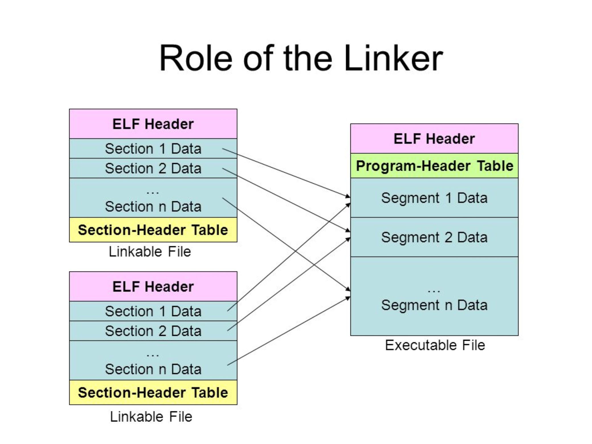
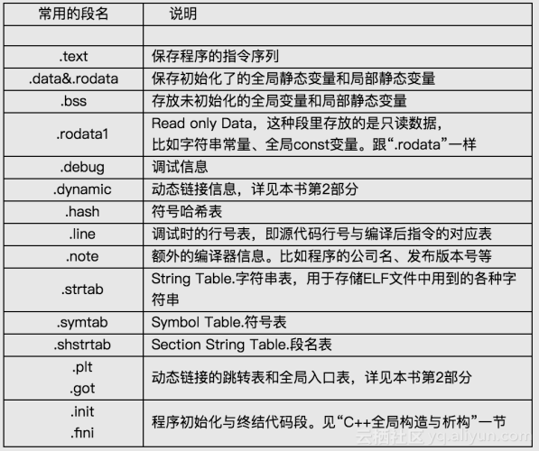
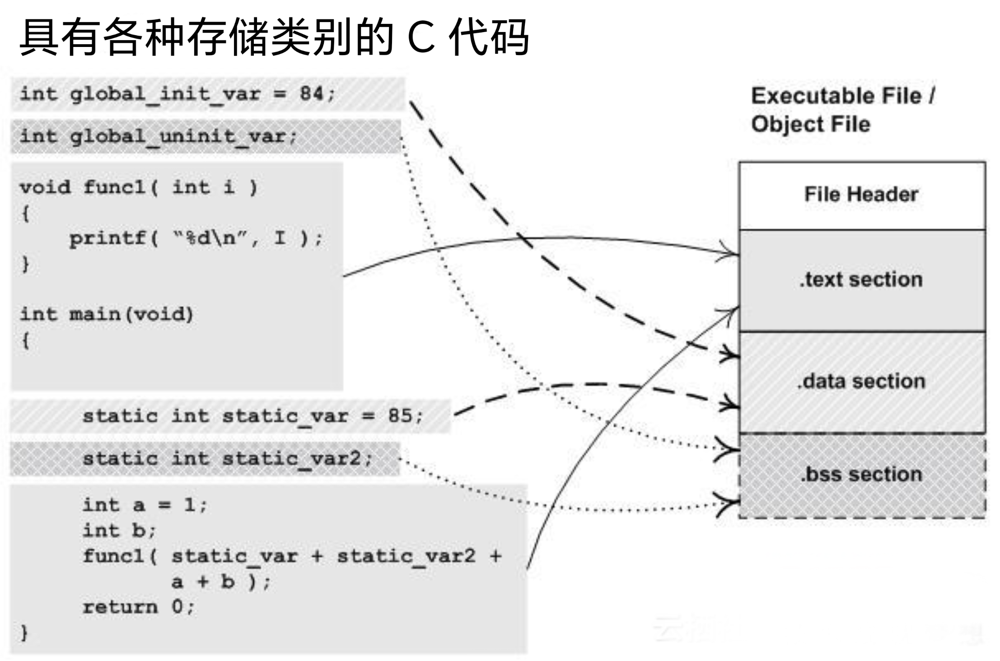

#  ELF 格式介紹

可执行与可连结格式（英语：Executable and Linkable Format，缩写ELF，此前的写法是Extensible Linking Format），常被称为ELF格式，在计算中，是一种用于可执行档案、目的码、共享库 和核心转储（core dump）的标准档案格式。在 Linux 平台上通用的二进制文件格式及在 Android 的 NDK 开发中，几乎都是 ELF。

## ELF 文件的主要组件

ELF 文件有三个主要组件组成：

 - ELF 头 (Header)
 - 节 (Sections) 
 - 段 (Segments)

每个元素在 ELF 可执行文件的链接/加载过程中都发挥着不同的作用。以下将讨论每个组件以及段和节之间的关系。

### ELF 头 (Header)

ELF 文件开始，包含文件结构的说明信息，分 32 位系统和 64 位系统，下面分别是 32 位系统和 64 位系统对应的 ELF 头的数据结构。

ELF 的魔数：7f 45 4c 46 (其中 45 4c 46 是 ELF 的 ASCII 码值)

### 节 (Sections) 

系统预定义了一些节名（以.开头），这些节有其特定的类型和含义。

|節名|类型|说明|
|:---:|:---|:---|
|.**text** |SHT_NOBITS， SHF_ALLOC + SHF_WRITE|保存程序的指令代码|
|.**bss** |SHT_NOBITS， SHF_ALLOC + SHF_WRITE|程序运行时未初始化的全局变量和静态变量。数据初始化为0|
|.**data** 和 .**data1**|SHT_PROGBITS， SHF_ALLOC + SHF_WRITE|初始化的全局变量和静态变量|
|.**strtab**|SHT_STRTAB|字符串，是符号表中符号对应的名字|
|**symtab**|SHT_SYMTAB|符号表定位、重定位符号定义和引用时需要的信息|
|.**debug**|SHT_PROGBITS|符号调试用的信息，用于**gdb**等工具调试程序|
|.**comment** |SHT_PROGBITS|版本控制信(不包含，注释在预处理时已经被删除了)|
|.**dynamic**|SHT_DYNAMIC SHF_ALLOC SHF_WRITE|动态链接的信息。|
|.**dynstr**|SHT_STRTAB SHF_ALLOC|动态链接用的字符串，通常是和符号表中的符号关联的字符串|
|.**dynsym**|SHT_DYNSYM SHF_ALLOC|动态链接符号表。|
|.**fini**，.**fini_array**|SHT_PROGBITS SHF_ALLOC + SHF_EXECINSTR|程序正常结束时要执行该指令|
|.**got**|SHT_PROGBITS|全局偏移表(global offset table)|
|.**hash**|SHT_HASH|符号hash表，标志SHF_ALLOC|
|.**init** .**init_array**|SHT_PROGBITS|程序运行时，先执行该节中的代码。SHF_ALLOC + SHF_EXECINSTR，和.fini对应|
|.**interp**|SHT_PROGBITS|内容是一个字符串，指定了程序解释器的路径名。如文件中有一个可加载的segment包含该节，属性就包含SHF_ALLOC，否则不包含|
|.**line**|SHT_PROGBITS|，符号调试的行号信息，描述了源程序和机器代码的对应关系。gdb等调试器需要此信息|
|.**note**|SHT_NOTE||
|.**plt** |SHT_PROGBITS|过程链接表(Procedure Linkage Table)|
|.**relNAME**|SHT_REL|重定位信息。如文件有一个可加载的segment包含该section，section属性将包含SHF_ALLOC，否则不包含。NAME，是应用重定位的节的名字，比如.text的重定位信息存储在.rel.text中|
|.**relaname**|SHT_RELA|和.rel相同|
|.**rodata** ，.**rodata1**|SHT_PROGBITS|只读数据，组成不可写的段。标志SHF_ALLOC|
|.**shstrtab**|SHT_STRTAB|共用一块存储空间|

### 段 (Segments)

要注意区分段 (segment) 和节 (section) 的概念，在写汇编程序时用 .text， .bss， .data 这些指示，都指的是 section，比如 .text，告诉汇编器后面的代码放入 .text section 中。
目标代码文件中的 section 和 section header table 中的条目是一一对应的。section 的信息用于链接器对代码重定位。

而文件载入内存执行时，是以 segment 组织的，每个 segment 对应 **ELF** 文件中 **program header table** 中的一个条目，用来建立可执行文件的进程映像。
通常，代码段、数据段是**segment**，目标代码中的**section** 会被链接器组织到可执行文件的各个 **segment** 中。.text section 的内容会组装到代码段中 .data, .bss 等节的内容会包含在数据Segments段中。

