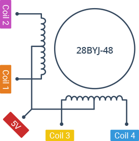
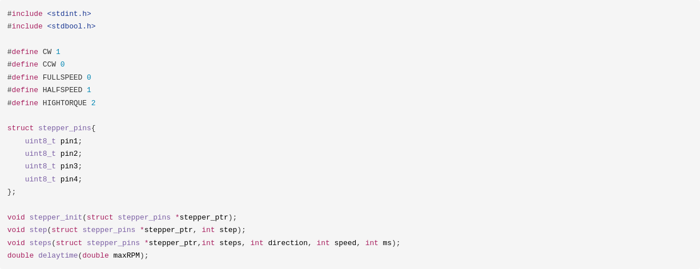
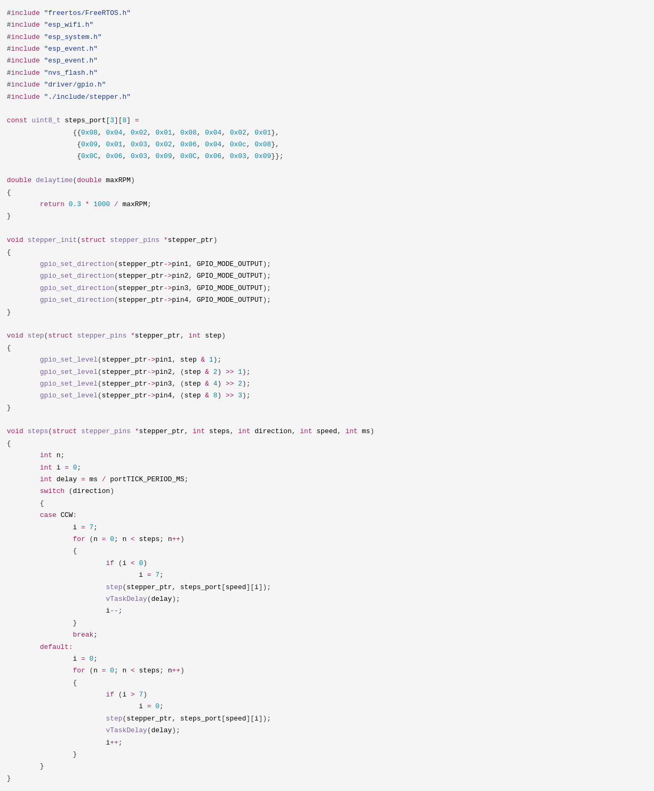
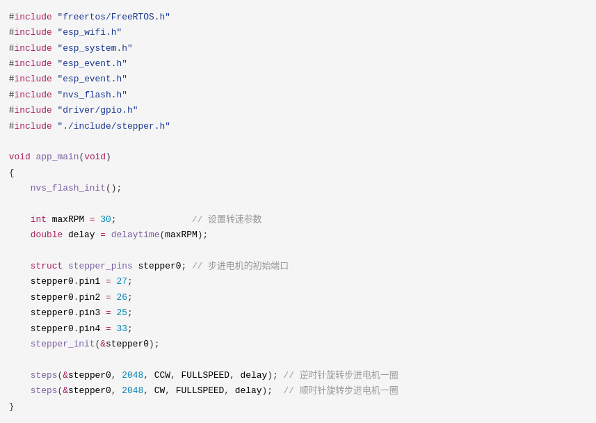
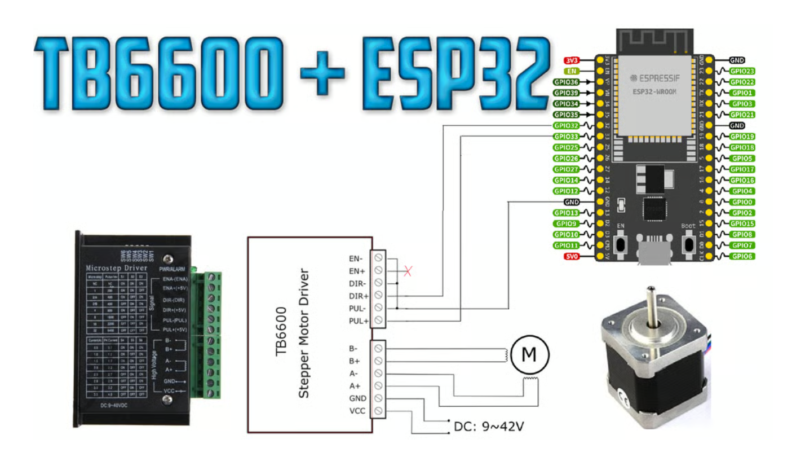

# 步进电动机介紹

步进电机的轴在通常相隔几度的离散旋转位置之间移动。由于这种精确的位置可控性，步进电机非常适合需要高定位精度的应用。

## 步进电动机特性

步进电机的行为与标准直流电机不同。每次移动一点点。步进电机在扭矩-速度关系上也不同于直流电机。

直流电机通常在没有齿轮机构的情况下，在低速下产生高扭矩的能力并不好。而步进电机的工作方式相反。它们在低速时产生最大的扭矩。

步进电机还有另一个特性，即**保持扭矩**，这是直流电机所没有的。保持扭矩使步进电机在不转动时能够牢牢保持其位置。这对于电机可能启动和停止的应用非常有用，而作用在电机上的力仍然存在。 这样就无需机械制动机制。

步进电机不仅仅**响应时钟信号**，它们还有多个绕组，需要按照正确的顺序通电后电机轴才会转动。颠倒顺序将导致电机反方向转动。如果控制信号发送顺序不正确，电机将无法正常转动。它可能只是嗡嗡作响而不转动。或者实际上会转动但不稳定。负责将步进和方向信号转换为绕组通电模式的电路称为转换器。大多数步进电机控制系统除了转换器之外还包含驱动器，以处理电机绕组所吸收的电流。

### 步进电动机运转速度

步进电机低速时可以正常运转,但若高于一定速度就无法启动,并伴有啸叫声。因为步进电机有一个技术参数：空载启动频率，即步进电机在空载情况下能够正常启动的脉冲频率，如果脉冲频率高于该值，电机不能正常启动，可能发生丢步或堵转。在有负载的情况下，启动频率应更低。如果要使电机达到高速转动，脉冲频率应该有加速过程，即启动频率较低，然后按一定加速度升到所希望的高频（电机转速从低速升到高速）。

### 步进电机精度

一般步进电机的精度为步进角的 **3-5** %，且不累积。

### 步进电机的外表温度

步进电机温度过高首先会使电机的磁性材料退磁，从而导致力矩下降乃至于失步，因此电机外表允许的最高温度应取决于不同电机磁性材料的退磁点；一般来讲，磁性材料的退磁点都在摄氏 **130** 度以上，有的甚至高达摄氏200度以
上，所以步进电机外表温度在摄氏 **80-90** 度完全正常。

### 步进电机的力矩会随转速的升高而下降

当步进电机转动时，电机各相绕组的电感将形成一个反向电动势；频率越高，反向电动势越大。在它的作用下，电机随频率（或速度）的增大而相电流减小，从而导致力矩下降。

### 克服两相混合式步进电机在低速运转时的振动和噪声

步进电机低速转动时振动和噪声大是其固有的缺点，可采用以下方案来克服：

 - 如步进电机正好工作在共振区，可通过改变减速比等机械传动避开共振区；
 - 采用带有细分功能的驱动器，这是最常用、最简便的方法；
 - 换成步距角更小的步进电机，如三相或五相步进电机；
 - 换成交流伺服电机，几乎可以完全克服震动和噪声，但成本较高；
 - 在电机轴上加磁性阻尼器，市场上已有这种产品，但机械结构改变较大。

### 细分驱动器的细分数是否能代表精度

步进电机的细分技术实质上是一种电子阻尼技术，其主要目的是减弱或消除步进电机的低频振动，提高电机的运转精度只是细分技术的一个附带功能。比如对于步进角为 **1.8°** 的两相混合式步进电机，如果细分驱动器的细分数设置为 **4**，那么电机的运转分辨率为每个脉冲 **0.45°**，电机的精度能否达到或接近 **0.45°**，还取决于细分驱动器的细分电流控制精度等其它因素。不同的细分驱动器精度可能差别很大；细分数越大精度越难控制。

## 步进电机的类型

步进电机分为两个基本类别：

- 类型 永磁式 步进一般为两相，转矩和体积较小，步进角一般为7.5度 或15度；
- 类型 混合式 步进是指混合了永磁式和反应式的优点。它又分为两相和五相：两相步进角一般为 **1.8** 度而五相步进角一般为 **0.72**度。这种步进电机的应用最为广泛。

类型 反应式步进已被淘汰一般为三相，可实现大转矩输出，步进角一般为1.5度，但噪声和振动都很大。

电机类型决定了驱动器类型和所用转换器的类型。这些类型包括单极、双极和多相。

## 每步度数

这通常是为特定应用选择步进电机时最重要的因素。该因素指定了轴每完整步进旋转的度数。电机的半步操作将使步数/转数加倍，并将每步度数减半。对于未标记的电机，通常可以手动仔细计算电机每转的步数。每步度数可以通过将 360 除以 1 完整旋转中的步数来计算。常见的度数/步数包括：0.72、1.8、3.6、7.5、15 甚至 90。每步度数通常称为电机的分辨率。与未标记的电机一样，如果电机上只印有**步数/转数**，则将 360 除以该数字将得出度数/步数值。

## 驱动序列永磁步进电机有几种子类型可供选择

### 标准驱动序列

电机每步都同时激活一个绕组。

### **高扭矩**和**半步**驱动序列

在高扭矩序列中，电机每步都同时激活两个绕组。这种双绕组组合产生的扭矩比标准序列高出约 1.5 倍，但消耗的电流是标准序列的两倍。

半步进是通过组合两个序列实现的。首先，激活其中一个绕组，然后激活两个绕组，然后激活一个绕组，等等。这实际上使电机轴每转一圈前进的步数加倍，并将每步的度数减半。

### 如何计算步进电机的步进延迟

- 将电机的 RPM 转换为 RPS

$$
RPS = \frac {RPM}{60}
$$

- 取倒数可得到每转秒数

$$
\frac {1}{RPS} = \frac {60}{RPM}
$$

- 除以 360 可得到每度秒数

$$
\frac {60}{RPM \times 360} = \frac {1}{6 \times RPM}
$$

- 乘以 1.8 可得到每步秒数

$$
\frac {1.8}{6 \times RPM} = \frac {0.3}{RPM}
$$

## 28BYJ48步进马达+ULN2003驱动板

28BYJ-48 是 5V 单极步进电机，有五个端子。在这种电机中，脉冲频率决定了它的速度，以获得精确的速度调节。此外，脉冲序列决定了它的旋转方向，而脉冲数控制了它的转动距离。电机在大约 **15RPM** 的速度下可提供 **34.3mN.m** 的扭矩。它即使在静止状态下也能提供良好的扭矩，只要向电机供电就​​可以保持这种扭矩。唯一的缺点是它有点耗电，即使它不移动也会消耗电力。工作电流大约 **240mA**（典型）

### 单相激磁四拍 (标准驱动序列，一相激磁驅動法，一圈需要2048步)

最简单的步进电机驱动方式。电机在每个瞬间只有一个线圈导通，消耗电力小。但在切换瞬间时没有任何的电磁作用在转子上，容易造成振动，也容易因为惯性而失步。

> 马达步进角 **11.25**度 再乘以减速比得到输出的解析度：
>> 每步旋转 11.25 x 1/64 = 0.17578125 度

若要转一圈，需要  360/0.17578125 = **2048**步

### 单双交替激磁八拍 (半步，優點：精度提升2倍，可高轉速)

使用单四拍和双四拍交替进行的方式，每传送一个励磁信号，步进电机前进半个步距角。其特点是分辨率高，运转更加平滑，是最常用的方式。

> 马达步进角 **5.625**度 再乘以减速比得到输出的解析度：
>> 每步旋转 5.625 x 1/64 = 0.087890625 度

若要转一圈，需要  360/0.087890625 = **4096**步

### 双相激磁四拍 (高扭矩，優點：轉矩大 缺點：轉速慢、耗電)

这方式输出的转矩较大且振动较少，切换过程中至少有一个线圈通电作用于转子，使得输出的转矩较大，振动较小，也比单四拍平稳，不易失步。

> 马达步进角 **5.625**度 再乘以减速比得到输出的解析度：
>> 每步旋转 5.625 x 1/64 = 0.087890625 度

若要转一圈，需要  360/0.087890625 = **4096**步

### 示例代码

#### steppers.h

#### steppers.c

#### main.c

## TB6600 驱动板

一款專業的兩相步進馬達驅動。可實現正反轉控制，通過 **3** 位元撥碼開關選擇 **7** 檔細分控制 (1,2/A,2/B,4,8,16,32)，通過3位元撥碼開關選 擇8 檔電流控制（0.5A，1A，1.5A，2A，2.5A，2.8A,3.0A,3.5A）。適合驅動 **57**、**42** 型兩相、四相混合式步進馬達。能達到低振動、小雜訊、高速度的效果驅動電機。

 - 工作溫度 : -10～45℃
 - 存放溫度 : -40℃～70℃
 - 最大功耗 : 160W
 - 峰值電流 : 4A
 - 輸出電流	: 0.5-4.0A
 - 供電電壓 : 9~42V 供電
 - 控制電壓 : 3.3~24V

 
