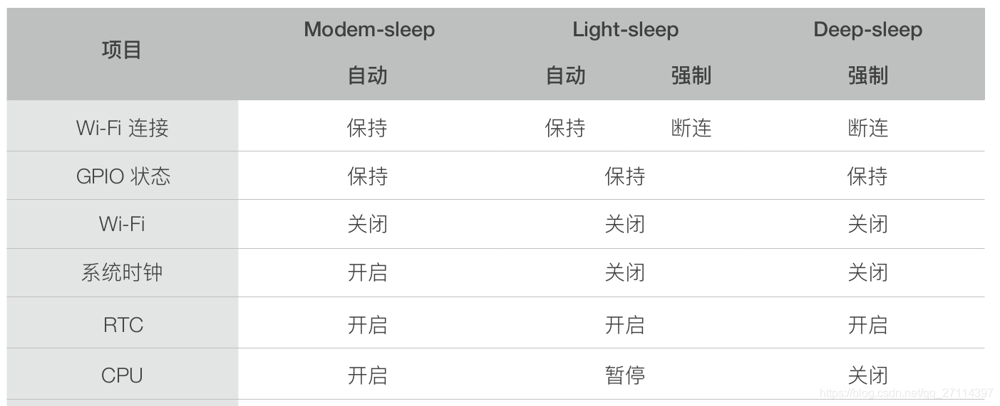
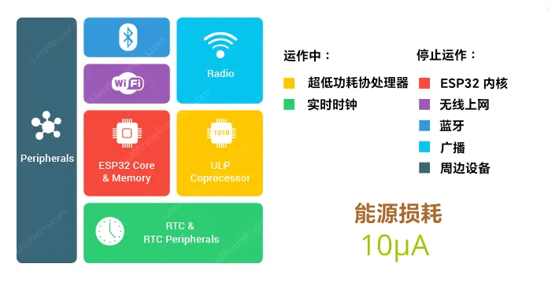
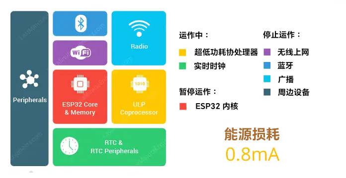
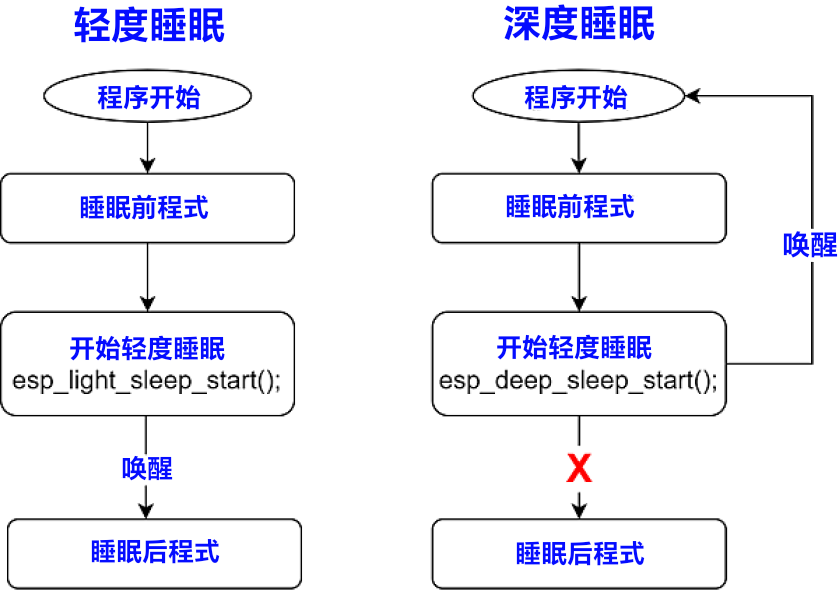

<style>
  table {
    width: 100%
    }
  td {
    vertical-align: center;
  }
  table.inputT{
    margin: 10px;
    width: auto;
    margin-left: auto;
    margin-right: auto;
    border: none;
  }
  input{
    text-align: center;
    padding: 0px 10px;
  }
  iframe{
    width: 100%;
    display: block;
    border-style:none;
  }
</style>


# ESP 定时器唤醒



定时器唤醒对于使用 ESP32 执行周期性任务不会消耗太多电量很有用。

使用以下函数定义唤醒源时间为微秒：

```c
esp_sleep_enable_timer_wakeup(time_in_us);
```

此函数接受以微秒为单位的睡眠时间作为参数。然后通过调用以下函数进入睡眠状态：

## 深度睡眠

```c
esp_deep_sleep_start();
```



- esp_deep_sleep_start 关闭处理器，因此在此行下方编写的任何代码都不会被执行。
- 当 ESP32 从深度睡眠中唤醒时，它将重新运行设置函数。
- 進入 Deep-sleep 时，存储在内存中的所有数据都将丢失。

## 轻度睡眠

```c
esp_light_sleep_start();
```



- esp_light_sleep_start 暂停处理器，因此在此行下方编写的任何代码都暂停执行。
- 当 ESP32 从轻度睡眠中唤醒时，它将继续运行设置函数。
- 退出 Light-sleep 后，数字外设、RAM 和 CPU 将恢复运行，并且其内部状态将保留。

## 睡眠状态流程

